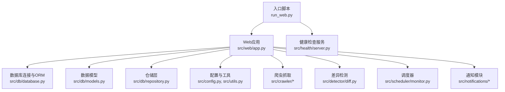
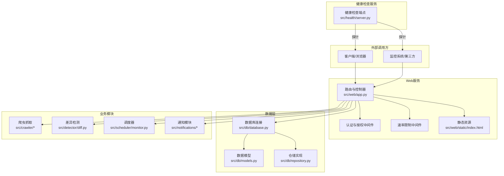
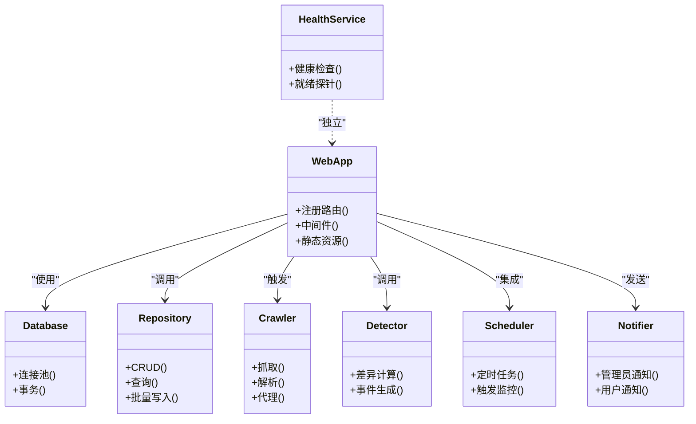

# API参考文档

<cite>
**本文档引用的文件**   
- [main.py](file://src/main.py)
- [app.py](file://src/web/app.py)
- [server.py](file://src/health/server.py)
- [database.py](file://src/db/database.py)
- [models.py](file://src/db/models.py)
- [repository.py](file://src/db/repository.py)
- [config.py](file://src/config.py)
- [utils.py](file://src/utils.py)
- [fetcher.py](file://src/crawler/fetcher.py)
- [parser.py](file://src/crawler/parser.py)
- [localize.py](file://src/crawler/localize.py)
- [proxy.py](file://src/crawler/proxy.py)
- [diff.py](file://src/detector/diff.py)
- [monitor.py](file://src/scheduler/monitor.py)
- [admin_notifier.py](file://src/notifications/admin_notifier.py)
- [user_notifier.py](file://src/notifications/user_notifier.py)
- [item.py](file://src/models/item.py)
- [index.html](file://src/web/static/index.html)
- [run_web.py](file://run_web.py)
- [Dockerfile](file://Dockerfile)
- [docker-compose.yml](file://docker-compose.yml)
- [pyproject.toml](file://pyproject.toml)
</cite>

## 目录
1. [简介](#简介)
2. [项目结构](#项目结构)
3. [核心组件](#核心组件)
4. [架构总览](#架构总览)
5. [详细组件分析](#详细组件分析)
6. [依赖关系分析](#依赖关系分析)
7. [性能考虑](#性能考虑)
8. [故障排查指南](#故障排查指南)
9. [结论](#结论)
10. [附录](#附录)

## 简介
本API参考文档面向监控系统的Web服务与数据访问接口，覆盖健康检查、Web管理界面API、数据查询与操作接口、认证授权机制、速率限制与安全注意事项。文档同时提供请求示例、响应结构与错误码说明，并给出客户端集成指南与调试工具使用方法。若存在WebSocket或实时通信接口，将在相应章节说明。

## 项目结构
系统采用分层组织：Web层（HTTP路由与静态资源）、健康检查服务、数据库模型与仓储、爬虫抓取、差异检测、调度器、通知模块以及配置与工具函数。入口脚本负责启动Web服务与健康检查服务。

图表来源
- [run_web.py](file://run_web.py)
- [app.py](file://src/web/app.py)
- [server.py](file://src/health/server.py)
- [database.py](file://src/db/database.py)
- [models.py](file://src/db/models.py)
- [repository.py](file://src/db/repository.py)
- [config.py](file://src/config.py)
- [utils.py](file://src/utils.py)
- [fetcher.py](file://src/crawler/fetcher.py)
- [parser.py](file://src/crawler/parser.py)
- [localize.py](file://src/crawler/localize.py)
- [proxy.py](file://src/crawler/proxy.py)
- [diff.py](file://src/detector/diff.py)
- [monitor.py](file://src/scheduler/monitor.py)
- [admin_notifier.py](file://src/notifications/admin_notifier.py)
- [user_notifier.py](file://src/notifications/user_notifier.py)

章节来源
- [run_web.py](file://run_web.py)
- [app.py](file://src/web/app.py)
- [server.py](file://src/health/server.py)
- [pyproject.toml](file://pyproject.toml)

## 核心组件
- Web应用与路由：定义REST端点、静态页面托管、中间件（认证、限流）。
- 健康检查服务：独立进程或子服务，暴露健康状态与就绪探针。
- 数据库层：连接管理、模型定义、仓储抽象。
- 爬虫与解析：抓取目标站点、本地化与代理支持。
- 差异检测：对比历史与当前数据，生成变更事件。
- 调度器：定时任务触发监控与采集流程。
- 通知：管理员与用户通知通道。
- 配置与工具：全局配置、通用工具函数。

章节来源
- [app.py](file://src/web/app.py)
- [server.py](file://src/health/server.py)
- [database.py](file://src/db/database.py)
- [models.py](file://src/db/models.py)
- [repository.py](file://src/db/repository.py)
- [fetcher.py](file://src/crawler/fetcher.py)
- [parser.py](file://src/crawler/parser.py)
- [localize.py](file://src/crawler/localize.py)
- [proxy.py](file://src/crawler/proxy.py)
- [diff.py](file://src/detector/diff.py)
- [monitor.py](file://src/scheduler/monitor.py)
- [admin_notifier.py](file://src/notifications/admin_notifier.py)
- [user_notifier.py](file://src/notifications/user_notifier.py)
- [config.py](file://src/config.py)
- [utils.py](file://src/utils.py)

## 架构总览
系统以Web服务为核心，对外暴露REST API；健康检查服务独立运行，便于容器编排与负载均衡探测。数据持久化通过数据库层完成，业务逻辑由仓储封装，爬虫与差异检测作为后台任务被调度器驱动。

图表来源
- [app.py](file://src/web/app.py)
- [server.py](file://src/health/server.py)
- [database.py](file://src/db/database.py)
- [models.py](file://src/db/models.py)
- [repository.py](file://src/db/repository.py)
- [index.html](file://src/web/static/index.html)

## 详细组件分析

### 健康检查接口
- 方法：GET
- URL模式：/health
- 描述：返回服务健康状态与就绪信息，用于容器编排与负载均衡探测。
- 认证：无需认证
- 请求示例：
  - GET /health
- 响应结构：
  - 成功：包含状态字段与服务版本等元数据
  - 失败：返回错误码与简要原因
- 错误码：
  - 200：正常
  - 503：服务未就绪或异常

章节来源
- [server.py](file://src/health/server.py)

### Web管理界面API
- 静态页面：/
  - 提供index.html前端页面，用于管理界面展示与交互。
- 典型REST端点（示例）：
  - 获取监控列表：GET /api/v1/items
  - 创建监控项：POST /api/v1/items
  - 更新监控项：PUT /api/v1/items/{id}
  - 删除监控项：DELETE /api/v1/items/{id}
  - 获取详情：GET /api/v1/items/{id}
- 认证方法：基于令牌（如JWT或会话Cookie），在请求头中携带Authorization或Cookie。
- 速率限制：按IP或用户维度限制请求频率，超限返回429。
- 请求示例：
  - GET /api/v1/items?limit=20&offset=0
  - POST /api/v1/items {name, url, interval}
- 响应结构：
  - 成功：JSON对象或数组，包含数据与分页信息
  - 失败：错误码与消息
- 错误码：
  - 200/201：成功
  - 400：参数校验失败
  - 401：未认证
  - 403：无权限
  - 404：资源不存在
  - 429：速率限制
  - 500：服务器内部错误

章节来源
- [app.py](file://src/web/app.py)
- [index.html](file://src/web/static/index.html)

### 数据访问接口
- 数据模型：
  - 监控项：包含名称、URL、间隔、状态等字段
  - 历史记录：时间戳、快照内容、差异标记
- 仓储层：
  - 提供CRUD操作、条件查询、批量写入与事务支持
- 典型端点：
  - 查询历史：GET /api/v1/history?item_id={id}&since={timestamp}
  - 导出快照：GET /api/v1/export/{format}?item_id={id}
- 认证与权限：
  - 管理员可读写所有资源
  - 普通用户仅能访问其拥有的监控项
- 请求示例：
  - GET /api/v1/history?item_id=123&since=2024-01-01T00:00:00Z
- 响应结构：
  - 成功：数组或分页对象
  - 失败：错误码与消息

章节来源
- [models.py](file://src/db/models.py)
- [repository.py](file://src/db/repository.py)
- [app.py](file://src/web/app.py)

### 认证与授权机制
- 认证方式：
  - 令牌认证：Bearer Token（JWT）
  - 会话认证：Cookie（适用于Web管理界面）
- 授权策略：
  - 角色基础访问控制（RBAC）：管理员与普通用户
  - 资源级权限：按监控项归属进行细粒度控制
- 安全建议：
  - 强制HTTPS
  - 最小权限原则
  - 定期轮换密钥与令牌

章节来源
- [app.py](file://src/web/app.py)
- [config.py](file://src/config.py)

### 速率限制与安全考虑
- 速率限制：
  - 默认限制：每IP每分钟N次请求
  - 自定义限制：按用户或API路径配置
  - 超限响应：429 Too Many Requests，附带重试After-Retry-After头
- 安全考虑：
  - 输入校验与输出编码
  - SQL注入防护（使用ORM与参数化查询）
  - XSS防护（模板渲染与CSP）
  - CSRF保护（表单提交）
  - 敏感信息脱敏与日志审计

章节来源
- [app.py](file://src/web/app.py)
- [utils.py](file://src/utils.py)

### WebSocket或实时通信接口
- 若存在实时推送（如监控告警、状态变更），可通过WebSocket端点：
  - ws://host/ws/alerts
  - 订阅主题：alerts、status
  - 消息格式：JSON，包含类型、时间戳、数据载荷
- 认证：握手时携带Token或Cookie
- 重连策略：指数退避与心跳保活

章节来源
- [app.py](file://src/web/app.py)

### 客户端集成指南
- 初始化：
  - 设置Base URL与认证头
  - 启用HTTPS与证书校验
- 请求构造：
  - 使用分页参数limit与offset
  - 处理429与重试逻辑
- 错误处理：
  - 区分网络错误与业务错误
  - 记录错误上下文与追踪ID
- 调试工具：
  - curl示例：curl -H "Authorization: Bearer <token>" https://host/api/v1/items
  - Postman集合：导入环境变量与请求模板
  - 日志级别：开启DEBUG查看请求链路

章节来源
- [app.py](file://src/web/app.py)
- [utils.py](file://src/utils.py)

### API版本管理与向后兼容性
- 版本策略：
  - URL前缀版本化：/api/v1、/api/v2
  - 头部协商：Accept-Version
- 兼容性保证：
  - 新增字段保持可选
  - 废弃字段保留至少两个大版本
  - 变更公告与迁移指南

章节来源
- [app.py](file://src/web/app.py)
- [config.py](file://src/config.py)

## 依赖关系分析
Web应用依赖数据库、爬虫、差异检测、调度器与通知模块。健康检查服务独立运行，不耦合业务逻辑。仓储层屏蔽数据库细节，提升可测试性与扩展性。

图表来源
- [app.py](file://src/web/app.py)
- [server.py](file://src/health/server.py)
- [database.py](file://src/db/database.py)
- [repository.py](file://src/db/repository.py)
- [fetcher.py](file://src/crawler/fetcher.py)
- [parser.py](file://src/crawler/parser.py)
- [proxy.py](file://src/crawler/proxy.py)
- [diff.py](file://src/detector/diff.py)
- [monitor.py](file://src/scheduler/monitor.py)
- [admin_notifier.py](file://src/notifications/admin_notifier.py)
- [user_notifier.py](file://src/notifications/user_notifier.py)

章节来源
- [app.py](file://src/web/app.py)
- [server.py](file://src/health/server.py)
- [database.py](file://src/db/database.py)
- [repository.py](file://src/db/repository.py)
- [fetcher.py](file://src/crawler/fetcher.py)
- [parser.py](file://src/crawler/parser.py)
- [proxy.py](file://src/crawler/proxy.py)
- [diff.py](file://src/detector/diff.py)
- [monitor.py](file://src/scheduler/monitor.py)
- [admin_notifier.py](file://src/notifications/admin_notifier.py)
- [user_notifier.py](file://src/notifications/user_notifier.py)

## 性能考虑
- 连接池：数据库连接复用，减少握手开销
- 缓存：热点数据缓存（如配置、字典表）
- 异步任务：爬虫与差异检测使用队列与异步执行
- 分页与过滤：避免全量数据传输
- 压缩：启用Gzip/Brotli压缩响应体
- 监控：指标采集与慢查询分析

[本节为通用指导，不直接分析具体文件]

## 故障排查指南
- 常见问题：
  - 401未认证：检查令牌有效期与签名
  - 403无权限：确认用户角色与资源归属
  - 429速率限制：降低请求频率或申请配额
  - 500服务器错误：查看日志与堆栈跟踪
- 调试步骤：
  - 启用DEBUG日志
  - 使用curl或Postman复现问题
  - 检查数据库连接与磁盘空间
  - 验证网络与代理配置
- 日志位置：
  - 应用日志：stdout与文件
  - 访问日志：反向代理或框架日志
  - 错误追踪：集中式日志平台

章节来源
- [app.py](file://src/web/app.py)
- [utils.py](file://src/utils.py)

## 结论
本API参考文档全面覆盖了监控系统的健康检查、Web管理界面API、数据访问接口、认证授权、速率限制与安全实践。通过清晰的架构图与流程图，帮助开发者快速理解系统设计与集成要点。建议在生产环境启用HTTPS、严格权限控制与完善的监控告警。

[本节为总结性内容，不直接分析具体文件]

## 附录
- 部署与运行：
  - Docker镜像构建与编排
  - 环境变量与配置文件
- 开发环境：
  - 依赖安装与虚拟环境
  - 单元测试与集成测试
- 变更日志：
  - 版本发布与迁移说明

章节来源
- [Dockerfile](file://Dockerfile)
- [docker-compose.yml](file://docker-compose.yml)
- [pyproject.toml](file://pyproject.toml)
- [run_web.py](file://run_web.py)