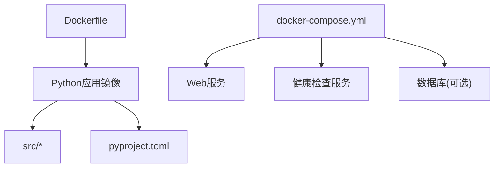
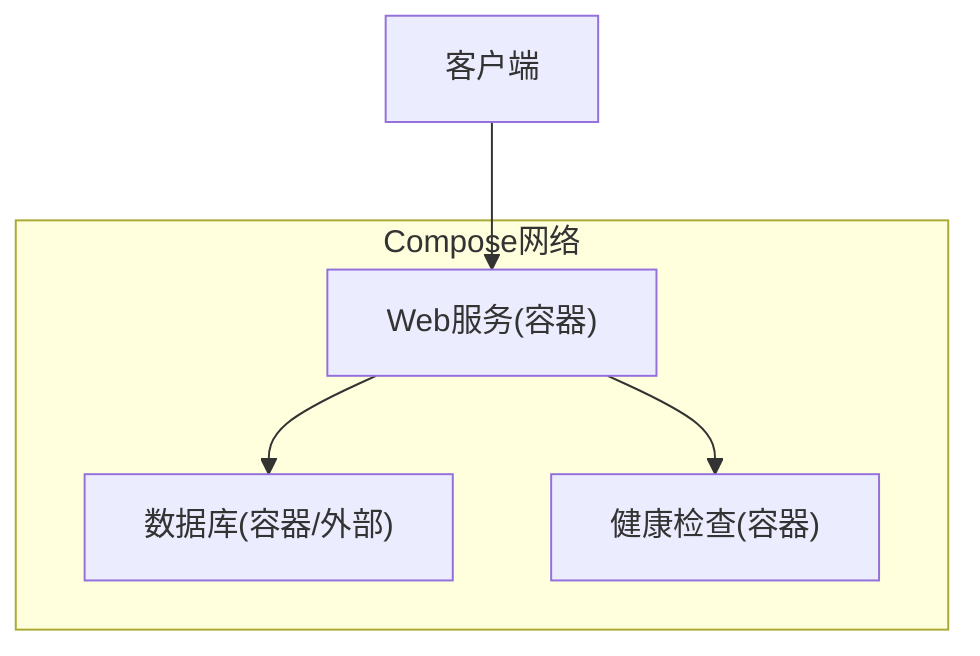
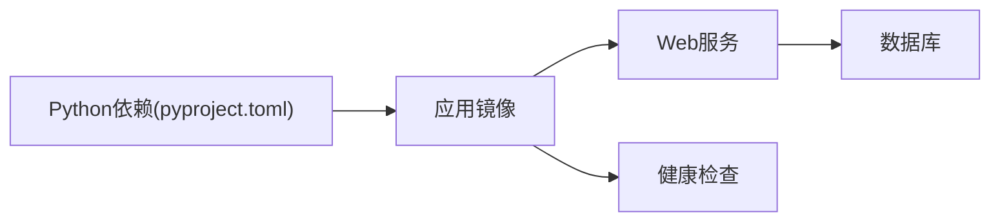

# Docker部署

<cite>
**本文引用的文件**   
- [Dockerfile](file://Dockerfile)
- [docker-compose.yml](file://docker-compose.yml)
- [README.md](file://README.md)
- [src/main.py](file://src/main.py)
- [src/config.py](file://src/config.py)
- [src/web/app.py](file://src/web/app.py)
- [src/health/server.py](file://src/health/server.py)
- [pyproject.toml](file://pyproject.toml)
</cite>

## 目录
1. [简介](#简介)
2. [项目结构](#项目结构)
3. [核心组件](#核心组件)
4. [架构总览](#架构总览)
5. [详细组件分析](#详细组件分析)
6. [依赖关系分析](#依赖关系分析)
7. [性能与优化](#性能与优化)
8. [故障排查指南](#故障排查指南)
9. [结论](#结论)
10. [附录](#附录)

## 简介
本文件面向使用容器化方式部署该监控系统的工程师与运维人员，围绕以下目标展开：
- 完整说明镜像构建过程、Dockerfile分层优化策略
- 详解 docker-compose.yml 的服务编排、网络与数据卷配置
- 提供容器启动、停止、重启命令与环境变量说明
- 给出端口映射、日志收集方案
- 总结生产环境最佳实践与性能优化建议
- 提供常见问题的排查方法与监控方案

## 项目结构
仓库采用Python应用+容器编排的典型结构。关键目录与职责如下：
- src：应用源码（Web服务、健康检查、调度器、数据库模型等）
- tests：单元测试
- translate：翻译映射
- Dockerfile：镜像构建定义
- docker-compose.yml：多服务编排
- pyproject.toml：Python依赖与打包元信息
- README.md：项目说明

图表来源
- [Dockerfile:1-200](file://Dockerfile#L1-L200)
- [docker-compose.yml:1-200](file://docker-compose.yml#L1-L200)

章节来源
- [README.md:1-200](file://README.md#L1-L200)
- [pyproject.toml:1-200](file://pyproject.toml#L1-L200)

## 核心组件
- Web服务：基于FastAPI/Flask等框架的HTTP接口，暴露REST API与静态页面
- 健康检查：轻量HTTP端点用于存活与就绪探针
- 调度器：定时任务执行监控逻辑
- 数据库：持久化存储（通过外部服务或容器化数据库）
- 环境变量：统一从环境变量注入配置

章节来源
- [src/web/app.py:1-200](file://src/web/app.py#L1-L200)
- [src/health/server.py:1-200](file://src/health/server.py#L1-L200)
- [src/config.py:1-200](file://src/config.py#L1-L200)

## 架构总览
下图展示容器内外的交互关系：客户端访问Web服务，健康检查服务被编排用于探针；数据库作为独立服务或外部实例；所有服务通过Compose网络互通。

图表来源
- [docker-compose.yml:1-200](file://docker-compose.yml#L1-L200)
- [src/web/app.py:1-200](file://src/web/app.py#L1-L200)
- [src/health/server.py:1-200](file://src/health/server.py#L1-L200)

## 详细组件分析

### Dockerfile 构建与分层优化
- 基础镜像选择：建议使用精简且安全的Python官方镜像（如slim或alpine变体），减少攻击面与体积
- 构建阶段：
  - 安装系统依赖（如有C扩展或编译需求）
  - 复制依赖声明文件并安装Python依赖（利用Docker缓存层）
  - 复制应用代码
  - 设置非root用户运行，提升安全性
- 分层优化要点：
  - 将频繁变更的代码放在后层，不常变的依赖放在前层
  - 合并RUN指令减少层数
  - 使用.dockerignore排除无关文件
- 入口与参数：
  - 指定ENTRYPOINT/CMD以启动Web服务或调度器
  - 支持通过环境变量覆盖运行时配置

章节来源
- [Dockerfile:1-200](file://Dockerfile#L1-L200)

### docker-compose.yml 编排详解
- 服务定义：
  - web：主应用服务，暴露HTTP端口，挂载代码或只读镜像
  - health：健康检查服务，提供探针端点
  - db：数据库服务（可选），持久化数据卷
- 网络配置：
  - 自定义bridge网络隔离服务间通信
  - 通过服务名进行DNS解析
- 数据卷：
  - 为数据库与应用日志创建命名卷或绑定挂载
  - 确保数据持久化与备份策略
- 环境变量：
  - 集中管理敏感信息与运行时开关
  - 支持不同环境（开发/测试/生产）的env_file或inline变量
- 健康检查与重试：
  - 使用depends_on与健康检查条件控制启动顺序
  - 配置restart策略保障可用性

章节来源
- [docker-compose.yml:1-200](file://docker-compose.yml#L1-L200)

### 环境变量与配置
- 常用变量：
  - WEB_PORT：Web服务监听端口
  - DB_HOST/DB_PORT/DB_USER/DB_PASS：数据库连接信息
  - LOG_LEVEL：日志级别
  - FEATURE_FLAGS：功能开关
- 读取方式：
  - 应用通过config模块统一读取环境变量
  - 提供默认值与校验

章节来源
- [src/config.py:1-200](file://src/config.py#L1-L200)

### 端口映射与服务暴露
- Web服务：
  - 容器内监听固定端口（如8000）
  - 宿主机映射到对外端口（如80/443）
- 健康检查：
  - 内部端口供编排工具探测
- 数据库：
  - 仅对内暴露或通过反向代理访问

章节来源
- [docker-compose.yml:1-200](file://docker-compose.yml#L1-L200)
- [src/web/app.py:1-200](file://src/web/app.py#L1-L200)

### 日志收集
- 输出格式：JSON结构化日志便于采集
- 驱动选择：
  - 本地文件：绑定挂载日志目录
  - 远程收集：使用json-file或gelf驱动对接ELK/Loki
- 轮转策略：限制日志大小与数量

章节来源
- [docker-compose.yml:1-200](file://docker-compose.yml#L1-L200)

### 容器生命周期管理命令
- 启动：
  - 后台启动所有服务
  - 按依赖顺序启动并等待健康检查通过
- 停止：
  - 优雅关闭服务，保留日志与数据
- 重启：
  - 滚动更新或故障恢复
- 查看状态与日志：
  - 查看服务状态、实时日志

章节来源
- [docker-compose.yml:1-200](file://docker-compose.yml#L1-L200)

### 健康检查与就绪探针
- 存活探针：返回200即认为进程存活
- 就绪探针：依赖数据库连通性检测
- 失败处理：自动重启或标记不可用

章节来源
- [src/health/server.py:1-200](file://src/health/server.py#L1-L200)
- [docker-compose.yml:1-200](file://docker-compose.yml#L1-L200)

### 数据持久化与备份
- 数据库卷：
  - 命名卷保证跨重建持久化
  - 定期快照或导出
- 应用日志：
  - 绑定挂载至宿主机或日志服务器
- 配置文件：
  - 使用只读卷挂载避免误改

章节来源
- [docker-compose.yml:1-200](file://docker-compose.yml#L1-L200)

## 依赖关系分析
- 应用依赖：
  - Python包依赖由pyproject.toml声明
  - 构建时安装依赖并缓存
- 服务依赖：
  - Web服务依赖数据库与健康检查
  - 健康检查可独立运行

图表来源
- [pyproject.toml:1-200](file://pyproject.toml#L1-L200)
- [docker-compose.yml:1-200](file://docker-compose.yml#L1-L200)

章节来源
- [pyproject.toml:1-200](file://pyproject.toml#L1-L200)
- [docker-compose.yml:1-200](file://docker-compose.yml#L1-L200)

## 性能与优化
- 镜像体积：
  - 使用多阶段构建分离构建与运行环境
  - 清理缓存与临时文件
- 资源限制：
  - 为容器设置CPU与内存上限
  - 合理分配副本数
- I/O优化：
  - 数据库与日志使用高性能卷
  - 避免在容器内写入大量临时文件
- 网络优化：
  - 使用专用网络减少广播风暴
  - 合理设置超时与重试

[本节为通用指导，不直接分析具体文件]

## 故障排查指南
- 常见问题定位：
  - 端口冲突：检查宿主机与容器端口映射
  - 数据库连接失败：核对环境变量与网络连通性
  - 健康检查失败：查看探针端点响应码与日志
- 日志查看：
  - 使用compose日志命令过滤服务
  - 结合时间戳与错误关键字检索
- 资源瓶颈：
  - 监控CPU/内存使用率
  - 调整副本与资源限制
- 回滚策略：
  - 保留历史镜像版本
  - 快速切换至稳定版本

章节来源
- [docker-compose.yml:1-200](file://docker-compose.yml#L1-L200)
- [src/health/server.py:1-200](file://src/health/server.py#L1-L200)

## 结论
通过合理的Dockerfile分层与docker-compose编排，可实现安全、高效、可维护的监控系统集成部署。配合环境变量、日志与监控策略，可在生产环境中获得稳定的运行体验。

[本节为总结性内容，不直接分析具体文件]

## 附录
- 快速参考：
  - 构建镜像：根据Dockerfile执行构建
  - 启动服务：使用compose命令拉起全部服务
  - 查看日志：按服务过滤查看实时日志
  - 健康检查：访问健康端点验证服务状态

章节来源
- [Dockerfile:1-200](file://Dockerfile#L1-L200)
- [docker-compose.yml:1-200](file://docker-compose.yml#L1-L200)
- [src/main.py:1-200](file://src/main.py#L1-L200)