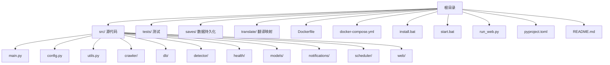
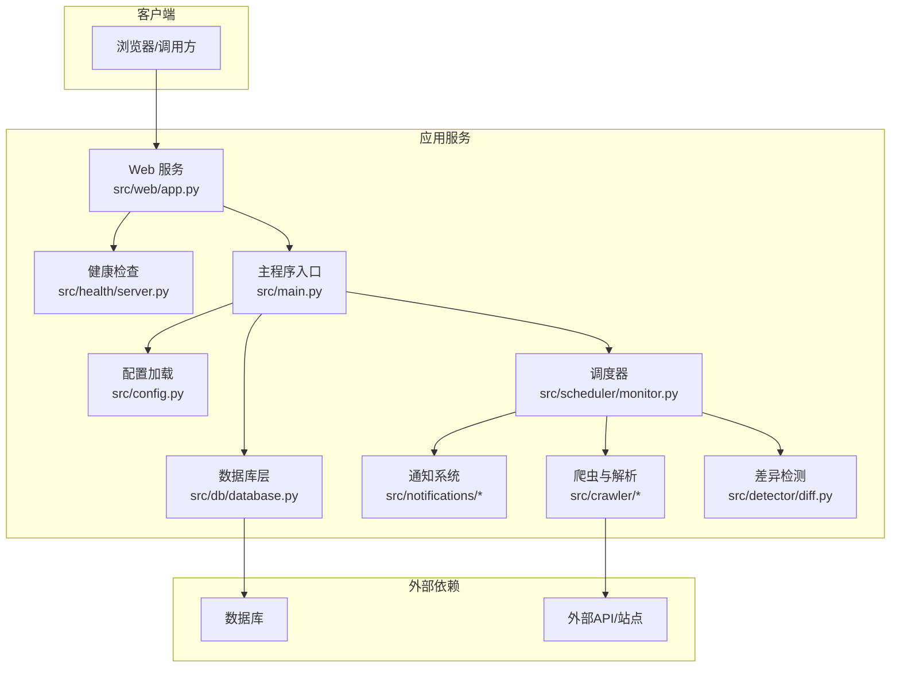
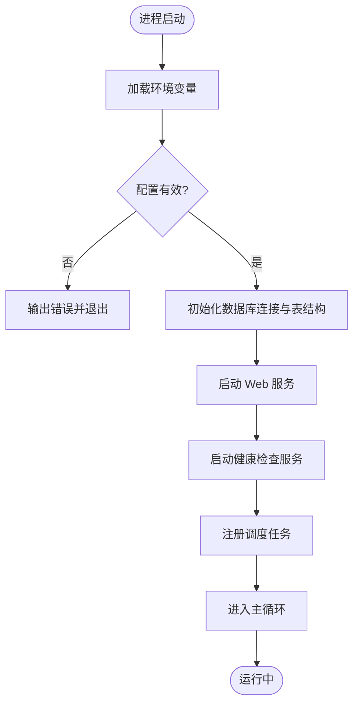
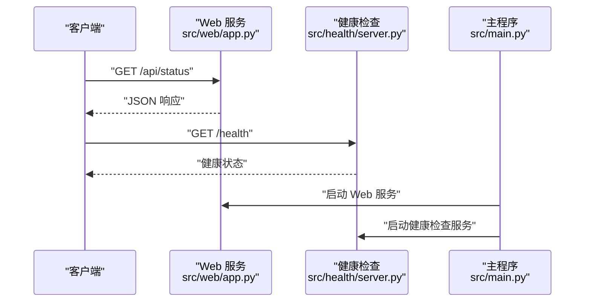
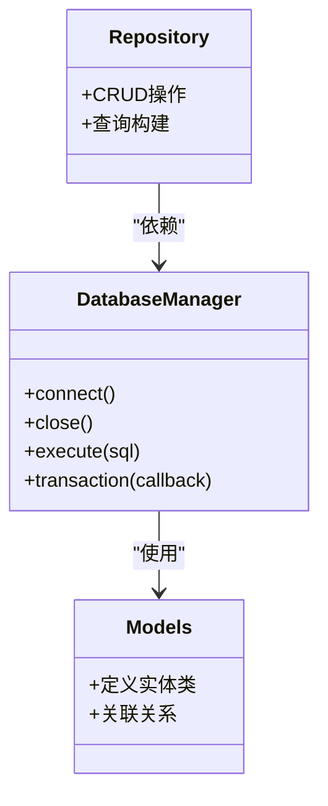
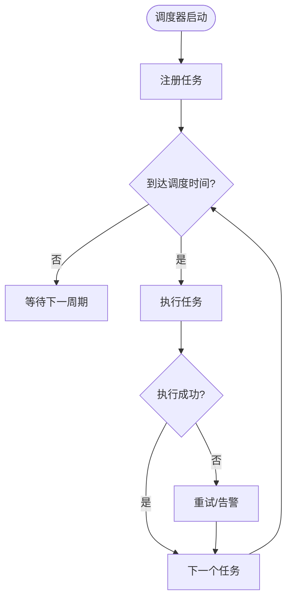
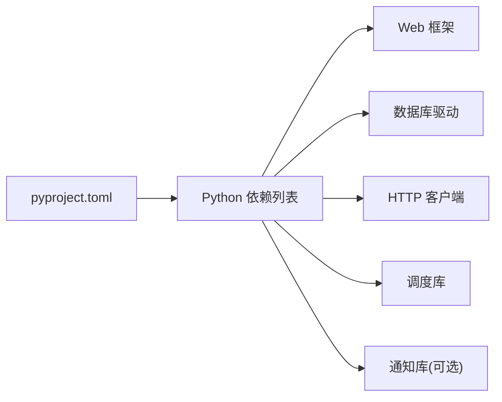
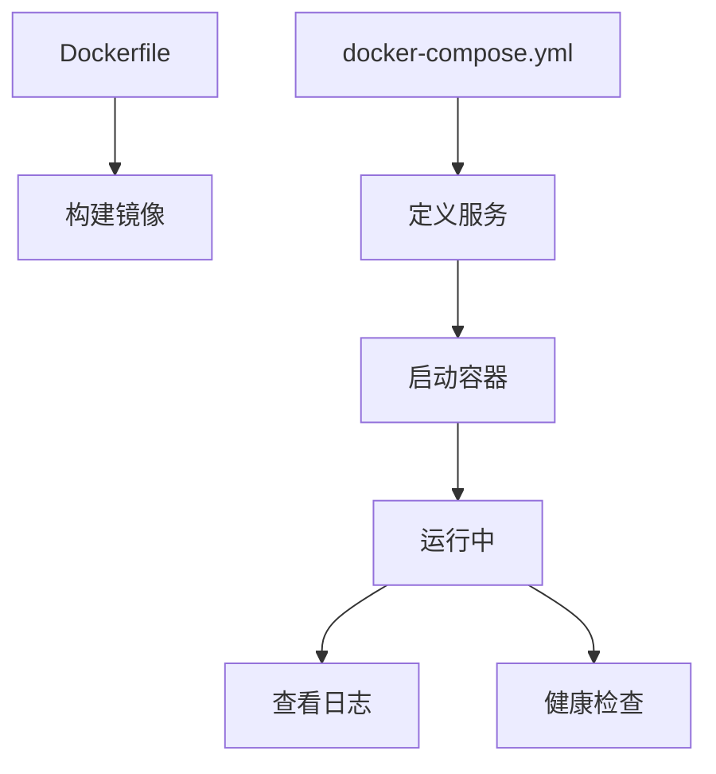
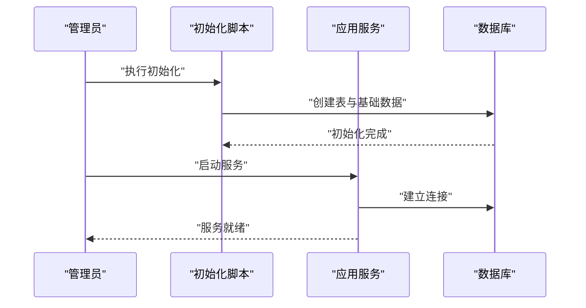

# 安装与部署

<cite>
**本文引用的文件**   
- [README.md](file://README.md)
- [pyproject.toml](file://pyproject.toml)
- [Dockerfile](file://Dockerfile)
- [docker-compose.yml](file://docker-compose.yml)
- [install.bat](file://install.bat)
- [start.bat](file://start.bat)
- [run_web.py](file://run_web.py)
- [src/main.py](file://src/main.py)
- [src/config.py](file://src/config.py)
- [src/db/database.py](file://src/db/database.py)
- [src/web/app.py](file://src/web/app.py)
- [src/health/server.py](file://src/health/server.py)
</cite>

## 目录
1. [简介](#简介)
2. [项目结构](#项目结构)
3. [核心组件](#核心组件)
4. [架构总览](#架构总览)
5. [详细组件分析](#详细组件分析)
6. [依赖关系分析](#依赖关系分析)
7. [性能考虑](#性能考虑)
8. [故障排查指南](#故障排查指南)
9. [结论](#结论)
10. [附录](#附录) 

## 简介
本安装与部署文档面向初学者与高级用户，覆盖本地开发环境搭建、生产环境部署以及 Docker 容器化部署方案。内容包含 Python 环境要求、依赖包安装、配置文件设置、Windows 批处理脚本使用说明、Docker 镜像构建与容器编排配置、环境变量配置、数据库初始化与服务启动流程，并提供常见问题排查建议。

## 项目结构
本项目采用模块化组织，核心代码位于 src 目录下，按功能划分模块：爬虫抓取、解析、代理、检测差异、健康检查、Web 服务、调度器、通知、模型与数据库等。根目录提供打包与运行脚本、Docker 相关配置及说明文档。

**图表来源** 
- [README.md:1-200](file://README.md#L1-L200)
- [pyproject.toml:1-200](file://pyproject.toml#L1-L200)
- [Dockerfile:1-200](file://Dockerfile#L1-L200)
- [docker-compose.yml:1-200](file://docker-compose.yml#L1-L200)

**章节来源**
- [README.md:1-200](file://README.md#L1-L200)
- [pyproject.toml:1-200](file://pyproject.toml#L1-L200)

## 核心组件
- 应用入口与配置加载：负责读取环境变量与配置文件，初始化全局状态。
- Web 服务：提供 HTTP API 与静态页面，用于监控与展示。
- 健康检查：暴露健康端点，便于编排平台探测服务可用性。
- 数据库层：封装连接、模型定义与仓库访问，支持初始化与迁移。
- 调度与任务：定时执行监控任务，驱动爬虫与检测逻辑。
- 通知系统：向管理员或用户发送告警信息。
- 爬虫与解析：采集目标站点数据并进行本地化处理。
- 差异检测：对比历史与当前数据，生成变更事件。

**章节来源**
- [src/main.py:1-200](file://src/main.py#L1-L200)
- [src/config.py:1-200](file://src/config.py#L1-L200)
- [src/web/app.py:1-200](file://src/web/app.py#L1-L200)
- [src/health/server.py:1-200](file://src/health/server.py#L1-L200)
- [src/db/database.py:1-200](file://src/db/database.py#L1-L200)

## 架构总览
下图展示了从 Web 请求到后端处理、数据库交互与健康检查的整体流程，以及容器编排中的服务关系。

**图表来源** 
- [src/web/app.py:1-200](file://src/web/app.py#L1-L200)
- [src/health/server.py:1-200](file://src/health/server.py#L1-L200)
- [src/main.py:1-200](file://src/main.py#L1-L200)
- [src/config.py:1-200](file://src/config.py#L1-L200)
- [src/db/database.py:1-200](file://src/db/database.py#L1-L200)

## 详细组件分析

### 应用入口与配置加载
- 入口职责：解析命令行参数、加载配置、初始化日志与数据库连接、启动 Web 服务与健康检查。
- 配置来源：环境变量优先，其次为配置文件；敏感信息通过环境变量注入。
- 关键流程：
  - 读取并校验必要的环境变量（如数据库连接串、端口、调试开关）。
  - 初始化数据库连接与表结构。
  - 启动 Web 服务与健康检查服务。
  - 注册调度任务并进入主循环。

**图表来源** 
- [src/main.py:1-200](file://src/main.py#L1-L200)
- [src/config.py:1-200](file://src/config.py#L1-L200)
- [src/db/database.py:1-200](file://src/db/database.py#L1-L200)

**章节来源**
- [src/main.py:1-200](file://src/main.py#L1-L200)
- [src/config.py:1-200](file://src/config.py#L1-L200)

### Web 服务
- 职责：提供 HTTP API、静态资源与监控界面；路由分发与中间件处理。
- 启动方式：可通过 run_web.py 直接运行，或在主程序中集成启动。
- 健康检查：独立的健康检查服务暴露 /health 端点，供编排平台探测。

**图表来源** 
- [src/web/app.py:1-200](file://src/web/app.py#L1-L200)
- [src/health/server.py:1-200](file://src/health/server.py#L1-L200)
- [src/main.py:1-200](file://src/main.py#L1-L200)

**章节来源**
- [src/web/app.py:1-200](file://src/web/app.py#L1-L200)
- [src/health/server.py:1-200](file://src/health/server.py#L1-L200)
- [run_web.py:1-200](file://run_web.py#L1-L200)

### 数据库层
- 职责：管理数据库连接、会话生命周期、模型定义与仓库访问。
- 初始化：在应用启动时创建表结构与基础数据。
- 连接配置：通过环境变量或配置文件指定连接字符串、池大小、超时等。

**图表来源** 
- [src/db/database.py:1-200](file://src/db/database.py#L1-L200)

**章节来源**
- [src/db/database.py:1-200](file://src/db/database.py#L1-L200)

### 调度与任务
- 职责：定时触发监控任务，协调爬虫、解析、差异检测与通知。
- 任务注册：在主程序启动时注册周期性任务。
- 失败重试：对失败任务进行指数退避重试与告警。

**图表来源** 
- [src/scheduler/monitor.py:1-200](file://src/scheduler/monitor.py#L1-L200)

**章节来源**
- [src/scheduler/monitor.py:1-200](file://src/scheduler/monitor.py#L1-L200)

### 通知系统
- 职责：将异常、变更与告警信息发送给管理员或用户。
- 渠道：邮件、即时通讯、Webhook 等（根据配置启用）。
- 模板：支持消息模板与动态变量替换。

**章节来源**
- [src/notifications/admin_notifier.py:1-200](file://src/notifications/admin_notifier.py#L1-L200)
- [src/notifications/user_notifier.py:1-200](file://src/notifications/user_notifier.py#L1-L200)

### 爬虫与解析
- 职责：抓取目标站点数据，进行本地化处理与结构化解析。
- 代理支持：可配置代理服务器以绕过网络限制。
- 错误处理：网络异常、解析失败的重试与降级策略。

**章节来源**
- [src/crawler/fetcher.py:1-200](file://src/crawler/fetcher.py#L1-L200)
- [src/crawler/parser.py:1-200](file://src/crawler/parser.py#L1-L200)
- [src/crawler/localize.py:1-200](file://src/crawler/localize.py#L1-L200)
- [src/crawler/proxy.py:1-200](file://src/crawler/proxy.py#L1-L200)

### 差异检测
- 职责：对比历史与当前数据，识别变更并生成事件。
- 算法：基于字段级差异与阈值判断。
- 输出：变更摘要与告警信息。

**章节来源**
- [src/detector/diff.py:1-200](file://src/detector/diff.py#L1-L200)

## 依赖关系分析
- Python 版本与依赖：由 pyproject.toml 声明，建议使用现代包管理器安装。
- 运行时依赖：Web 框架、数据库驱动、HTTP 客户端、调度库等。
- 可选依赖：通知渠道扩展、加密工具等。

**图表来源** 
- [pyproject.toml:1-200](file://pyproject.toml#L1-L200)

**章节来源**
- [pyproject.toml:1-200](file://pyproject.toml#L1-L200)

## 性能考虑
- 数据库连接池：合理设置池大小与超时，避免连接耗尽。
- 并发与异步：在高吞吐场景下考虑异步 IO 与线程池。
- 缓存策略：对热点数据引入缓存以减少重复计算与 IO。
- 日志级别：生产环境降低日志级别，减少磁盘 IO。
- 资源限制：在容器中设置 CPU 与内存限制，防止资源争用。

[本节为通用指导，不直接分析具体文件]

## 故障排查指南
- 启动失败
  - 检查环境变量是否完整（数据库连接串、端口、密钥等）。
  - 查看日志输出定位错误堆栈。
  - 确认依赖包已正确安装且版本兼容。
- 数据库连接失败
  - 验证数据库服务可达性与凭据正确性。
  - 检查防火墙与网络策略。
  - 尝试手动连接数据库确认配置。
- Web 服务不可用
  - 检查端口占用与权限。
  - 查看健康检查端点返回状态。
  - 确认静态资源路径与权限。
- 任务执行失败
  - 查看调度器日志与重试记录。
  - 检查外部依赖（站点可达性、API 限流）。
  - 调整任务间隔与超时参数。
- 通知未送达
  - 验证通知渠道配置（SMTP、Webhook URL、Token）。
  - 检查网络出站规则与证书有效性。

**章节来源**
- [src/main.py:1-200](file://src/main.py#L1-L200)
- [src/config.py:1-200](file://src/config.py#L1-L200)
- [src/db/database.py:1-200](file://src/db/database.py#L1-L200)
- [src/health/server.py:1-200](file://src/health/server.py#L1-L200)

## 结论
本安装与部署文档提供了从零开始搭建与运行监控系统的全流程指导。通过合理的配置与环境准备，结合 Docker 容器化与编排，可实现快速部署与稳定运行。遇到问题时，依据故障排查指南逐步定位与解决，确保系统持续可用。

## 附录

### 本地开发环境搭建
- 环境要求
  - Python 版本：建议使用最新稳定版（参考 pyproject.toml 的声明）。
  - 操作系统：Windows、macOS、Linux 均可。
- 依赖安装
  - 使用现代包管理器安装依赖（推荐基于 pyproject.toml 的方式）。
  - 或使用 pip 安装依赖（若存在 requirements.txt）。
- 配置文件设置
  - 复制示例配置（如有）并修改环境变量。
  - 设置数据库连接串、端口、调试开关等。
- 数据库初始化
  - 运行初始化脚本或命令，创建表结构与基础数据。
- 启动服务
  - 使用 run_web.py 启动 Web 服务。
  - 或直接运行主程序入口，自动启动所有子服务。

**章节来源**
- [pyproject.toml:1-200](file://pyproject.toml#L1-L200)
- [run_web.py:1-200](file://run_web.py#L1-L200)
- [src/main.py:1-200](file://src/main.py#L1-L200)
- [src/config.py:1-200](file://src/config.py#L1-L200)
- [src/db/database.py:1-200](file://src/db/database.py#L1-L200)

### Windows 批处理脚本使用说明
- install.bat
  - 作用：一键安装依赖与初始化环境。
  - 用法：双击运行或在命令行执行。
  - 注意：需以管理员权限运行（如需安装系统级依赖）。
- start.bat
  - 作用：启动应用服务（Web、健康检查、调度器等）。
  - 用法：双击运行或在命令行执行。
  - 注意：确保环境变量已正确设置。

**章节来源**
- [install.bat:1-200](file://install.bat#L1-L200)
- [start.bat:1-200](file://start.bat#L1-L200)

### Docker 容器化部署
- 镜像构建
  - 使用 Dockerfile 构建镜像，指定基础镜像与依赖安装步骤。
  - 推荐使用多阶段构建减小镜像体积。
- 容器编排
  - 使用 docker-compose.yml 定义服务、网络与卷挂载。
  - 配置环境变量与数据持久化路径。
- 启动与停止
  - 使用 docker-compose up/down 管理服务生命周期。
  - 查看日志与状态以排查问题。

**图表来源** 
- [Dockerfile:1-200](file://Dockerfile#L1-L200)
- [docker-compose.yml:1-200](file://docker-compose.yml#L1-L200)

**章节来源**
- [Dockerfile:1-200](file://Dockerfile#L1-L200)
- [docker-compose.yml:1-200](file://docker-compose.yml#L1-L200)

### 环境变量配置
- 必需变量
  - 数据库连接串：指定数据库类型、地址、用户名、密码与数据库名。
  - 端口：Web 服务监听端口。
  - 调试开关：控制日志级别与调试模式。
- 可选变量
  - 代理配置：爬虫代理服务器地址与认证信息。
  - 通知渠道：邮件 SMTP、Webhook URL、Token 等。
  - 调度参数：任务间隔、超时、重试次数等。

**章节来源**
- [src/config.py:1-200](file://src/config.py#L1-L200)
- [docker-compose.yml:1-200](file://docker-compose.yml#L1-L200)

### 数据库初始化与服务启动流程
- 初始化流程
  - 连接数据库并创建表结构。
  - 插入基础数据（如角色、权限、默认配置）。
- 启动流程
  - 加载配置与日志。
  - 启动 Web 服务与健康检查。
  - 注册调度任务并进入主循环。

**图表来源** 
- [src/db/database.py:1-200](file://src/db/database.py#L1-L200)
- [src/main.py:1-200](file://src/main.py#L1-L200)

**章节来源**
- [src/db/database.py:1-200](file://src/db/database.py#L1-L200)
- [src/main.py:1-200](file://src/main.py#L1-L200)