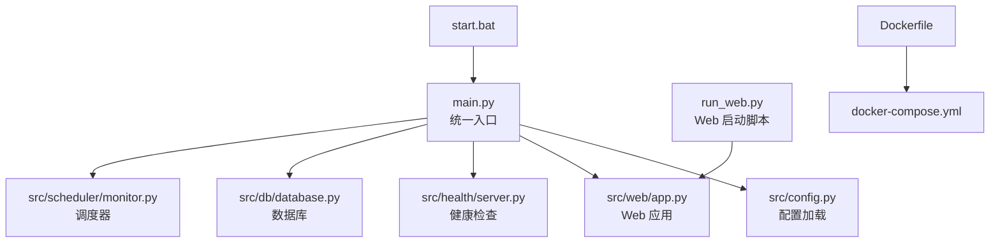
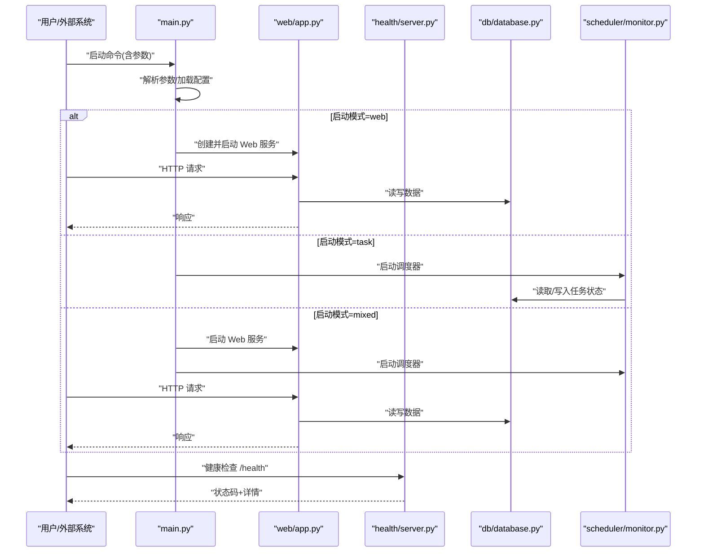
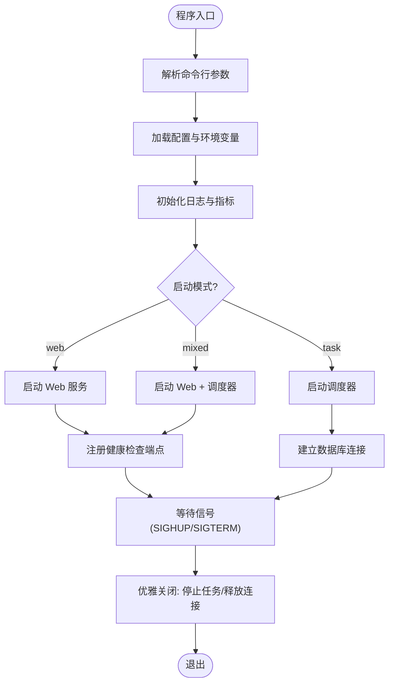
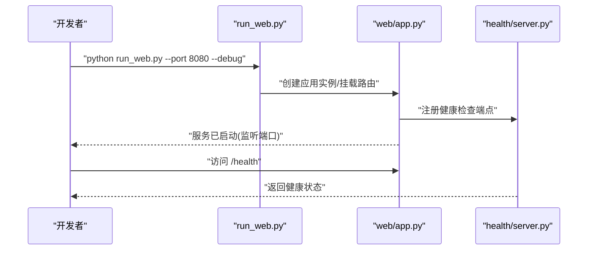
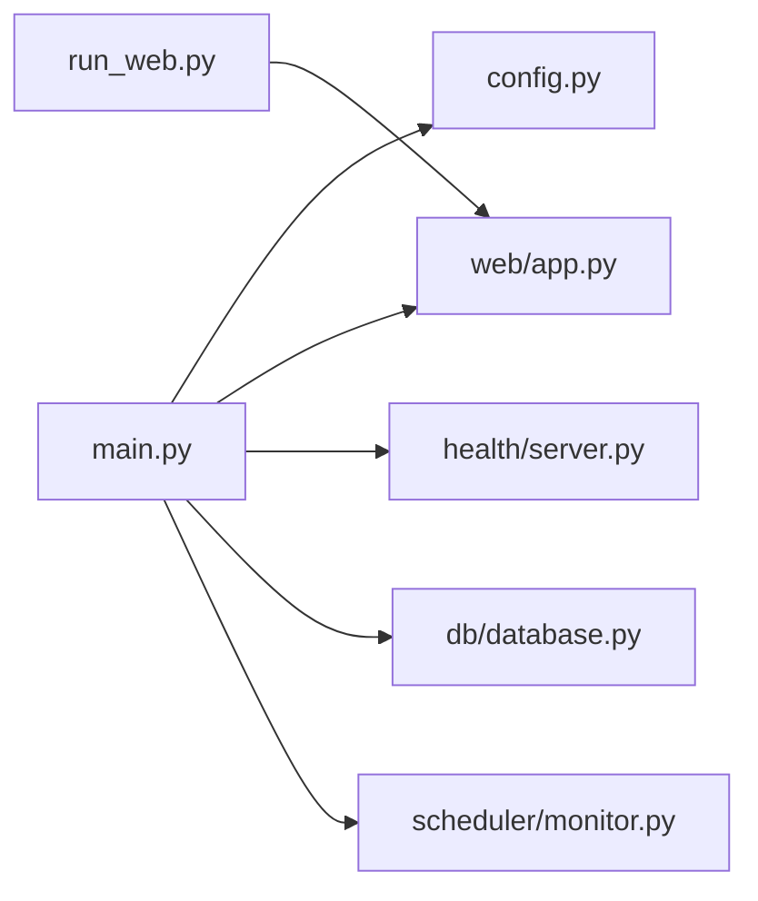

# 服务启动

<cite>
**本文引用的文件**   
- [main.py](file://src/main.py)
- [run_web.py](file://run_web.py)
- [config.py](file://src/config.py)
- [app.py](file://src/web/app.py)
- [server.py](file://src/health/server.py)
- [database.py](file://src/db/database.py)
- [monitor.py](file://src/scheduler/monitor.py)
- [Dockerfile](file://Dockerfile)
- [docker-compose.yml](file://docker-compose.yml)
- [start.bat](file://start.bat)
- [pyproject.toml](file://pyproject.toml)
</cite>

## 目录
1. [简介](#简介)
2. [项目结构](#项目结构)
3. [核心组件](#核心组件)
4. [架构总览](#架构总览)
5. [详细组件分析](#详细组件分析)
6. [依赖关系分析](#依赖关系分析)
7. [性能考虑](#性能考虑)
8. [故障排查指南](#故障排查指南)
9. [结论](#结论)
10. [附录](#附录)

## 简介
本指南面向运维与开发者，提供监控服务的完整启动说明。内容覆盖主入口 main.py 的启动流程、命令行参数与启动模式；run_web.py 的 Web 服务启动方式、端口配置与调试模式；后台服务模式与守护进程配置；健康检查、优雅关闭、进程管理；多进程/多线程启动与资源限制；启动日志查看与错误诊断；以及服务监控与告警配置建议。

## 项目结构
本项目采用分层组织：Web 服务、健康检查、数据库、调度器、爬虫、通知等模块清晰分离。关键启动相关文件如下：
- src/main.py：统一入口，负责解析参数、初始化配置、选择运行模式（Web/任务/混合）并拉起子服务。
- run_web.py：独立脚本，用于快速启动 Web 服务，便于开发与调试。
- src/config.py：集中式配置加载与环境变量映射。
- src/web/app.py：Web 应用装配（路由、中间件、静态资源）。
- src/health/server.py：健康检查端点实现。
- src/db/database.py：数据库连接与生命周期管理。
- src/scheduler/monitor.py：定时任务与监控逻辑。
- Dockerfile/docker-compose.yml：容器化部署与编排。
- start.bat：Windows 快捷启动脚本。
- pyproject.toml：Python 工程元数据与依赖声明。

图表来源
- [main.py](file://src/main.py)
- [config.py](file://src/config.py)
- [app.py](file://src/web/app.py)
- [server.py](file://src/health/server.py)
- [database.py](file://src/db/database.py)
- [monitor.py](file://src/scheduler/monitor.py)
- [Dockerfile](file://Dockerfile)
- [docker-compose.yml](file://docker-compose.yml)
- [start.bat](file://start.bat)

章节来源
- [main.py](file://src/main.py)
- [run_web.py](file://run_web.py)
- [config.py](file://src/config.py)
- [app.py](file://src/web/app.py)
- [server.py](file://src/health/server.py)
- [database.py](file://src/db/database.py)
- [monitor.py](file://src/scheduler/monitor.py)
- [Dockerfile](file://Dockerfile)
- [docker-compose.yml](file://docker-compose.yml)
- [start.bat](file://start.bat)
- [pyproject.toml](file://pyproject.toml)

## 核心组件
- 统一入口 main.py
  - 职责：解析命令行参数、加载配置、初始化日志、根据模式启动 Web/调度/健康检查等子服务，处理信号以实现优雅关闭。
  - 关键点：支持多种启动模式（如 web、task、mixed），可切换调试开关，绑定端口与线程/进程数。
- Web 启动脚本 run_web.py
  - 职责：快速启动 Web 服务，默认使用开发服务器或生产 WSGI 服务器，暴露调试模式与热重载选项。
  - 关键点：端口、主机、调试开关、工作进程数、静态资源路径。
- 配置中心 config.py
  - 职责：集中读取环境变量与配置文件，提供类型安全访问接口，校验必填项并提供默认值。
- 健康检查 server.py
  - 职责：提供 /health 与 /ready 等端点，返回服务状态与依赖健康情况。
- 数据库 database.py
  - 职责：连接池管理、迁移执行、事务上下文、连接生命周期。
- 调度器 monitor.py
  - 职责：周期性任务注册、执行、失败重试与指标上报。

章节来源
- [main.py](file://src/main.py)
- [run_web.py](file://run_web.py)
- [config.py](file://src/config.py)
- [server.py](file://src/health/server.py)
- [database.py](file://src/db/database.py)
- [monitor.py](file://src/scheduler/monitor.py)

## 架构总览
下图展示从入口到各子系统的调用关系与数据流向，包括 Web、健康检查、数据库与调度器的交互。

图表来源
- [main.py](file://src/main.py)
- [app.py](file://src/web/app.py)
- [server.py](file://src/health/server.py)
- [database.py](file://src/db/database.py)
- [monitor.py](file://src/scheduler/monitor.py)

## 详细组件分析

### 主入口 main.py 启动流程与参数
- 启动流程
  - 解析命令行参数（模式、端口、调试、线程/进程数、日志级别等）。
  - 加载配置（环境变量优先，其次配置文件）。
  - 初始化日志与监控指标。
  - 根据模式启动对应子系统（Web、调度器、健康检查）。
  - 注册信号处理器（SIGTERM/SIGINT）实现优雅关闭。
- 命令行参数
  - 模式：web/task/mixed
  - 端口：HTTP 监听端口
  - 调试：开启/关闭调试与热重载
  - 并发：工作进程数/线程数
  - 日志：级别、输出目标
- 启动模式
  - web：仅启动 Web 服务与健康检查。
  - task：仅启动调度器与数据库连接。
  - mixed：同时启动 Web、调度器与健康检查。

图表来源
- [main.py](file://src/main.py)
- [config.py](file://src/config.py)
- [server.py](file://src/health/server.py)
- [database.py](file://src/db/database.py)
- [monitor.py](file://src/scheduler/monitor.py)

章节来源
- [main.py](file://src/main.py)
- [config.py](file://src/config.py)

### Web 服务启动 run_web.py
- 启动方式
  - 直接运行脚本即可启动 Web 服务，适合开发与本地调试。
  - 支持指定主机、端口、调试模式与工作进程数。
- 端口配置
  - 通过命令行参数或环境变量设置监听端口与主机地址。
- 调试模式
  - 开启后启用热重载、详细错误页与调试日志。
- 生产模式
  - 建议使用 WSGI 服务器（如 gunicorn/uwsgi）并以多进程方式运行，配合反向代理。

图表来源
- [run_web.py](file://run_web.py)
- [app.py](file://src/web/app.py)
- [server.py](file://src/health/server.py)

章节来源
- [run_web.py](file://run_web.py)
- [app.py](file://src/web/app.py)

### 后台服务模式与守护进程
- Linux 环境
  - 使用 systemd 单元文件托管进程，配置 Restart、RestartSec、LimitNOFILE、MemoryLimit 等。
  - 通过 ExecStart 指向 Python 解释器与 main.py，传入模式与参数。
- Windows 环境
  - 使用 nssm 或 schtasks 将 Python 进程注册为服务，设置启动参数与重启策略。
- Docker 环境
  - 基于 Dockerfile 构建镜像，docker-compose 编排多容器（Web、调度器、数据库）。
  - 通过环境变量注入配置，利用 healthcheck 进行容器健康探测。

章节来源
- [Dockerfile](file://Dockerfile)
- [docker-compose.yml](file://docker-compose.yml)
- [start.bat](file://start.bat)

### 健康检查、优雅关闭与进程管理
- 健康检查
  - /health：返回服务整体状态与依赖（数据库、调度器）健康信息。
  - /ready：就绪探针，确保依赖初始化完成后才接受流量。
- 优雅关闭
  - 捕获 SIGTERM/SIGINT，停止调度器任务、关闭数据库连接池、等待请求完成后再退出。
- 进程管理
  - 多进程：通过工作进程数控制并发能力，结合反向代理负载均衡。
  - 进程监控：systemd/Docker 内置重启策略，异常退出自动恢复。

章节来源
- [server.py](file://src/health/server.py)
- [database.py](file://src/db/database.py)
- [monitor.py](file://src/scheduler/monitor.py)

### 多进程/多线程启动与资源限制
- 多进程
  - 通过工作进程数参数启动多个 Worker，提升吞吐与隔离性。
  - 每个进程独立内存空间，避免全局锁竞争。
- 多线程
  - 在 IO 密集型场景下可使用线程池提高并发，但需注意 GIL 影响 CPU 密集型任务。
- 资源限制
  - 操作系统级：ulimit、cgroups、systemd 的 MemoryLimit/CPUQuota。
  - 应用级：连接池大小、队列长度、最大并发任务数。

章节来源
- [main.py](file://src/main.py)
- [config.py](file://src/config.py)

### 启动日志查看与错误诊断
- 日志级别
  - 通过命令行参数或环境变量设置日志级别（DEBUG/INFO/WARNING/ERROR）。
- 日志输出
  - 控制台输出与文件输出可选，生产环境推荐文件输出并接入日志收集系统。
- 错误诊断
  - 启用调试模式获取详细堆栈。
  - 关注数据库连接、端口占用、权限问题与依赖服务可用性。

章节来源
- [main.py](file://src/main.py)
- [config.py](file://src/config.py)

### 服务监控与告警配置
- 指标暴露
  - 暴露 /metrics 端点（Prometheus 抓取），包含 HTTP 请求计数、延迟、错误率、数据库连接池状态。
- 健康探针
  - 使用 /health 与 /ready 作为存活与就绪探针，供 K8s/编排平台使用。
- 告警规则
  - 基于指标阈值（错误率、延迟、CPU/内存）配置告警，推送至邮件/钉钉/企业微信等。

章节来源
- [server.py](file://src/health/server.py)
- [app.py](file://src/web/app.py)

## 依赖关系分析
- 模块耦合
  - main.py 依赖 config.py 与子系统模块（web、health、db、scheduler）。
  - run_web.py 主要依赖 web/app.py 与健康检查。
- 外部依赖
  - 数据库驱动、WSGI 服务器、调度框架、日志与监控库。
- 潜在循环依赖
  - 通过模块化与接口抽象避免循环导入，保持高内聚低耦合。

图表来源
- [main.py](file://src/main.py)
- [config.py](file://src/config.py)
- [app.py](file://src/web/app.py)
- [server.py](file://src/health/server.py)
- [database.py](file://src/db/database.py)
- [monitor.py](file://src/scheduler/monitor.py)
- [run_web.py](file://run_web.py)

章节来源
- [main.py](file://src/main.py)
- [run_web.py](file://run_web.py)
- [config.py](file://src/config.py)
- [app.py](file://src/web/app.py)
- [server.py](file://src/health/server.py)
- [database.py](file://src/db/database.py)
- [monitor.py](file://src/scheduler/monitor.py)

## 性能考虑
- 并发模型
  - 多进程更适合 CPU 密集型与隔离性要求高的场景；多线程适合 IO 密集型。
- 连接池
  - 合理设置数据库连接池大小，避免过多连接导致资源耗尽。
- 缓存
  - 热点数据引入缓存层（内存/Redis）降低数据库压力。
- 反向代理
  - 使用 Nginx/Traefik 做静态资源与负载均衡，提升吞吐与稳定性。
- 资源限制
  - 设置进程内存上限、文件描述符上限，防止单进程泄漏拖垮系统。

[本节为通用指导，不直接分析具体文件]

## 故障排查指南
- 常见启动问题
  - 端口被占用：更换端口或释放占用进程。
  - 数据库连接失败：检查连接串、网络、权限与迁移是否执行。
  - 权限不足：确保对日志目录、数据目录有读写权限。
- 日志定位
  - 提高日志级别，查看关键阶段日志（配置加载、依赖初始化、服务启动）。
  - 采集错误堆栈与上下文信息，定位异常根因。
- 健康检查
  - 访问 /health 与 /ready，确认依赖状态与服务就绪。
- 进程管理
  - 使用系统工具（systemctl/docker ps/top）观察进程状态与资源消耗。

章节来源
- [server.py](file://src/health/server.py)
- [database.py](file://src/db/database.py)
- [main.py](file://src/main.py)

## 结论
通过 main.py 的统一入口与 run_web.py 的快速启动脚本，本项目提供了灵活的启动方式与完善的健康检查机制。结合容器化与进程管理，可实现稳定可靠的部署与运维。建议在生产环境中采用多进程、反向代理、健康探针与监控告警，以获得更高的可用性与可观测性。

## 附录
- 常用启动命令示例
  - 开发模式：python run_web.py --port 8080 --debug
  - 生产模式：python main.py --mode web --workers 4 --port 8080
  - 任务模式：python main.py --mode task --log-level INFO
- 环境变量参考
  - PORT、HOST、DEBUG、WORKERS、LOG_LEVEL、DB_URL 等
- 容器化部署
  - 使用 Dockerfile 构建镜像，docker-compose 编排服务，通过环境变量注入配置。

章节来源
- [run_web.py](file://run_web.py)
- [main.py](file://src/main.py)
- [config.py](file://src/config.py)
- [Dockerfile](file://Dockerfile)
- [docker-compose.yml](file://docker-compose.yml)