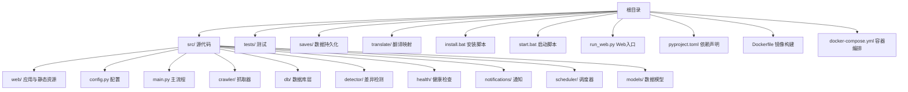
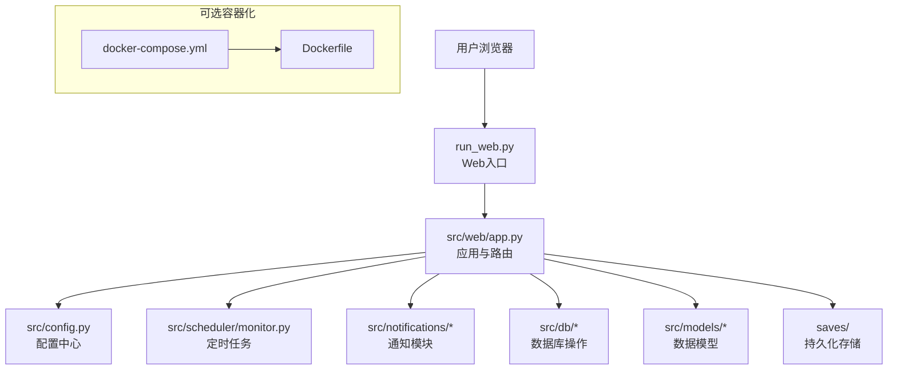
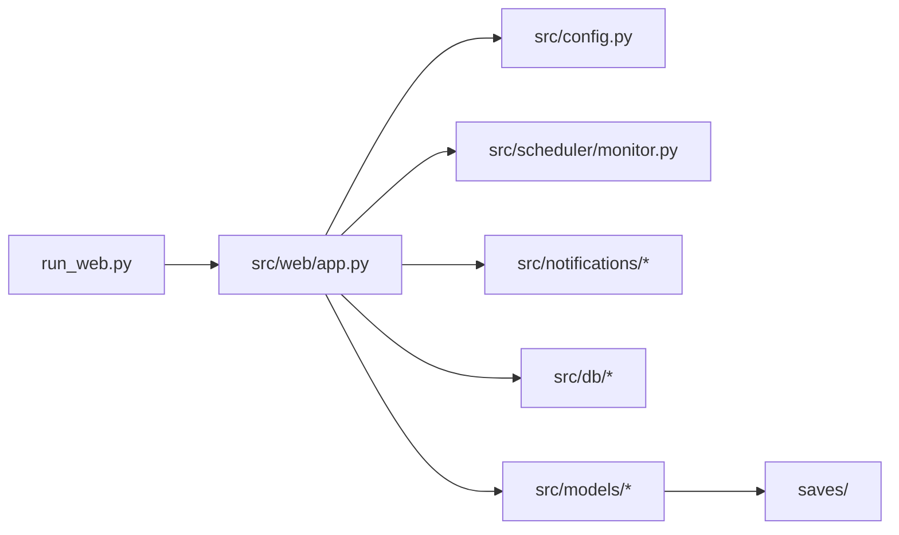

# 本地安装

<cite>
**本文引用的文件**   
- [README.md](file://README.md)
- [pyproject.toml](file://pyproject.toml)
- [install.bat](file://install.bat)
- [start.bat](file://start.bat)
- [run_web.py](file://run_web.py)
- [src/config.py](file://src/config.py)
- [src/main.py](file://src/main.py)
- [Dockerfile](file://Dockerfile)
- [docker-compose.yml](file://docker-compose.yml)
</cite>

## 目录
1. [简介](#简介)
2. [项目结构](#项目结构)
3. [核心组件](#核心组件)
4. [架构总览](#架构总览)
5. [详细组件分析](#详细组件分析)
6. [依赖关系分析](#依赖关系分析)
7. [性能注意事项](#性能注意事项)
8. [故障排查指南](#故障排查指南)
9. [结论](#结论)
10. [附录](#附录)

## 简介
本指南面向初学者，提供完整的本地安装说明。内容涵盖：
- Python 环境要求与依赖包清单
- Windows 批处理脚本 install.bat 与 start.bat 的使用方式
- 虚拟环境创建、依赖安装、配置文件初始化等步骤
- Linux/Mac 环境的替代安装方案
- 常见安装问题的排查与解决方案

通过本指南，你将能够在本地快速搭建并运行该监控项目的 Web 服务与后台任务。

## 项目结构
仓库采用按功能模块划分的目录组织方式，核心入口位于根目录的 run_web.py 与 src/main.py，Web 服务由 src/web/app.py 提供，配置集中在 src/config.py，依赖声明在 pyproject.toml，Windows 一键安装与启动脚本为 install.bat 与 start.bat，同时提供 Docker 化部署能力（Dockerfile、docker-compose.yml）。

[本节未直接分析具体文件，故不列出“章节来源”]

## 核心组件
- 依赖管理：pyproject.toml 集中声明项目依赖与构建工具链。
- 安装与启动：install.bat 负责创建虚拟环境、安装依赖；start.bat 用于启动服务。
- 运行入口：run_web.py 作为 Web 服务的统一入口；src/main.py 提供后台任务或主流程逻辑。
- 配置中心：src/config.py 提供统一的配置读取与默认值。
- 容器化：Dockerfile 与 docker-compose.yml 支持容器化部署与编排。

**章节来源**
- [pyproject.toml](file://pyproject.toml)
- [install.bat](file://install.bat)
- [start.bat](file://start.bat)
- [run_web.py](file://run_web.py)
- [src/main.py](file://src/main.py)
- [src/config.py](file://src/config.py)
- [Dockerfile](file://Dockerfile)
- [docker-compose.yml](file://docker-compose.yml)

## 架构总览
下图展示了本地运行时的主要组件与交互关系：用户通过浏览器访问 Web 界面，Web 服务由 run_web.py 启动，内部调用 src/web/app.py 提供的路由与业务逻辑；配置由 src/config.py 统一管理；后台任务由 src/main.py 驱动；数据持久化到 saves/ 目录；可选地通过 Docker 容器化运行。

**图表来源**
- [run_web.py](file://run_web.py)
- [src/web/app.py](file://src/web/app.py)
- [src/config.py](file://src/config.py)
- [src/scheduler/monitor.py](file://src/scheduler/monitor.py)
- [src/notifications/admin_notifier.py](file://src/notifications/admin_notifier.py)
- [src/notifications/user_notifier.py](file://src/notifications/user_notifier.py)
- [src/db/database.py](file://src/db/database.py)
- [src/db/models.py](file://src/db/models.py)
- [src/db/repository.py](file://src/db/repository.py)
- [src/models/item.py](file://src/models/item.py)
- [Dockerfile](file://Dockerfile)
- [docker-compose.yml](file://docker-compose.yml)

**章节来源**
- [run_web.py](file://run_web.py)
- [src/web/app.py](file://src/web/app.py)
- [src/config.py](file://src/config.py)
- [src/main.py](file://src/main.py)
- [Dockerfile](file://Dockerfile)
- [docker-compose.yml](file://docker-compose.yml)

## 详细组件分析

### 安装与启动脚本（Windows）
- install.bat：用于创建 Python 虚拟环境、安装依赖包、执行必要的初始化步骤。建议在首次克隆仓库后运行一次。
- start.bat：用于启动 Web 服务或后台任务，通常会在已创建的虚拟环境中激活并运行入口脚本。

使用建议：
- 以管理员权限打开命令提示符或 PowerShell，进入仓库根目录。
- 先运行 install.bat 完成环境准备。
- 再运行 start.bat 启动服务。

注意：
- 若系统未安装 Python 或 pip，请先安装对应版本后再执行脚本。
- 如遇网络问题，可配置国内镜像源加速依赖下载。

**章节来源**
- [install.bat](file://install.bat)
- [start.bat](file://start.bat)

### 依赖管理与构建（pyproject.toml）
- 所有第三方依赖与构建工具均在 pyproject.toml 中声明，便于统一管理与复现环境。
- 推荐使用现代 Python 工具链（如 uv、pipx、或 venv + pip）进行依赖安装。

最佳实践：
- 优先使用虚拟环境隔离依赖。
- 固定依赖版本以确保可重复构建。
- 在 CI/CD 中复用相同的依赖锁定策略。

**章节来源**
- [pyproject.toml](file://pyproject.toml)

### Web 服务入口（run_web.py）
- run_web.py 是 Web 服务的统一入口，负责加载配置、初始化应用、启动服务器。
- 通常监听指定端口并提供 HTTP API 与静态页面。

运行要点：
- 确保依赖已安装且配置正确。
- 如需自定义端口或调试模式，可通过环境变量或命令行参数覆盖默认设置。

**章节来源**
- [run_web.py](file://run_web.py)

### 主流程与后台任务（src/main.py）
- src/main.py 提供后台任务或主流程逻辑，可与 Web 服务并行运行。
- 常用于定时任务、数据采集、消息处理等场景。

运行要点：
- 与 Web 服务共享同一虚拟环境与配置。
- 可通过进程管理器（如 systemd、supervisor）或容器编排进行生命周期管理。

**章节来源**
- [src/main.py](file://src/main.py)

### 配置中心（src/config.py）
- src/config.py 集中管理配置项，包括默认值与环境变量覆盖。
- 建议将敏感信息（如密钥、连接串）通过环境变量注入，避免硬编码。

配置建议：
- 区分开发、测试、生产环境配置。
- 对必填项进行校验，失败时给出明确错误信息。

**章节来源**
- [src/config.py](file://src/config.py)

### 容器化部署（Dockerfile 与 docker-compose.yml）
- Dockerfile 定义镜像构建步骤，包含 Python 运行时、依赖安装与应用代码复制。
- docker-compose.yml 编排多个服务（如 Web、数据库、缓存），简化本地与生产部署。

使用建议：
- 本地开发可使用 docker-compose up -d 快速拉起服务。
- 生产环境建议结合环境变量与外部卷实现配置与数据持久化。

**章节来源**
- [Dockerfile](file://Dockerfile)
- [docker-compose.yml](file://docker-compose.yml)

## 依赖关系分析
下图展示关键模块之间的依赖关系与调用方向，有助于理解数据流与控制流。

**图表来源**
- [run_web.py](file://run_web.py)
- [src/web/app.py](file://src/web/app.py)
- [src/config.py](file://src/config.py)
- [src/scheduler/monitor.py](file://src/scheduler/monitor.py)
- [src/notifications/admin_notifier.py](file://src/notifications/admin_notifier.py)
- [src/notifications/user_notifier.py](file://src/notifications/user_notifier.py)
- [src/db/database.py](file://src/db/database.py)
- [src/db/models.py](file://src/db/models.py)
- [src/db/repository.py](file://src/db/repository.py)
- [src/models/item.py](file://src/models/item.py)

**章节来源**
- [pyproject.toml](file://pyproject.toml)
- [run_web.py](file://run_web.py)
- [src/main.py](file://src/main.py)

## 性能注意事项
- 依赖安装：建议使用离线缓存或镜像源加速，减少首次安装时间。
- 虚拟环境：保持最小化依赖集合，按需引入扩展包。
- 配置加载：避免在热路径中进行昂贵的配置解析，必要时进行缓存。
- 并发与线程：根据任务类型选择合适的并发模型（多线程/多进程/异步）。
- 存储读写：对频繁写入的数据考虑批量提交与索引优化。

[本节为通用指导，不直接分析具体文件，故不列出“章节来源”]

## 故障排查指南
常见问题与解决思路：
- Python 版本不匹配：确认本地 Python 版本满足项目要求，必要时升级或切换版本。
- 依赖安装失败：检查网络连接与镜像源配置，尝试更换国内镜像或离线安装。
- 权限不足：在 Windows 上以管理员权限运行脚本；在 Linux/Mac 上使用 sudo 或调整权限。
- 端口占用：修改服务监听端口或释放被占用的端口。
- 配置文件缺失：根据模板生成配置文件，并确保环境变量正确注入。
- 容器启动失败：检查 Docker 与 docker-compose 版本，查看日志定位问题。

**章节来源**
- [README.md](file://README.md)
- [pyproject.toml](file://pyproject.toml)
- [install.bat](file://install.bat)
- [start.bat](file://start.bat)
- [Dockerfile](file://Dockerfile)
- [docker-compose.yml](file://docker-compose.yml)

## 结论
通过本指南，你可以在 Windows、Linux 与 Mac 环境下完成本地安装与运行。推荐优先使用虚拟环境隔离依赖，并通过 pyproject.toml 统一管理依赖版本。对于团队协作与生产部署，建议结合 Docker 与容器编排提升一致性与可维护性。

[本节为总结性内容，不直接分析具体文件，故不列出“章节来源”]

## 附录

### Windows 安装步骤（基于批处理脚本）
- 前置条件：安装 Python 与 pip，确保可在命令行中直接调用 python 与 pip。
- 步骤：
  1) 打开命令提示符或 PowerShell，进入仓库根目录。
  2) 运行 install.bat 创建虚拟环境并安装依赖。
  3) 根据需要初始化配置文件（参考 src/config.py 的默认值与环境变量）。
  4) 运行 start.bat 启动服务。
- 验证：访问 http://localhost:端口 或通过 API 接口确认服务正常。

**章节来源**
- [install.bat](file://install.bat)
- [start.bat](file://start.bat)
- [src/config.py](file://src/config.py)

### Linux/Mac 替代安装方案
- 前置条件：安装 Python 与 pip，确保具备虚拟环境管理能力（venv 或 virtualenv）。
- 步骤：
  1) 创建并激活虚拟环境：python -m venv .venv && source .venv/bin/activate（Mac/Linux）。
  2) 安装依赖：pip install -r requirements.txt 或使用 pyproject.toml 对应的安装命令。
  3) 初始化配置文件：根据 src/config.py 的默认值与环境变量生成配置。
  4) 启动服务：运行 run_web.py 或相关入口脚本。
- 验证：同 Windows 步骤，访问本地服务地址确认正常运行。

**章节来源**
- [pyproject.toml](file://pyproject.toml)
- [run_web.py](file://run_web.py)
- [src/config.py](file://src/config.py)

### 容器化安装（Docker）
- 前置条件：安装 Docker 与 docker-compose。
- 步骤：
  1) 在项目根目录执行 docker-compose up -d 拉起服务。
  2) 检查容器状态与日志，确认服务就绪。
  3) 访问服务端口或使用 API 验证功能。
- 注意：如需自定义配置，可通过环境变量或挂载卷覆盖默认设置。

**章节来源**
- [Dockerfile](file://Dockerfile)
- [docker-compose.yml](file://docker-compose.yml)