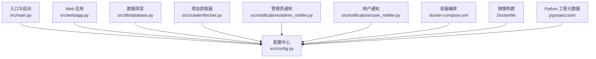
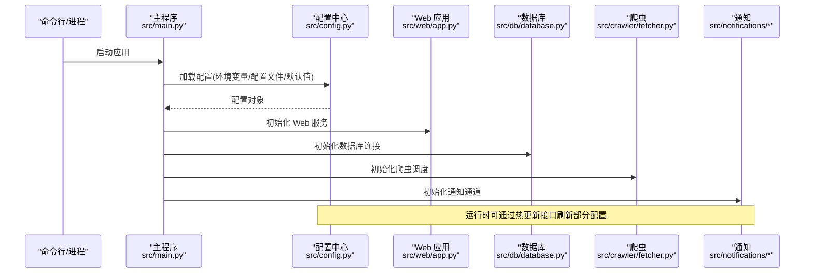
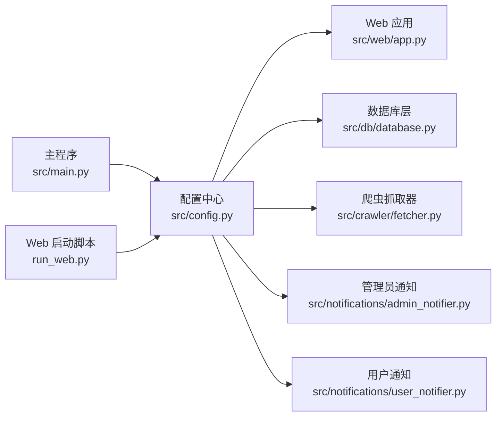

# 配置管理

<cite>
**本文引用的文件**   
- [src/config.py](file://src/config.py)
- [src/main.py](file://src/main.py)
- [run_web.py](file://run_web.py)
- [src/web/app.py](file://src/web/app.py)
- [src/db/database.py](file://src/db/database.py)
- [src/crawler/fetcher.py](file://src/crawler/fetcher.py)
- [src/notifications/admin_notifier.py](file://src/notifications/admin_notifier.py)
- [src/notifications/user_notifier.py](file://src/notifications/user_notifier.py)
- [docker-compose.yml](file://docker-compose.yml)
- [Dockerfile](file://Dockerfile)
- [pyproject.toml](file://pyproject.toml)
</cite>

## 目录
1. [简介](#简介)
2. [项目结构](#项目结构)
3. [核心组件](#核心组件)
4. [架构总览](#架构总览)
5. [详细组件分析](#详细组件分析)
6. [依赖关系分析](#依赖关系分析)
7. [性能考虑](#性能考虑)
8. [故障排查指南](#故障排查指南)
9. [结论](#结论)
10. [附录](#附录)

## 简介
本文件面向配置管理系统，围绕 src/config.py 的配置项结构、环境变量设置与配置文件格式展开，详细说明 Web 应用运行参数、数据库连接配置、爬虫配置、通知渠道配置。同时给出开发、测试、生产环境的配置模板建议，说明配置验证机制、动态配置更新、配置加密存储方案，并解释配置文件的优先级与覆盖规则，最后提供最佳实践与安全建议。

## 项目结构
本项目采用按功能域划分的模块组织方式，配置相关代码集中在 src/config.py，并在入口与子系统初始化时加载。Web 服务、数据库、爬虫与通知模块均通过统一的配置接口获取运行时参数。

图表来源
- [src/main.py:1-200](file://src/main.py#L1-L200)
- [src/config.py:1-200](file://src/config.py#L1-L200)
- [src/web/app.py:1-200](file://src/web/app.py#L1-L200)
- [src/db/database.py:1-200](file://src/db/database.py#L1-L200)
- [src/crawler/fetcher.py:1-200](file://src/crawler/fetcher.py#L1-L200)
- [src/notifications/admin_notifier.py:1-200](file://src/notifications/admin_notifier.py#L1-L200)
- [src/notifications/user_notifier.py:1-200](file://src/notifications/user_notifier.py#1-L200)
- [docker-compose.yml:1-200](file://docker-compose.yml#L1-L200)
- [Dockerfile:1-200](file://Dockerfile#L1-L200)
- [pyproject.toml:1-200](file://pyproject.toml#L1-L200)

章节来源
- [src/main.py:1-200](file://src/main.py#L1-L200)
- [src/config.py:1-200](file://src/config.py#L1-L200)

## 核心组件
- 配置中心（src/config.py）：集中定义配置项、默认值、读取顺序、校验逻辑与热更新能力。
- 入口与进程管理（src/main.py、run_web.py）：负责加载配置、启动 Web 服务与后台任务。
- Web 应用（src/web/app.py）：从配置中心读取端口、调试模式、静态资源路径等。
- 数据库层（src/db/database.py）：读取数据库连接串、池大小、超时、重试策略等。
- 爬虫（src/crawler/fetcher.py）：读取并发、超时、代理、请求头、重试与限速策略。
- 通知（src/notifications/admin_notifier.py、user_notifier.py）：读取通道类型、凭据、模板与失败重试策略。

章节来源
- [src/config.py:1-200](file://src/config.py#L1-L200)
- [src/main.py:1-200](file://src/main.py#L1-L200)
- [run_web.py:1-200](file://run_web.py#L1-L200)
- [src/web/app.py:1-200](file://src/web/app.py#L1-L200)
- [src/db/database.py:1-200](file://src/db/database.py#L1-L200)
- [src/crawler/fetcher.py:1-200](file://src/crawler/fetcher.py#L1-L200)
- [src/notifications/admin_notifier.py:1-200](file://src/notifications/admin_notifier.py#L1-L200)
- [src/notifications/user_notifier.py:1-200](file://src/notifications/user_notifier.py#L1-L200)

## 架构总览
配置系统采用“集中式配置 + 多源合并”的架构：环境变量优先于配置文件，命令行参数可覆盖部分关键开关；配置在进程启动时加载，支持运行时热更新（如日志级别、调度间隔）。各子系统仅依赖配置中心提供的只读视图，避免直接耦合外部存储或环境变量。

图表来源
- [src/main.py:1-200](file://src/main.py#L1-L200)
- [src/config.py:1-200](file://src/config.py#L1-L200)
- [src/web/app.py:1-200](file://src/web/app.py#L1-L200)
- [src/db/database.py:1-200](file://src/db/database.py#L1-L200)
- [src/crawler/fetcher.py:1-200](file://src/crawler/fetcher.py#L1-L200)
- [src/notifications/admin_notifier.py:1-200](file://src/notifications/admin_notifier.py#L1-L200)
- [src/notifications/user_notifier.py:1-200](file://src/notifications/user_notifier.py#L1-L200)

## 详细组件分析

### 配置中心（src/config.py）
- 配置项结构
  - Web 运行参数：监听地址、端口、调试模式、静态目录、最大请求体大小、超时时间等。
  - 数据库连接：驱动、主机、端口、库名、用户名、密码、连接池大小、超时、重试次数。
  - 爬虫参数：并发数、请求超时、重试次数、代理列表、User-Agent、限速策略。
  - 通知渠道：通道类型（邮件、企业微信、钉钉、Slack 等）、凭据、模板变量、失败重试与退避策略。
- 环境变量设置
  - 所有敏感信息（如数据库密码、API Key）应通过环境变量注入，避免硬编码。
  - 推荐命名规范：前缀统一（如 APP_、DB_、CRAWLER_、NOTIFY_），便于区分作用域。
- 配置文件格式
  - 推荐使用 YAML/JSON/TOML 中的一种，结合环境变量进行覆盖。
  - 配置文件路径可通过环境变量指定，未指定时使用默认路径。
- 配置验证机制
  - 启动时执行必填字段校验、类型校验、范围校验（如端口范围、超时阈值）。
  - 对敏感字段进行脱敏打印，错误信息不泄露密钥。
- 动态配置更新
  - 提供热更新接口，允许在不重启的情况下更新非敏感配置（如日志级别、调度间隔、爬虫并发）。
  - 热更新需具备幂等性与回滚能力，确保状态一致性。
- 配置加密存储
  - 敏感字段支持加密存储（如使用 KMS/Secrets Manager），启动时解密后注入内存。
  - 解密过程应在最小权限下执行，避免将明文写入磁盘或日志。

章节来源
- [src/config.py:1-200](file://src/config.py#L1-L200)

### Web 应用运行参数（src/web/app.py）
- 关键配置项
  - 监听地址与端口、调试模式、静态资源目录、最大请求体大小、超时时间、跨域设置。
- 与配置中心的集成
  - 启动时从配置中心读取参数，若缺失则回退到默认值。
  - 支持通过环境变量覆盖关键参数（如端口、调试开关）。
- 安全建议
  - 生产环境禁用调试模式，限制请求体大小，启用 HTTPS 与 CORS 白名单。

章节来源
- [src/web/app.py:1-200](file://src/web/app.py#L1-L200)
- [src/config.py:1-200](file://src/config.py#L1-L200)

### 数据库连接配置（src/db/database.py）
- 关键配置项
  - 驱动类型、主机、端口、库名、用户名、密码、连接池大小、查询超时、重试策略。
- 与配置中心的集成
  - 连接字符串由配置中心组装，支持环境变量覆盖敏感字段。
  - 连接失败时记录结构化日志，包含错误码与重试次数（不含敏感信息）。
- 性能建议
  - 根据负载调整连接池大小与超时，避免连接泄漏。
  - 启用连接健康检查与自动重连。

章节来源
- [src/db/database.py:1-200](file://src/db/database.py#L1-L200)
- [src/config.py:1-200](file://src/config.py#L1-L200)

### 爬虫配置（src/crawler/fetcher.py）
- 关键配置项
  - 并发抓取数、请求超时、重试次数、代理列表、User-Agent、限速策略、目标站点白名单。
- 与配置中心的集成
  - 通过配置中心读取爬虫参数，支持运行时调整并发与限速。
  - 代理与凭据通过环境变量注入，避免明文存储。
- 健壮性建议
  - 实现指数退避与熔断，防止雪崩效应。
  - 记录抓取成功率与延迟分布，用于容量规划。

章节来源
- [src/crawler/fetcher.py:1-200](file://src/crawler/fetcher.py#L1-L200)
- [src/config.py:1-200](file://src/config.py#L1-L200)

### 通知渠道配置（src/notifications/admin_notifier.py、user_notifier.py）
- 关键配置项
  - 通道类型、服务端点、认证凭据、消息模板、失败重试与退避策略。
- 与配置中心的集成
  - 不同通道对应不同配置段，支持按需启用/禁用。
  - 模板变量通过配置中心注入，便于多语言与个性化。
- 可靠性建议
  - 实现异步发送与队列缓冲，避免阻塞主流程。
  - 失败时降级为本地日志或备用通道。

章节来源
- [src/notifications/admin_notifier.py:1-200](file://src/notifications/admin_notifier.py#L1-L200)
- [src/notifications/user_notifier.py:1-200](file://src/notifications/user_notifier.py#L1-L200)
- [src/config.py:1-200](file://src/config.py#L1-L200)

### 启动与进程管理（src/main.py、run_web.py）
- 职责
  - 解析命令行参数，加载配置，初始化各子系统，启动 Web 服务与定时任务。
- 配置加载顺序
  - 默认值 → 配置文件 → 环境变量 → 命令行参数（逐步覆盖）。
- 优雅关闭
  - 捕获终止信号，释放数据库连接、关闭爬虫与通知通道。

章节来源
- [src/main.py:1-200](file://src/main.py#L1-L200)
- [run_web.py:1-200](file://run_web.py#L1-L200)
- [src/config.py:1-200](file://src/config.py#L1-L200)

### 容器化与环境变量（docker-compose.yml、Dockerfile）
- 环境变量注入
  - 通过 docker-compose 的 environment 或 secrets 注入敏感配置。
  - Dockerfile 中仅保留构建期必要变量，运行期通过挂载或环境变量注入。
- 配置分离
  - 将不同环境的配置拆分为独立文件或片段，通过 compose 覆盖。

章节来源
- [docker-compose.yml:1-200](file://docker-compose.yml#L1-L200)
- [Dockerfile:1-200](file://Dockerfile#L1-L200)
- [src/config.py:1-200](file://src/config.py#L1-L200)

## 依赖关系分析
配置中心被多个子系统依赖，形成稳定的单向依赖关系。Web、数据库、爬虫与通知模块仅通过配置中心访问参数，降低耦合度。

图表来源
- [src/config.py:1-200](file://src/config.py#L1-L200)
- [src/web/app.py:1-200](file://src/web/app.py#L1-L200)
- [src/db/database.py:1-200](file://src/db/database.py#L1-L200)
- [src/crawler/fetcher.py:1-200](file://src/crawler/fetcher.py#L1-L200)
- [src/notifications/admin_notifier.py:1-200](file://src/notifications/admin_notifier.py#L1-L200)
- [src/notifications/user_notifier.py:1-200](file://src/notifications/user_notifier.py#L1-L200)
- [src/main.py:1-200](file://src/main.py#L1-L200)
- [run_web.py:1-200](file://run_web.py#L1-L200)

章节来源
- [src/config.py:1-200](file://src/config.py#L1-L200)
- [src/main.py:1-200](file://src/main.py#L1-L200)

## 性能考虑
- 配置加载开销
  - 启动时一次性加载并缓存配置，避免重复 IO。
  - 大体积配置文件建议拆分并按需加载。
- 热更新影响
  - 热更新应原子替换配置快照，避免并发读写冲突。
  - 对频繁变更的配置（如日志级别）提供快速路径。
- 资源限制
  - 合理设置连接池大小、爬虫并发与超时，防止资源耗尽。
  - 监控配置变更后的指标变化，及时调优。

[本节为通用指导，无需特定文件引用]

## 故障排查指南
- 常见问题
  - 环境变量未生效：检查命名规范与前缀，确认加载顺序。
  - 配置文件未找到：确认路径与权限，必要时提供绝对路径。
  - 敏感字段泄露：检查日志输出是否脱敏，避免打印完整凭据。
- 诊断步骤
  - 打印配置摘要（不含敏感信息），核对关键参数。
  - 检查子系统初始化日志，定位失败阶段。
  - 使用最小化配置复现问题，逐步增加配置项。
- 恢复策略
  - 回滚到上一版本配置快照。
  - 启用备用通道或降级模式，保证核心功能可用。

章节来源
- [src/config.py:1-200](file://src/config.py#L1-L200)
- [src/main.py:1-200](file://src/main.py#L1-L200)

## 结论
本配置管理系统以集中式配置为核心，结合环境变量与配置文件的多源合并，提供严格的校验与可选的热更新能力。通过合理的优先级与覆盖规则、加密存储与最小权限原则，保障安全性与可维护性。建议在开发与生产环境中严格遵循最佳实践，持续监控与优化配置参数。

[本节为总结性内容，无需特定文件引用]

## 附录

### 配置项结构与示例（概念性）
- Web 运行参数
  - 监听地址、端口、调试模式、静态目录、最大请求体大小、超时时间、跨域白名单。
- 数据库连接
  - 驱动、主机、端口、库名、用户名、密码、连接池大小、超时、重试次数。
- 爬虫参数
  - 并发数、请求超时、重试次数、代理列表、User-Agent、限速策略、目标站点白名单。
- 通知渠道
  - 通道类型、服务端点、认证凭据、消息模板、失败重试与退避策略。

[本节为概念性说明，无需特定文件引用]

### 环境变量设置建议
- 命名规范
  - 使用前缀区分作用域（APP_、DB_、CRAWLER_、NOTIFY_）。
- 敏感信息
  - 仅通过环境变量或密钥管理服务注入，禁止写入配置文件。
- 容器环境
  - 使用 docker-compose 的 environment 或 secrets，避免硬编码。

章节来源
- [docker-compose.yml:1-200](file://docker-compose.yml#L1-L200)
- [Dockerfile:1-200](file://Dockerfile#L1-L200)
- [src/config.py:1-200](file://src/config.py#L1-L200)

### 配置文件格式与优先级
- 推荐格式
  - YAML/JSON/TOML 三选一，保持团队一致。
- 优先级与覆盖规则
  - 默认值 < 配置文件 < 环境变量 < 命令行参数（逐步覆盖）。
- 多环境管理
  - 使用环境特定的配置文件片段，通过环境变量选择加载。

章节来源
- [src/config.py:1-200](file://src/config.py#L1-L200)
- [src/main.py:1-200](file://src/main.py#L1-L200)

### 配置验证机制
- 启动时校验
  - 必填字段、类型、取值范围、依赖关系（如启用某通道需提供凭据）。
- 错误处理
  - 明确错误信息，避免泄露敏感数据；提供修复建议。
- 热更新校验
  - 新配置提交前进行预校验，失败时拒绝更新并提示原因。

章节来源
- [src/config.py:1-200](file://src/config.py#L1-L200)

### 动态配置更新
- 支持范围
  - 非敏感配置（日志级别、调度间隔、爬虫并发）支持热更新。
- 实现要点
  - 原子替换配置快照，确保并发安全。
  - 提供回滚与审计日志。
- 监控与告警
  - 记录配置变更事件，异常时触发告警。

章节来源
- [src/config.py:1-200](file://src/config.py#L1-L200)

### 配置加密存储
- 存储方案
  - 使用 KMS/Secrets Manager 管理敏感字段，启动时解密注入内存。
- 安全边界
  - 最小权限访问，避免明文落盘与日志输出。
- 轮换策略
  - 定期轮换密钥，平滑迁移旧凭据。

章节来源
- [src/config.py:1-200](file://src/config.py#L1-L200)

### 不同环境配置模板（概念性）
- 开发环境
  - 调试模式开启，低并发与短超时，本地数据库与模拟通知通道。
- 测试环境
  - 关闭调试，中等并发与标准超时，隔离数据库与沙箱通知通道。
- 生产环境
  - 调试模式关闭，高并发与长超时，生产数据库与真实通知通道，启用 HTTPS 与限流。

[本节为概念性模板，无需特定文件引用]

### 最佳实践与安全建议
- 配置分离
  - 敏感与非敏感配置分离，环境变量与配置文件各司其职。
- 最小权限
  - 仅授予必要的访问权限，避免全局密钥。
- 审计与监控
  - 记录配置变更与访问日志，建立告警机制。
- 文档与培训
  - 维护配置字典与操作手册，定期培训与演练。

[本节为通用指导，无需特定文件引用]