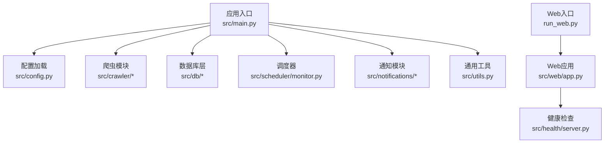
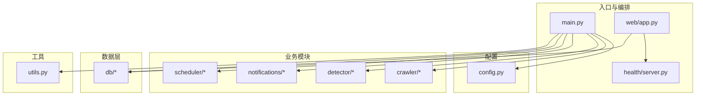
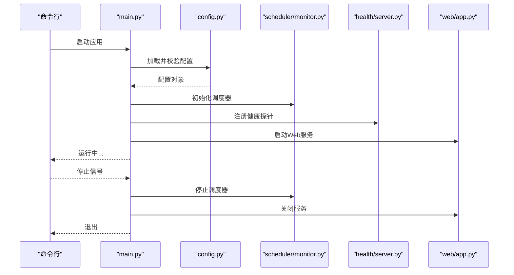
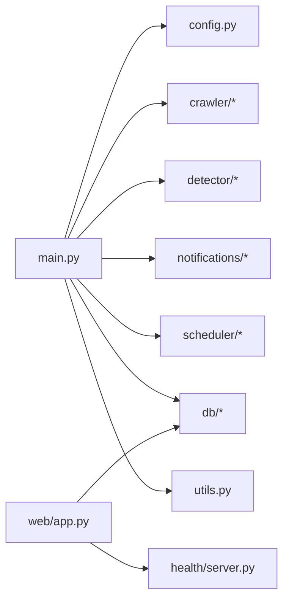

# 代码规范

<cite>
**本文引用的文件**   
- [README.md](file://README.md)
- [pyproject.toml](file://pyproject.toml)
- [src/main.py](file://src/main.py)
- [src/config.py](file://src/config.py)
- [src/utils.py](file://src/utils.py)
- [src/crawler/fetcher.py](file://src/crawler/fetcher.py)
- [src/crawler/parser.py](file://src/crawler/parser.py)
- [src/db/database.py](file://src/db/database.py)
- [src/db/models.py](file://src/db/models.py)
- [src/health/server.py](file://src/health/server.py)
- [src/web/app.py](file://src/web/app.py)
- [tests/conftest.py](file://tests/conftest.py)
- [Dockerfile](file://Dockerfile)
</cite>

## 目录
1. [引言](#引言)
2. [项目结构](#项目结构)
3. [核心组件](#核心组件)
4. [架构总览](#架构总览)
5. [详细组件分析](#详细组件分析)
6. [依赖关系分析](#依赖关系分析)
7. [性能考虑](#性能考虑)
8. [故障排查指南](#故障排查指南)
9. [结论](#结论)
10. [附录：代码审查清单与工具配置](#附录代码审查清单与工具配置)

## 引言
本规范旨在为Python代码库建立统一的编码风格、命名约定、文件组织与模块边界，明确导入顺序、函数与类设计原则、错误处理与日志记录模式、配置管理最佳实践与安全注意事项，并提供代码审查清单和质量检查工具的配置建议，确保代码库的一致性与可维护性。

## 项目结构
仓库采用按功能域划分的模块化结构，核心入口位于 src/main.py，Web服务入口在 run_web.py；健康检查与健康端点在 health/server.py；爬虫相关逻辑集中在 crawler 包；数据访问层在 db 包；通知能力在 notifications 包；调度器在 scheduler 包；Web界面资源在 web/static。测试集中于 tests 目录，翻译映射在 translate 目录。

图表来源
- [src/main.py](file://src/main.py)
- [src/config.py](file://src/config.py)
- [src/crawler/fetcher.py](file://src/crawler/fetcher.py)
- [src/crawler/parser.py](file://src/crawler/parser.py)
- [src/db/database.py](file://src/db/database.py)
- [src/db/models.py](file://src/db/models.py)
- [src/health/server.py](file://src/health/server.py)
- [src/web/app.py](file://src/web/app.py)
- [run_web.py](file://run_web.py)

章节来源
- [README.md](file://README.md)
- [pyproject.toml](file://pyproject.toml)

## 核心组件
- 应用入口与生命周期管理：负责初始化配置、启动调度器、注册健康检查、启动Web服务等。
- 配置管理：集中读取环境变量与配置文件，提供类型安全的配置对象，支持默认值与校验。
- 爬虫子系统：抓取、解析与本地化，强调超时、重试与代理策略的可配置性。
- 数据访问层：封装ORM模型与仓储接口，统一事务与连接池管理。
- 健康检查：对外暴露健康探针，便于容器编排与负载均衡探测。
- Web服务：提供REST或页面服务，遵循安全与性能最佳实践。
- 工具与辅助：日志、序列化、加密、HTTP客户端等通用能力。

章节来源
- [src/main.py](file://src/main.py)
- [src/config.py](file://src/config.py)
- [src/crawler/fetcher.py](file://src/crawler/fetcher.py)
- [src/crawler/parser.py](file://src/crawler/parser.py)
- [src/db/database.py](file://src/db/database.py)
- [src/db/models.py](file://src/db/models.py)
- [src/health/server.py](file://src/health/server.py)
- [src/web/app.py](file://src/web/app.py)
- [src/utils.py](file://src/utils.py)

## 架构总览
系统由“入口—配置—业务模块—基础设施”四层构成。入口协调各模块生命周期；配置层提供统一配置源；业务模块（爬虫、检测、通知、调度）通过数据访问层持久化状态；健康检查与Web服务作为外部集成点。

图表来源
- [src/main.py](file://src/main.py)
- [src/config.py](file://src/config.py)
- [src/crawler/fetcher.py](file://src/crawler/fetcher.py)
- [src/crawler/parser.py](file://src/crawler/parser.py)
- [src/detector/diff.py](file://src/detector/diff.py)
- [src/notifications/admin_notifier.py](file://src/notifications/admin_notifier.py)
- [src/notifications/user_notifier.py](file://src/notifications/user_notifier.py)
- [src/scheduler/monitor.py](file://src/scheduler/monitor.py)
- [src/db/database.py](file://src/db/database.py)
- [src/db/models.py](file://src/db/models.py)
- [src/health/server.py](file://src/health/server.py)
- [src/web/app.py](file://src/web/app.py)
- [src/utils.py](file://src/utils.py)

## 详细组件分析

### 入口与生命周期（src/main.py）
- 职责：加载配置、初始化日志、启动调度器、注册健康检查、启动Web服务、优雅关闭。
- 设计要点：
  - 使用结构化日志，避免打印语句。
  - 将长生命周期对象以单例或上下文管理器形式管理。
  - 对异常进行捕获并上报，保证进程退出码正确。
- 推荐流程：

图表来源
- [src/main.py](file://src/main.py)
- [src/config.py](file://src/config.py)
- [src/scheduler/monitor.py](file://src/scheduler/monitor.py)
- [src/health/server.py](file://src/health/server.py)
- [src/web/app.py](file://src/web/app.py)

章节来源
- [src/main.py](file://src/main.py)

### 配置管理（src/config.py）
- 职责：集中读取环境变量、配置文件，提供类型安全与默认值，支持多环境切换。
- 设计要点：
  - 使用强类型字段与校验，失败时给出清晰错误信息。
  - 敏感信息仅从环境变量注入，禁止硬编码。
  - 提供只读配置视图，防止运行时篡改。
- 推荐模式：
  - 分层加载：默认值 → 配置文件 → 环境变量 → 运行时覆盖。
  - 延迟求值：按需加载昂贵配置项。
  - 审计日志：记录关键配置变更（脱敏后）。

章节来源
- [src/config.py](file://src/config.py)

### 爬虫子系统（src/crawler/fetcher.py, src/crawler/parser.py）
- fetcher：负责HTTP请求、重试、超时、代理、限流与缓存。
- parser：负责HTML/JSON解析、数据清洗、标准化输出。
- 设计要点：
  - 所有网络调用必须设置超时与重试策略。
  - 解析器应幂等且健壮，对畸形输入返回明确错误。
  - 使用结构化日志记录请求/响应摘要（脱敏）。
- 错误处理：
  - 区分网络错误、解析错误与业务错误，分别记录与重试策略。
  - 对不可恢复错误快速失败，避免级联故障。

章节来源
- [src/crawler/fetcher.py](file://src/crawler/fetcher.py)
- [src/crawler/parser.py](file://src/crawler/parser.py)

### 数据访问层（src/db/database.py, src/db/models.py）
- database：连接池、会话管理、事务封装、迁移执行。
- models：ORM模型定义、字段约束、关联关系。
- 设计要点：
  - 统一连接生命周期，避免连接泄漏。
  - 使用仓储模式隔离查询细节，便于测试替换。
  - 对慢查询与异常进行监控与告警。
- 并发与一致性：
  - 合理设置隔离级别与锁策略。
  - 批量操作优先，减少往返次数。

章节来源
- [src/db/database.py](file://src/db/database.py)
- [src/db/models.py](file://src/db/models.py)

### 健康检查（src/health/server.py）
- 职责：暴露健康探针，聚合各子系统健康状态。
- 设计要点：
  - 轻量、无副作用、快速返回。
  - 依赖检查需具备降级与超时保护。
  - 区分就绪与存活探针。

章节来源
- [src/health/server.py](file://src/health/server.py)

### Web服务（src/web/app.py）
- 职责：路由、鉴权、请求校验、响应格式化、静态资源托管。
- 设计要点：
  - 输入校验与输出序列化分离。
  - 统一错误响应格式与状态码。
  - 启用HTTPS、CORS、CSRF防护等安全措施。

章节来源
- [src/web/app.py](file://src/web/app.py)

### 工具与辅助（src/utils.py）
- 职责：日志、序列化、加解密、时间处理、字符串与集合工具。
- 设计要点：
  - 纯函数优先，避免隐式状态。
  - 对外暴露稳定API，内部实现可演进。

章节来源
- [src/utils.py](file://src/utils.py)

## 依赖关系分析
- 模块内聚与耦合：
  - 入口与配置低耦合，通过依赖注入或工厂创建实例。
  - 爬虫与数据层通过仓储接口解耦，便于单元测试替换。
  - Web与健康模块独立，不直接依赖爬虫与调度。
- 外部依赖：
  - HTTP客户端、ORM框架、消息队列、缓存等应在配置中声明，并通过适配器接入。
- 循环依赖规避：
  - 使用接口抽象与事件总线降低耦合。

图表来源
- [src/main.py](file://src/main.py)
- [src/config.py](file://src/config.py)
- [src/crawler/fetcher.py](file://src/crawler/fetcher.py)
- [src/crawler/parser.py](file://src/crawler/parser.py)
- [src/detector/diff.py](file://src/detector/diff.py)
- [src/notifications/admin_notifier.py](file://src/notifications/admin_notifier.py)
- [src/notifications/user_notifier.py](file://src/notifications/user_notifier.py)
- [src/scheduler/monitor.py](file://src/scheduler/monitor.py)
- [src/db/database.py](file://src/db/database.py)
- [src/db/models.py](file://src/db/models.py)
- [src/health/server.py](file://src/health/server.py)
- [src/web/app.py](file://src/web/app.py)
- [src/utils.py](file://src/utils.py)

章节来源
- [pyproject.toml](file://pyproject.toml)

## 性能考虑
- 网络I/O：
  - 使用连接池与异步客户端，合理设置超时与重试退避。
  - 对热点数据进行缓存，注意缓存失效与一致性。
- 数据库：
  - 避免N+1查询，使用批量与预加载。
  - 索引优化与慢查询监控。
- CPU密集：
  - 拆分任务到线程/进程池，避免阻塞主循环。
- 内存：
  - 大对象及时释放，使用生成器与流式处理。
- 可观测性：
  - 指标采集与分布式追踪，定位瓶颈。

[本节为通用指导，无需引用具体文件]

## 故障排查指南
- 日志规范：
  - 使用结构化日志，包含请求ID、用户ID、模块名、级别与上下文。
  - 避免记录敏感信息，必要时脱敏。
- 错误分类：
  - 网络错误、解析错误、业务错误、系统错误分别处理。
  - 对可重试错误实施指数退避。
- 健康检查：
  - 关注就绪探针失败原因，检查依赖服务可用性。
- 常见症状：
  - 高延迟：检查网络超时、数据库慢查询、锁竞争。
  - 内存增长：检查未释放连接、缓存膨胀、大对象累积。
  - 频繁重启：检查崩溃日志、OOM、依赖服务不可用。

章节来源
- [src/utils.py](file://src/utils.py)
- [src/health/server.py](file://src/health/server.py)

## 结论
通过统一的编码风格、清晰的模块边界、严格的错误处理与日志规范、健壮的配置管理与安全实践，配合自动化质量检查与代码审查清单，可显著提升代码库的可读性、稳定性与可维护性。建议在团队内推广本规范，并在CI流水线中强制执行。

[本节为总结性内容，无需引用具体文件]

## 附录：代码审查清单与工具配置

### Python编码风格与命名约定
- 文件与模块：
  - 文件名全小写，使用下划线分隔；模块职责单一。
  - 包内 __init__.py 仅做导出与装配，不包含复杂逻辑。
- 命名：
  - 变量与函数：小写下划线；常量：大写加下划线。
  - 类名：大驼峰；私有成员以下划线前缀。
  - 包与模块：名词或动宾短语，表达领域概念。
- 注释与文档：
  - 公共API需提供docstring，说明参数、返回值与异常。
  - 复杂逻辑添加行内注释解释意图而非复述代码。

### 模块导入顺序与组织
- 顺序：
  - 标准库 → 第三方库 → 本地模块。
  - 每个分组之间空一行，组内按字母排序。
- 导入方式：
  - 避免通配符导入；显式导入所需名称。
  - 避免循环导入，必要时延迟导入或使用函数内导入。

### 函数与类设计原则
- 函数：
  - 单一职责，参数不超过三个，必要时使用命名参数。
  - 避免副作用，尽量纯函数；需要IO时明确标注。
- 类：
  - 保持小类，职责清晰；组合优于继承。
  - 使用数据类或命名元组表示不可变数据结构。
- 异常：
  - 自定义异常层次清晰，区分可恢复与不可恢复错误。
  - 不要吞掉异常，至少记录并向上抛出。

### 错误处理与日志记录标准模式
- 错误处理：
  - 外层捕获未知异常，记录堆栈并返回友好错误。
  - 重试策略针对特定错误类型，设置最大次数与退避。
- 日志：
  - 使用结构化日志，包含必要上下文。
  - 分级记录：DEBUG用于调试，INFO用于关键路径，WARNING用于潜在问题，ERROR用于失败，CRITICAL用于严重故障。

### 配置管理最佳实践与安全考虑
- 配置来源优先级：默认值 → 配置文件 → 环境变量 → 运行时覆盖。
- 敏感信息：
  - 仅通过环境变量注入，禁止写入代码与版本控制。
  - 使用密钥管理服务或机密卷挂载。
- 校验与默认值：
  - 启动时校验必填项与取值范围，失败即中止。
- 审计与脱敏：
  - 记录配置加载结果（脱敏），便于排障。

### 代码审查清单
- 结构与可读性：
  - 模块职责清晰，命名一致，无重复代码。
- 正确性与健壮性：
  - 边界条件与异常路径已覆盖，错误处理完善。
- 性能与可伸缩性：
  - 无阻塞调用，资源使用合理，有监控与告警。
- 安全性：
  - 输入校验、权限控制、敏感信息保护到位。
- 可测试性：
  - 依赖可注入，单元测试覆盖率达标，集成测试完备。
- 文档与可维护性：
  - API文档更新，变更记录清晰，依赖升级评估充分。

### 质量检查工具配置建议
- 静态检查：
  - flake8/pylint：统一风格与潜在缺陷检查。
  - mypy：类型检查，提升健壮性。
- 格式化：
  - black/ruff：自动格式化，保证风格一致。
- 依赖与漏洞：
  - safety/dependabot：扫描已知漏洞与过期依赖。
- 测试：
  - pytest：单元与集成测试，覆盖率统计。
- CI集成：
  - 在流水线中依次执行格式化、静态检查、测试与构建。
  - 失败即阻断合并，确保主干质量。

章节来源
- [pyproject.toml](file://pyproject.toml)
- [Dockerfile](file://Dockerfile)
- [tests/conftest.py](file://tests/conftest.py)