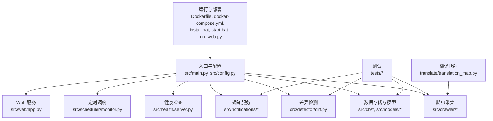
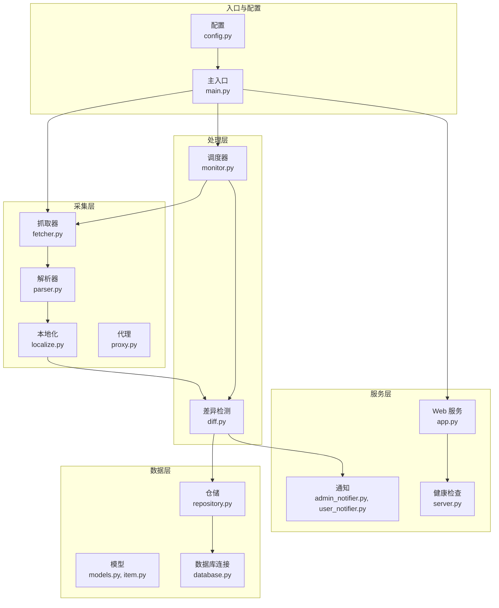
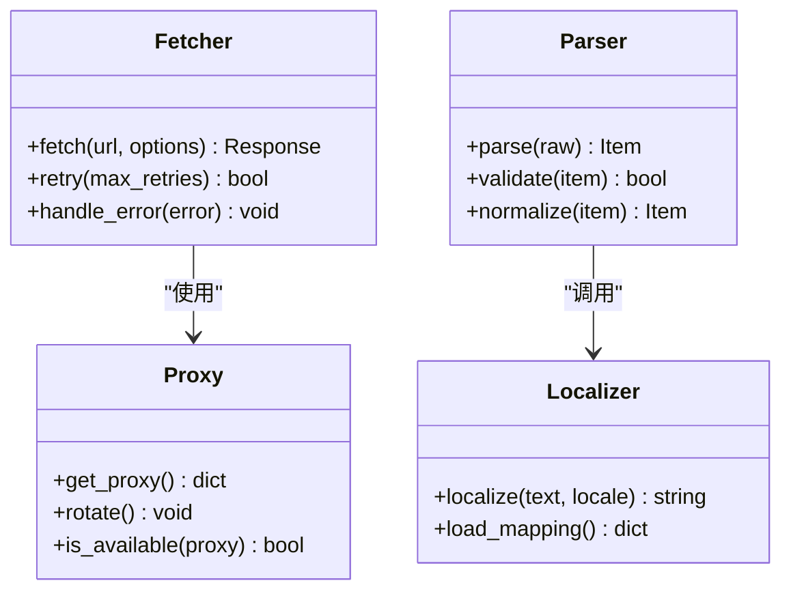
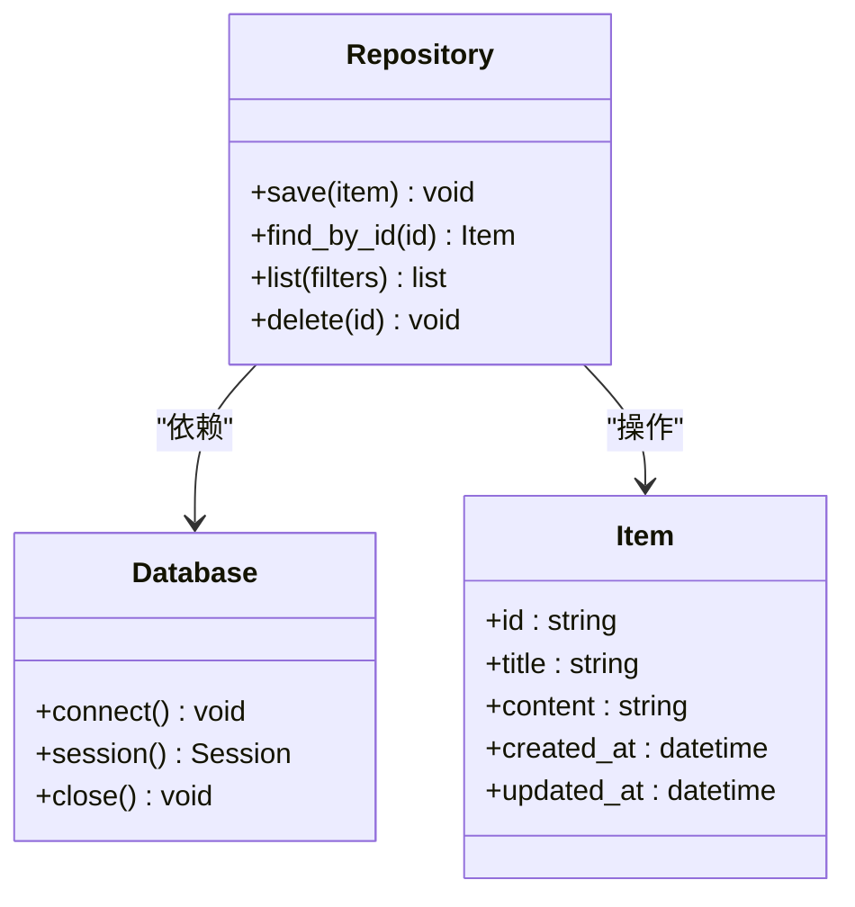
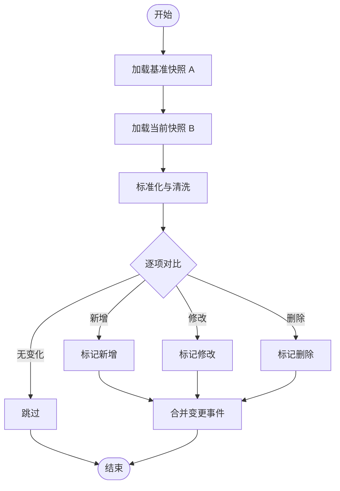
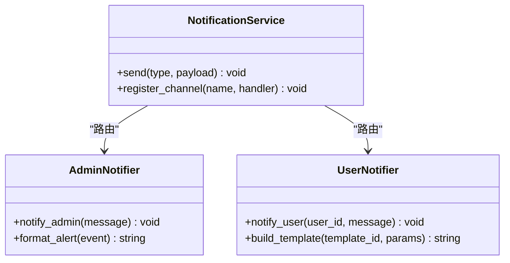
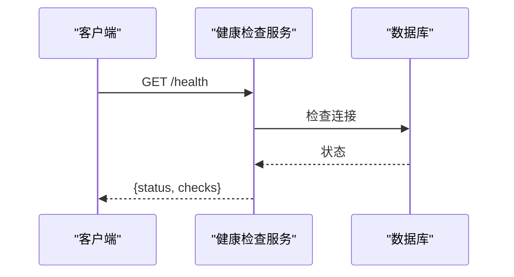
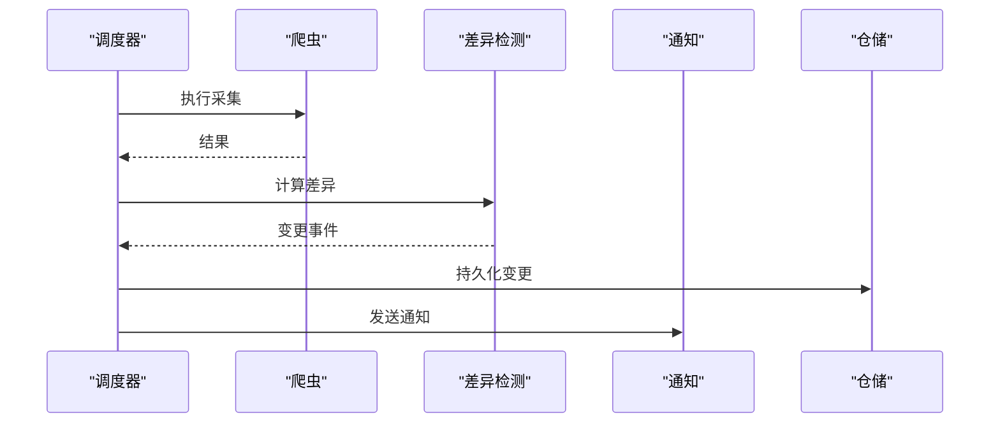
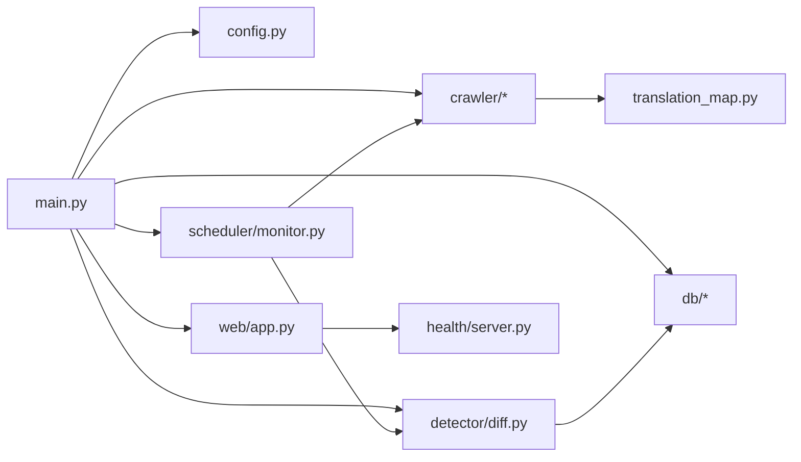

# 开发指南

<cite>
**本文引用的文件**   
- [README.md](file://README.md)
- [pyproject.toml](file://pyproject.toml)
- [Dockerfile](file://Dockerfile)
- [docker-compose.yml](file://docker-compose.yml)
- [install.bat](file://install.bat)
- [start.bat](file://start.bat)
- [run_web.py](file://run_web.py)
- [src/main.py](file://src/main.py)
- [src/config.py](file://src/config.py)
- [src/utils.py](file://src/utils.py)
- [src/crawler/fetcher.py](file://src/crawler/fetcher.py)
- [src/crawler/parser.py](file://src/crawler/parser.py)
- [src/crawler/localize.py](file://src/crawler/localize.py)
- [src/crawler/proxy.py](file://src/crawler/proxy.py)
- [src/db/database.py](file://src/db/database.py)
- [src/db/models.py](file://src/db/models.py)
- [src/db/repository.py](file://src/db/repository.py)
- [src/detector/diff.py](file://src/detector/diff.py)
- [src/health/server.py](file://src/health/server.py)
- [src/models/item.py](file://src/models/item.py)
- [src/notifications/admin_notifier.py](file://src/notifications/admin_notifier.py)
- [src/notifications/user_notifier.py](file://src/notifications/user_notifier.py)
- [src/scheduler/monitor.py](file://src/scheduler/monitor.py)
- [src/web/app.py](file://src/web/app.py)
- [tests/conftest.py](file://tests/conftest.py)
- [tests/test_diff.py](file://tests/test_diff.py)
- [tests/test_notifier.py](file://tests/test_notifier.py)
- [tests/test_parser.py](file://tests/test_parser.py)
- [translate/translation_map.py](file://translate/translation_map.py)
</cite>

## 目录
1. [简介](#简介)
2. [项目结构](#项目结构)
3. [核心组件](#核心组件)
4. [架构总览](#架构总览)
5. [详细组件分析](#详细组件分析)
6. [依赖关系分析](#依赖关系分析)
7. [性能考量](#性能考量)
8. [故障排查指南](#故障排查指南)
9. [结论](#结论)
10. [附录](#附录)

## 简介
本指南面向新加入的开发者，目标是帮助你在最短时间内完成环境搭建、理解系统架构与核心模块、掌握测试策略与单测编写规范，并遵循统一的代码贡献流程与审查标准。文档同时涵盖调试技巧、性能分析与日志记录最佳实践，以及插件开发与第三方集成的扩展机制说明。

## 项目结构
本项目采用按功能域划分的模块化结构，主要包含爬虫采集、数据模型与存储、差异检测、健康检查、通知、定时调度、Web 服务与工具库等。测试用例位于 tests 目录，翻译映射位于 translate 目录。根目录提供打包与运行脚本及容器化配置。

图表来源
- [src/main.py:1-200](file://src/main.py#L1-L200)
- [src/config.py:1-200](file://src/config.py#L1-L200)
- [src/crawler/fetcher.py:1-200](file://src/crawler/fetcher.py#L1-L200)
- [src/crawler/parser.py:1-200](file://src/crawler/parser.py#L1-L200)
- [src/crawler/localize.py:1-200](file://src/crawler/localize.py#L1-L200)
- [src/crawler/proxy.py:1-200](file://src/crawler/proxy.py#L1-L200)
- [src/db/database.py:1-200](file://src/db/database.py#L1-L200)
- [src/db/models.py:1-200](file://src/db/models.py#L1-L200)
- [src/db/repository.py:1-200](file://src/db/repository.py#L1-L200)
- [src/detector/diff.py:1-200](file://src/detector/diff.py#L1-L200)
- [src/health/server.py:1-200](file://src/health/server.py#L1-L200)
- [src/models/item.py:1-200](file://src/models/item.py#L1-L200)
- [src/notifications/admin_notifier.py:1-200](file://src/notifications/admin_notifier.py#L1-L200)
- [src/notifications/user_notifier.py:1-200](file://src/notifications/user_notifier.py#L1-L200)
- [src/scheduler/monitor.py:1-200](file://src/scheduler/monitor.py#L1-L200)
- [src/web/app.py:1-200](file://src/web/app.py#L1-L200)
- [tests/conftest.py:1-200](file://tests/conftest.py#L1-L200)
- [tests/test_diff.py:1-200](file://tests/test_diff.py#L1-L200)
- [tests/test_notifier.py:1-200](file://tests/test_notifier.py#L1-L200)
- [tests/test_parser.py:1-200](file://tests/test_parser.py#L1-L200)
- [translate/translation_map.py:1-200](file://translate/translation_map.py#L1-L200)
- [Dockerfile:1-200](file://Dockerfile#L1-L200)
- [docker-compose.yml:1-200](file://docker-compose.yml#L1-L200)
- [install.bat:1-200](file://install.bat#L1-L200)
- [start.bat:1-200](file://start.bat#L1-L200)
- [run_web.py:1-200](file://run_web.py#L1-L200)

章节来源
- [README.md:1-200](file://README.md#L1-L200)
- [pyproject.toml:1-200](file://pyproject.toml#L1-L200)
- [Dockerfile:1-200](file://Dockerfile#L1-L200)
- [docker-compose.yml:1-200](file://docker-compose.yml#L1-L200)
- [install.bat:1-200](file://install.bat#L1-L200)
- [start.bat:1-200](file://start.bat#L1-L200)
- [run_web.py:1-200](file://run_web.py#L1-L200)

## 核心组件
- 入口与配置：负责应用初始化、配置加载、依赖注入与生命周期管理。
- 爬虫采集：包括抓取、解析、本地化与代理支持，形成数据采集流水线。
- 数据层：定义数据模型、数据库连接与会话管理、仓储访问接口。
- 差异检测：对采集结果进行比对，识别变更。
- 健康检查：对外暴露健康状态端点，便于编排与健康探测。
- 通知服务：向管理员或用户发送告警与通知。
- 定时调度：周期性触发监控任务。
- Web 服务：提供 Web 界面与 API。
- 工具与翻译：通用工具函数与多语言映射。

章节来源
- [src/main.py:1-200](file://src/main.py#L1-L200)
- [src/config.py:1-200](file://src/config.py#L1-L200)
- [src/crawler/fetcher.py:1-200](file://src/crawler/fetcher.py#L1-L200)
- [src/crawler/parser.py:1-200](file://src/crawler/parser.py#L1-L200)
- [src/crawler/localize.py:1-200](file://src/crawler/localize.py#L1-L200)
- [src/crawler/proxy.py:1-200](file://src/crawler/proxy.py#L1-L200)
- [src/db/database.py:1-200](file://src/db/database.py#L1-L200)
- [src/db/models.py:1-200](file://src/db/models.py#L1-L200)
- [src/db/repository.py:1-200](file://src/db/repository.py#L1-L200)
- [src/detector/diff.py:1-200](file://src/detector/diff.py#L1-L200)
- [src/health/server.py:1-200](file://src/health/server.py#L1-L200)
- [src/notifications/admin_notifier.py:1-200](file://src/notifications/admin_notifier.py#L1-L200)
- [src/notifications/user_notifier.py:1-200](file://src/notifications/user_notifier.py#L1-L200)
- [src/scheduler/monitor.py:1-200](file://src/scheduler/monitor.py#L1-L200)
- [src/web/app.py:1-200](file://src/web/app.py#L1-L200)
- [src/utils.py:1-200](file://src/utils.py#L1-L200)
- [translate/translation_map.py:1-200](file://translate/translation_map.py#L1-L200)

## 架构总览
系统以“采集-解析-检测-通知-持久化”为主线，配合 Web 与调度模块形成闭环。健康检查为外部编排提供探针。整体遵循分层与职责分离原则，通过仓储抽象隔离数据访问，通过通知与调度实现异步与周期化处理。

图表来源
- [src/main.py:1-200](file://src/main.py#L1-L200)
- [src/config.py:1-200](file://src/config.py#L1-L200)
- [src/crawler/fetcher.py:1-200](file://src/crawler/fetcher.py#L1-L200)
- [src/crawler/parser.py:1-200](file://src/crawler/parser.py#L1-L200)
- [src/crawler/localize.py:1-200](file://src/crawler/localize.py#L1-L200)
- [src/crawler/proxy.py:1-200](file://src/crawler/proxy.py#L1-L200)
- [src/detector/diff.py:1-200](file://src/detector/diff.py#L1-L200)
- [src/scheduler/monitor.py:1-200](file://src/scheduler/monitor.py#L1-L200)
- [src/db/models.py:1-200](file://src/db/models.py#L1-L200)
- [src/models/item.py:1-200](file://src/models/item.py#L1-L200)
- [src/db/repository.py:1-200](file://src/db/repository.py#L1-L200)
- [src/db/database.py:1-200](file://src/db/database.py#L1-L200)
- [src/notifications/admin_notifier.py:1-200](file://src/notifications/admin_notifier.py#L1-L200)
- [src/notifications/user_notifier.py:1-200](file://src/notifications/user_notifier.py#L1-L200)
- [src/health/server.py:1-200](file://src/health/server.py#L1-L200)
- [src/web/app.py:1-200](file://src/web/app.py#L1-L200)

## 详细组件分析

### 爬虫采集子系统
- 抓取器：负责网络请求、重试、超时控制与错误恢复。
- 解析器：将原始内容结构化，提取关键字段。
- 本地化：根据翻译映射进行文本本地化。
- 代理：支持代理配置与轮换。

图表来源
- [src/crawler/fetcher.py:1-200](file://src/crawler/fetcher.py#L1-L200)
- [src/crawler/parser.py:1-200](file://src/crawler/parser.py#L1-L200)
- [src/crawler/localize.py:1-200](file://src/crawler/localize.py#L1-L200)
- [src/crawler/proxy.py:1-200](file://src/crawler/proxy.py#L1-L200)

章节来源
- [src/crawler/fetcher.py:1-200](file://src/crawler/fetcher.py#L1-L200)
- [src/crawler/parser.py:1-200](file://src/crawler/parser.py#L1-L200)
- [src/crawler/localize.py:1-200](file://src/crawler/localize.py#L1-L200)
- [src/crawler/proxy.py:1-200](file://src/crawler/proxy.py#L1-L200)
- [translate/translation_map.py:1-200](file://translate/translation_map.py#L1-L200)

### 数据层（模型、仓储与数据库）
- 模型：定义实体结构与约束。
- 仓储：封装 CRUD 操作，屏蔽底层细节。
- 数据库：连接管理与会话生命周期。

图表来源
- [src/models/item.py:1-200](file://src/models/item.py#L1-L200)
- [src/db/models.py:1-200](file://src/db/models.py#L1-L200)
- [src/db/repository.py:1-200](file://src/db/repository.py#L1-L200)
- [src/db/database.py:1-200](file://src/db/database.py#L1-L200)

章节来源
- [src/models/item.py:1-200](file://src/models/item.py#L1-L200)
- [src/db/models.py:1-200](file://src/db/models.py#L1-L200)
- [src/db/repository.py:1-200](file://src/db/repository.py#L1-L200)
- [src/db/database.py:1-200](file://src/db/database.py#L1-L200)

### 差异检测
- 输入：两次采集结果的快照或增量数据。
- 逻辑：字段级对比、去重、变更分类（新增、修改、删除）。
- 输出：变更事件列表，供通知与持久化使用。

图表来源
- [src/detector/diff.py:1-200](file://src/detector/diff.py#L1-L200)

章节来源
- [src/detector/diff.py:1-200](file://src/detector/diff.py#L1-L200)

### 通知服务
- 管理员通知：用于运维告警与关键事件上报。
- 用户通知：面向终端用户的提醒与反馈。
- 可扩展性：通过统一接口接入不同渠道（邮件、IM、短信等）。

图表来源
- [src/notifications/admin_notifier.py:1-200](file://src/notifications/admin_notifier.py#L1-L200)
- [src/notifications/user_notifier.py:1-200](file://src/notifications/user_notifier.py#L1-L200)

章节来源
- [src/notifications/admin_notifier.py:1-200](file://src/notifications/admin_notifier.py#L1-L200)
- [src/notifications/user_notifier.py:1-200](file://src/notifications/user_notifier.py#L1-L200)

### 健康检查与服务
- 健康检查：返回进程、依赖（如数据库）状态。
- Web 服务：提供页面与 API，承载监控面板与查询能力。

图表来源
- [src/health/server.py:1-200](file://src/health/server.py#L1-L200)
- [src/db/database.py:1-200](file://src/db/database.py#L1-L200)

章节来源
- [src/health/server.py:1-200](file://src/health/server.py#L1-L200)
- [src/web/app.py:1-200](file://src/web/app.py#L1-L200)

### 定时调度
- 调度器：周期性触发采集与检测任务。
- 任务编排：协调抓取、解析、检测、通知与持久化的顺序。

图表来源
- [src/scheduler/monitor.py:1-200](file://src/scheduler/monitor.py#L1-L200)
- [src/crawler/fetcher.py:1-200](file://src/crawler/fetcher.py#L1-L200)
- [src/detector/diff.py:1-200](file://src/detector/diff.py#L1-L200)
- [src/notifications/admin_notifier.py:1-200](file://src/notifications/admin_notifier.py#L1-L200)
- [src/db/repository.py:1-200](file://src/db/repository.py#L1-L200)

章节来源
- [src/scheduler/monitor.py:1-200](file://src/scheduler/monitor.py#L1-L200)

## 依赖关系分析
- 模块内聚：各功能域相对独立，通过清晰的接口交互。
- 外部依赖：网络请求、数据库驱动、Web 框架与调度库。
- 潜在循环：避免仓储与模型直接耦合业务逻辑；通过仓储抽象降低耦合度。

图表来源
- [src/main.py:1-200](file://src/main.py#L1-L200)
- [src/config.py:1-200](file://src/config.py#L1-L200)
- [src/crawler/fetcher.py:1-200](file://src/crawler/fetcher.py#L1-L200)
- [src/crawler/parser.py:1-200](file://src/crawler/parser.py#L1-L200)
- [src/crawler/localize.py:1-200](file://src/crawler/localize.py#L1-L200)
- [src/crawler/proxy.py:1-200](file://src/crawler/proxy.py#L1-L200)
- [src/db/database.py:1-200](file://src/db/database.py#L1-L200)
- [src/db/models.py:1-200](file://src/db/models.py#L1-L200)
- [src/db/repository.py:1-200](file://src/db/repository.py#L1-L200)
- [src/detector/diff.py:1-200](file://src/detector/diff.py#L1-L200)
- [src/health/server.py:1-200](file://src/health/server.py#L1-L200)
- [src/models/item.py:1-200](file://src/models/item.py#L1-L200)
- [src/notifications/admin_notifier.py:1-200](file://src/notifications/admin_notifier.py#L1-L200)
- [src/notifications/user_notifier.py:1-200](file://src/notifications/user_notifier.py#L1-L200)
- [src/scheduler/monitor.py:1-200](file://src/scheduler/monitor.py#L1-L200)
- [src/web/app.py:1-200](file://src/web/app.py#L1-L200)
- [translate/translation_map.py:1-200](file://translate/translation_map.py#L1-L200)

章节来源
- [pyproject.toml:1-200](file://pyproject.toml#L1-L200)

## 性能考量
- 网络层：合理设置超时与重试退避，限制并发与队列长度，避免雪崩。
- 解析层：流式解析大文档，减少内存占用；缓存热点数据。
- 数据层：索引优化、批量写入、事务边界明确；避免 N+1 查询。
- 调度层：任务去重与幂等设计；背压与限流。
- 可观测性：关键路径埋点与指标收集，结合日志与追踪定位瓶颈。

[本节为通用指导，不直接分析具体文件]

## 故障排查指南
- 常见问题
  - 网络异常：检查代理配置、超时与重试策略。
  - 解析失败：校验目标站点结构变化与解析规则。
  - 数据库连接失败：确认连接串、权限与网络连通性。
  - 通知未送达：核对渠道配置与模板参数。
- 调试技巧
  - 启用详细日志与请求跟踪。
  - 使用断点与单元测试快速验证假设。
  - 借助健康检查端点快速定位依赖问题。
- 日志最佳实践
  - 结构化日志，包含上下文与追踪 ID。
  - 分级输出（DEBUG/INFO/WARN/ERROR），避免敏感信息泄露。

章节来源
- [src/health/server.py:1-200](file://src/health/server.py#L1-L200)
- [src/utils.py:1-200](file://src/utils.py#L1-L200)

## 结论
本指南从架构到实践提供了端到端的开发参考。建议新开发者先完成环境搭建与单测运行，再逐步深入各模块源码。在扩展新功能时，优先遵循现有分层与接口约定，确保可维护性与可观测性。

[本节为总结性内容，不直接分析具体文件]

## 附录

### 开发环境搭建
- 前置条件
  - Python 版本与依赖管理工具（参见 pyproject.toml）。
  - 数据库与必要的外部服务（如消息通道）。
- 安装步骤
  - 使用 install.bat 或 pip 安装依赖。
  - 配置环境变量与数据库连接。
- 运行方式
  - 使用 start.bat 启动服务或 run_web.py 启动 Web。
  - Docker 与 docker-compose 一键拉起。

章节来源
- [pyproject.toml:1-200](file://pyproject.toml#L1-L200)
- [install.bat:1-200](file://install.bat#L1-L200)
- [start.bat:1-200](file://start.bat#L1-L200)
- [run_web.py:1-200](file://run_web.py#L1-L200)
- [Dockerfile:1-200](file://Dockerfile#L1-L200)
- [docker-compose.yml:1-200](file://docker-compose.yml#L1-L200)

### 代码规范与风格
- 命名与结构：模块按功能域划分，类与方法语义清晰。
- 类型与注释：关键接口添加类型提示与文档字符串。
- 错误处理：统一异常类型与错误码，避免吞异常。
- 日志与可观测性：结构化日志与指标埋点。

[本节为通用规范，不直接分析具体文件]

### 测试策略与单测编写
- 策略
  - 单元测试覆盖核心逻辑与边界条件。
  - 集成测试验证外部依赖交互（数据库、网络）。
  - 契约测试保证接口稳定性。
- 用例结构
  - 使用 conftest.py 共享夹具与配置。
  - 每个被测模块对应一个测试文件。
  - 使用参数化与数据驱动提升覆盖率。
- 运行与报告
  - 使用 pytest 运行测试并生成报告。
  - 持续集成中自动执行测试与质量检查。

章节来源
- [tests/conftest.py:1-200](file://tests/conftest.py#L1-L200)
- [tests/test_diff.py:1-200](file://tests/test_diff.py#L1-L200)
- [tests/test_notifier.py:1-200](file://tests/test_notifier.py#L1-L200)
- [tests/test_parser.py:1-200](file://tests/test_parser.py#L1-L200)

### 代码贡献与 Pull Request 流程
- 分支策略
  - 功能分支基于 main 创建，命名遵循 feature/xxx。
  - 修复分支 hotfix/xxx，发布分支 release/xxx。
- PR 要求
  - 描述变更动机与影响范围。
  - 附带相关测试用例与更新文档。
  - 通过所有 CI 检查。
- 代码审查标准
  - 可读性与可维护性优先。
  - 复杂度控制与圈复杂度阈值。
  - 安全与性能审查。

[本节为通用流程，不直接分析具体文件]

### 插件开发与第三方集成
- 插件接口
  - 定义统一的通知渠道、解析器与存储适配器接口。
  - 通过注册表机制动态加载插件。
- 集成示例
  - 新增通知渠道：实现通知处理器并注册。
  - 新增解析器：适配新站点格式并纳入流水线。
  - 新增存储后端：实现仓储接口并切换配置。

[本节为概念性扩展说明，不直接分析具体文件]

### 调试技巧与性能分析
- 调试
  - 使用断点与交互式调试器。
  - 开启详细日志与请求追踪。
- 性能分析
  - 使用性能剖析工具定位热点。
  - 关注 I/O 与 CPU 密集型路径。
- 日志最佳实践
  - 结构化日志与上下文关联。
  - 分级输出与脱敏处理。

[本节为通用指导，不直接分析具体文件]