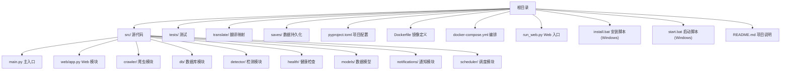
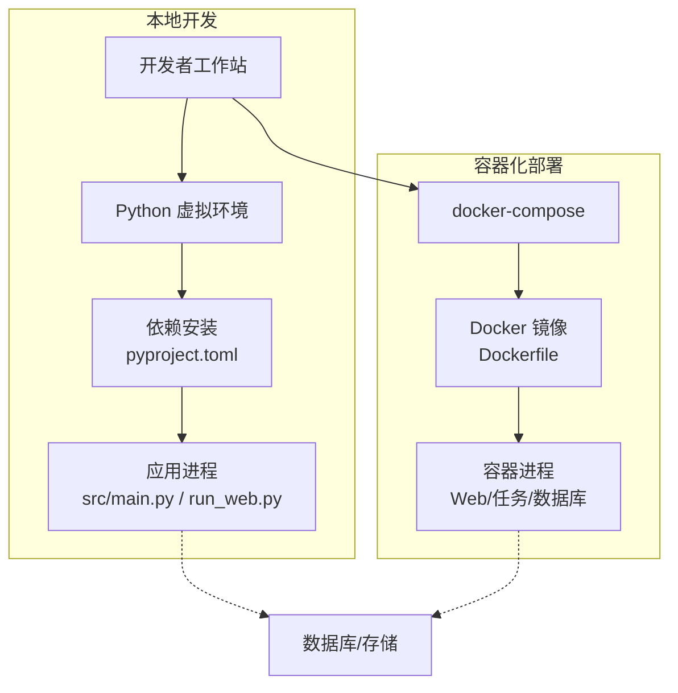
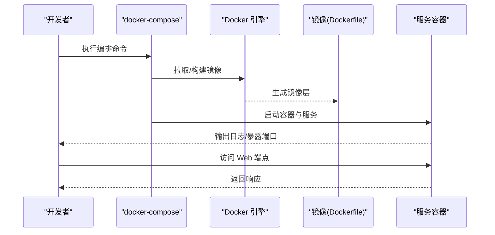
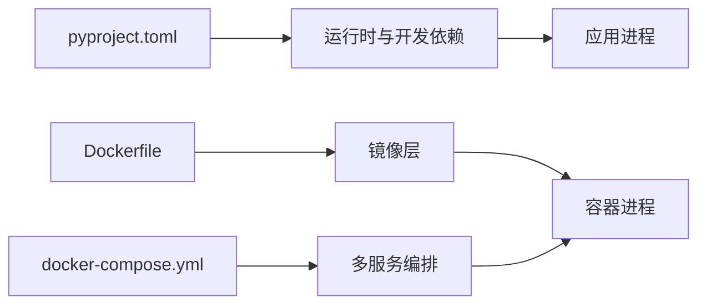

# 开发环境搭建

<cite>
**本文引用的文件**   
- [pyproject.toml](file://pyproject.toml)
- [Dockerfile](file://Dockerfile)
- [docker-compose.yml](file://docker-compose.yml)
- [install.bat](file://install.bat)
- [start.bat](file://start.bat)
- [run_web.py](file://run_web.py)
- [src/main.py](file://src/main.py)
- [README.md](file://README.md)
</cite>

## 目录
1. [简介](#简介)
2. [项目结构](#项目结构)
3. [核心组件](#核心组件)
4. [架构总览](#架构总览)
5. [详细组件分析](#详细组件分析)
6. [依赖关系分析](#依赖关系分析)
7. [性能考虑](#性能考虑)
8. [故障排查指南](#故障排查指南)
9. [结论](#结论)
10. [附录](#附录)

## 简介
本指南面向首次接触本项目的开发者，目标是帮助你在 Windows 与 Linux 环境下快速搭建完整的开发与运行环境。内容涵盖：
- Python 版本要求与环境隔离（虚拟环境）
- 使用 pyproject.toml 进行依赖管理与项目配置
- Docker 与 docker-compose 的快速启动方式
- Windows 与 Linux 的安装差异与注意事项
- 常见环境问题的定位与解决

## 项目结构
仓库采用模块化组织，核心代码位于 src/ 下，测试在 tests/，可执行脚本与配置文件位于根目录。关键入口与配置如下：
- 应用主入口：src/main.py
- Web 服务入口：run_web.py
- 项目依赖与构建配置：pyproject.toml
- 容器化：Dockerfile、docker-compose.yml
- Windows 快捷脚本：install.bat、start.bat
- 说明文档：README.md

图表来源
- [pyproject.toml](file://pyproject.toml)
- [Dockerfile](file://Dockerfile)
- [docker-compose.yml](file://docker-compose.yml)
- [src/main.py](file://src/main.py)
- [run_web.py](file://run_web.py)

章节来源
- [README.md](file://README.md)

## 核心组件
- 项目管理与依赖：通过 pyproject.toml 声明依赖与工具链，推荐使用现代 Python 包管理工具进行安装与构建。
- 应用入口：src/main.py 提供命令行或进程入口；run_web.py 用于启动 Web 服务。
- 容器化：Dockerfile 定义运行环境与镜像层；docker-compose.yml 一键拉起多服务（如 Web、数据库等）。
- 平台脚本：install.bat 与 start.bat 为 Windows 用户提供便捷的一键安装与启动流程。

章节来源
- [pyproject.toml](file://pyproject.toml)
- [src/main.py](file://src/main.py)
- [run_web.py](file://run_web.py)
- [Dockerfile](file://Dockerfile)
- [docker-compose.yml](file://docker-compose.yml)
- [install.bat](file://install.bat)
- [start.bat](file://start.bat)

## 架构总览
下图展示了本地开发与容器化两种典型路径：开发者可选择在宿主机上基于 Python 环境运行，也可通过 Docker 快速拉起完整环境。

图表来源
- [pyproject.toml](file://pyproject.toml)
- [Dockerfile](file://Dockerfile)
- [docker-compose.yml](file://docker-compose.yml)
- [src/main.py](file://src/main.py)
- [run_web.py](file://run_web.py)

## 详细组件分析

### 使用 pyproject.toml 进行项目管理
- 作用：集中声明 Python 版本、运行时依赖、构建与打包配置、开发工具链等。
- 推荐实践：
  - 使用现代包管理器（如 uv/pipx/标准库 venv + pip）创建并激活虚拟环境。
  - 从 pyproject.toml 安装依赖，确保环境一致性与可复现性。
  - 将开发工具（如测试、格式化、类型检查）也统一纳入配置，便于团队协作。

章节来源
- [pyproject.toml](file://pyproject.toml)

### 虚拟环境创建与依赖安装（跨平台）
- Linux/macOS：
  - 创建并激活虚拟环境后，从 pyproject.toml 安装依赖。
  - 若使用 uv，可直接基于 pyproject.toml 安装。
- Windows：
  - 可使用 PowerShell 或 CMD 创建虚拟环境，再按相同步骤安装依赖。
  - 也可使用 install.bat 脚本完成自动化安装（见下一节）。

章节来源
- [pyproject.toml](file://pyproject.toml)

### Docker 与 docker-compose 快速启动
- 适用场景：希望“开箱即用”地拉起 Web 服务与依赖（如数据库），无需在本地安装 Python 与各类依赖。
- 步骤概览：
  - 确保已安装 Docker 与 docker-compose。
  - 在项目根目录执行编排命令，自动拉取镜像、构建镜像（如需）、启动服务。
  - 访问 Web 端点或查看日志进行验证。

图表来源
- [Dockerfile](file://Dockerfile)
- [docker-compose.yml](file://docker-compose.yml)

章节来源
- [Dockerfile](file://Dockerfile)
- [docker-compose.yml](file://docker-compose.yml)

### Windows 一键安装与启动（install.bat/start.bat）
- install.bat：用于在 Windows 上自动完成环境准备与依赖安装。
- start.bat：用于快速启动应用或 Web 服务。
- 建议：
  - 首次运行前确认 Python 与相关工具已正确安装。
  - 如遇权限或路径问题，以管理员身份运行终端并重试。

章节来源
- [install.bat](file://install.bat)
- [start.bat](file://start.bat)

### 应用入口与 Web 服务
- 主入口：src/main.py 提供应用的核心启动逻辑。
- Web 服务：run_web.py 用于启动 Web 服务，便于本地调试与联调。
- 建议：
  - 本地调试时优先使用 run_web.py 启动 Web 服务。
  - 生产环境可通过容器编排统一管理生命周期。

章节来源
- [src/main.py](file://src/main.py)
- [run_web.py](file://run_web.py)

## 依赖关系分析
- 运行时依赖：由 pyproject.toml 统一声明，确保所有开发者与运行环境一致。
- 开发依赖：建议在 pyproject.toml 中声明测试、格式化、静态检查等工具，提升协作效率。
- 容器依赖：Dockerfile 与 docker-compose.yml 共同定义镜像与多服务编排，屏蔽底层差异。

图表来源
- [pyproject.toml](file://pyproject.toml)
- [Dockerfile](file://Dockerfile)
- [docker-compose.yml](file://docker-compose.yml)

章节来源
- [pyproject.toml](file://pyproject.toml)
- [Dockerfile](file://Dockerfile)
- [docker-compose.yml](file://docker-compose.yml)

## 性能考虑
- 依赖安装：优先使用支持缓存与增量安装的现代工具，减少重复下载与构建时间。
- 容器构建：合理分层与缓存，避免频繁重建基础镜像层。
- 资源限制：在生产环境中为容器设置合理的 CPU/内存上限，避免资源争用。
- 日志与监控：开启必要的指标与日志，便于定位瓶颈与异常。

[本节为通用指导，不直接分析具体文件]

## 故障排查指南
- Python 版本不匹配
  - 现象：导入失败、语法错误、依赖编译失败。
  - 处理：确认 pyproject.toml 中的版本约束，使用对应版本的 Python 解释器。
- 依赖安装失败
  - 现象：网络超时、二进制包编译失败、权限不足。
  - 处理：检查网络代理、系统依赖（如编译器）、以管理员权限运行。
- 容器无法启动
  - 现象：端口冲突、镜像拉取失败、卷挂载错误。
  - 处理：检查端口占用、镜像可用性、路径与权限。
- Web 服务无法访问
  - 现象：连接拒绝、页面空白、接口报错。
  - 处理：检查服务是否启动、端口是否正确、环境变量与配置项。

章节来源
- [pyproject.toml](file://pyproject.toml)
- [Dockerfile](file://Dockerfile)
- [docker-compose.yml](file://docker-compose.yml)
- [install.bat](file://install.bat)
- [start.bat](file://start.bat)
- [run_web.py](file://run_web.py)
- [src/main.py](file://src/main.py)

## 结论
通过统一的 pyproject.toml 与容器化方案，本项目能够在不同平台上保持一致的开发与运行体验。建议团队遵循本指南的标准化流程，结合容器化快速交付与本地调试的高效性，提升整体研发效率。

[本节为总结性内容，不直接分析具体文件]

## 附录

### 快速上手清单（Windows）
- 安装 Python 与必要工具（如 pip/uv）。
- 运行 install.bat 完成依赖安装。
- 运行 start.bat 启动应用或 Web 服务。
- 如遇到问题，参考“故障排查指南”。

章节来源
- [install.bat](file://install.bat)
- [start.bat](file://start.bat)

### 快速上手清单（Linux/macOS）
- 安装 Python 与包管理工具（pip/uv）。
- 创建并激活虚拟环境。
- 从 pyproject.toml 安装依赖。
- 运行 Web 服务或主入口进行验证。
- 如遇到问题，参考“故障排查指南”。

章节来源
- [pyproject.toml](file://pyproject.toml)

### 使用 docker-compose 一键启动
- 确保已安装 Docker 与 docker-compose。
- 在项目根目录执行编排命令，等待服务就绪。
- 访问 Web 端点或查看日志进行验证。

章节来源
- [docker-compose.yml](file://docker-compose.yml)
- [Dockerfile](file://Dockerfile)