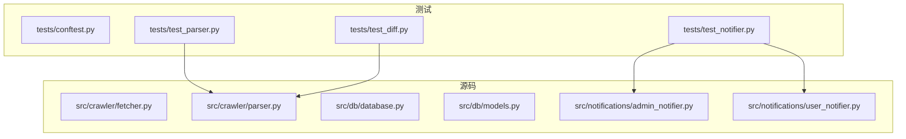
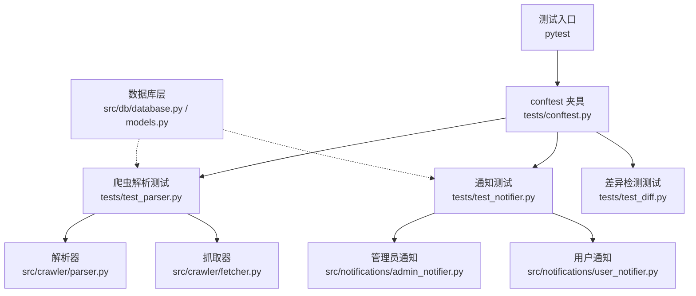
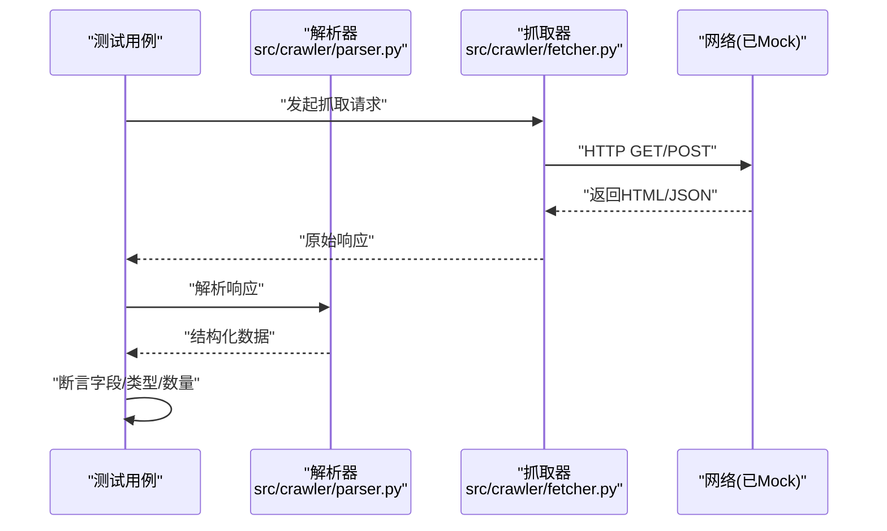
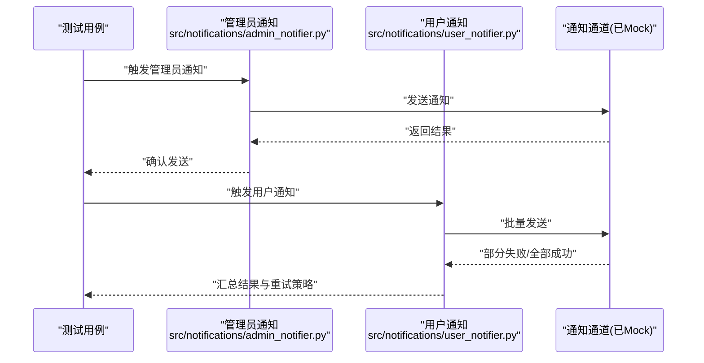
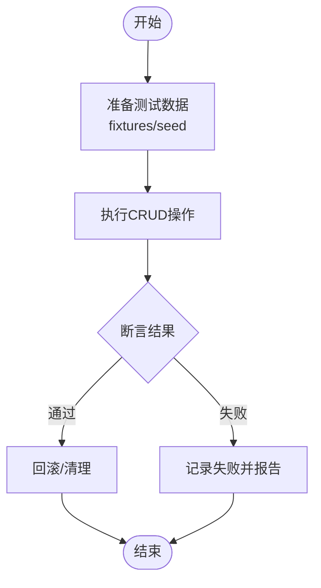
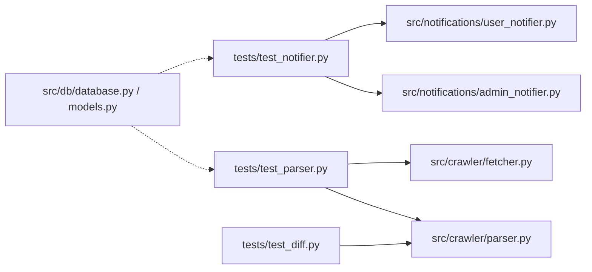

# 测试指南

<cite>
**本文档引用的文件**
- [tests/conftest.py](file://tests/conftest.py)
- [tests/test_diff.py](file://tests/test_diff.py)
- [tests/test_notifier.py](file://tests/test_notifier.py)
- [tests/test_parser.py](file://tests/test_parser.py)
- [src/crawler/fetcher.py](file://src/crawler/fetcher.py)
- [src/crawler/parser.py](file://src/crawler/parser.py)
- [src/db/database.py](file://src/db/database.py)
- [src/db/models.py](file://src/db/models.py)
- [src/notifications/admin_notifier.py](file://src/notifications/admin_notifier.py)
- [src/notifications/user_notifier.py](file://src/notifications/user_notifier.py)
- [pyproject.toml](file://pyproject.toml)
- [README.md](file://README.md)
</cite>

## 目录
1. [简介](#简介)
2. [项目结构](#项目结构)
3. [核心组件](#核心组件)
4. [架构总览](#架构总览)
5. [详细组件分析](#详细组件分析)
6. [依赖分析](#依赖分析)
7. [性能考虑](#性能考虑)
8. [故障排查指南](#故障排查指南)
9. [结论](#结论)
10. [附录](#附录)

## 简介
本指南面向使用 pytest 框架的测试实践，结合本项目（监控系统）的实际代码与测试结构，系统讲解：
- pytest 的基本用法与项目测试组织方式
- tests/conftest.py 中的配置与 fixture 使用模式
- 单元测试最佳实践：用例设计、Mock 策略、断言方法
- 针对爬虫、数据库操作、通知系统等核心功能的测试方法
- 测试数据准备、异步测试与性能测试要点
- 覆盖率要求与持续集成建议

## 项目结构
本项目采用“功能模块 + 测试目录”的组织方式。源码位于 src/ 下，测试位于 tests/ 下，遵循 pytest 默认发现规则。关键目录与职责：
- src/crawler：抓取与解析逻辑
- src/db：数据库模型与仓储访问
- src/notifications：通知发送（管理员与用户）
- tests：pytest 测试套件，包含 conftest.py 与多个测试模块

图表来源
- [tests/conftest.py](file://tests/conftest.py)
- [tests/test_parser.py](file://tests/test_parser.py)
- [tests/test_notifier.py](file://tests/test_notifier.py)
- [tests/test_diff.py](file://tests/test_diff.py)
- [src/crawler/parser.py](file://src/crawler/parser.py)
- [src/notifications/admin_notifier.py](file://src/notifications/admin_notifier.py)
- [src/notifications/user_notifier.py](file://src/notifications/user_notifier.py)

章节来源
- [README.md](file://README.md)

## 核心组件
- pytest 配置与共享夹具：通过 tests/conftest.py 集中管理测试环境、数据库连接、Mock 对象与通用夹具，避免重复代码。
- 爬虫测试：围绕解析器与抓取器进行输入输出验证与边界条件覆盖。
- 通知系统测试：对管理员与用户通知路径进行行为验证，通常配合 Mock 外部服务。
- 数据库测试：基于 models/repository 的读写路径，建议使用事务回滚或内存库隔离。

章节来源
- [tests/conftest.py](file://tests/conftest.py)
- [tests/test_parser.py](file://tests/test_parser.py)
- [tests/test_notifier.py](file://tests/test_notifier.py)
- [tests/test_diff.py](file://tests/test_diff.py)
- [src/crawler/parser.py](file://src/crawler/parser.py)
- [src/notifications/admin_notifier.py](file://src/notifications/admin_notifier.py)
- [src/notifications/user_notifier.py](file://src/notifications/user_notifier.py)

## 架构总览
下图展示了测试与源码之间的交互关系，以及常见的测试策略（如 Mock 外部依赖、隔离数据库）。

图表来源
- [tests/conftest.py](file://tests/conftest.py)
- [tests/test_parser.py](file://tests/test_parser.py)
- [tests/test_notifier.py](file://tests/test_notifier.py)
- [tests/test_diff.py](file://tests/test_diff.py)
- [src/crawler/parser.py](file://src/crawler/parser.py)
- [src/crawler/fetcher.py](file://src/crawler/fetcher.py)
- [src/notifications/admin_notifier.py](file://src/notifications/admin_notifier.py)
- [src/notifications/user_notifier.py](file://src/notifications/user_notifier.py)
- [src/db/database.py](file://src/db/database.py)
- [src/db/models.py](file://src/db/models.py)

## 详细组件分析

### conftest.py 测试配置与 Fixture
- 作用：集中定义全局夹具、插件配置、测试环境初始化与清理。
- 常见内容：
  - 数据库连接夹具（可切换为内存库或事务回滚）
  - 网络请求 Mock（HTTP 客户端替换）
  - 通知通道 Mock（邮件/消息队列）
  - 公共测试数据生成器
- 使用建议：
  - 将耗时资源（DB、网络）放入 fixture，按需作用域控制（function/session）
  - 提供“干净状态”夹具，确保用例间互不干扰
  - 通过参数化 fixture 减少重复用例

章节来源
- [tests/conftest.py](file://tests/conftest.py)

### 爬虫测试（解析与抓取）
- 目标：验证解析器的输入输出正确性、异常处理与边界条件。
- 策略：
  - 构造 HTML/JSON 样本作为输入，断言解析结果字段与类型
  - 使用 Mock 替代真实 HTTP 调用，保证稳定与快速
  - 覆盖空响应、错误码、超时等异常分支
- 参考实现位置：
  - 解析器：src/crawler/parser.py
  - 抓取器：src/crawler/fetcher.py
  - 测试用例：tests/test_parser.py

图表来源
- [tests/test_parser.py](file://tests/test_parser.py)
- [src/crawler/parser.py](file://src/crawler/parser.py)
- [src/crawler/fetcher.py](file://src/crawler/fetcher.py)

章节来源
- [tests/test_parser.py](file://tests/test_parser.py)
- [src/crawler/parser.py](file://src/crawler/parser.py)
- [src/crawler/fetcher.py](file://src/crawler/fetcher.py)

### 通知系统测试（管理员与用户）
- 目标：验证通知发送流程、模板渲染与失败重试。
- 策略：
  - Mock 邮件/消息通道，断言调用次数与参数
  - 覆盖发送成功、失败、限流等场景
  - 校验通知内容与接收者列表
- 参考实现位置：
  - 管理员通知：src/notifications/admin_notifier.py
  - 用户通知：src/notifications/user_notifier.py
  - 测试用例：tests/test_notifier.py

图表来源
- [tests/test_notifier.py](file://tests/test_notifier.py)
- [src/notifications/admin_notifier.py](file://src/notifications/admin_notifier.py)
- [src/notifications/user_notifier.py](file://src/notifications/user_notifier.py)

章节来源
- [tests/test_notifier.py](file://tests/test_notifier.py)
- [src/notifications/admin_notifier.py](file://src/notifications/admin_notifier.py)
- [src/notifications/user_notifier.py](file://src/notifications/user_notifier.py)

### 数据库操作测试
- 目标：验证模型映射、仓储查询与事务一致性。
- 策略：
  - 使用内存数据库或事务回滚夹具，保证用例隔离
  - 预置测试数据，断言 CRUD 结果与约束
  - 模拟并发与异常（死锁、超时），验证健壮性
- 参考实现位置：
  - 数据库与模型：src/db/database.py, src/db/models.py

图表来源
- [src/db/database.py](file://src/db/database.py)
- [src/db/models.py](file://src/db/models.py)

章节来源
- [src/db/database.py](file://src/db/database.py)
- [src/db/models.py](file://src/db/models.py)

### 差异检测测试
- 目标：验证 diff 算法的正确性与性能。
- 策略：
  - 构造多组对比样本（相同、不同、缺失、新增）
  - 断言差异集合与顺序稳定性
  - 大样本压力测试与时间复杂度评估
- 参考实现位置：
  - 测试用例：tests/test_diff.py

章节来源
- [tests/test_diff.py](file://tests/test_diff.py)

## 依赖分析
- 测试与源码耦合点：
  - 爬虫测试依赖 parser/fetcher
  - 通知测试依赖 admin_notifier/user_notifier
  - 数据库测试依赖 database/models
- 外部依赖隔离：
  - 网络请求、邮件/消息通道、数据库连接均通过 fixture/Mock 隔离
- 建议：
  - 在 conftest.py 中统一注册 Mock 与替换策略
  - 使用接口抽象降低耦合度

图表来源
- [tests/test_parser.py](file://tests/test_parser.py)
- [tests/test_notifier.py](file://tests/test_notifier.py)
- [tests/test_diff.py](file://tests/test_diff.py)
- [src/crawler/parser.py](file://src/crawler/parser.py)
- [src/crawler/fetcher.py](file://src/crawler/fetcher.py)
- [src/notifications/admin_notifier.py](file://src/notifications/admin_notifier.py)
- [src/notifications/user_notifier.py](file://src/notifications/user_notifier.py)
- [src/db/database.py](file://src/db/database.py)
- [src/db/models.py](file://src/db/models.py)

章节来源
- [tests/conftest.py](file://tests/conftest.py)

## 性能考虑
- 测试数据规模：
  - 小样本用于快速回归，大样本用于基准测试
- 并行执行：
  - 合理划分用例，避免共享状态冲突
- 资源占用：
  - 数据库连接池、网络超时与重试策略需纳入测试
- 指标采集：
  - 记录关键路径耗时，设置阈值告警

[本节为通用指导，无需特定文件引用]

## 故障排查指南
- 常见问题：
  - 用例间状态污染：检查 fixture 作用域与清理逻辑
  - Mock 未生效：确认 patch 路径与作用域
  - 数据库不一致：使用事务回滚或独立库实例
  - 网络不稳定：固定响应或注入错误
- 定位步骤：
  - 缩小范围：最小化复现用例
  - 打印日志：增加上下文信息
  - 回放依赖：录制/回放外部响应

章节来源
- [tests/conftest.py](file://tests/conftest.py)

## 结论
通过统一的 conftest 夹具、清晰的测试分层与严格的 Mock 策略，本项目可实现高内聚、低耦合的可维护测试体系。建议持续完善覆盖率与 CI 流水线，保障质量与交付效率。

[本节为总结性内容，无需特定文件引用]

## 附录

### pytest 基本用法与项目测试结构
- 用例命名：test_*.py 或 *_test.py
- 运行命令：pytest
- 常用选项：-v（详细）、-k（过滤）、--cov（覆盖率）
- 目录约定：tests 根目录下的 conftest.py 自动加载

章节来源
- [tests/conftest.py](file://tests/conftest.py)

### 测试数据准备
- 工厂函数：按用例需求生成最小数据集
- 种子数据：固定样本用于回归
- 清理策略：每次用例后回滚或清空

章节来源
- [tests/conftest.py](file://tests/conftest.py)

### 异步测试
- 使用 pytest-asyncio 支持 async def 用例
- 注意事件循环与资源释放
- 对异步 IO（网络/DB）进行 Mock

章节来源
- [tests/conftest.py](file://tests/conftest.py)

### 性能测试
- 使用 pytest-benchmark 或自定义计时
- 关注热点路径与瓶颈
- 建立基线并监控回归

章节来源
- [tests/test_diff.py](file://tests/test_diff.py)

### 覆盖率要求
- 建议阈值：行覆盖率≥80%，分支覆盖率≥60%
- 排除第三方与样板代码
- 在 CI 中强制门槛

章节来源
- [pyproject.toml](file://pyproject.toml)

### 持续集成配置
- 触发条件：push/PR
- 步骤：安装依赖 → 运行测试 → 生成覆盖率 → 上传报告
- 缓存依赖与构建产物加速流水线

章节来源
- [pyproject.toml](file://pyproject.toml)