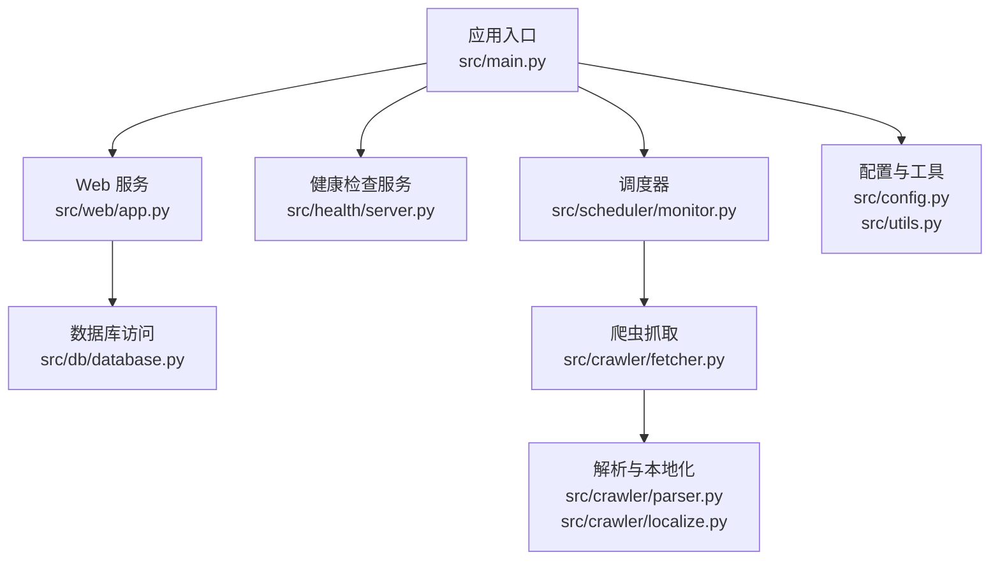
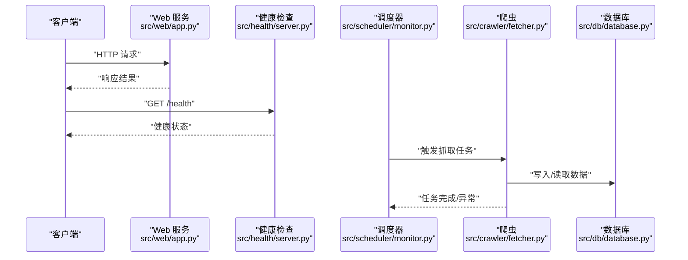
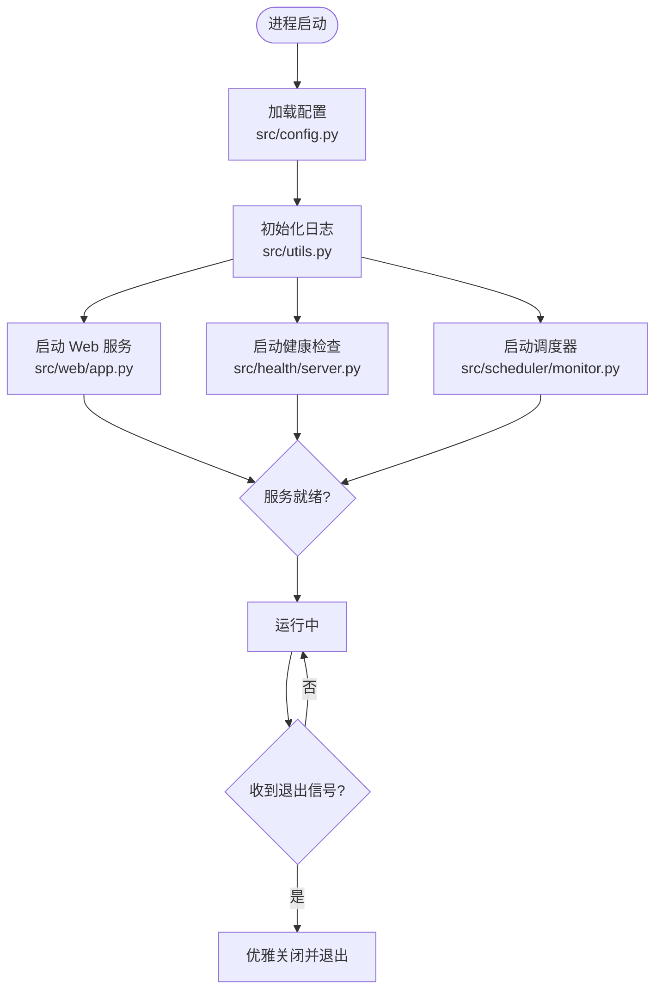
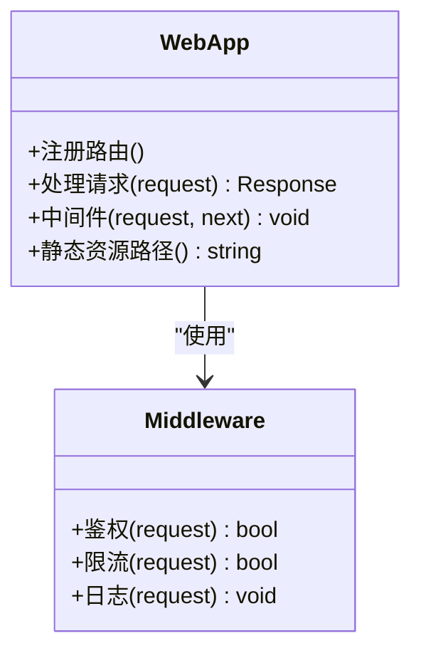
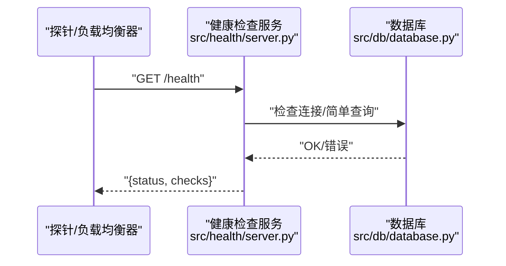
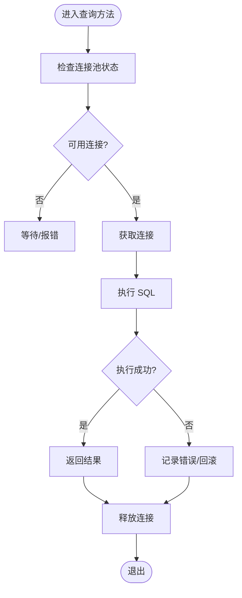
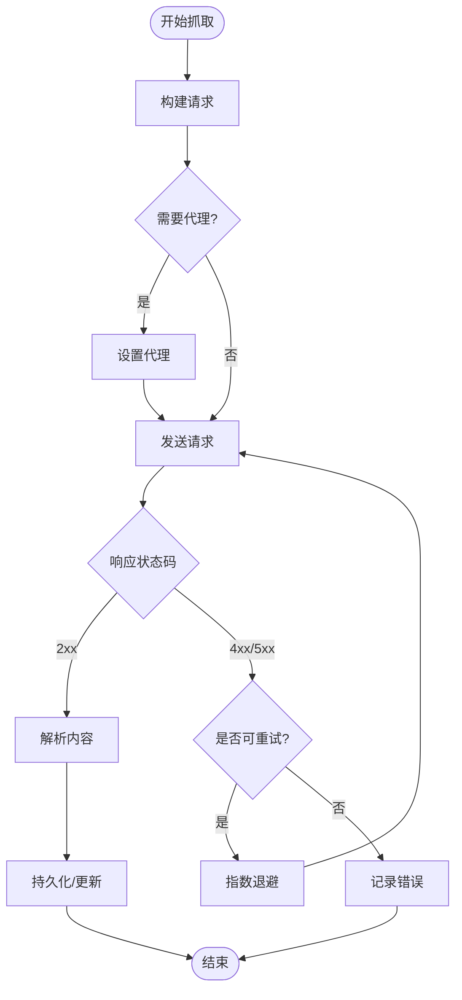
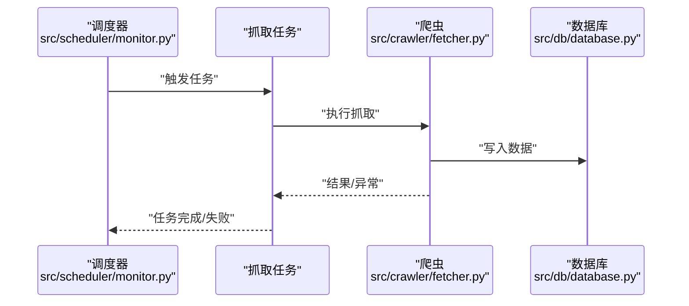
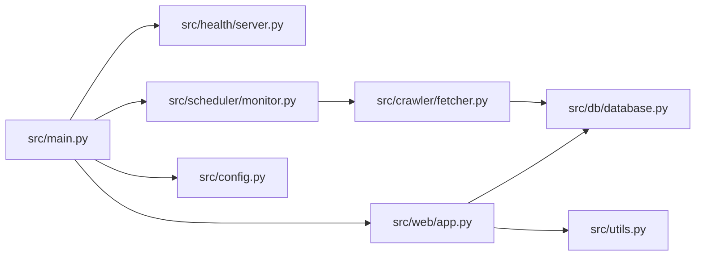

# 调试与性能分析

<cite>
**本文引用的文件**   
- [src/main.py](file://src/main.py)
- [src/config.py](file://src/config.py)
- [src/utils.py](file://src/utils.py)
- [src/web/app.py](file://src/web/app.py)
- [src/health/server.py](file://src/health/server.py)
- [src/db/database.py](file://src/db/database.py)
- [src/crawler/fetcher.py](file://src/crawler/fetcher.py)
- [src/scheduler/monitor.py](file://src/scheduler/monitor.py)
- [Dockerfile](file://Dockerfile)
- [docker-compose.yml](file://docker-compose.yml)
- [pyproject.toml](file://pyproject.toml)
- [README.md](file://README.md)
</cite>

## 目录
1. [简介](#简介)
2. [项目结构](#项目结构)
3. [核心组件](#核心组件)
4. [架构总览](#架构总览)
5. [详细组件分析](#详细组件分析)
6. [依赖关系分析](#依赖关系分析)
7. [性能考虑](#性能考虑)
8. [故障排查指南](#故障排查指南)
9. [结论](#结论)
10. [附录](#附录)

## 简介
本指南面向监控系统的开发与运维人员，聚焦于调试与性能分析实践。内容涵盖：
- Python 调试工具使用（pdb、IDE 调试器、远程调试）
- 日志记录配置与优化策略
- 系统健康状态监控与健康检查接口
- 性能分析方法与瓶颈识别技巧（CPU、内存、网络）
- 生产环境调试策略与问题排查流程

目标是帮助读者快速定位问题、提升系统稳定性与可观测性，并在生产环境中安全高效地排障。

## 项目结构
本项目采用模块化组织，关键模块包括：
- 应用入口与配置：main.py、config.py、utils.py
- Web 服务与静态资源：web/app.py、web/static/index.html
- 健康检查服务：health/server.py
- 数据库访问层：db/database.py、db/models.py、db/repository.py
- 爬虫抓取与解析：crawler/fetcher.py、crawler/parser.py、crawler/localize.py、crawler/proxy.py
- 调度与监控：scheduler/monitor.py
- 通知模块：notifications/*
- 模型定义：models/item.py
- 测试与翻译：tests/*、translate/*

**图示来源** 
- [src/main.py](file://src/main.py)
- [src/web/app.py](file://src/web/app.py)
- [src/health/server.py](file://src/health/server.py)
- [src/scheduler/monitor.py](file://src/scheduler/monitor.py)
- [src/db/database.py](file://src/db/database.py)
- [src/crawler/fetcher.py](file://src/crawler/fetcher.py)
- [src/crawler/parser.py](file://src/crawler/parser.py)
- [src/crawler/localize.py](file://src/crawler/localize.py)
- [src/config.py](file://src/config.py)
- [src/utils.py](file://src/utils.py)

**章节来源**
- [README.md](file://README.md)
- [pyproject.toml](file://pyproject.toml)

## 核心组件
- 应用入口与生命周期管理：负责初始化配置、启动 Web 服务、健康检查服务与调度任务。
- Web 服务：提供 HTTP API 与静态页面，承载用户交互与数据展示。
- 健康检查服务：暴露健康检查端点，供外部监控系统探测服务可用性。
- 数据库访问层：封装连接、事务与查询操作，确保数据一致性。
- 爬虫抓取：负责网络请求、代理、重试与错误处理。
- 调度器：周期性执行监控任务，协调抓取、解析与存储。
- 配置与工具：集中管理环境变量、日志级别、超时与并发参数。

**章节来源**
- [src/main.py](file://src/main.py)
- [src/web/app.py](file://src/web/app.py)
- [src/health/server.py](file://src/health/server.py)
- [src/db/database.py](file://src/db/database.py)
- [src/crawler/fetcher.py](file://src/crawler/fetcher.py)
- [src/scheduler/monitor.py](file://src/scheduler/monitor.py)
- [src/config.py](file://src/config.py)
- [src/utils.py](file://src/utils.py)

## 架构总览
系统由“应用入口 + Web 服务 + 健康检查 + 调度器 + 数据库 + 爬虫”构成。Web 服务对外暴露 API；健康检查服务独立运行，便于容器编排与负载均衡探针；调度器驱动爬虫周期执行；数据库层统一数据访问。

**图示来源** 
- [src/web/app.py](file://src/web/app.py)
- [src/health/server.py](file://src/health/server.py)
- [src/scheduler/monitor.py](file://src/scheduler/monitor.py)
- [src/crawler/fetcher.py](file://src/crawler/fetcher.py)
- [src/db/database.py](file://src/db/database.py)

## 详细组件分析

### 应用入口与配置（main.py、config.py、utils.py）
- 职责：加载配置、设置日志、启动各子服务、优雅关闭。
- 关键点：
  - 配置项应通过环境变量或配置文件注入，避免硬编码。
  - 日志级别与输出目标需支持动态调整。
  - 进程信号处理用于平滑重启与资源释放。

**图示来源** 
- [src/main.py](file://src/main.py)
- [src/config.py](file://src/config.py)
- [src/utils.py](file://src/utils.py)
- [src/web/app.py](file://src/web/app.py)
- [src/health/server.py](file://src/health/server.py)
- [src/scheduler/monitor.py](file://src/scheduler/monitor.py)

**章节来源**
- [src/main.py](file://src/main.py)
- [src/config.py](file://src/config.py)
- [src/utils.py](file://src/utils.py)

### Web 服务（web/app.py）
- 职责：路由注册、中间件、请求处理、静态资源托管。
- 调试要点：
  - 启用开发模式下的详细错误页与堆栈跟踪。
  - 为关键接口添加请求耗时与入参日志。
  - 使用线程/协程池隔离 IO 密集型请求。

**图示来源** 
- [src/web/app.py](file://src/web/app.py)

**章节来源**
- [src/web/app.py](file://src/web/app.py)

### 健康检查服务（health/server.py）
- 职责：暴露健康检查端点，返回服务状态与依赖健康信息。
- 建议实现：
  - 聚合数据库连接、外部依赖可用性检查结果。
  - 区分存活（liveness）与就绪（readiness）探针。
  - 控制健康检查频率与超时，避免影响主服务。

**图示来源** 
- [src/health/server.py](file://src/health/server.py)
- [src/db/database.py](file://src/db/database.py)

**章节来源**
- [src/health/server.py](file://src/health/server.py)

### 数据库访问层（db/database.py）
- 职责：连接管理、会话生命周期、事务控制、查询封装。
- 调试要点：
  - 开启 SQL 日志（仅开发/测试环境）。
  - 连接池大小与超时合理配置，避免连接耗尽。
  - 慢查询分析与索引优化。

**图示来源** 
- [src/db/database.py](file://src/db/database.py)

**章节来源**
- [src/db/database.py](file://src/db/database.py)

### 爬虫抓取（crawler/fetcher.py）
- 职责：发起网络请求、代理、重试、超时、错误分类。
- 性能与稳定性：
  - 并发限制与速率限制，避免被目标站点封禁。
  - 指数退避重试与熔断机制。
  - 请求链路追踪与采样日志。

**图示来源** 
- [src/crawler/fetcher.py](file://src/crawler/fetcher.py)

**章节来源**
- [src/crawler/fetcher.py](file://src/crawler/fetcher.py)

### 调度器（scheduler/monitor.py）
- 职责：定时任务编排、任务队列、失败重试、告警。
- 调试要点：
  - 任务执行时间分布与延迟监控。
  - 任务依赖与顺序约束可视化。
  - 任务失败后的补偿与幂等性保障。

**图示来源** 
- [src/scheduler/monitor.py](file://src/scheduler/monitor.py)
- [src/crawler/fetcher.py](file://src/crawler/fetcher.py)
- [src/db/database.py](file://src/db/database.py)

**章节来源**
- [src/scheduler/monitor.py](file://src/scheduler/monitor.py)

## 依赖关系分析
- 模块耦合：
  - main.py 作为装配中心，依赖 web、health、scheduler 模块。
  - scheduler 依赖 crawler 与 db。
  - web 依赖 db 与 utils。
- 外部依赖：
  - 数据库驱动、HTTP 客户端、调度框架、日志库。
- 潜在循环依赖：
  - 应避免模块间相互导入，必要时引入接口抽象或事件总线。

**图示来源** 
- [src/main.py](file://src/main.py)
- [src/web/app.py](file://src/web/app.py)
- [src/health/server.py](file://src/health/server.py)
- [src/scheduler/monitor.py](file://src/scheduler/monitor.py)
- [src/crawler/fetcher.py](file://src/crawler/fetcher.py)
- [src/db/database.py](file://src/db/database.py)
- [src/utils.py](file://src/utils.py)
- [src/config.py](file://src/config.py)

**章节来源**
- [src/main.py](file://src/main.py)
- [src/web/app.py](file://src/web/app.py)
- [src/health/server.py](file://src/health/server.py)
- [src/scheduler/monitor.py](file://src/scheduler/monitor.py)
- [src/crawler/fetcher.py](file://src/crawler/fetcher.py)
- [src/db/database.py](file://src/db/database.py)
- [src/utils.py](file://src/utils.py)
- [src/config.py](file://src/config.py)

## 性能考虑
- CPU 性能分析
  - 使用 cProfile 定位热点函数，结合 snakeviz 可视化调用图。
  - 对爬虫与解析阶段进行采样分析，关注 I/O 阻塞与计算密集部分。
- 内存泄漏检测
  - 使用 tracemalloc 或 memory_profiler 跟踪对象分配与增长趋势。
  - 检查长生命周期对象（连接池、缓存、全局变量）的引用释放。
- 网络请求监控
  - 统计请求成功率、延迟分位（P50/P95/P99）、错误码分布。
  - 对慢请求进行采样与链路追踪，识别上游瓶颈。
- 数据库性能
  - 开启慢查询日志，分析执行计划与索引命中。
  - 连接池大小与超时调优，避免连接风暴。
- 并发与资源限制
  - 合理设置线程/协程池上限，防止资源竞争。
  - 对第三方 API 实施速率限制与熔断降级。

[本节为通用指导，不直接分析具体文件]

## 故障排查指南
- 调试工具使用
  - pdb：在关键位置插入断点，逐步执行查看变量与调用栈。
  - IDE 调试器：VS Code、PyCharm 等支持断点、条件断点、变量监视。
  - 远程调试：通过 debugpy 或类似工具在容器/远端进程附加调试。
- 日志记录配置与优化
  - 分级日志（DEBUG/INFO/WARNING/ERROR），按模块与请求 ID 关联。
  - 结构化日志（JSON）便于采集与分析，避免敏感信息泄露。
  - 生产环境降低日志级别，启用异步写入与轮转。
- 健康检查与监控
  - 定期调用 /health 端点，观察状态变化与依赖健康指标。
  - 结合 Prometheus/Grafana 或云监控平台建立告警规则。
- 生产环境调试策略
  - 优先使用只读诊断接口与快照，避免修改状态。
  - 灰度发布与回滚预案，问题复现后收集必要上下文（日志、堆栈、指标）。
  - 对偶发问题启用采样与分布式追踪，定位根因。

**章节来源**
- [src/health/server.py](file://src/health/server.py)
- [src/utils.py](file://src/utils.py)
- [src/config.py](file://src/config.py)

## 结论
通过规范的调试流程、完善的日志与健康检查、以及系统的性能分析方法，可以显著提升监控系统的可观测性与稳定性。建议在开发、测试与生产三套环境分别配置合适的调试与监控策略，形成闭环的问题发现与修复机制。

[本节为总结性内容，不直接分析具体文件]

## 附录
- 部署与环境
  - Dockerfile 与 docker-compose.yml 用于容器化部署与编排。
  - pyproject.toml 管理依赖与构建配置。
- 常用命令
  - 本地启动、健康检查探测、日志查看与导出。
  - 性能分析脚本与报告生成。

**章节来源**
- [Dockerfile](file://Dockerfile)
- [docker-compose.yml](file://docker-compose.yml)
- [pyproject.toml](file://pyproject.toml)