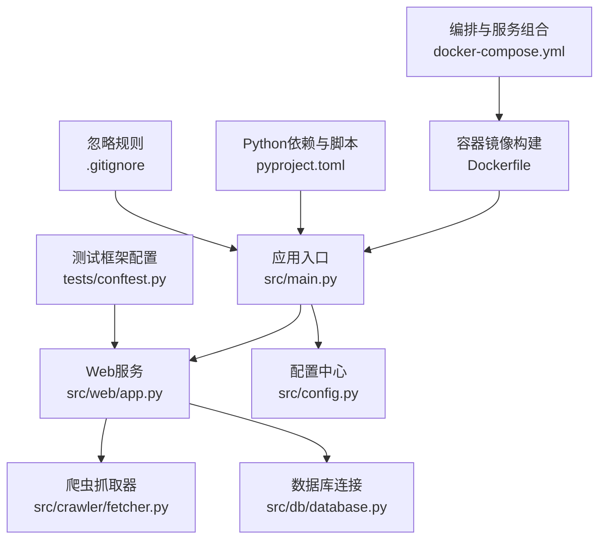
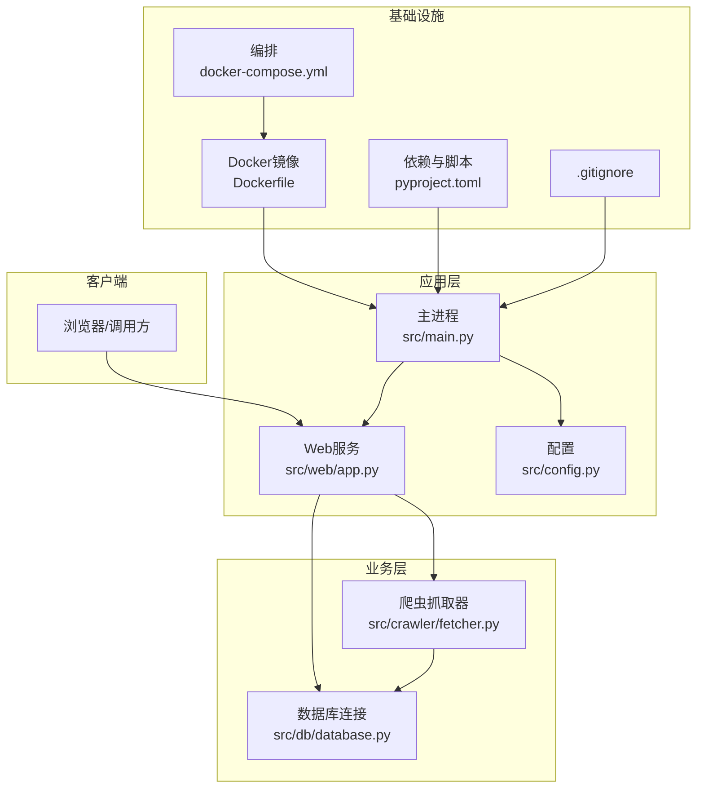
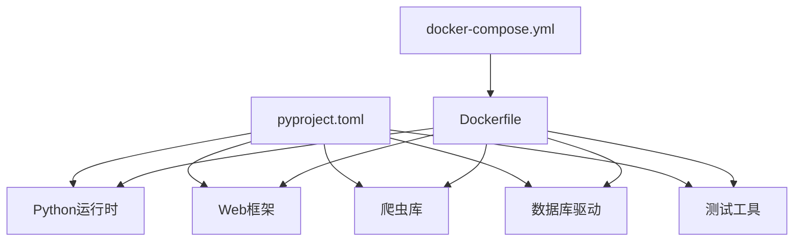

# 贡献指南

<cite>
**本文档引用的文件**   
- [README.md](file://README.md)
- [pyproject.toml](file://pyproject.toml)
- [Dockerfile](file://Dockerfile)
- [docker-compose.yml](file://docker-compose.yml)
- [.gitignore](file://.gitignore)
- [src/main.py](file://src/main.py)
- [src/config.py](file://src/config.py)
- [src/web/app.py](file://src/web/app.py)
- [src/crawler/fetcher.py](file://src/crawler/fetcher.py)
- [src/db/database.py](file://src/db/database.py)
- [tests/conftest.py](file://tests/conftest.py)
</cite>

## 目录
1. [简介](#简介)
2. [项目结构](#项目结构)
3. [核心组件](#核心组件)
4. [架构总览](#架构总览)
5. [详细组件分析](#详细组件分析)
6. [依赖关系分析](#依赖关系分析)
7. [性能注意事项](#性能注意事项)
8. [故障排查指南](#故障排查指南)
9. [结论](#结论)
10. [附录](#附录)

## 简介
本贡献指南面向所有希望参与本项目协作的开发者，目标是建立统一的Git工作流、分支管理策略、提交信息规范、Pull Request流程与代码审查标准，并提供Issue报告模板、问题反馈流程、新功能开发步骤与文档更新要求。同时明确社区行为准则与协作规范，确保开源协作高效且代码质量稳定。

## 项目结构
仓库采用按功能模块划分的目录组织方式，核心入口位于 src/main.py，Web服务在 src/web/app.py，爬虫能力集中在 src/crawler/*，数据持久化在 src/db/*，测试用例在 tests/ 下，容器化配置通过 Dockerfile 与 docker-compose.yml 提供，Python包与依赖由 pyproject.toml 管理。

图表来源
- [src/main.py](file://src/main.py)
- [src/web/app.py](file://src/web/app.py)
- [src/config.py](file://src/config.py)
- [src/crawler/fetcher.py](file://src/crawler/fetcher.py)
- [src/db/database.py](file://src/db/database.py)
- [tests/conftest.py](file://tests/conftest.py)
- [Dockerfile](file://Dockerfile)
- [docker-compose.yml](file://docker-compose.yml)
- [pyproject.toml](file://pyproject.toml)
- [.gitignore](file://.gitignore)

章节来源
- [README.md](file://README.md)
- [pyproject.toml](file://pyproject.toml)
- [Dockerfile](file://Dockerfile)
- [docker-compose.yml](file://docker-compose.yml)
- [.gitignore](file://.gitignore)

## 核心组件
- 应用入口与生命周期：负责初始化配置、启动Web服务与调度任务。
- Web服务：对外暴露HTTP接口，处理请求路由与响应。
- 爬虫子系统：负责目标站点抓取、解析与本地化处理。
- 数据层：封装数据库连接、模型定义与仓储访问。
- 测试基础设施：统一测试夹具与运行配置。

章节来源
- [src/main.py](file://src/main.py)
- [src/web/app.py](file://src/web/app.py)
- [src/crawler/fetcher.py](file://src/crawler/fetcher.py)
- [src/db/database.py](file://src/db/database.py)
- [tests/conftest.py](file://tests/conftest.py)

## 架构总览
系统采用分层架构：Web层接收请求并协调业务；爬虫层执行数据采集；数据层负责持久化；配置与依赖通过集中式配置文件管理；容器化部署保证环境一致性。

图表来源
- [src/main.py](file://src/main.py)
- [src/web/app.py](file://src/web/app.py)
- [src/config.py](file://src/config.py)
- [src/crawler/fetcher.py](file://src/crawler/fetcher.py)
- [src/db/database.py](file://src/db/database.py)
- [Dockerfile](file://Dockerfile)
- [docker-compose.yml](file://docker-compose.yml)
- [pyproject.toml](file://pyproject.toml)
- [.gitignore](file://.gitignore)

## 详细组件分析

### Git工作流程与分支管理策略
- 主干保护：main/master为受保护分支，禁止直接推送，仅允许通过合并请求进入。
- 功能分支：以 feature/ 前缀命名，如 feature/add-proxy-support，用于实现新功能或改进。
- 缺陷修复：以 fix/ 前缀命名，如 fix/parser-timeout，用于修复已知问题。
- 发布分支：以 release/ 前缀命名，如 release/v1.2.0，用于版本打包与回归测试。
- 热修复分支：以 hotfix/ 前缀命名，如 hotfix/security-patch，用于紧急修复生产问题。
- 分支同步：定期从上游主干拉取最新变更，保持分支可合并性。
- 合并策略：优先使用快速合并（fast-forward），必要时使用带签名的合并提交。

章节来源
- [README.md](file://README.md)
- [pyproject.toml](file://pyproject.toml)

### 提交信息规范
- 格式：类型(范围): 描述
- 类型建议：feat、fix、docs、style、refactor、test、chore、ci、perf、build、revert
- 范围：模块或子系统的短名，如 crawler、db、web
- 描述：简洁明了，动词开头，避免无意义词汇
- 示例：feat(crawler): 增加代理支持、fix(db): 修复连接池泄漏、docs(readme): 更新安装说明

章节来源
- [README.md](file://README.md)

### Pull Request创建流程与代码审查标准
- PR标题：遵循提交信息规范，清晰表达变更内容
- PR描述：包含背景、变更点、影响面、测试覆盖、兼容性说明
- 代码审查要点：
  - 正确性与健壮性：边界条件、异常路径、错误码
  - 可读性与一致性：命名、结构、注释、风格一致
  - 性能与安全：I/O开销、内存占用、注入风险、敏感信息泄露
  - 可维护性：解耦、扩展点、配置项设计
- 审查流程：至少一名核心成员审查通过后合并；自动化检查必须全部通过
- 合并后：更新相关文档与变更日志，通知相关人员

章节来源
- [README.md](file://README.md)

### Issue报告模板与问题反馈流程
- 标题：简明扼要，包含模块与问题类型
- 复现步骤：详细列出操作步骤与环境信息
- 期望结果与实际结果：对比说明
- 附加信息：日志片段、截图、配置文件、依赖版本
- 反馈渠道：仓库Issues页面，标签分类（bug、enhancement、question）
- 跟进机制：维护者标注优先级与状态，定期清理过期问题

章节来源
- [README.md](file://README.md)

### 新功能开发步骤与文档更新要求
- 需求确认：在Issue中讨论需求与方案，获得共识
- 分支开发：基于feature分支进行开发，保持小步提交
- 单元测试：新增或更新测试用例，确保覆盖率与稳定性
- 集成测试：验证端到端流程与外部依赖交互
- 文档更新：同步更新README、API文档、配置说明与迁移指南
- 自测与联调：本地运行与容器化验证，确保无回归
- 提交PR：附上变更说明与测试报告，等待审查与合并

章节来源
- [README.md](file://README.md)
- [pyproject.toml](file://pyproject.toml)

### 社区行为准则与协作规范
- 尊重与包容：鼓励多元观点，避免人身攻击与歧视性语言
- 建设性反馈：聚焦问题本身，提供可操作的改进建议
- 透明沟通：公开讨论决策过程，记录关键结论
- 责任分担：主动认领任务，及时汇报进度与阻塞
- 安全合规：不泄露敏感信息，遵守许可证与法律要求

章节来源
- [README.md](file://README.md)

### 如何参与项目讨论与技术决策
- 讨论渠道：Issues、Discussions、邮件列表（如有）
- 提案格式：背景、动机、方案对比、风险评估、实施计划
- 决策流程：广泛征求意见，核心成员投票或协商一致
- 变更记录：重要决策写入文档与变更日志，便于追溯

章节来源
- [README.md](file://README.md)

## 依赖关系分析
项目依赖包括Python运行时、Web框架、爬虫库、数据库驱动与测试工具。依赖声明集中于 pyproject.toml，容器镜像通过 Dockerfile 构建，服务编排通过 docker-compose.yml 管理。

图表来源
- [pyproject.toml](file://pyproject.toml)
- [Dockerfile](file://Dockerfile)
- [docker-compose.yml](file://docker-compose.yml)

章节来源
- [pyproject.toml](file://pyproject.toml)
- [Dockerfile](file://Dockerfile)
- [docker-compose.yml](file://docker-compose.yml)

## 性能注意事项
- 网络请求：合理设置超时与重试策略，避免阻塞主线程
- 数据库操作：使用连接池与事务，减少锁竞争
- 内存管理：流式处理大对象，避免一次性加载
- 缓存策略：对热点数据启用缓存，降低重复计算
- 监控指标：采集延迟、吞吐、错误率等关键指标

[本节为通用指导，无需特定文件引用]

## 故障排查指南
- 启动失败：检查端口占用、环境变量、依赖安装与镜像构建
- 爬虫异常：验证目标站点可达性、反爬策略与解析逻辑
- 数据库错误：核对连接参数、权限与表结构
- 测试失败：定位断言失败点，补充缺失用例
- 日志分析：收集关键上下文，定位根因

章节来源
- [src/main.py](file://src/main.py)
- [src/web/app.py](file://src/web/app.py)
- [src/crawler/fetcher.py](file://src/crawler/fetcher.py)
- [src/db/database.py](file://src/db/database.py)
- [tests/conftest.py](file://tests/conftest.py)

## 结论
本贡献指南旨在为项目协作提供清晰、可执行的规范，涵盖Git工作流、分支管理、提交信息、PR流程、代码审查、Issue模板、新功能开发、文档更新、社区行为与讨论参与。遵循这些规范将显著提升协作效率与代码质量，保障项目的长期健康发展。

[本节为总结性内容，无需特定文件引用]

## 附录
- 常用命令：git clone、git branch、git commit、git push、git pull、git merge
- 本地开发：python -m pytest、docker compose up、pip install -e .
- 文档位置：README.md、各模块内docstring、在线Wiki（如有）

[本节为辅助信息，无需特定文件引用]