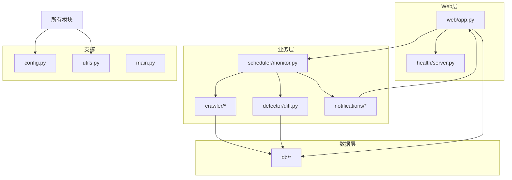
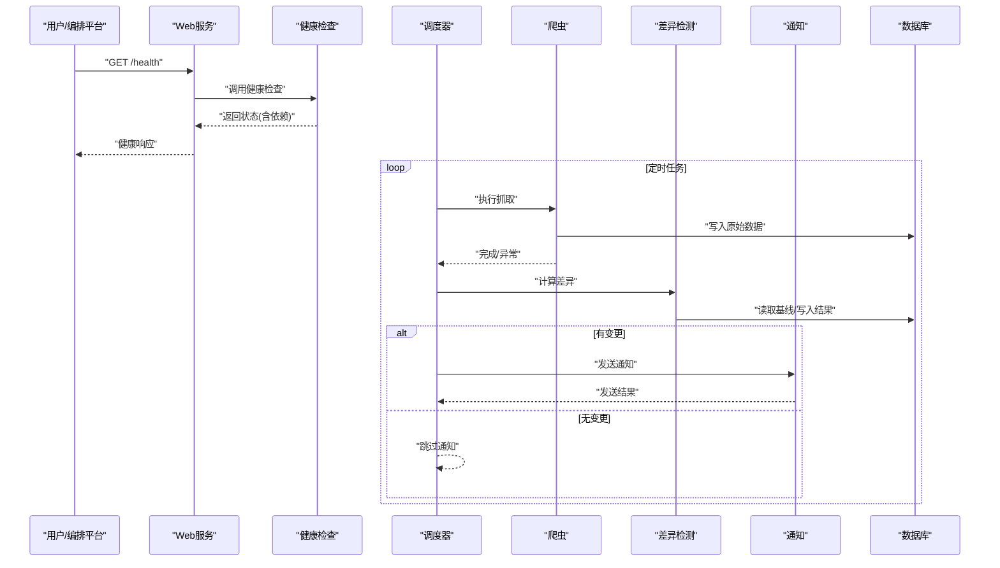
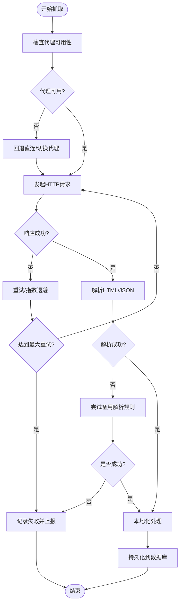
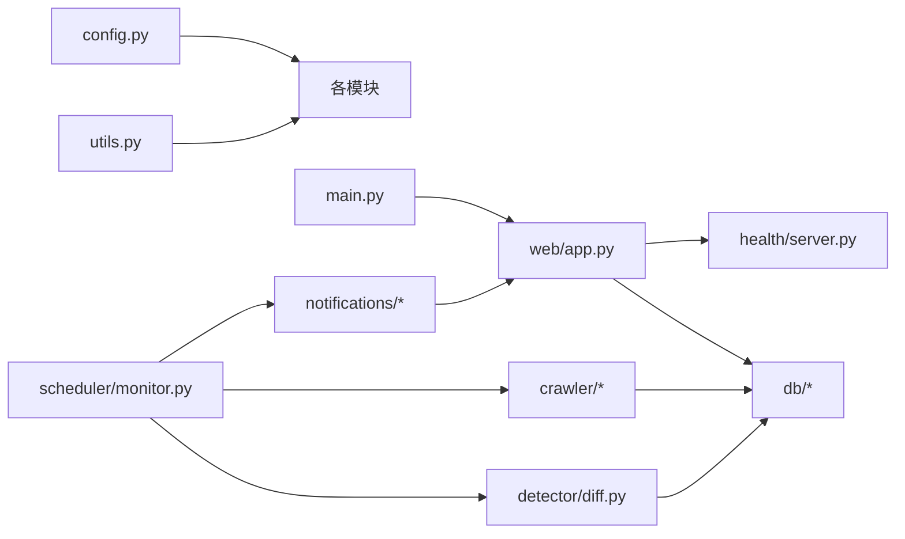

# 故障排查

<cite>
**本文引用的文件**   
- [README.md](file://README.md)
- [Dockerfile](file://Dockerfile)
- [docker-compose.yml](file://docker-compose.yml)
- [pyproject.toml](file://pyproject.toml)
- [install.bat](file://install.bat)
- [run_web.py](file://run_web.py)
- [start.bat](file://start.bat)
- [src/main.py](file://src/main.py)
- [src/config.py](file://src/config.py)
- [src/utils.py](file://src/utils.py)
- [src/web/app.py](file://src/web/app.py)
- [src/health/server.py](file://src/health/server.py)
- [src/crawler/fetcher.py](file://src/crawler/fetcher.py)
- [src/crawler/parser.py](file://src/crawler/parser.py)
- [src/crawler/localize.py](file://src/crawler/localize.py)
- [src/crawler/proxy.py](file://src/crawler/proxy.py)
- [src/db/database.py](file://src/db/database.py)
- [src/db/models.py](file://src/db/models.py)
- [src/db/repository.py](file://src/db/repository.py)
- [src/detector/diff.py](file://src/detector/diff.py)
- [src/scheduler/monitor.py](file://src/scheduler/monitor.py)
- [src/notifications/admin_notifier.py](file://src/notifications/admin_notifier.py)
- [src/notifications/user_notifier.py](file://src/notifications/user_notifier.py)
- [tests/conftest.py](file://tests/conftest.py)
- [tests/test_diff.py](file://tests/test_diff.py)
- [tests/test_notifier.py](file://tests/test_notifier.py)
- [tests/test_parser.py](file://tests/test_parser.py)
</cite>

## 目录
1. [简介](#简介)
2. [项目结构](#项目结构)
3. [核心组件](#核心组件)
4. [架构总览](#架构总览)
5. [详细组件分析](#详细组件分析)
6. [依赖关系分析](#依赖关系分析)
7. [性能考虑](#性能考虑)
8. [故障排查指南](#故障排查指南)
9. [结论](#结论)
10. [附录](#附录)

## 简介
本故障排查文档面向运维与开发人员，目标是快速定位并解决监控系统的常见问题。内容涵盖：
- 日志分析方法、错误追踪技巧
- 健康检查接口使用与监控指标解读
- 典型问题排查：网络、数据库连接、爬虫失败、通知发送等
- 性能调优建议、资源优化与容量规划
- 紧急恢复流程与备份恢复操作

## 项目结构
系统采用模块化分层设计，主要包含：
- Web 服务与健康检查
- 爬虫抓取与解析
- 数据库模型与仓储
- 差异检测器
- 调度器
- 通知模块（管理员与用户）
- 配置与工具库
- 测试套件与部署脚本

图表来源
- [src/web/app.py](file://src/web/app.py)
- [src/health/server.py](file://src/health/server.py)
- [src/crawler/fetcher.py](file://src/crawler/fetcher.py)
- [src/crawler/parser.py](file://src/crawler/parser.py)
- [src/crawler/localize.py](file://src/crawler/localize.py)
- [src/crawler/proxy.py](file://src/crawler/proxy.py)
- [src/db/database.py](file://src/db/database.py)
- [src/db/models.py](file://src/db/models.py)
- [src/db/repository.py](file://src/db/repository.py)
- [src/detector/diff.py](file://src/detector/diff.py)
- [src/scheduler/monitor.py](file://src/scheduler/monitor.py)
- [src/notifications/admin_notifier.py](file://src/notifications/admin_notifier.py)
- [src/notifications/user_notifier.py](file://src/notifications/user_notifier.py)
- [src/config.py](file://src/config.py)
- [src/utils.py](file://src/utils.py)
- [src/main.py](file://src/main.py)

章节来源
- [README.md](file://README.md)
- [docker-compose.yml](file://docker-compose.yml)
- [Dockerfile](file://Dockerfile)
- [pyproject.toml](file://pyproject.toml)

## 核心组件
- 健康检查服务：提供进程存活、依赖可达性检查能力，便于编排平台探测服务状态。
- Web 应用：对外暴露 API 与静态页面，承载监控展示与交互入口。
- 爬虫子系统：负责目标站点抓取、代理配置、本地化与解析。
- 数据库层：封装连接、模型定义与仓储访问。
- 差异检测：对比新旧数据，触发告警或通知。
- 调度器：周期性执行监控任务，协调各子模块。
- 通知模块：向管理员与用户发送告警与结果。
- 配置与工具：集中管理环境变量、默认值与通用方法。

章节来源
- [src/health/server.py](file://src/health/server.py)
- [src/web/app.py](file://src/web/app.py)
- [src/crawler/fetcher.py](file://src/crawler/fetcher.py)
- [src/crawler/parser.py](file://src/crawler/parser.py)
- [src/crawler/localize.py](file://src/crawler/localize.py)
- [src/crawler/proxy.py](file://src/crawler/proxy.py)
- [src/db/database.py](file://src/db/database.py)
- [src/db/models.py](file://src/db/models.py)
- [src/db/repository.py](file://src/db/repository.py)
- [src/detector/diff.py](file://src/detector/diff.py)
- [src/scheduler/monitor.py](file://src/scheduler/monitor.py)
- [src/notifications/admin_notifier.py](file://src/notifications/admin_notifier.py)
- [src/notifications/user_notifier.py](file://src/notifications/user_notifier.py)
- [src/config.py](file://src/config.py)
- [src/utils.py](file://src/utils.py)

## 架构总览
系统以调度器为驱动，按周期触发“抓取-解析-检测-通知”流水线；Web 层提供健康检查与查询能力；数据库持久化中间结果与历史数据。

图表来源
- [src/health/server.py](file://src/health/server.py)
- [src/web/app.py](file://src/web/app.py)
- [src/scheduler/monitor.py](file://src/scheduler/monitor.py)
- [src/crawler/fetcher.py](file://src/crawler/fetcher.py)
- [src/crawler/parser.py](file://src/crawler/parser.py)
- [src/detector/diff.py](file://src/detector/diff.py)
- [src/notifications/admin_notifier.py](file://src/notifications/admin_notifier.py)
- [src/notifications/user_notifier.py](file://src/notifications/user_notifier.py)
- [src/db/database.py](file://src/db/database.py)

## 详细组件分析

### 健康检查与服务状态诊断
- 健康检查端点用于容器编排与负载均衡探针，应返回进程状态与关键依赖可达性。
- 常见症状：
  - 503/非200：依赖不可达（数据库、外部服务）、端口占用、权限不足。
  - 延迟高：GC 停顿、线程池耗尽、锁竞争。
- 诊断步骤：
  - 直接调用健康接口，观察返回码与字段含义。
  - 查看依赖检查项的耗时与错误信息。
  - 结合系统资源监控（CPU、内存、句柄数）判断瓶颈。

章节来源
- [src/health/server.py](file://src/health/server.py)
- [src/web/app.py](file://src/web/app.py)

### 爬虫子系统（抓取、代理、解析、本地化）
- 抓取失败常见原因：
  - 网络超时、DNS 解析失败、SSL/TLS 握手失败。
  - 反爬策略（验证码、IP 封禁、User-Agent 限制）。
  - 代理不可用或认证失败。
- 解析失败常见原因：
  - 目标页面结构变化导致选择器失效。
  - 编码不一致、HTML 不完整。
- 本地化失败：
  - 语言包缺失或映射表不正确。
- 诊断步骤：
  - 开启抓取调试日志，记录请求头、响应码、响应体片段。
  - 校验代理配置与连通性。
  - 对解析器进行单元测试回归，确认选择器有效性。

图表来源
- [src/crawler/fetcher.py](file://src/crawler/fetcher.py)
- [src/crawler/parser.py](file://src/crawler/parser.py)
- [src/crawler/localize.py](file://src/crawler/localize.py)
- [src/crawler/proxy.py](file://src/crawler/proxy.py)

章节来源
- [src/crawler/fetcher.py](file://src/crawler/fetcher.py)
- [src/crawler/parser.py](file://src/crawler/parser.py)
- [src/crawler/localize.py](file://src/crawler/localize.py)
- [src/crawler/proxy.py](file://src/crawler/proxy.py)

### 数据库连接与仓储访问
- 常见问题：
  - 连接池耗尽、连接泄漏、事务未提交。
  - 慢查询、索引缺失、锁等待。
  - 权限不足、字符集不匹配。
- 诊断步骤：
  - 检查连接池大小与当前活跃连接数。
  - 启用慢查询日志，定位热点 SQL。
  - 验证账号权限与默认数据库存在。
  - 在仓储层增加重试与超时控制。

章节来源
- [src/db/database.py](file://src/db/database.py)
- [src/db/models.py](file://src/db/models.py)
- [src/db/repository.py](file://src/db/repository.py)

### 差异检测与告警触发
- 常见问题：
  - 基线数据缺失或不一致。
  - 比较逻辑阈值设置不当导致误报/漏报。
- 诊断步骤：
  - 核对基线与当前快照的数据一致性。
  - 打印差异明细，定位具体字段变化。
  - 调整阈值与过滤规则，减少噪声。

章节来源
- [src/detector/diff.py](file://src/detector/diff.py)

### 调度器与任务编排
- 常见问题：
  - 任务堆积、重复执行、死锁。
  - 调度间隔过短导致资源争用。
- 诊断步骤：
  - 查看任务队列长度与执行耗时分布。
  - 检查并发度与限流策略。
  - 确保幂等性与去重机制生效。

章节来源
- [src/scheduler/monitor.py](file://src/scheduler/monitor.py)

### 通知模块（管理员与用户）
- 常见问题：
  - 邮件/IM 通道不可用、配额耗尽、模板渲染失败。
  - 收件人列表错误或消息被拦截。
- 诊断步骤：
  - 检查通道配置与凭据有效期。
  - 查看发送队列与重试次数。
  - 使用最小化消息模板验证通道连通性。

章节来源
- [src/notifications/admin_notifier.py](file://src/notifications/admin_notifier.py)
- [src/notifications/user_notifier.py](file://src/notifications/user_notifier.py)

### Web 应用与静态资源
- 常见问题：
  - 端口冲突、反向代理配置错误、静态资源 404。
  - 跨域、会话丢失、CSRF 防护误拦。
- 诊断步骤：
  - 检查监听端口与防火墙规则。
  - 验证反向代理转发路径与头部透传。
  - 清理缓存并重新构建静态资源。

章节来源
- [src/web/app.py](file://src/web/app.py)

### 配置与工具
- 常见问题：
  - 环境变量未加载、默认值覆盖、敏感信息泄露。
- 诊断步骤：
  - 启动时打印配置摘要（脱敏）。
  - 校验必填项与类型约束。
  - 将配置与密钥分离管理。

章节来源
- [src/config.py](file://src/config.py)
- [src/utils.py](file://src/utils.py)

## 依赖关系分析
- 模块耦合：
  - 调度器强依赖爬虫、检测、通知与数据库。
  - Web 层依赖健康检查与数据库。
- 外部依赖：
  - HTTP 客户端、数据库驱动、邮件/IM SDK、代理服务等。
- 潜在风险：
  - 循环导入、单点依赖（如数据库、消息通道）。
  - 第三方服务限流与稳定性影响。

图表来源
- [src/config.py](file://src/config.py)
- [src/utils.py](file://src/utils.py)
- [src/main.py](file://src/main.py)
- [src/web/app.py](file://src/web/app.py)
- [src/health/server.py](file://src/health/server.py)
- [src/scheduler/monitor.py](file://src/scheduler/monitor.py)
- [src/crawler/fetcher.py](file://src/crawler/fetcher.py)
- [src/crawler/parser.py](file://src/crawler/parser.py)
- [src/crawler/localize.py](file://src/crawler/localize.py)
- [src/crawler/proxy.py](file://src/crawler/proxy.py)
- [src/db/database.py](file://src/db/database.py)
- [src/db/models.py](file://src/db/models.py)
- [src/db/repository.py](file://src/db/repository.py)
- [src/detector/diff.py](file://src/detector/diff.py)
- [src/notifications/admin_notifier.py](file://src/notifications/admin_notifier.py)
- [src/notifications/user_notifier.py](file://src/notifications/user_notifier.py)

章节来源
- [pyproject.toml](file://pyproject.toml)
- [docker-compose.yml](file://docker-compose.yml)

## 性能考虑
- 抓取阶段：
  - 合理设置并发与超时，避免对目标站造成压力。
  - 启用连接复用与压缩传输。
- 解析阶段：
  - 预编译选择器，减少正则开销。
  - 增量解析，避免全量重建。
- 数据库阶段：
  - 批量写入、事务合并。
  - 建立合适索引，避免全表扫描。
- 调度阶段：
  - 动态调整并发度与批大小。
  - 引入背压与限流，防止雪崩。
- 通知阶段：
  - 异步发送，批量聚合消息。
  - 失败重试与退避策略。

[本节为通用指导，无需引用具体文件]

## 故障排查指南

### 日志分析方法
- 日志级别与分类：
  - 启动/配置、请求/响应、抓取/解析、数据库、调度、通知、错误堆栈。
- 采集与存储：
  - 统一输出格式（时间戳、级别、模块、TraceId）。
  - 集中收集与检索（文件/ELK/云日志）。
- 分析技巧：
  - 基于 TraceId 串联一次请求的全链路日志。
  - 统计错误率、P95/P99 延迟、重试次数。
  - 关联系统指标（CPU、内存、IO、网络）定位根因。

章节来源
- [src/utils.py](file://src/utils.py)
- [src/config.py](file://src/config.py)

### 错误追踪技巧
- 结构化异常：
  - 区分可恢复与不可恢复错误，附带上下文参数。
- 采样与降级：
  - 高频错误采样上报，避免风暴。
  - 关键路径失败自动降级（如跳过非核心通知）。
- 回溯与复现：
  - 保留最小复现场景（输入、配置、环境）。
  - 使用测试用例固化修复。

章节来源
- [src/utils.py](file://src/utils.py)
- [tests/test_diff.py](file://tests/test_diff.py)
- [tests/test_notifier.py](file://tests/test_notifier.py)
- [tests/test_parser.py](file://tests/test_parser.py)

### 健康检查接口使用
- 端点说明：
  - 进程存活、依赖可达性、资源水位。
- 使用方式：
  - 编排平台定期探测，失败则重启或摘除流量。
  - 自定义检查项扩展（如外部 API 连通性）。
- 指标解读：
  - 状态码、检查项耗时、失败原因。

章节来源
- [src/health/server.py](file://src/health/server.py)
- [src/web/app.py](file://src/web/app.py)

### 监控指标解读
- 业务指标：
  - 抓取成功率、解析成功率、差异触发率、通知送达率。
- 系统指标：
  - CPU、内存、磁盘 IO、网络吞吐、连接池使用率。
- 告警策略：
  - 阈值告警（错误率、延迟、资源水位）。
  - 趋势告警（环比/同比突增）。

章节来源
- [src/scheduler/monitor.py](file://src/scheduler/monitor.py)
- [src/utils.py](file://src/utils.py)

### 典型问题排查步骤

#### 网络问题
- 现象：抓取超时、DNS 解析失败、SSL 握手失败。
- 步骤：
  - 检查 DNS 与代理配置，验证连通性。
  - 查看 TLS 证书与协议版本兼容性。
  - 提升超时与重试上限，观察是否缓解。
- 参考：
  - [src/crawler/fetcher.py](file://src/crawler/fetcher.py)
  - [src/crawler/proxy.py](file://src/crawler/proxy.py)

#### 数据库连接问题
- 现象：连接失败、连接池耗尽、慢查询。
- 步骤：
  - 检查账号权限、字符集、默认库。
  - 调整连接池大小与空闲回收策略。
  - 启用慢查询日志，优化 SQL 与索引。
- 参考：
  - [src/db/database.py](file://src/db/database.py)
  - [src/db/repository.py](file://src/db/repository.py)

#### 爬虫失败
- 现象：解析失败、选择器不匹配、反爬拦截。
- 步骤：
  - 打印响应体片段，确认页面结构。
  - 更新解析规则与本地化映射。
  - 轮换 User-Agent、添加延时与代理池。
- 参考：
  - [src/crawler/parser.py](file://src/crawler/parser.py)
  - [src/crawler/localize.py](file://src/crawler/localize.py)

#### 通知发送失败
- 现象：邮件/IM 发送失败、模板渲染错误。
- 步骤：
  - 校验通道配置与凭据。
  - 使用最小模板测试通道连通性。
  - 检查发送队列与重试策略。
- 参考：
  - [src/notifications/admin_notifier.py](file://src/notifications/admin_notifier.py)
  - [src/notifications/user_notifier.py](file://src/notifications/user_notifier.py)

### 性能调优建议
- 抓取：
  - 控制并发、启用连接复用、压缩传输。
- 解析：
  - 预编译选择器、增量解析、缓存热点数据。
- 数据库：
  - 批量写入、事务合并、索引优化、读写分离。
- 调度：
  - 动态并发、批大小自适应、背压限流。
- 通知：
  - 异步发送、批量聚合、失败退避。

[本节为通用指导，无需引用具体文件]

### 资源使用优化
- 进程与线程：
  - 合理设置工作进程/线程数，避免过度上下文切换。
- 内存：
  - 监控大对象与泄漏，及时释放无用引用。
- IO：
  - 使用缓冲与零拷贝，减少系统调用。
- 网络：
  - 连接池复用、Keep-Alive、合理超时。

[本节为通用指导，无需引用具体文件]

### 容量规划指导
- 评估维度：
  - 抓取规模（URL 数量、频率）、解析复杂度、差异粒度、通知峰值。
- 容量公式：
  - 资源需求 = 基础开销 + 单位负载 × 负载量 + 安全冗余。
- 扩容策略：
  - 水平扩展（多实例）、垂直扩展（更大规格）、分库分表。

[本节为通用指导，无需引用具体文件]

### 紧急恢复流程
- 快速止血：
  - 暂停调度任务、隔离故障节点、回滚最近变更。
- 数据恢复：
  - 从备份恢复数据库与关键文件。
  - 校验数据一致性与完整性。
- 服务重建：
  - 使用镜像与配置重建实例，逐步放量。
- 复盘改进：
  - 根因分析、补丁发布、演练预案。

章节来源
- [Dockerfile](file://Dockerfile)
- [docker-compose.yml](file://docker-compose.yml)
- [src/config.py](file://src/config.py)

### 备份恢复操作
- 备份范围：
  - 数据库、配置文件、静态资源、日志归档。
- 备份策略：
  - 全量+增量、异地容灾、加密存储。
- 恢复步骤：
  - 停止写入、恢复数据、验证一致性、恢复服务。
- 演练要求：
  - 定期演练恢复流程，记录耗时与问题。

章节来源
- [docker-compose.yml](file://docker-compose.yml)
- [src/db/database.py](file://src/db/database.py)

## 结论
通过标准化的日志与指标体系、完善的健康检查与监控告警、以及针对网络、数据库、爬虫与通知的典型排查流程，运维团队可以快速定位并解决问题。配合性能调优、容量规划与紧急恢复预案，可显著提升系统稳定性与可维护性。

## 附录

### 常用命令与脚本
- 安装与运行：
  - 使用安装脚本与环境准备。
  - 启动 Web 服务与调度任务。
- 部署与编排：
  - Docker 镜像构建与容器编排。
  - 环境变量与密钥管理。

章节来源
- [install.bat](file://install.bat)
- [run_web.py](file://run_web.py)
- [start.bat](file://start.bat)
- [Dockerfile](file://Dockerfile)
- [docker-compose.yml](file://docker-compose.yml)
- [pyproject.toml](file://pyproject.toml)

### 测试与回归
- 单元测试：
  - 差异检测、通知发送、解析器行为。
- 集成测试：
  - 端到端抓取-解析-检测-通知流程。
- 故障注入：
  - 模拟网络抖动、数据库不可用、通知通道失败。

章节来源
- [tests/test_diff.py](file://tests/test_diff.py)
- [tests/test_notifier.py](file://tests/test_notifier.py)
- [tests/test_parser.py](file://tests/test_parser.py)
- [tests/conftest.py](file://tests/conftest.py)