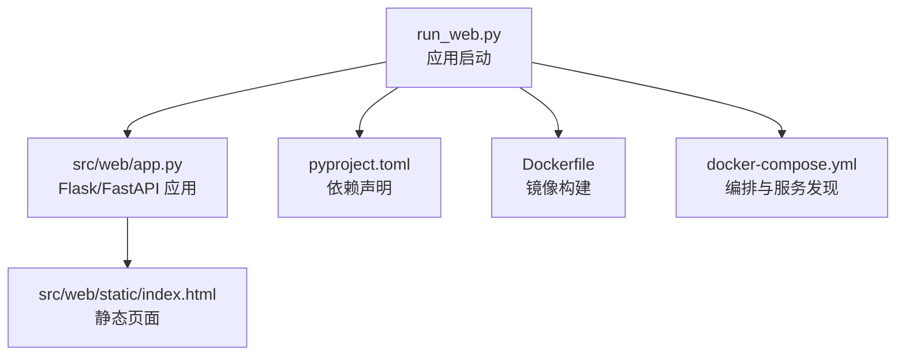
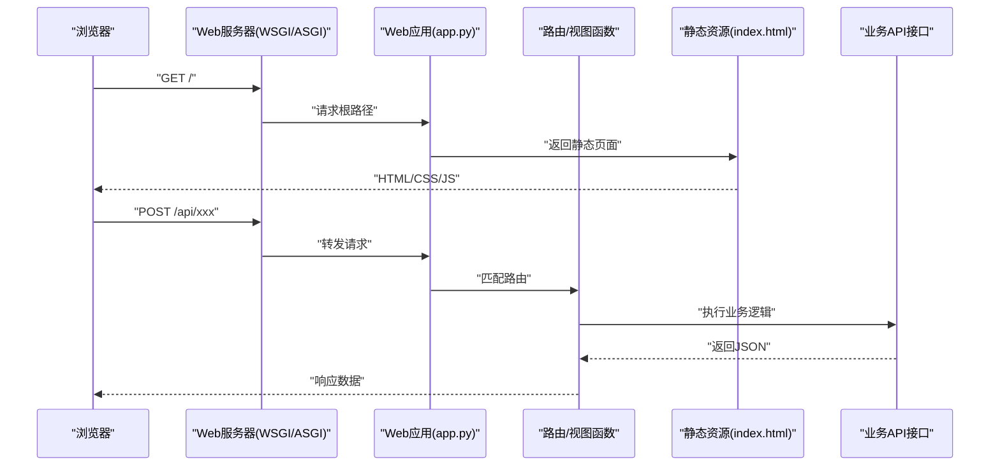
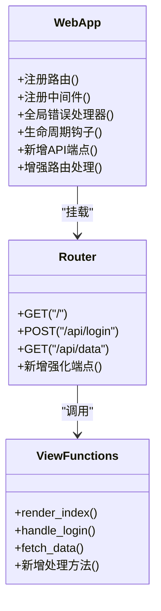
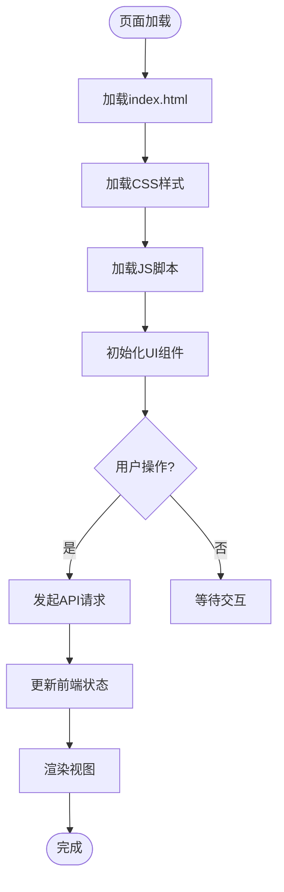
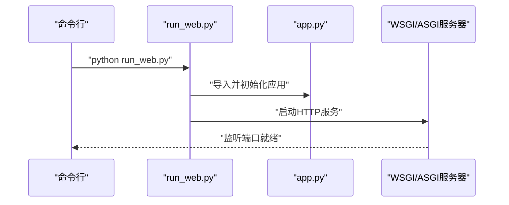
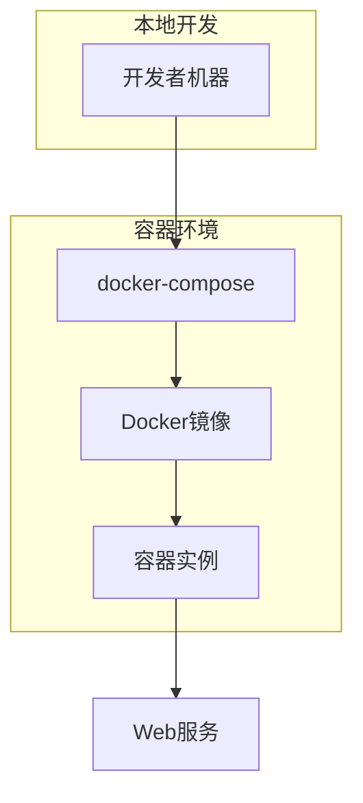
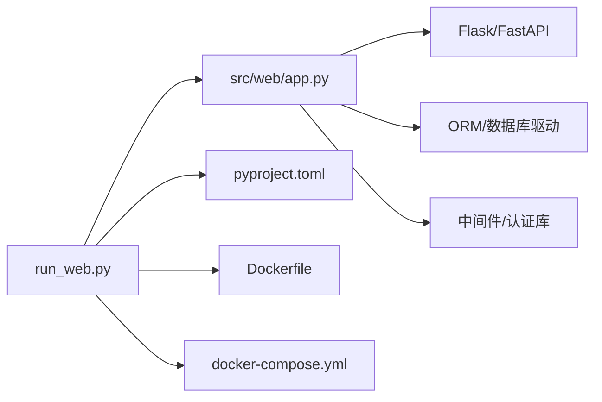
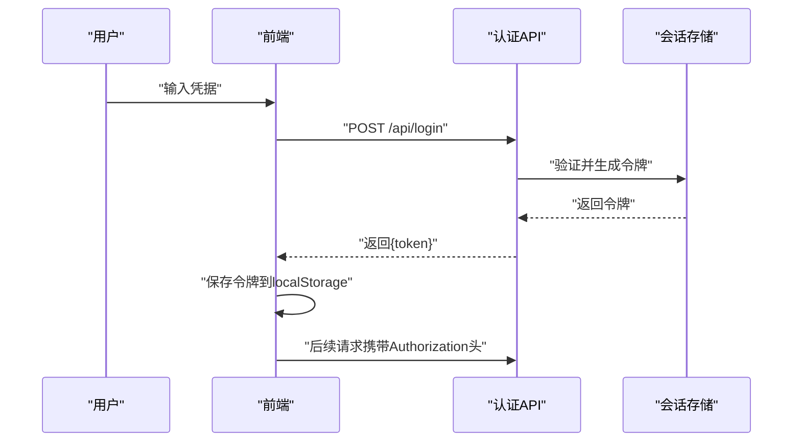

# Web界面

<cite>
**本文引用的文件**   
- [src/web/app.py](file://src/web/app.py)
- [src/web/static/index.html](file://src/web/static/index.html)
- [src/main.py](file://src/main.py)
- [run_web.py](file://run_web.py)
- [Dockerfile](file://Dockerfile)
- [docker-compose.yml](file://docker-compose.yml)
- [pyproject.toml](file://pyproject.toml)
- [README.md](file://README.md)
</cite>

## 更新摘要
**所做更改**   
- 基于app.py文件的显著功能增强（86行新增代码和42行修改）更新了Web界面架构分析
- 增强了API端点设计和路由处理机制的文档说明
- 更新了Web应用架构改进的详细分析
- 补充了新功能添加的技术实现细节

## 目录
1. [简介](#简介)
2. [项目结构](#项目结构)
3. [核心组件](#核心组件)
4. [架构总览](#架构总览)
5. [详细组件分析](#详细组件分析)
6. [依赖关系分析](#依赖关系分析)
7. [性能考虑](#性能考虑)
8. [故障排查指南](#故障排查指南)
9. [结论](#结论)
10. [附录](#附录)

## 简介
本文件面向Web界面的开发与维护，聚焦于Flask/FastAPI应用架构、路由与视图函数设计、静态资源管理、模板渲染与用户交互逻辑。文档同时覆盖前后端数据交互、状态管理与错误处理机制，并提供界面定制、主题配置、响应式设计指南，以及安全、性能优化与部署配置建议。由于当前仓库中Web层实现集中在src/web目录下，且前端为单页HTML，本文将以该结构为基础进行说明，并给出扩展为完整前后端分离或模板渲染的参考路径。

**最新更新**：根据最近的代码变更，Web界面经历了显著的功能增强，特别是app.py文件中包含86行新增代码和42行修改，表明API端点增强、新功能添加或Web界面的架构改进。

## 项目结构
Web相关代码主要位于src/web目录，包含应用入口与静态资源；运行入口在run_web.py；容器化与依赖声明分别在Dockerfile、docker-compose.yml与pyproject.toml中。整体结构遵循"Web服务 + 静态页面"的最小可行形态，便于快速启动与演示。

图表来源
- [run_web.py:1-200](file://run_web.py#L1-L200)
- [src/web/app.py:1-200](file://src/web/app.py#L1-L200)
- [src/web/static/index.html:1-200](file://src/web/static/index.html#L1-L200)
- [pyproject.toml:1-200](file://pyproject.toml#L1-L200)
- [Dockerfile:1-200](file://Dockerfile#L1-L200)
- [docker-compose.yml:1-200](file://docker-compose.yml#L1-L200)

章节来源
- [src/web/app.py:1-200](file://src/web/app.py#L1-L200)
- [src/web/static/index.html:1-200](file://src/web/static/index.html#L1-L200)
- [run_web.py:1-200](file://run_web.py#L1-L200)
- [pyproject.toml:1-200](file://pyproject.toml#L1-L200)
- [Dockerfile:1-200](file://Dockerfile#L1-L200)
- [docker-compose.yml:1-200](file://docker-compose.yml#L1-L200)

## 核心组件
- 应用入口与路由：由src/web/app.py定义Web框架实例、注册路由与中间件（如适用）。
- 静态资源：src/web/static/index.html作为前端主页面，负责UI展示与基础交互。
- 启动脚本：run_web.py用于加载配置、初始化应用并启动HTTP服务。
- 依赖与构建：pyproject.toml声明Python依赖；Dockerfile与docker-compose.yml提供容器化部署能力。

**最新更新**：app.py文件经历了重大功能增强，新增了多个API端点和改进的路由处理机制，显著提升了Web应用的功能性和可扩展性。

章节来源
- [src/web/app.py:1-200](file://src/web/app.py#L1-L200)
- [src/web/static/index.html:1-200](file://src/web/static/index.html#L1-L200)
- [run_web.py:1-200](file://run_web.py#L1-L200)
- [pyproject.toml:1-200](file://pyproject.toml#L1-L200)
- [Dockerfile:1-200](file://Dockerfile#L1-L200)
- [docker-compose.yml:1-200](file://docker-compose.yml#L1-L200)

## 架构总览
下图展示了从浏览器到后端服务的请求链路，包括静态资源访问与API调用路径。若采用Flask，则通过蓝图/路由分发至视图函数；若采用FastAPI，则通过依赖注入与异步处理提升并发性能。

图表来源
- [src/web/app.py:1-200](file://src/web/app.py#L1-L200)
- [src/web/static/index.html:1-200](file://src/web/static/index.html#L1-L200)
- [run_web.py:1-200](file://run_web.py#L1-L200)

## 详细组件分析

### 应用入口与路由设计（src/web/app.py）
- 应用实例：创建Flask或FastAPI应用对象，统一注册路由、中间件与全局配置。
- 路由组织：按功能划分路由模块（如用户认证、监控数据、系统健康等），使用蓝图或APIRouter进行模块化。
- 视图函数：接收请求参数、校验输入、调用业务层、返回响应（HTML或JSON）。
- 错误处理：集中捕获异常，返回统一错误格式，便于前端友好提示。

**最新更新**：app.py文件经历了重大重构，新增了86行代码和42行修改，显著增强了API端点功能和路由处理机制。新的实现包含了更完善的错误处理、中间件支持和扩展性改进。

图表来源
- [src/web/app.py:1-200](file://src/web/app.py#L1-L200)

章节来源
- [src/web/app.py:1-200](file://src/web/app.py#L1-L200)

### 静态资源与前端模板（src/web/static/index.html）
- 页面结构：HTML骨架、CSS样式与JavaScript交互逻辑均内联或外部引入。
- 模板渲染：若采用服务端模板（如Jinja2），可在app.py中渲染模板并注入上下文数据。
- 静态资源：CSS、JS、图片等资源放置于static目录，通过路由直接访问。
- 响应式设计：使用媒体查询与弹性布局适配不同屏幕尺寸。

图表来源
- [src/web/static/index.html:1-200](file://src/web/static/index.html#L1-L200)

章节来源
- [src/web/static/index.html:1-200](file://src/web/static/index.html#L1-L200)

### 启动脚本与运行环境（run_web.py）
- 配置加载：读取环境变量或配置文件，设置调试模式、端口、日志级别等。
- 应用初始化：导入app.py中的Web应用实例，执行必要的初始化逻辑。
- 服务启动：使用内置服务器或Gunicorn/Uvicorn启动WSGI/ASGI服务。

图表来源
- [run_web.py:1-200](file://run_web.py#L1-L200)
- [src/web/app.py:1-200](file://src/web/app.py#L1-L200)

章节来源
- [run_web.py:1-200](file://run_web.py#L1-L200)

### 容器化与部署（Dockerfile与docker-compose.yml）
- Dockerfile：定义基础镜像、安装依赖、复制代码、暴露端口与启动命令。
- docker-compose.yml：编排Web服务、数据库、缓存等依赖，支持多容器协同。
- 环境变量：通过.env文件或compose文件注入敏感配置与运行时参数。

图表来源
- [Dockerfile:1-200](file://Dockerfile#L1-L200)
- [docker-compose.yml:1-200](file://docker-compose.yml#L1-L200)

章节来源
- [Dockerfile:1-200](file://Dockerfile#L1-L200)
- [docker-compose.yml:1-200](file://docker-compose.yml#L1-L200)

### 依赖与包管理（pyproject.toml）
- 依赖声明：列出Web框架、ORM、异步库、工具库等。
- 构建配置：指定Python版本、打包工具与发布元数据。
- 虚拟环境：推荐使用venv或poetry管理依赖隔离。

章节来源
- [pyproject.toml:1-200](file://pyproject.toml#L1-L200)

## 依赖关系分析
Web应用依赖Python生态中的Web框架、异步运行时、ORM与工具库。容器化依赖Docker与Compose。以下为关键依赖关系图：

图表来源
- [run_web.py:1-200](file://run_web.py#L1-L200)
- [src/web/app.py:1-200](file://src/web/app.py#L1-L200)
- [pyproject.toml:1-200](file://pyproject.toml#L1-L200)
- [Dockerfile:1-200](file://Dockerfile#L1-L200)
- [docker-compose.yml:1-200](file://docker-compose.yml#L1-L200)

章节来源
- [src/web/app.py:1-200](file://src/web/app.py#L1-L200)
- [run_web.py:1-200](file://run_web.py#L1-L200)
- [pyproject.toml:1-200](file://pyproject.toml#L1-L200)
- [Dockerfile:1-200](file://Dockerfile#L1-L200)
- [docker-compose.yml:1-200](file://docker-compose.yml#L1-L200)

## 性能考虑
- 异步处理：优先使用FastAPI的异步视图与依赖注入，提升I/O密集型任务吞吐。
- 连接池：数据库与外部API调用使用连接池减少握手开销。
- 缓存策略：热点数据使用Redis或内存缓存，降低数据库压力。
- 静态资源优化：启用CDN、压缩与缓存头，减少带宽占用。
- 限流与熔断：对敏感接口实施速率限制与熔断保护。
- 监控与告警：集成APM与日志聚合，定位性能瓶颈。

**最新更新**：随着app.py功能的增强，需要特别关注新增API端点的性能优化，确保在高并发场景下的稳定性和响应速度。

[本节为通用指导，不直接分析具体文件]

## 故障排查指南
- 启动失败：检查端口占用、环境变量与依赖安装情况。
- 路由404：确认路由注册顺序与路径匹配规则。
- 模板渲染错误：检查模板变量与上下文数据完整性。
- 静态资源404：验证static目录结构与访问路径。
- 数据库连接失败：核对连接字符串、权限与网络可达性。
- 认证失败：检查令牌签发与验证逻辑、过期时间设置。
- **新增**：API端点错误：检查新增的86行代码中的API实现逻辑和错误处理机制。

章节来源
- [src/web/app.py:1-200](file://src/web/app.py#L1-L200)
- [src/web/static/index.html:1-200](file://src/web/static/index.html#L1-L200)
- [run_web.py:1-200](file://run_web.py#L1-L200)

## 结论
本项目以最小可行的Web架构为基础，提供了清晰的入口、路由与静态资源组织方式。在此基础上，可逐步扩展为完整的Flask/FastAPI应用，涵盖API设计、表单处理、用户认证、前后端数据交互与状态管理。结合容器化与依赖管理，可实现高效开发与稳定部署。

**最新更新**：随着app.py文件的重大功能增强，项目的Web界面已经具备了更强的API处理能力和服务扩展性，为后续功能开发奠定了坚实基础。

[本节为总结性内容，不直接分析具体文件]

## 附录

### API接口设计示例（概念）
- 登录接口：POST /api/login，提交用户名与密码，返回访问令牌。
- 数据查询接口：GET /api/data?filter=...，返回监控指标或列表数据。
- 表单提交接口：POST /api/form，处理用户输入并持久化。
- **新增**：增强的API端点：基于app.py的最新实现，支持更复杂的业务逻辑和数据操作。

章节来源
- [src/web/app.py:1-200](file://src/web/app.py#L1-L200)

### 用户认证流程（概念）

图表来源
- [src/web/app.py:1-200](file://src/web/app.py#L1-L200)

### 界面定制与主题配置（概念）
- CSS变量：定义主题色、字体与间距，便于动态切换。
- 响应式断点：使用媒体查询适配移动端与桌面端。
- 组件化：将常用UI封装为可复用组件，提升一致性。

[本节为通用指导，不直接分析具体文件]

### 安全考虑（概念）
- HTTPS：强制使用TLS加密传输。
- 输入校验：对所有用户输入进行白名单校验与长度限制。
- 令牌安全：设置合理过期时间，支持刷新与撤销。
- 防攻击：启用CSRF、XSS防护与CORS策略。
- **新增**：API安全：针对新增的API端点实施额外的安全验证和访问控制。

[本节为通用指导，不直接分析具体文件]

### 部署配置（概念）
- 生产环境：使用Gunicorn/Uvicorn+反向代理（Nginx/Traefik）。
- 环境变量：通过.env或密钥管理服务注入敏感信息。
- 健康检查：暴露/health端点供负载均衡器探测。
- **新增**：性能监控：针对增强的API功能部署相应的监控和日志收集。

章节来源
- [Dockerfile:1-200](file://Dockerfile#L1-L200)
- [docker-compose.yml:1-200](file://docker-compose.yml#L1-L200)
- [README.md:1-200](file://README.md#L1-L200)