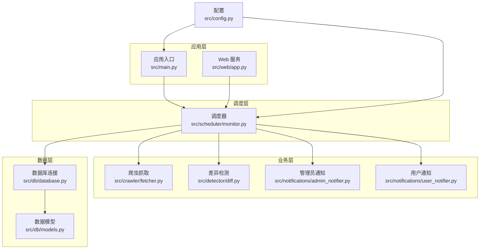
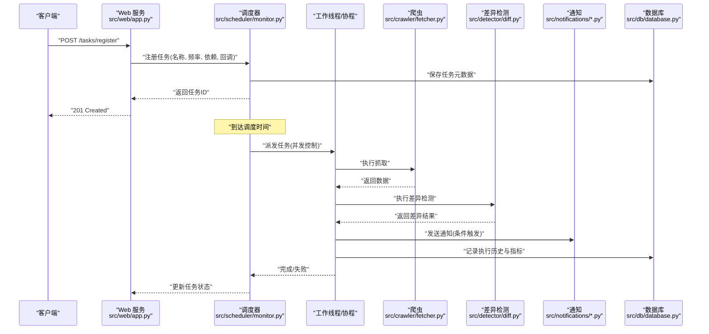
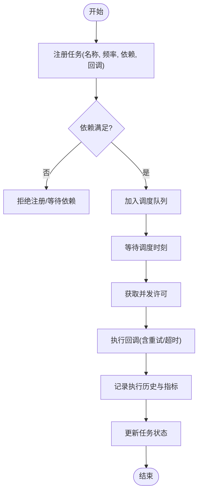
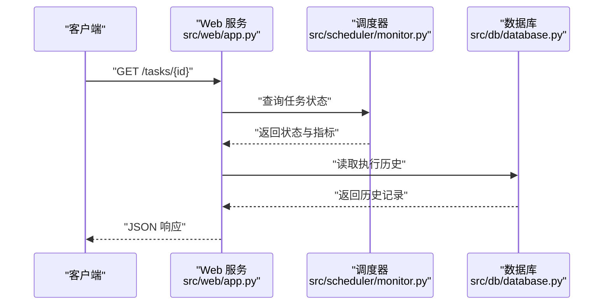
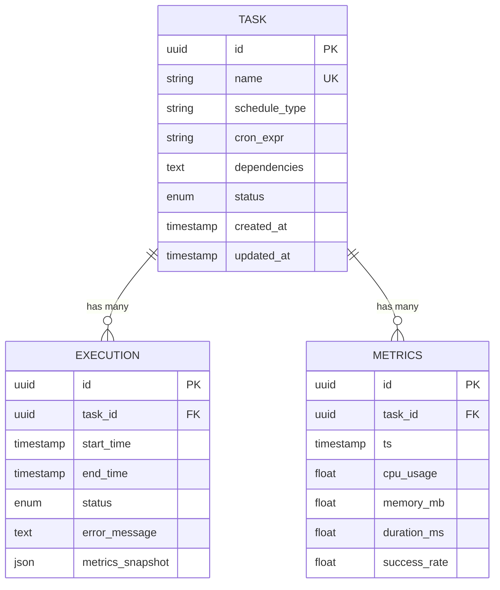
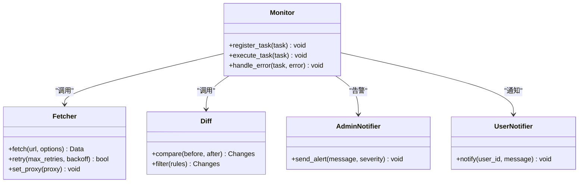
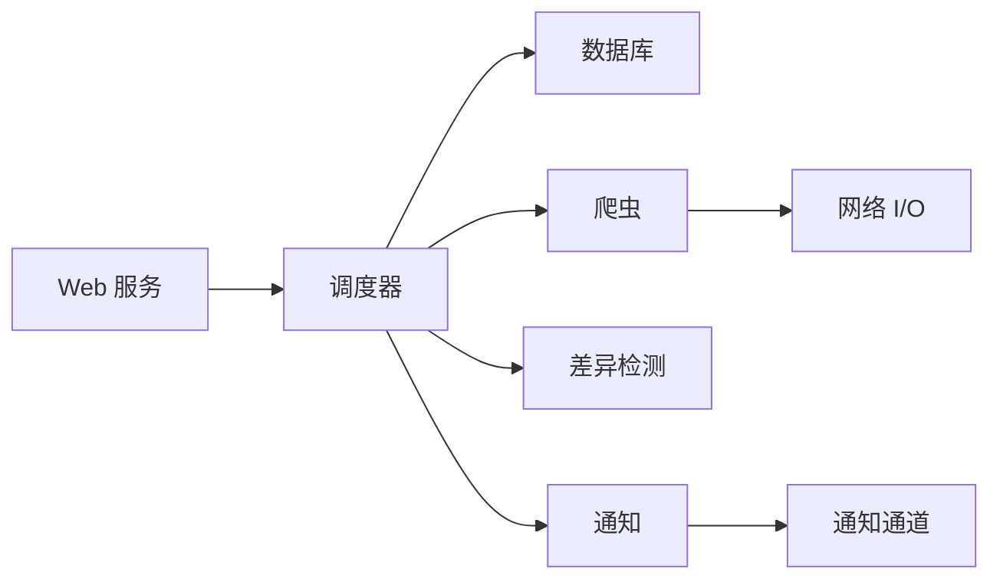

# 任务调度器

<cite>
**本文引用的文件**   
- [src/scheduler/monitor.py](file://src/scheduler/monitor.py)
- [src/main.py](file://src/main.py)
- [src/config.py](file://src/config.py)
- [src/web/app.py](file://src/web/app.py)
- [src/db/database.py](file://src/db/database.py)
- [src/db/models.py](file://src/db/models.py)
- [src/crawler/fetcher.py](file://src/crawler/fetcher.py)
- [src/detector/diff.py](file://src/detector/diff.py)
- [src/notifications/admin_notifier.py](file://src/notifications/admin_notifier.py)
- [src/notifications/user_notifier.py](file://src/notifications/user_notifier.py)
- [README.md](file://README.md)
</cite>

## 目录
1. [简介](#简介)
2. [项目结构](#项目结构)
3. [核心组件](#核心组件)
4. [架构总览](#架构总览)
5. [详细组件分析](#详细组件分析)
6. [依赖关系分析](#依赖关系分析)
7. [性能考虑](#性能考虑)
8. [故障排查指南](#故障排查指南)
9. [结论](#结论)
10. [附录](#附录)

## 简介
本文件为“任务调度器”的综合文档，聚焦定时任务的创建、管理与执行机制。内容涵盖：
- 任务调度策略与并发控制
- 资源管理与错误处理、恢复机制
- 监控任务注册、执行频率配置与状态管理
- 任务依赖关系建模与编排
- 监控、日志记录与性能分析工具使用
- 扩展新任务类型与优化调度性能

## 项目结构
本项目采用分层与按功能域组织的方式，关键目录与职责如下：
- src/scheduler：调度器核心（任务定义、调度策略、生命周期管理）
- src/web：Web 接口（任务注册、查询、启停等）
- src/db：数据持久化（模型、仓库、数据库连接）
- src/crawler：数据采集（抓取、解析、代理）
- src/detector：差异检测（变更发现）
- src/notifications：通知（管理员与用户通知）
- src/config：全局配置（调度参数、线程池大小、重试策略等）
- src/main：应用启动入口（初始化、装配、启动调度器）

图表来源
- [src/main.py](file://src/main.py)
- [src/scheduler/monitor.py](file://src/scheduler/monitor.py)
- [src/web/app.py](file://src/web/app.py)
- [src/config.py](file://src/config.py)
- [src/db/database.py](file://src/db/database.py)
- [src/db/models.py](file://src/db/models.py)
- [src/crawler/fetcher.py](file://src/crawler/fetcher.py)
- [src/detector/diff.py](file://src/detector/diff.py)
- [src/notifications/admin_notifier.py](file://src/notifications/admin_notifier.py)
- [src/notifications/user_notifier.py](file://src/notifications/user_notifier.py)

章节来源
- [README.md](file://README.md)

## 核心组件
- 调度器（Scheduler）
  - 负责任务注册、调度策略选择（固定间隔/Cron）、并发控制（线程池/信号量）、任务生命周期管理（创建、运行、暂停、停止、重启）。
  - 提供任务状态跟踪、指标采集与告警触发。
- Web 接口（API）
  - 暴露任务注册、查询、启停、重跑、查看日志与指标的 HTTP 端点。
- 数据层（DB）
  - 维护任务元数据、执行历史、指标快照与告警事件。
- 业务组件
  - 爬虫抓取、差异检测、通知模块作为可被调度的任务或子任务。
- 配置（Config）
  - 集中管理调度器参数（线程池大小、最大并发、重试次数、退避策略、Cron 表达式、超时等）。

章节来源
- [src/scheduler/monitor.py](file://src/scheduler/monitor.py)
- [src/web/app.py](file://src/web/app.py)
- [src/db/database.py](file://src/db/database.py)
- [src/db/models.py](file://src/db/models.py)
- [src/config.py](file://src/config.py)

## 架构总览
调度器位于应用中心位置，协调 Web 接口、数据层与业务组件。任务以“可调用单元”形式存在，支持同步/异步执行；调度器通过线程池或协程池进行并发控制，并通过数据库持久化执行结果与状态。

图表来源
- [src/web/app.py](file://src/web/app.py)
- [src/scheduler/monitor.py](file://src/scheduler/monitor.py)
- [src/crawler/fetcher.py](file://src/crawler/fetcher.py)
- [src/detector/diff.py](file://src/detector/diff.py)
- [src/notifications/admin_notifier.py](file://src/notifications/admin_notifier.py)
- [src/notifications/user_notifier.py](file://src/notifications/user_notifier.py)
- [src/db/database.py](file://src/db/database.py)

## 详细组件分析

### 调度器（Monitor）
- 功能要点
  - 任务注册：支持名称、频率（间隔/Cron）、依赖列表、回调函数、超时、重试策略。
  - 调度策略：固定间隔与 Cron 表达式两种模式；支持延迟启动与优雅关闭。
  - 并发控制：线程池/协程池 + 信号量限制最大并发；支持队列背压。
  - 生命周期：创建、运行、暂停、停止、重启；支持热更新。
  - 状态与指标：记录运行状态、最近执行时间、成功率、平均耗时、错误率。
  - 错误处理：捕获异常、分类错误码、指数退避重试、死信队列。
  - 依赖编排：DAG 式依赖检查，前置任务成功才执行当前任务。
- 关键流程
  - 任务注册 -> 校验依赖 -> 加入调度队列 -> 到点触发 -> 并发许可获取 -> 执行回调 -> 记录结果 -> 更新状态与指标。

图表来源
- [src/scheduler/monitor.py](file://src/scheduler/monitor.py)

章节来源
- [src/scheduler/monitor.py](file://src/scheduler/monitor.py)

### Web 接口（App）
- 功能要点
  - 任务注册/查询/启停/重跑
  - 查看任务状态、执行历史、指标与日志
  - 健康检查与系统信息
- 典型端点
  - POST /tasks/register：注册新任务
  - GET /tasks/{id}：查询任务详情
  - POST /tasks/{id}/start | stop | restart：控制任务生命周期
  - GET /tasks/{id}/history：获取执行历史
  - GET /metrics：导出指标
  - GET /health：健康检查

图表来源
- [src/web/app.py](file://src/web/app.py)
- [src/scheduler/monitor.py](file://src/scheduler/monitor.py)
- [src/db/database.py](file://src/db/database.py)

章节来源
- [src/web/app.py](file://src/web/app.py)

### 数据模型与持久化（Models & Database）
- 模型设计
  - 任务表：ID、名称、频率、依赖、状态、创建/更新时间
  - 执行历史表：任务ID、开始/结束时间、状态、错误信息、指标快照
  - 指标表：任务ID、时间戳、CPU/内存/耗时/成功率等
- 访问层
  - 连接管理、事务封装、分页查询、索引优化

图表来源
- [src/db/models.py](file://src/db/models.py)
- [src/db/database.py](file://src/db/database.py)

章节来源
- [src/db/models.py](file://src/db/models.py)
- [src/db/database.py](file://src/db/database.py)

### 业务组件（Crawler、Detector、Notifications）
- 爬虫抓取（Fetcher）
  - 负责从目标源拉取数据，支持代理、重试、限流、超时。
- 差异检测（Diff）
  - 对数据进行比对，输出新增/删除/修改项，供后续动作消费。
- 通知（Admin/User Notifier）
  - 根据规则向管理员或用户发送通知（邮件/消息队列/HTTP）。

图表来源
- [src/crawler/fetcher.py](file://src/crawler/fetcher.py)
- [src/detector/diff.py](file://src/detector/diff.py)
- [src/notifications/admin_notifier.py](file://src/notifications/admin_notifier.py)
- [src/notifications/user_notifier.py](file://src/notifications/user_notifier.py)
- [src/scheduler/monitor.py](file://src/scheduler/monitor.py)

章节来源
- [src/crawler/fetcher.py](file://src/crawler/fetcher.py)
- [src/detector/diff.py](file://src/detector/diff.py)
- [src/notifications/admin_notifier.py](file://src/notifications/admin_notifier.py)
- [src/notifications/user_notifier.py](file://src/notifications/user_notifier.py)

### 配置（Config）
- 关键配置项
  - 调度器：线程池大小、最大并发、默认超时、重试次数、退避策略、Cron 表达式
  - 数据库：连接串、连接池大小、超时
  - 爬虫：代理、超时、重试、限流
  - 通知：渠道、模板、阈值
- 作用范围
  - 应用启动时加载，注入到调度器与各业务组件

章节来源
- [src/config.py](file://src/config.py)

## 依赖关系分析
- 组件耦合
  - 调度器与 Web 接口松耦合（通过 API），与数据层通过仓库抽象，与业务组件通过接口调用。
- 外部依赖
  - 数据库、网络 I/O（爬虫）、通知通道（邮件/消息队列）。
- 潜在循环依赖
  - 避免调度器直接依赖具体业务实现，应通过接口或工厂模式解耦。

图表来源
- [src/web/app.py](file://src/web/app.py)
- [src/scheduler/monitor.py](file://src/scheduler/monitor.py)
- [src/db/database.py](file://src/db/database.py)
- [src/crawler/fetcher.py](file://src/crawler/fetcher.py)
- [src/detector/diff.py](file://src/detector/diff.py)
- [src/notifications/admin_notifier.py](file://src/notifications/admin_notifier.py)
- [src/notifications/user_notifier.py](file://src/notifications/user_notifier.py)

章节来源
- [src/web/app.py](file://src/web/app.py)
- [src/scheduler/monitor.py](file://src/scheduler/monitor.py)
- [src/db/database.py](file://src/db/database.py)
- [src/crawler/fetcher.py](file://src/crawler/fetcher.py)
- [src/detector/diff.py](file://src/detector/diff.py)
- [src/notifications/admin_notifier.py](file://src/notifications/admin_notifier.py)
- [src/notifications/user_notifier.py](file://src/notifications/user_notifier.py)

## 性能考虑
- 并发控制
  - 合理设置线程池/协程池大小，结合 IO 密集型与 CPU 密集型任务特性调整。
  - 使用信号量限制热点任务并发，避免雪崩。
- 调度策略
  - 高频任务使用固定间隔，低频任务使用 Cron；避免过多短周期任务导致抖动。
- 资源管理
  - 数据库连接池、网络请求超时、重试退避、缓存热点数据。
- 指标与观测
  - 采集任务耗时、成功率、错误率、队列长度、线程池利用率；基于指标动态扩缩容。
- 存储优化
  - 执行历史分表/分区，指标定期聚合归档，减少查询压力。

[本节为通用指导，不直接分析具体文件]

## 故障排查指南
- 常见问题
  - 任务未执行：检查调度时间、依赖是否满足、并发许可是否耗尽。
  - 执行失败：查看错误信息与堆栈，确认重试与退避策略是否生效。
  - 性能退化：观察指标（CPU/内存/耗时/错误率），定位瓶颈（IO 阻塞、锁竞争、慢查询）。
- 诊断步骤
  - 通过 Web 接口查询任务状态与执行历史
  - 查看数据库中的错误信息与指标快照
  - 启用更详细的日志级别，定位异常路径
- 恢复策略
  - 自动重试与指数退避
  - 手动重跑失败任务
  - 降级与熔断（通知告警、跳过非关键步骤）

章节来源
- [src/scheduler/monitor.py](file://src/scheduler/monitor.py)
- [src/web/app.py](file://src/web/app.py)
- [src/db/database.py](file://src/db/database.py)

## 结论
本调度器提供了完整的定时任务管理能力，覆盖注册、调度、并发控制、状态跟踪、错误处理与恢复、指标监控与告警。通过模块化设计与清晰的依赖关系，便于扩展新的任务类型与优化调度性能。建议在生产环境中结合指标与日志持续优化，确保稳定性与可扩展性。

[本节为总结，不直接分析具体文件]

## 附录

### 如何注册监控任务（示例说明）
- 步骤
  - 准备回调函数（抓取+检测+通知）
  - 通过 Web 接口提交任务注册请求（名称、频率、依赖、回调标识）
  - 调度器校验并持久化任务元数据
  - 到达调度时间后自动执行
- 参考路径
  - 任务注册端点：[src/web/app.py](file://src/web/app.py)
  - 调度器注册逻辑：[src/scheduler/monitor.py](file://src/scheduler/monitor.py)
  - 任务模型与持久化：[src/db/models.py](file://src/db/models.py), [src/db/database.py](file://src/db/database.py)

章节来源
- [src/web/app.py](file://src/web/app.py)
- [src/scheduler/monitor.py](file://src/scheduler/monitor.py)
- [src/db/models.py](file://src/db/models.py)
- [src/db/database.py](file://src/db/database.py)

### 配置执行频率（示例说明）
- 支持固定间隔与 Cron 表达式
- 在配置文件中设置默认频率，或在注册任务时覆盖
- 参考路径
  - 配置项：[src/config.py](file://src/config.py)
  - 调度器解析与执行：[src/scheduler/monitor.py](file://src/scheduler/monitor.py)

章节来源
- [src/config.py](file://src/config.py)
- [src/scheduler/monitor.py](file://src/scheduler/monitor.py)

### 处理任务状态（示例说明）
- 状态包括：待执行、运行中、成功、失败、暂停、停止
- 通过 Web 接口查询与更新状态
- 参考路径
  - 状态枚举与持久化：[src/db/models.py](file://src/db/models.py)
  - 状态流转与更新：[src/scheduler/monitor.py](file://src/scheduler/monitor.py)
  - 查询接口：[src/web/app.py](file://src/web/app.py)

章节来源
- [src/db/models.py](file://src/db/models.py)
- [src/scheduler/monitor.py](file://src/scheduler/monitor.py)
- [src/web/app.py](file://src/web/app.py)

### 任务依赖关系与编排（示例说明）
- 支持 DAG 依赖，前置任务成功才执行当前任务
- 依赖冲突检测与循环依赖检测
- 参考路径
  - 依赖解析与校验：[src/scheduler/monitor.py](file://src/scheduler/monitor.py)
  - 任务模型字段：[src/db/models.py](file://src/db/models.py)

章节来源
- [src/scheduler/monitor.py](file://src/scheduler/monitor.py)
- [src/db/models.py](file://src/db/models.py)

### 错误处理与恢复机制（示例说明）
- 捕获异常、分类错误码、指数退避重试
- 失败任务进入死信队列，支持人工干预重跑
- 参考路径
  - 错误处理与重试：[src/scheduler/monitor.py](file://src/scheduler/monitor.py)
  - 执行历史与指标记录：[src/db/database.py](file://src/db/database.py)

章节来源
- [src/scheduler/monitor.py](file://src/scheduler/monitor.py)
- [src/db/database.py](file://src/db/database.py)

### 任务监控、日志与性能分析（示例说明）
- 监控指标：耗时、成功率、错误率、队列长度、线程池利用率
- 日志记录：结构化日志，包含任务 ID、阶段、错误信息
- 性能分析：基于指标与采样日志定位瓶颈
- 参考路径
  - 指标采集与导出：[src/scheduler/monitor.py](file://src/scheduler/monitor.py)
  - 日志记录：各业务组件（爬虫、检测、通知）
  - 查询接口：[src/web/app.py](file://src/web/app.py)

章节来源
- [src/scheduler/monitor.py](file://src/scheduler/monitor.py)
- [src/web/app.py](file://src/web/app.py)
- [src/crawler/fetcher.py](file://src/crawler/fetcher.py)
- [src/detector/diff.py](file://src/detector/diff.py)
- [src/notifications/admin_notifier.py](file://src/notifications/admin_notifier.py)
- [src/notifications/user_notifier.py](file://src/notifications/user_notifier.py)

### 扩展新任务类型（示例说明）
- 步骤
  - 定义新任务回调（实现统一接口）
  - 注册任务（名称、频率、依赖、回调）
  - 配置重试与超时策略
  - 接入指标与日志
- 参考路径
  - 任务回调接口约定：[src/scheduler/monitor.py](file://src/scheduler/monitor.py)
  - 注册接口：[src/web/app.py](file://src/web/app.py)
  - 模型与持久化：[src/db/models.py](file://src/db/models.py)

章节来源
- [src/scheduler/monitor.py](file://src/scheduler/monitor.py)
- [src/web/app.py](file://src/web/app.py)
- [src/db/models.py](file://src/db/models.py)

### 优化调度性能（示例说明）
- 调整并发与线程池大小
- 使用 Cron 替代高频固定间隔
- 缓存热点数据，减少重复计算
- 数据库索引优化与查询分页
- 参考路径
  - 调度器参数：[src/config.py](file://src/config.py)
  - 调度执行与并发控制：[src/scheduler/monitor.py](file://src/scheduler/monitor.py)
  - 数据访问优化：[src/db/database.py](file://src/db/database.py)

章节来源
- [src/config.py](file://src/config.py)
- [src/scheduler/monitor.py](file://src/scheduler/monitor.py)
- [src/db/database.py](file://src/db/database.py)