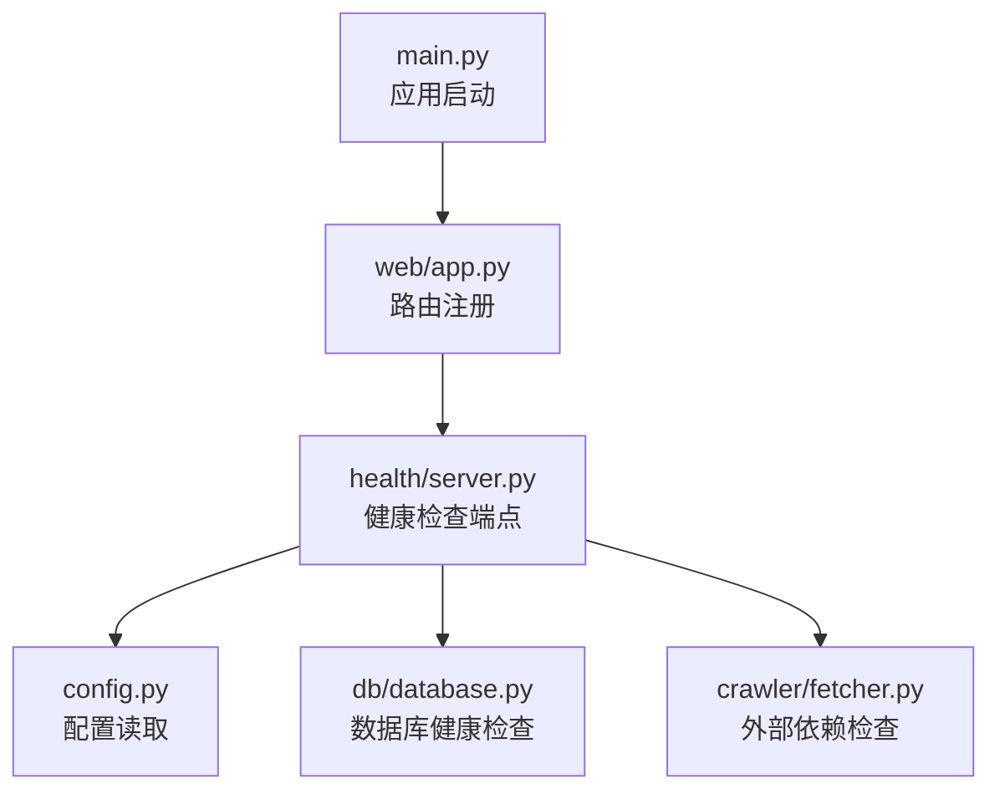
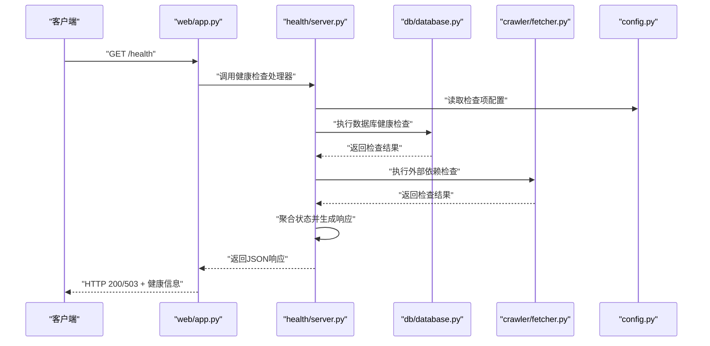
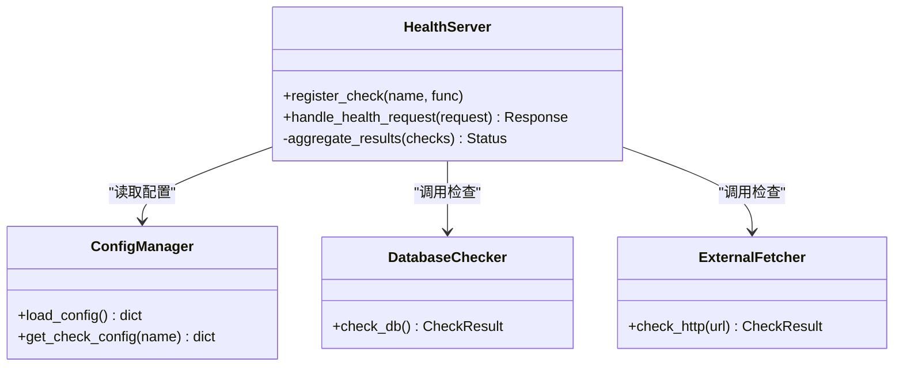

# 健康检查服务

<cite>
**本文引用的文件**   
- [src/health/server.py](file://src/health/server.py)
- [src/main.py](file://src/main.py)
- [src/config.py](file://src/config.py)
- [src/web/app.py](file://src/web/app.py)
- [src/db/database.py](file://src/db/database.py)
- [src/crawler/fetcher.py](file://src/crawler/fetcher.py)
- [README.md](file://README.md)
</cite>

## 目录
1. [简介](#简介)
2. [项目结构](#项目结构)
3. [核心组件](#核心组件)
4. [架构总览](#架构总览)
5. [详细组件分析](#详细组件分析)
6. [依赖关系分析](#依赖关系分析)
7. [性能考虑](#性能考虑)
8. [故障排查指南](#故障排查指南)
9. [结论](#结论)
10. [附录](#附录)

## 简介
本文件为健康检查服务的完整技术文档，聚焦于健康检查端点的设计与实现原理，涵盖检查项配置、状态判断逻辑与响应格式。同时提供如何添加自定义健康检查项、集成外部依赖检查以及实现分级健康状态的实践指南。文档还包含监控集成、告警配置、负载均衡与服务发现集成的建议方案，帮助读者在生产环境中稳定部署与健康检查服务。

## 项目结构
健康检查功能位于 src/health/server.py，Web 应用入口在 src/web/app.py，主进程启动在 src/main.py，配置集中在 src/config.py。数据库连接与爬虫抓取分别由 src/db/database.py 与 src/crawler/fetcher.py 提供能力支撑。整体采用模块化设计，健康检查作为独立模块通过 Web 层暴露 HTTP 接口。

图表来源
- [src/main.py](file://src/main.py)
- [src/web/app.py](file://src/web/app.py)
- [src/health/server.py](file://src/health/server.py)
- [src/config.py](file://src/config.py)
- [src/db/database.py](file://src/db/database.py)
- [src/crawler/fetcher.py](file://src/crawler/fetcher.py)

章节来源
- [src/health/server.py](file://src/health/server.py)
- [src/web/app.py](file://src/web/app.py)
- [src/main.py](file://src/main.py)
- [src/config.py](file://src/config.py)

## 核心组件
- 健康检查服务器：提供 HTTP 端点，聚合多项健康检查并返回统一响应。
- 检查项注册器：用于声明式注册健康检查项（如数据库、外部依赖）。
- 状态聚合器：根据各检查项结果计算整体健康状态（支持分级：healthy/degraded/unhealthy）。
- 配置管理：从配置文件加载检查项开关、超时、阈值等参数。
- 外部依赖检查：封装数据库连通性、HTTP 可达性等探测逻辑。

章节来源
- [src/health/server.py](file://src/health/server.py)
- [src/config.py](file://src/config.py)
- [src/db/database.py](file://src/db/database.py)
- [src/crawler/fetcher.py](file://src/crawler/fetcher.py)

## 架构总览
健康检查服务通过 Web 层暴露 /health 或 /healthz 端点，客户端请求进入后由健康检查服务器解析请求、触发各项检查、聚合结果并返回标准 JSON 响应。检查项可包括内部组件（数据库）与外部依赖（HTTP 服务），所有检查均受配置控制，支持超时与重试策略。

图表来源
- [src/web/app.py](file://src/web/app.py)
- [src/health/server.py](file://src/health/server.py)
- [src/db/database.py](file://src/db/database.py)
- [src/crawler/fetcher.py](file://src/crawler/fetcher.py)
- [src/config.py](file://src/config.py)

## 详细组件分析

### 健康检查端点设计与实现
- 端点路径：通常为 /health 或 /healthz，便于负载均衡器与服务网格识别。
- 请求处理流程：
  - 解析请求参数（可选：是否包含详细信息、指定检查项）。
  - 读取配置，筛选启用的检查项。
  - 并行执行检查项，收集结果。
  - 基于规则计算整体状态（healthy/degraded/unhealthy）。
  - 构造标准 JSON 响应，包含状态码、时间戳、检查项明细。
- 错误处理：
  - 单个检查项失败不影响其他检查项。
  - 异常被捕获并记录日志，标记对应检查项为 unhealthy。
  - 超时与重试策略由配置控制。

章节来源
- [src/health/server.py](file://src/health/server.py)
- [src/config.py](file://src/config.py)

### 检查项配置
- 配置项示例：
  - 检查项开关：启用/禁用某项检查。
  - 超时设置：每项检查的最大等待时间。
  - 阈值与权重：影响整体状态计算的权重与阈值。
  - 重试策略：失败后的重试次数与间隔。
- 配置来源：
  - 环境变量、配置文件、运行时注入。
- 动态更新：
  - 支持热重载配置，无需重启服务。

章节来源
- [src/config.py](file://src/config.py)

### 状态判断逻辑
- 单项状态：ok、warning、error。
- 整体状态：
  - healthy：所有关键检查项 ok。
  - degraded：部分非关键检查项 warning 或 error。
  - unhealthy：关键检查项 error。
- 计算规则：
  - 加权评分或优先级判定。
  - 支持按环境（开发/测试/生产）差异化策略。

章节来源
- [src/health/server.py](file://src/health/server.py)

### 响应格式
- 标准 JSON 结构：
  - status：整体状态（healthy/degraded/unhealthy）。
  - timestamp：检查时间。
  - checks：检查项列表，每项包含 name、status、message、latency。
  - metadata：扩展信息（版本、实例ID等）。
- HTTP 状态码：
  - 200：healthy。
  - 503：degraded/unhealthy。

章节来源
- [src/health/server.py](file://src/health/server.py)

### 自定义健康检查项
- 步骤：
  - 定义检查函数：接收配置，返回检查结果（状态、消息、耗时）。
  - 注册检查项：添加到检查项注册表。
  - 配置开关与超时：在配置文件中启用并设置参数。
- 示例场景：
  - 缓存服务连通性检查。
  - 第三方 API 可用性检查。
  - 磁盘空间与内存使用率检查。

章节来源
- [src/health/server.py](file://src/health/server.py)
- [src/config.py](file://src/config.py)

### 外部依赖检查
- 数据库检查：
  - 尝试建立连接或执行简单查询。
  - 捕获异常并记录错误原因。
- HTTP 检查：
  - 发起 HEAD 或 GET 请求到目标服务。
  - 验证响应状态码与延迟。
- 重试与超时：
  - 配置重试次数与超时时间，避免雪崩。

章节来源
- [src/db/database.py](file://src/db/database.py)
- [src/crawler/fetcher.py](file://src/crawler/fetcher.py)

### 分级健康状态实现
- 分级策略：
  - 关键检查项（数据库、核心服务）：error 直接导致 unhealthy。
  - 非关键检查项（日志服务、监控代理）：warning 允许 degraded。
- 权重配置：
  - 为不同检查项分配权重，影响整体状态计算。
- 环境差异：
  - 开发环境放宽限制，生产环境严格判定。

章节来源
- [src/health/server.py](file://src/health/server.py)
- [src/config.py](file://src/config.py)

## 依赖关系分析
健康检查服务依赖以下模块：
- Web 层：路由与请求处理。
- 配置模块：加载与校验配置。
- 数据库模块：提供数据库健康检查能力。
- 爬虫模块：提供外部 HTTP 依赖检查能力。

图表来源
- [src/health/server.py](file://src/health/server.py)
- [src/config.py](file://src/config.py)
- [src/db/database.py](file://src/db/database.py)
- [src/crawler/fetcher.py](file://src/crawler/fetcher.py)

章节来源
- [src/health/server.py](file://src/health/server.py)
- [src/config.py](file://src/config.py)
- [src/db/database.py](file://src/db/database.py)
- [src/crawler/fetcher.py](file://src/crawler/fetcher.py)

## 性能考虑
- 并发检查：
  - 使用异步或线程池并行执行检查项，降低端到端延迟。
- 超时控制：
  - 为每项检查设置合理超时，避免阻塞。
- 缓存结果：
  - 对频繁调用的检查项进行短期缓存，减少重复开销。
- 资源限制：
  - 限制并发检查数量，防止资源耗尽。
- 监控指标：
  - 暴露检查耗时、成功率、失败原因等指标供监控系统采集。

[本节为通用指导，不直接分析具体文件]

## 故障排查指南
- 常见问题：
  - 检查项超时：检查网络连通性与目标服务状态。
  - 数据库连接失败：验证凭据、端口与防火墙规则。
  - 外部依赖不可达：确认域名解析与 HTTPS 证书有效性。
- 诊断方法：
  - 查看健康检查日志，定位失败检查项。
  - 启用详细模式，获取检查项的 message 字段。
  - 使用 curl 或浏览器访问 /health 端点，观察响应内容。
- 恢复步骤：
  - 重启相关依赖服务。
  - 调整配置中的超时与重试参数。
  - 临时禁用非关键检查项以快速恢复服务。

章节来源
- [src/health/server.py](file://src/health/server.py)
- [src/db/database.py](file://src/db/database.py)
- [src/crawler/fetcher.py](file://src/crawler/fetcher.py)

## 结论
健康检查服务通过模块化设计与标准化响应格式，提供了灵活、可扩展的健康检查能力。通过合理的配置与状态判断逻辑，能够准确反映系统健康状况，并为监控与告警提供可靠数据源。在生产环境中，建议结合负载均衡与服务发现机制，实现高可用与健康检查的无缝集成。

[本节为总结性内容，不直接分析具体文件]

## 附录

### 监控集成
- 指标暴露：
  - 将健康检查的指标（如状态、耗时、失败率）导出为 Prometheus 格式。
- 告警规则：
  - 当整体状态为 unhealthy 时触发告警。
  - 针对关键检查项失败设置高优先级告警。
- 可视化面板：
  - 展示健康状态趋势与检查项详情。

章节来源
- [src/health/server.py](file://src/health/server.py)

### 负载均衡配置
- 健康检查端点：
  - 在负载均衡器中配置 /health 或 /healthz 作为健康检查路径。
- 超时与重试：
  - 设置合理的健康检查间隔、超时与重试次数。
- 流量切换：
  - 当健康检查失败时，自动摘除后端实例。

章节来源
- [src/web/app.py](file://src/web/app.py)

### 服务发现集成
- 注册健康检查：
  - 在服务启动时向服务发现中心注册实例信息与健康检查端点。
- 动态更新：
  - 健康状态变化时，及时更新服务发现中的实例状态。
- 多环境支持：
  - 区分开发、测试、生产环境的注册策略。

章节来源
- [src/main.py](file://src/main.py)
- [src/health/server.py](file://src/health/server.py)

### 参考文档
- README.md 提供项目概述与使用说明，可作为健康检查服务的补充参考。

章节来源
- [README.md](file://README.md)