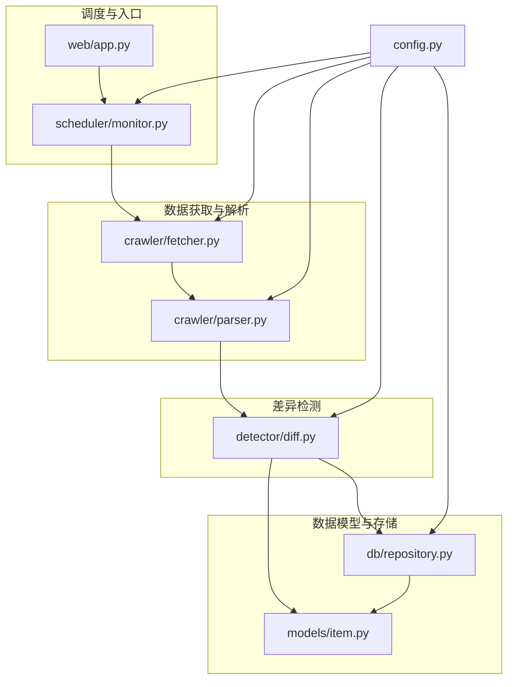
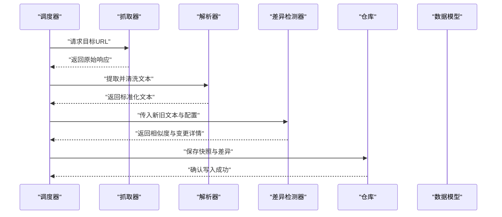
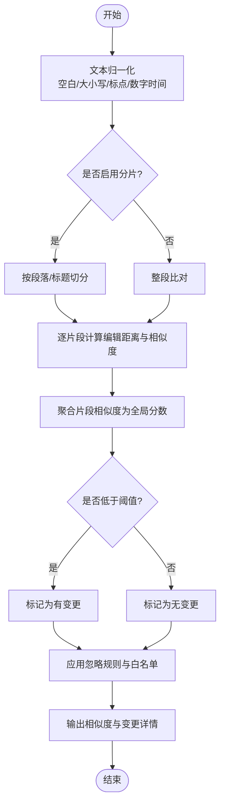
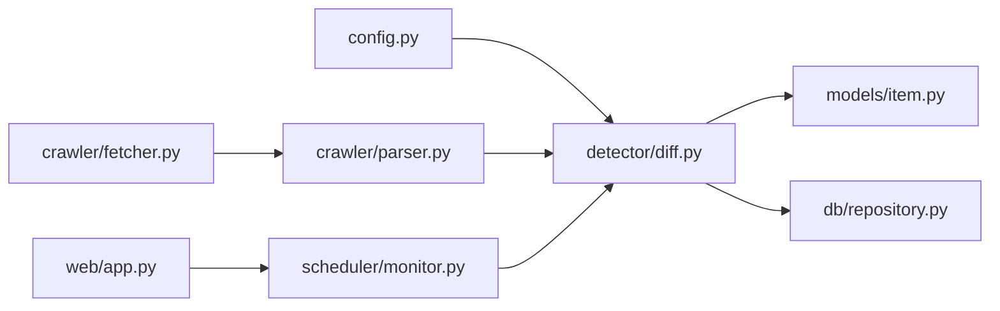

# 内容差异检测

<cite>
**本文引用的文件**   
- [src/detector/diff.py](file://src/detector/diff.py)
- [tests/test_diff.py](file://tests/test_diff.py)
- [src/config.py](file://src/config.py)
- [src/crawler/fetcher.py](file://src/crawler/fetcher.py)
- [src/crawler/parser.py](file://src/crawler/parser.py)
- [src/models/item.py](file://src/models/item.py)
- [src/db/repository.py](file://src/db/repository.py)
- [src/scheduler/monitor.py](file://src/scheduler/monitor.py)
- [src/web/app.py](file://src/web/app.py)
- [README.md](file://README.md)
</cite>

## 目录
1. [简介](#简介)
2. [项目结构](#项目结构)
3. [核心组件](#核心组件)
4. [架构总览](#架构总览)
5. [详细组件分析](#详细组件分析)
6. [依赖关系分析](#依赖关系分析)
7. [性能考量](#性能考量)
8. [故障排查指南](#故障排查指南)
9. [结论](#结论)
10. [附录](#附录)

## 简介
本文件为“内容差异检测模块”的综合文档，聚焦于文本比较策略、相似度计算与变更识别逻辑，并给出阈值配置、忽略规则与白名单设置方法。同时提供网页内容比较示例、特殊字符与编码处理建议，以及性能特点、内存占用和扩展性说明。最后包含自定义检测算法的集成方式与调试技巧，帮助读者快速上手并高效优化。

## 项目结构
差异检测位于 detector 模块中，并与爬虫抓取、解析、调度、存储及 Web 界面等子系统协作。整体流程大致为：调度器触发任务 -> 抓取网页 -> 解析文本 -> 执行差异检测 -> 持久化结果 -> 通知与展示。

图表来源
- [src/scheduler/monitor.py](file://src/scheduler/monitor.py)
- [src/web/app.py](file://src/web/app.py)
- [src/crawler/fetcher.py](file://src/crawler/fetcher.py)
- [src/crawler/parser.py](file://src/crawler/parser.py)
- [src/detector/diff.py](file://src/detector/diff.py)
- [src/models/item.py](file://src/models/item.py)
- [src/db/repository.py](file://src/db/repository.py)
- [src/config.py](file://src/config.py)

章节来源
- [README.md](file://README.md)

## 核心组件
- 差异检测器（diff）：实现文本比较、相似度计算、变更识别、阈值判定、忽略规则与白名单过滤。
- 抓取器（fetcher）：负责从目标 URL 获取原始响应，处理网络异常与重试。
- 解析器（parser）：将 HTML/富文本转换为纯文本或结构化片段，便于稳定比较。
- 调度器（monitor）：周期性触发监控任务，协调各阶段执行。
- 数据模型（item）：定义监控项、历史快照与差异记录的数据结构。
- 仓库（repository）：持久化监控项、快照与差异结果。
- 配置（config）：集中管理阈值、忽略规则、白名单、超时、并发等参数。

章节来源
- [src/detector/diff.py](file://src/detector/diff.py)
- [src/crawler/fetcher.py](file://src/crawler/fetcher.py)
- [src/crawler/parser.py](file://src/crawler/parser.py)
- [src/scheduler/monitor.py](file://src/scheduler/monitor.py)
- [src/models/item.py](file://src/models/item.py)
- [src/db/repository.py](file://src/db/repository.py)
- [src/config.py](file://src/config.py)

## 架构总览
差异检测在“抓取-解析-检测-存储”流水线中处于关键位置。其输入为标准化后的文本片段，输出为相似度分数与变更详情；上游需保证文本规范化以降低噪声，下游需根据阈值与规则决定是否上报。

图表来源
- [src/scheduler/monitor.py](file://src/scheduler/monitor.py)
- [src/crawler/fetcher.py](file://src/crawler/fetcher.py)
- [src/crawler/parser.py](file://src/crawler/parser.py)
- [src/detector/diff.py](file://src/detector/diff.py)
- [src/db/repository.py](file://src/db/repository.py)
- [src/models/item.py](file://src/models/item.py)

## 详细组件分析

### 差异检测器（diff）
- 文本比较策略
  - 行级/词级对齐：通过序列比对（如基于编辑距离的动态规划）生成最小编辑操作序列，用于定位新增、删除、修改区域。
  - 语义归一化：在比对前进行空白折叠、大小写统一、标点规范化、数字/时间格式化等，降低无关波动对相似度的影响。
- 相似度计算
  - 基于编辑距离的相似度：以归一化的编辑距离计算相似度分数，值域通常映射到[0,1]，越接近1表示越相似。
  - 可选加权策略：对重要段落或关键词赋予更高权重，提升关键变更的敏感度。
- 变更识别逻辑
  - 分段扫描：将长文本切分为稳定片段（如按标题/段落边界），分别计算相似度，再聚合得到全局相似度。
  - 阈值判定：当相似度低于阈值时标记为“有变更”，否则视为“无变更”。
  - 忽略规则与白名单：支持正则或路径匹配忽略不相关变化（如广告、时间戳、随机ID），白名单则强制保留某些片段参与比较。
- 配置项
  - 相似度阈值：控制变更敏感度。
  - 忽略规则：正则表达式列表或规则对象，用于过滤噪声。
  - 白名单：必须纳入比较的关键片段标识。
  - 归一化开关：是否启用空白折叠、大小写统一、标点清理等。
  - 最大文本长度与分片大小：限制内存与CPU开销。
- 复杂度与性能
  - 时间复杂度：主要受文本长度与分片数量影响，典型为 O(n·m) 或近似线性（分片后）。
  - 空间复杂度：动态规划矩阵或缓存表占用与文本规模成正比，可通过分片与增量对比降低峰值内存。
- 错误处理
  - 空输入/超长输入保护：提前截断或拒绝处理。
  - 编码异常：统一转码为 UTF-8，失败时回退至近似解码或报错提示。
  - 正则编译失败：捕获并降级为宽松匹配。

图表来源
- [src/detector/diff.py](file://src/detector/diff.py)

章节来源
- [src/detector/diff.py](file://src/detector/diff.py)
- [tests/test_diff.py](file://tests/test_diff.py)

### 抓取器（fetcher）
- 功能要点
  - HTTP 请求封装：支持 GET/POST、超时、重试、代理、UA 伪装。
  - 响应处理：自动解码、压缩处理、错误状态码重试。
  - 安全与稳定性：连接池、限流、熔断与日志记录。
- 与差异检测的关系
  - 提供原始响应，供解析器抽取文本；若响应过大，应在抓取层做裁剪以减少后续内存压力。

章节来源
- [src/crawler/fetcher.py](file://src/crawler/fetcher.py)

### 解析器（parser）
- 功能要点
  - HTML 到文本：去除脚本/样式、清理标签、保留必要结构（标题、段落、表格）。
  - 文本清洗：去重、排序稳定化、移除动态元素（时间戳、随机 ID）。
  - 结构化输出：返回可比较的文本块或键值对，便于 diff 分片比对。
- 与差异检测的关系
  - 高质量的结构化文本能显著提升相似度计算的准确性与鲁棒性。

章节来源
- [src/crawler/parser.py](file://src/crawler/parser.py)

### 调度器（monitor）
- 功能要点
  - 任务编排：定时触发抓取、解析、检测、存储与通知。
  - 配置注入：将阈值、忽略规则、白名单等参数传递给各组件。
  - 容错与重试：对失败任务进行指数退避重试与告警。
- 与差异检测的关系
  - 作为调用方，组织数据流并决定何时触发差异检测。

章节来源
- [src/scheduler/monitor.py](file://src/scheduler/monitor.py)

### 数据模型（item）
- 字段设计
  - 监控项：URL、名称、规则、阈值、忽略规则、白名单、状态。
  - 快照：时间戳、文本摘要、哈希、来源。
  - 差异记录：旧/新快照引用、相似度、变更详情、是否触发。
- 与差异检测的关系
  - 差异检测结果写入差异记录，驱动后续通知与展示。

章节来源
- [src/models/item.py](file://src/models/item.py)

### 仓库（repository）
- 功能要点
  - 持久化：监控项、快照、差异记录的增删改查。
  - 查询优化：按时间范围、URL、是否触发等条件检索。
  - 事务与一致性：确保快照与差异记录的一致性。
- 与差异检测的关系
  - 读取历史快照作为“旧文本”，写入本次差异结果。

章节来源
- [src/db/repository.py](file://src/db/repository.py)

### Web 应用（app）
- 功能要点
  - API 暴露：提交监控任务、查看历史差异、调整阈值与规则。
  - 可视化：展示相似度趋势、变更高亮、忽略规则命中统计。
- 与差异检测的关系
  - 提供用户交互入口，动态更新检测配置。

章节来源
- [src/web/app.py](file://src/web/app.py)

### 配置（config）
- 关键配置项
  - 阈值：相似度阈值、分片相似度阈值。
  - 忽略规则：正则列表、路径/选择器忽略。
  - 白名单：必须比较的片段标识。
  - 文本处理：归一化开关、最大长度、分片大小。
  - 网络与并发：超时、重试次数、并发度。
- 与差异检测的关系
  - 所有检测行为均受配置驱动，便于统一管理与热更新。

章节来源
- [src/config.py](file://src/config.py)

## 依赖关系分析
差异检测模块依赖上游的抓取与解析，依赖下游的存储与展示，并通过配置统一管理行为。

图表来源
- [src/config.py](file://src/config.py)
- [src/detector/diff.py](file://src/detector/diff.py)
- [src/crawler/fetcher.py](file://src/crawler/fetcher.py)
- [src/crawler/parser.py](file://src/crawler/parser.py)
- [src/scheduler/monitor.py](file://src/scheduler/monitor.py)
- [src/models/item.py](file://src/models/item.py)
- [src/db/repository.py](file://src/db/repository.py)
- [src/web/app.py](file://src/web/app.py)

章节来源
- [src/detector/diff.py](file://src/detector/diff.py)
- [src/config.py](file://src/config.py)

## 性能考量
- 文本规模控制
  - 限制最大文本长度与分片大小，避免 O(n·m) 矩阵过大导致内存溢出。
  - 优先对关键段落进行精细比对，非关键段落采用快速启发式判断。
- 相似度计算优化
  - 使用滚动哈希或局部比对减少全量计算。
  - 缓存中间结果（如分片指纹），避免重复计算。
- I/O 与并发
  - 抓取与解析阶段使用连接池与异步并发，提高吞吐。
  - 存储层批量写入，减少事务开销。
- 内存占用
  - 流式处理大文本，避免一次性加载全部响应。
  - 及时释放临时对象，避免 GC 抖动。
- 可扩展性
  - 插件化相似度算法：支持替换为更高效的相似度度量（如 Jaccard、MinHash、SimHash）。
  - 规则引擎：支持 DSL 或 YAML 配置忽略规则与白名单，便于版本化管理。

[本节为通用指导，无需特定文件来源]

## 故障排查指南
- 常见问题
  - 相似度始终过高：检查归一化是否过强、忽略规则是否过于宽泛、分片粒度是否不当。
  - 误报频繁：调高阈值、收紧忽略规则、增加白名单约束。
  - 性能瓶颈：增大分片大小上限、启用缓存、限制文本长度。
  - 编码问题：统一转码为 UTF-8，捕获解码异常并记录源编码。
- 调试技巧
  - 输出中间文本与分片结果，验证清洗与切分效果。
  - 打印忽略规则命中统计，定位噪声来源。
  - 逐步放宽/收紧阈值，观察曲线变化。
  - 使用单元测试覆盖边界用例（空文本、超长文本、特殊字符、HTML 嵌套）。

章节来源
- [tests/test_diff.py](file://tests/test_diff.py)
- [src/detector/diff.py](file://src/detector/diff.py)

## 结论
内容差异检测模块通过“规范化+分片+编辑距离+阈值判定”的组合策略，在保证准确性的同时兼顾性能与可扩展性。合理的配置（阈值、忽略规则、白名单）与高质量的解析输出是稳定运行的关键。通过插件化算法与规则引擎，系统可灵活适配不同场景与业务需求。

[本节为总结性内容，无需特定文件来源]

## 附录

### 配置阈值、忽略规则与白名单的设置建议
- 阈值
  - 初始建议：0.85~0.95，根据页面稳定性与业务敏感度调优。
  - 分片阈值：对关键段落可设置更低阈值以提升敏感度。
- 忽略规则
  - 时间戳/日期：匹配常见格式的正则。
  - 随机 ID/会话号：匹配 UUID 或短哈希。
  - 广告/推荐位：通过 CSS 选择器或固定路径排除。
- 白名单
  - 标题、核心段落、价格/库存等关键字段必须纳入比较。
  - 使用稳定标识（如 data-testid、h1/h2 文本）锚定片段。

章节来源
- [src/config.py](file://src/config.py)
- [src/detector/diff.py](file://src/detector/diff.py)

### 网页内容比较示例（步骤说明）
- 抓取：使用抓取器获取目标 URL 的响应，处理编码与压缩。
- 解析：去除脚本/样式，提取标题与正文，清理动态元素。
- 检测：将当前文本与上次快照文本传入差异检测器，设置阈值与规则。
- 判定：若相似度低于阈值且未命中忽略规则，则记录变更并触发通知。
- 存储：保存快照与差异记录，供查询与展示。

章节来源
- [src/crawler/fetcher.py](file://src/crawler/fetcher.py)
- [src/crawler/parser.py](file://src/crawler/parser.py)
- [src/detector/diff.py](file://src/detector/diff.py)
- [src/db/repository.py](file://src/db/repository.py)

### 特殊字符与编码处理
- 统一转码：将所有输入转为 UTF-8，失败时记录原始编码并尝试替代解码。
- 字符清洗：移除不可见字符、零宽字符、BOM 头。
- 多语言支持：保持 Unicode 完整性，避免 ASCII 截断。

章节来源
- [src/crawler/fetcher.py](file://src/crawler/fetcher.py)
- [src/crawler/parser.py](file://src/crawler/parser.py)
- [src/detector/diff.py](file://src/detector/diff.py)

### 自定义检测算法集成方式
- 接口约定
  - 输入：旧文本、新文本、配置对象（阈值、规则、白名单）。
  - 输出：相似度分数、变更详情（新增/删除/修改片段）、诊断信息。
- 集成步骤
  - 实现标准接口类/函数，注册到检测器工厂。
  - 在配置中切换算法实现。
  - 补充单元测试覆盖边界用例。
- 注意事项
  - 保持时间/空间复杂度可控。
  - 输出变更详情需结构化，便于下游渲染与审计。

章节来源
- [src/detector/diff.py](file://src/detector/diff.py)
- [tests/test_diff.py](file://tests/test_diff.py)