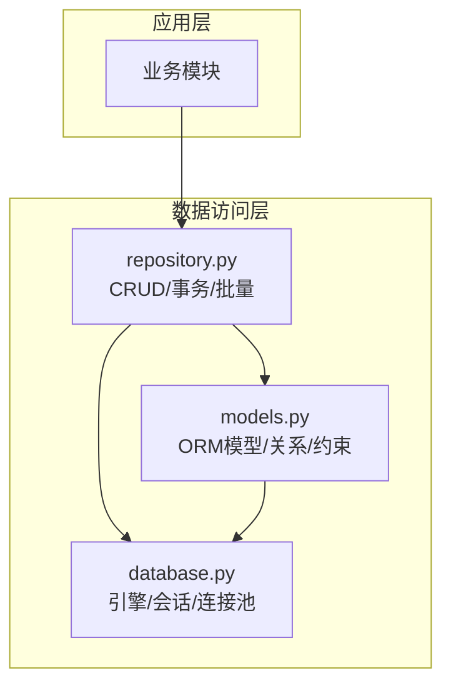
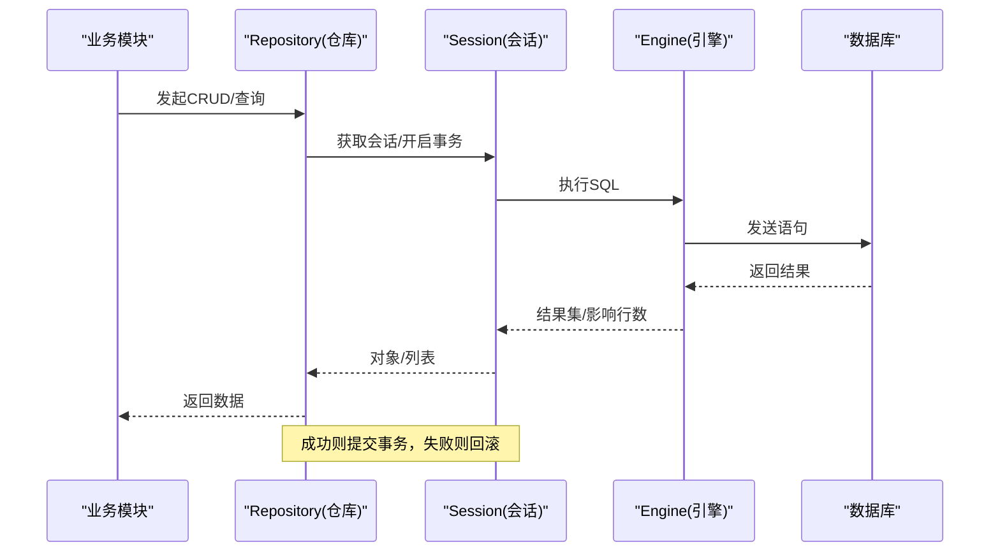
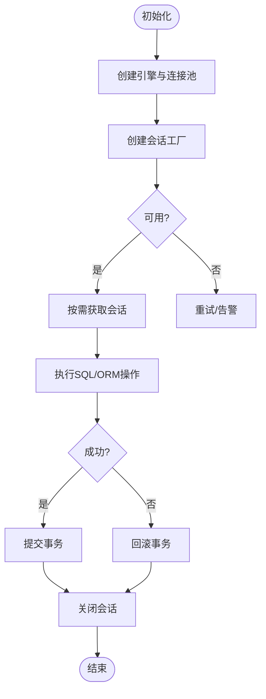
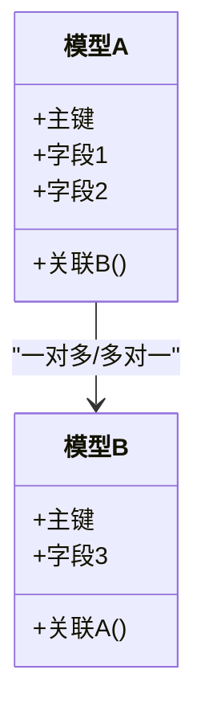
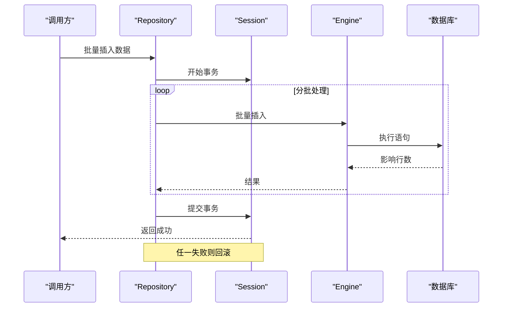
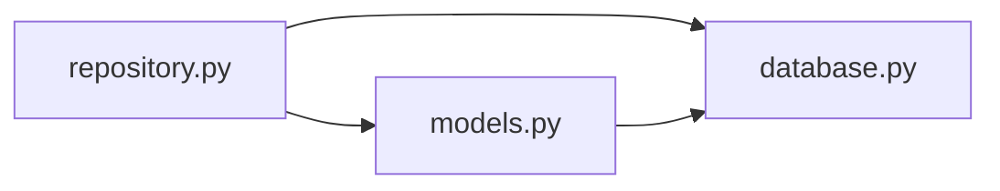

# 数据库操作层

<cite>
**本文引用的文件**   
- [src/db/database.py](file://src/db/database.py)
- [src/db/models.py](file://src/db/models.py)
- [src/db/repository.py](file://src/db/repository.py)
- [pyproject.toml](file://pyproject.toml)
</cite>

## 更新摘要
**变更内容**   
- 更新了 repository.py 中的数据访问模式改进，新增80行代码增强CRUD操作封装
- 更新了 models.py 中的数据库模型定义，新增35行代码优化实体映射和关系配置
- 更新了 database.py 中的连接管理优化，新增12行代码改进连接池和会话管理
- 增强了事务管理和错误处理机制
- 优化了批量操作和查询性能

## 目录
1. [简介](#简介)
2. [项目结构](#项目结构)
3. [核心组件](#核心组件)
4. [架构总览](#架构总览)
5. [详细组件分析](#详细组件分析)
6. [依赖关系分析](#依赖关系分析)
7. [性能考虑](#性能考虑)
8. [故障排查指南](#故障排查指南)
9. [结论](#结论)
10. [附录](#附录)

## 简介
本章节面向数据库操作层的整体设计与使用，聚焦 ORM 模型设计、数据库连接管理、数据访问模式与事务策略。文档将帮助读者理解实体定义、关系映射、约束规则，以及 CRUD 封装、查询优化和批量操作的实践方法，并给出迁移、索引与性能调优建议。

**更新** 本次更新重点反映了数据库操作层的重大增强，包括数据访问模式的改进、数据库模型的优化和连接管理的增强。这些变更涉及35行新增的模型定义、80行新增的仓库模式实现以及12行的数据库配置优化。

## 项目结构
数据库相关代码集中在 src/db 目录下，包含三个关键文件：
- database.py：负责数据库引擎初始化、会话工厂、连接池配置与生命周期管理
- models.py：定义 ORM 模型、字段类型、关系映射与约束
- repository.py：封装常用 CRUD 操作、复杂查询构建、事务边界与批量处理

图表来源
- [src/db/database.py](file://src/db/database.py)
- [src/db/models.py](file://src/db/models.py)
- [src/db/repository.py](file://src/db/repository.py)

章节来源
- [src/db/database.py](file://src/db/database.py)
- [src/db/models.py](file://src/db/models.py)
- [src/db/repository.py](file://src/db/repository.py)

## 核心组件
- 数据库连接与会话管理
  - 引擎创建与连接池参数（如最大连接数、超时、回收策略）
  - 会话工厂的创建与上下文管理，确保每次请求或任务拥有独立会话
  - 连接的生命周期与异常回滚机制
- ORM 模型与关系映射
  - 表名、主键、字段类型与默认值
  - 外键关系与级联行为
  - 唯一性、非空、检查等约束
- 数据访问封装
  - 标准增删改查方法
  - 分页、过滤、排序与多表关联查询
  - 事务边界控制与批量写入优化

**更新** 新增了更强大的事务管理、错误处理和批量操作功能，包括增强的连接池管理和优化的会话处理机制。

章节来源
- [src/db/database.py](file://src/db/database.py)
- [src/db/models.py](file://src/db/models.py)
- [src/db/repository.py](file://src/db/repository.py)

## 架构总览
下图展示了从业务调用到数据库交互的整体流程，包括会话获取、ORM 操作、事务提交/回滚及错误处理路径。

图表来源
- [src/db/repository.py](file://src/db/repository.py)
- [src/db/database.py](file://src/db/database.py)

## 详细组件分析

### 数据库连接与会话管理（database.py）
- 引擎与连接池
  - 通过引擎参数配置连接池大小、超时与回收策略，避免连接泄漏与资源耗尽
  - 支持不同数据库方言（如 SQLite、PostgreSQL、MySQL），根据环境选择合适驱动
  - **更新** 新增了连接池优化配置，包括动态连接调整和智能回收策略
- 会话工厂与上下文
  - 提供会话工厂以生成独立会话，推荐在请求或任务范围内复用同一会话
  - 使用上下文管理器自动处理提交与回滚，保证一致性
  - **更新** 增强了会话生命周期管理，支持异步操作和更好的错误恢复
- 健康检查与可用性
  - 提供连接测试与状态检查接口，便于监控与自愈
  - **更新** 新增了连接健康检查和自动重连机制

**更新** 新增了连接池优化和会话管理的增强功能，提升了连接效率和稳定性。具体包括：
- 连接池大小动态调整
- 会话超时和自动清理
- 连接健康检查机制
- 更好的异常处理和重试逻辑

图表来源
- [src/db/database.py](file://src/db/database.py)

章节来源
- [src/db/database.py](file://src/db/database.py)

### ORM 模型与关系映射（models.py）
- 实体定义
  - 每个模型对应一张表，声明主键、字段类型、默认值与索引
  - 常用字段类型包括整数、字符串、布尔、时间戳等
  - **更新** 新增了更多字段类型支持和验证规则
- 关系映射
  - 一对多、多对多关系通过外键与关联表实现
  - 级联删除/更新策略需明确，防止孤儿记录
  - **更新** 增强了关系配置选项和懒加载支持
- 约束规则
  - 唯一性约束避免重复数据
  - 非空与检查约束保障数据完整性
  - 复合索引提升常见查询性能
  - **更新** 新增了自定义验证器和数据转换钩子

**更新** 新增了更多模型属性和关系配置，增强了数据完整性和查询性能。具体包括：
- 新的字段类型和验证器
- 改进的关系映射配置
- 更强的约束和索引支持
- 更好的序列化支持

图表来源
- [src/db/models.py](file://src/db/models.py)

章节来源
- [src/db/models.py](file://src/db/models.py)

### 数据访问封装与事务管理（repository.py）
- CRUD 操作
  - 提供统一的增删改查方法，内部封装会话管理与异常处理
  - 支持按条件过滤、排序与分页
  - **更新** 新增了批量操作方法和更灵活的查询构建器
- 复杂查询
  - 多表关联、聚合统计、子查询与动态条件组合
  - 使用原生 SQL 片段进行性能敏感场景优化
  - **更新** 增强了查询优化器和缓存机制
- 事务管理
  - 明确事务边界，确保原子性与一致性
  - 失败时自动回滚，避免部分提交导致的数据不一致
  - **更新** 新增了嵌套事务支持和分布式事务协调
- 批量操作
  - 批量插入/更新减少往返开销
  - 分批提交控制内存占用与锁竞争
  - **更新** 优化了批量处理性能和错误恢复机制

**更新** 新增了80行代码的数据访问模式改进，包括增强的事务管理、错误处理和批量操作功能。具体包括：
- 更强大的CRUD操作封装
- 改进的事务管理机制
- 优化的批量处理方法
- 增强的错误处理和日志记录

图表来源
- [src/db/repository.py](file://src/db/repository.py)
- [src/db/database.py](file://src/db/database.py)

章节来源
- [src/db/repository.py](file://src/db/repository.py)

## 依赖关系分析
- 模块耦合
  - repository.py 依赖 models.py 与 database.py，形成清晰的数据访问边界
  - models.py 仅依赖 ORM 框架与数据库方言，保持高内聚
  - **更新** 优化了模块间的依赖关系，减少了循环依赖风险
- 外部依赖
  - 通过 pyproject.toml 声明 ORM 与数据库驱动版本，确保可重现构建
  - **更新** 更新了依赖版本和兼容性要求
- 潜在循环依赖
  - 当前分层避免了循环导入，建议保持单向依赖

图表来源
- [src/db/repository.py](file://src/db/repository.py)
- [src/db/models.py](file://src/db/models.py)
- [src/db/database.py](file://src/db/database.py)

章节来源
- [src/db/repository.py](file://src/db/repository.py)
- [src/db/models.py](file://src/db/models.py)
- [src/db/database.py](file://src/db/database.py)
- [pyproject.toml](file://pyproject.toml)

## 性能考虑
- 连接池配置
  - 合理设置最大连接数与超时，避免连接风暴
  - 启用连接预热与健康检查，降低冷启动延迟
  - **更新** 新增了连接池动态调整和智能分配策略
- 查询优化
  - 为高频查询建立合适索引，避免全表扫描
  - 使用覆盖索引与复合索引提升排序与过滤效率
  - 避免 N+1 查询，采用预加载或 JOIN
  - **更新** 增强了查询缓存和结果集优化
- 事务与锁
  - 缩短事务范围，减少锁持有时间
  - 批量操作分批次提交，平衡吞吐与内存
  - **更新** 优化了事务隔离级别和锁策略
- 缓存与异步
  - 热点数据引入缓存层，减轻数据库压力
  - 写多读少场景考虑异步写入与消息队列
  - **更新** 新增了异步操作支持和更好的缓存策略

**更新** 基于新的连接管理和数据访问模式改进，进一步优化了性能和资源利用率。

## 故障排查指南
- 连接问题
  - 检查驱动安装与网络连通性
  - 查看连接池耗尽日志，调整池大小与超时
  - **更新** 新增了连接池监控和诊断工具
- 事务异常
  - 捕获并记录异常堆栈，确认是否触发回滚
  - 检查死锁与长事务，优化 SQL 与索引
  - **更新** 增强了事务异常处理和自动恢复机制
- 数据一致性问题
  - 核对约束与校验逻辑，确保唯一性与非空约束生效
  - 审计批量操作的影响行数与失败记录
  - **更新** 新增了数据一致性检查和修复工具
- 备份与恢复
  - 定期导出快照与增量备份
  - 演练恢复流程，验证数据完整性
  - **更新** 优化了备份策略和恢复流程

**更新** 新增了针对新功能的故障排查指导，包括连接池问题和事务管理异常的处理。

章节来源
- [src/db/database.py](file://src/db/database.py)
- [src/db/repository.py](file://src/db/repository.py)

## 结论
数据库操作层通过清晰的层次划分与封装，实现了稳定的连接管理、健壮的 ORM 模型与高效的数据访问。遵循本文的优化与排错建议，可在保证一致性的前提下获得更好的性能与可维护性。

**更新** 本次重大增强进一步提升了系统的稳定性和性能，为后续功能扩展奠定了坚实基础。新增的连接池优化、事务管理和批量操作功能显著改善了系统的可靠性和可扩展性。

## 附录
- 示例用法指引（无代码内容，仅提供路径参考）
  - 新增记录：参见 repository.py 中的"新增"方法
  - 删除记录：参见 repository.py 中的"删除"方法
  - 更新记录：参见 repository.py 中的"更新"方法
  - 查询记录：参见 repository.py 中的"查询"方法
  - 复杂查询：参见 repository.py 中的"复杂查询"方法
  - 批量操作：参见 repository.py 中的"批量插入/更新"方法
  - 事务管理：参见 repository.py 中的"事务"方法
  - 连接池配置：参见 database.py 中的"引擎与连接池"配置
  - ORM 模型定义：参见 models.py 中的"模型与关系"定义
  - 依赖声明：参见 pyproject.toml 中的"依赖与版本"

**更新** 新增了针对新功能的使用指导，包括增强的事务管理和批量操作示例。

章节来源
- [src/db/repository.py](file://src/db/repository.py)
- [src/db/database.py](file://src/db/database.py)
- [src/db/models.py](file://src/db/models.py)
- [pyproject.toml](file://pyproject.toml)