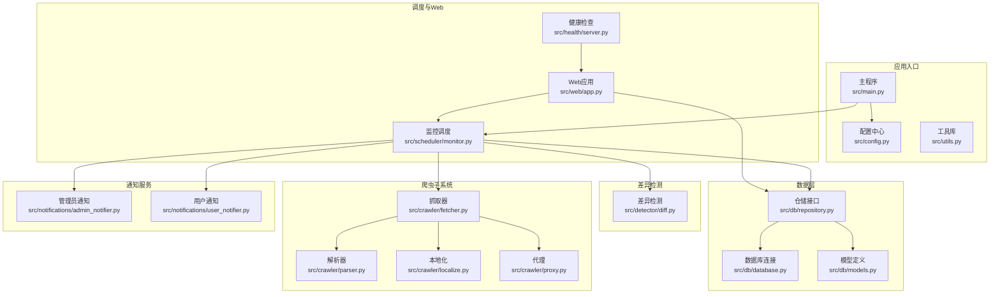
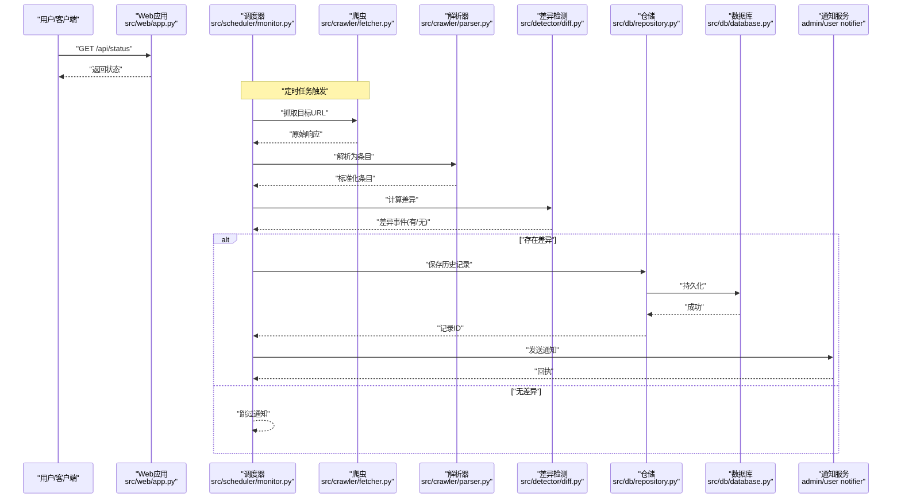
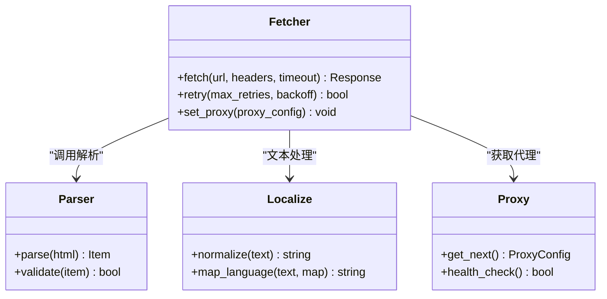
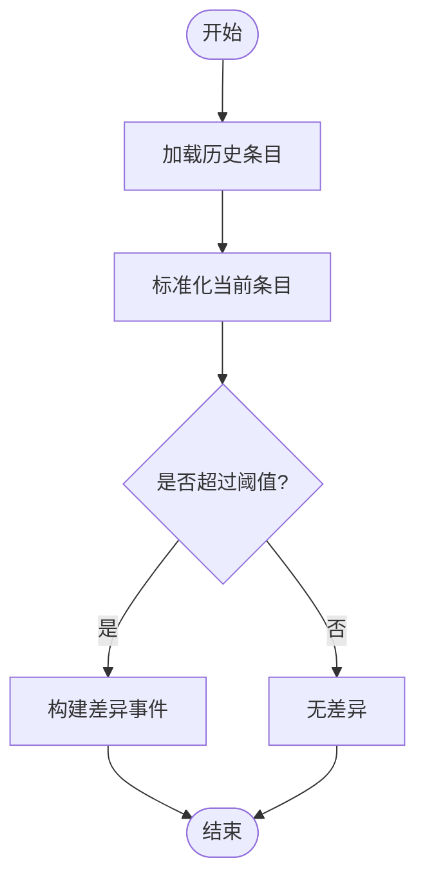
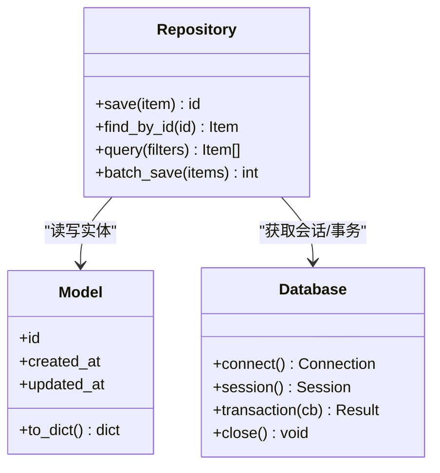
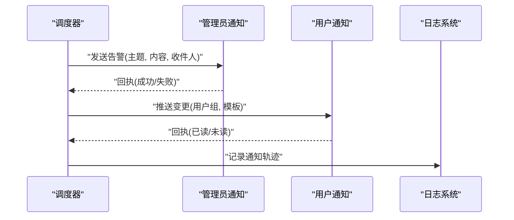
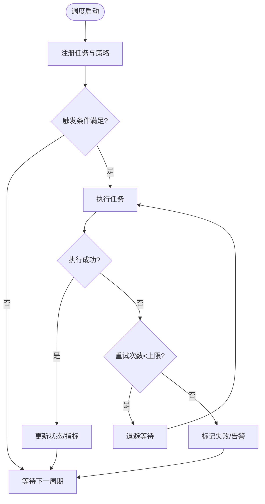
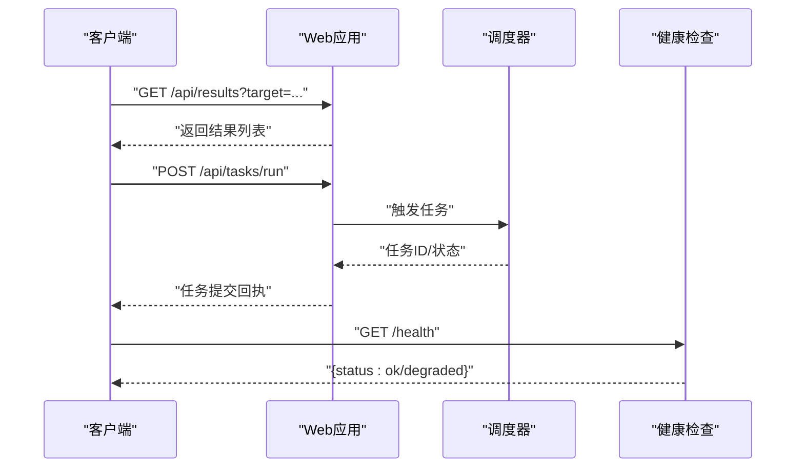
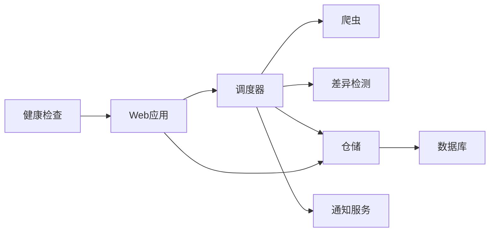

# 核心模块

<cite>
**本文引用的文件**   
- [src/main.py](file://src/main.py)
- [src/config.py](file://src/config.py)
- [src/utils.py](file://src/utils.py)
- [src/crawler/fetcher.py](file://src/crawler/fetcher.py)
- [src/crawler/parser.py](file://src/crawler/parser.py)
- [src/crawler/localize.py](file://src/crawler/localize.py)
- [src/crawler/proxy.py](file://src/crawler/proxy.py)
- [src/detector/diff.py](file://src/detector/diff.py)
- [src/db/database.py](file://src/db/database.py)
- [src/db/models.py](file://src/db/models.py)
- [src/db/repository.py](file://src/db/repository.py)
- [src/notifications/admin_notifier.py](file://src/notifications/admin_notifier.py)
- [src/notifications/user_notifier.py](file://src/notifications/user_notifier.py)
- [src/scheduler/monitor.py](file://src/scheduler/monitor.py)
- [src/web/app.py](file://src/web/app.py)
- [src/web/static/index.html](file://src/web/static/index.html)
- [src/health/server.py](file://src/health/server.py)
- [translate/translation_map.py](file://translate/translation_map.py)
- [tests/test_diff.py](file://tests/test_diff.py)
- [tests/test_notifier.py](file://tests/test_notifier.py)
- [tests/test_parser.py](file://tests/test_parser.py)
- [pyproject.toml](file://pyproject.toml)
- [Dockerfile](file://Dockerfile)
- [docker-compose.yml](file://docker-compose.yml)
</cite>

## 目录
1. [简介](#简介)
2. [项目结构](#项目结构)
3. [核心组件](#核心组件)
4. [架构总览](#架构总览)
5. [详细组件分析](#详细组件分析)
6. [依赖关系分析](#依赖关系分析)
7. [性能考虑](#性能考虑)
8. [故障排查指南](#故障排查指南)
9. [结论](#结论)
10. [附录](#附录)

## 简介
本文件为监控系统的核心模块文档，覆盖网页爬虫系统、内容差异检测、数据库操作、通知机制、任务调度与Web界面等关键子系统。文档从职责边界、数据流向、交互关系入手，结合代码级图示与示例路径，帮助初学者快速理解整体架构，同时为高级开发者提供深入实现细节、扩展点与优化建议。

## 项目结构
系统采用按功能域划分的模块化结构：
- 爬虫层：负责抓取、解析、本地化与代理配置
- 差异检测：对比历史与当前内容，生成变更事件
- 数据持久化：ORM模型、数据库连接与仓储接口
- 通知服务：管理员与用户通知通道
- 任务调度：周期性执行监控任务
- Web界面：提供静态页面与API访问
- 健康检查：对外暴露健康状态端点
- 配置与工具：全局配置、通用工具函数
- 测试与部署：单元测试、容器化与编排

**图表来源** 
- [src/main.py](file://src/main.py)
- [src/config.py](file://src/config.py)
- [src/utils.py](file://src/utils.py)
- [src/crawler/fetcher.py](file://src/crawler/fetcher.py)
- [src/crawler/parser.py](file://src/crawler/parser.py)
- [src/crawler/localize.py](file://src/crawler/localize.py)
- [src/crawler/proxy.py](file://src/crawler/proxy.py)
- [src/detector/diff.py](file://src/detector/diff.py)
- [src/db/database.py](file://src/db/database.py)
- [src/db/models.py](file://src/db/models.py)
- [src/db/repository.py](file://src/db/repository.py)
- [src/notifications/admin_notifier.py](file://src/notifications/admin_notifier.py)
- [src/notifications/user_notifier.py](file://src/notifications/user_notifier.py)
- [src/scheduler/monitor.py](file://src/scheduler/monitor.py)
- [src/web/app.py](file://src/web/app.py)
- [src/health/server.py](file://src/health/server.py)

**章节来源**
- [src/main.py](file://src/main.py)
- [src/config.py](file://src/config.py)
- [src/utils.py](file://src/utils.py)
- [pyproject.toml](file://pyproject.toml)
- [Dockerfile](file://Dockerfile)
- [docker-compose.yml](file://docker-compose.yml)

## 核心组件
- 爬虫子系统
  - 抓取器：统一HTTP请求封装、重试与超时控制、代理支持
  - 解析器：HTML/结构化数据提取，输出标准化条目
  - 本地化：多语言映射与文本规范化
  - 代理：代理池或单代理配置，失败切换与鉴权
- 差异检测
  - 基于规则或算法的文本/结构比对，生成差异报告与事件
- 数据层
  - 模型：实体定义与字段约束
  - 数据库：连接管理、事务与迁移
  - 仓储：CRUD抽象与查询封装
- 通知服务
  - 管理员通知：邮件/IM/日志告警
  - 用户通知：订阅推送或站内消息
- 任务调度
  - 定时任务编排、并发控制、失败重试与幂等性
- Web界面
  - 静态页面与API路由，查询监控结果与触发任务
- 健康检查
  - 存活探针、依赖健康探测（DB、外部服务）

**章节来源**
- [src/crawler/fetcher.py](file://src/crawler/fetcher.py)
- [src/crawler/parser.py](file://src/crawler/parser.py)
- [src/crawler/localize.py](file://src/crawler/localize.py)
- [src/crawler/proxy.py](file://src/crawler/proxy.py)
- [src/detector/diff.py](file://src/detector/diff.py)
- [src/db/database.py](file://src/db/database.py)
- [src/db/models.py](file://src/db/models.py)
- [src/db/repository.py](file://src/db/repository.py)
- [src/notifications/admin_notifier.py](file://src/notifications/admin_notifier.py)
- [src/notifications/user_notifier.py](file://src/notifications/user_notifier.py)
- [src/scheduler/monitor.py](file://src/scheduler/monitor.py)
- [src/web/app.py](file://src/web/app.py)
- [src/health/server.py](file://src/health/server.py)

## 架构总览
系统以“调度驱动”为核心：调度器按策略周期触发爬虫抓取，解析后进入差异检测，若发现变更则写入数据库并触发通知；Web层提供查询与运维能力，健康检查保障服务可用性。

**图表来源** 
- [src/web/app.py](file://src/web/app.py)
- [src/scheduler/monitor.py](file://src/scheduler/monitor.py)
- [src/crawler/fetcher.py](file://src/crawler/fetcher.py)
- [src/crawler/parser.py](file://src/crawler/parser.py)
- [src/detector/diff.py](file://src/detector/diff.py)
- [src/db/repository.py](file://src/db/repository.py)
- [src/db/database.py](file://src/db/database.py)
- [src/notifications/admin_notifier.py](file://src/notifications/admin_notifier.py)
- [src/notifications/user_notifier.py](file://src/notifications/user_notifier.py)

## 详细组件分析

### 爬虫子系统
- 抓取器
  - 职责：发起HTTP请求、处理重定向、超时与重试、错误分类
  - 关键点：可插拔代理、UA/头定制、限流与退避
  - 使用模式：传入目标URL与解析回调，返回标准化响应体
- 解析器
  - 职责：将原始HTML/JSON转换为领域条目
  - 关键点：选择器策略、容错与降级、字段映射
- 本地化
  - 职责：文本清洗、编码转换、多语言映射
  - 关键点：翻译表维护、大小写/标点规范化
- 代理
  - 职责：代理配置、健康检查、轮换策略
  - 关键点：认证、超时、失败回退

**图表来源** 
- [src/crawler/fetcher.py](file://src/crawler/fetcher.py)
- [src/crawler/parser.py](file://src/crawler/parser.py)
- [src/crawler/localize.py](file://src/crawler/localize.py)
- [src/crawler/proxy.py](file://src/crawler/proxy.py)

**章节来源**
- [src/crawler/fetcher.py](file://src/crawler/fetcher.py)
- [src/crawler/parser.py](file://src/crawler/parser.py)
- [src/crawler/localize.py](file://src/crawler/localize.py)
- [src/crawler/proxy.py](file://src/crawler/proxy.py)
- [translate/translation_map.py](file://translate/translation_map.py)

### 差异检测
- 职责：比较历史与当前条目，识别新增、修改、删除
- 关键点：相似度阈值、忽略噪声（时间戳/随机ID）、增量更新
- 输出：差异事件对象，包含变更类型与摘要

**图表来源** 
- [src/detector/diff.py](file://src/detector/diff.py)

**章节来源**
- [src/detector/diff.py](file://src/detector/diff.py)
- [tests/test_diff.py](file://tests/test_diff.py)

### 数据层
- 模型
  - 职责：定义实体结构与约束
  - 关键点：字段类型、索引、外键关系
- 数据库
  - 职责：连接池、会话管理、事务
  - 关键点：迁移脚本、连接健康检查
- 仓储
  - 职责：封装CRUD与复杂查询
  - 关键点：分页、过滤、批量操作

**图表来源** 
- [src/db/models.py](file://src/db/models.py)
- [src/db/database.py](file://src/db/database.py)
- [src/db/repository.py](file://src/db/repository.py)

**章节来源**
- [src/db/models.py](file://src/db/models.py)
- [src/db/database.py](file://src/db/database.py)
- [src/db/repository.py](file://src/db/repository.py)

### 通知机制
- 管理员通知
  - 渠道：邮件、IM、日志
  - 策略：去重、速率限制、模板渲染
- 用户通知
  - 渠道：站内消息、订阅推送
  - 策略：用户偏好、订阅分组

**图表来源** 
- [src/notifications/admin_notifier.py](file://src/notifications/admin_notifier.py)
- [src/notifications/user_notifier.py](file://src/notifications/user_notifier.py)

**章节来源**
- [src/notifications/admin_notifier.py](file://src/notifications/admin_notifier.py)
- [src/notifications/user_notifier.py](file://src/notifications/user_notifier.py)
- [tests/test_notifier.py](file://tests/test_notifier.py)

### 任务调度
- 职责：周期执行监控任务、并发控制、失败重试、幂等
- 关键点：调度策略（固定间隔/延迟队列）、任务状态机、指标上报

**图表来源** 
- [src/scheduler/monitor.py](file://src/scheduler/monitor.py)

**章节来源**
- [src/scheduler/monitor.py](file://src/scheduler/monitor.py)

### Web界面与健康检查
- Web应用
  - 职责：提供静态页面与API路由，查询监控结果、触发任务
  - 关键点：路由组织、中间件（鉴权/限流）、缓存
- 健康检查
  - 职责：存活探针、依赖健康探测（DB、外部服务）
  - 关键点：分级健康状态、快速失败

**图表来源** 
- [src/web/app.py](file://src/web/app.py)
- [src/web/static/index.html](file://src/web/static/index.html)
- [src/health/server.py](file://src/health/server.py)

**章节来源**
- [src/web/app.py](file://src/web/app.py)
- [src/web/static/index.html](file://src/web/static/index.html)
- [src/health/server.py](file://src/health/server.py)

### 配置与工具
- 配置中心
  - 职责：集中管理环境变量、配置文件、默认值
  - 关键点：类型校验、热重载、敏感信息保护
- 工具库
  - 职责：通用函数（日志、加密、时间处理、重试装饰器）
  - 关键点：无副作用、可测试性

**章节来源**
- [src/config.py](file://src/config.py)
- [src/utils.py](file://src/utils.py)

## 依赖关系分析
- 内部依赖
  - 调度器依赖爬虫、差异检测、仓储与通知服务
  - Web应用依赖调度器与仓储
  - 健康检查依赖Web应用与数据库连接
- 外部依赖
  - HTTP客户端、数据库驱动、通知渠道SDK
- 耦合与内聚
  - 仓储抽象降低对具体ORM的耦合
  - 通知服务通过接口解耦不同渠道实现

**图表来源** 
- [src/scheduler/monitor.py](file://src/scheduler/monitor.py)
- [src/web/app.py](file://src/web/app.py)
- [src/db/repository.py](file://src/db/repository.py)
- [src/db/database.py](file://src/db/database.py)
- [src/health/server.py](file://src/health/server.py)

**章节来源**
- [src/scheduler/monitor.py](file://src/scheduler/monitor.py)
- [src/web/app.py](file://src/web/app.py)
- [src/db/repository.py](file://src/db/repository.py)
- [src/db/database.py](file://src/db/database.py)
- [src/health/server.py](file://src/health/server.py)

## 性能考虑
- 爬虫
  - 连接复用与池化、并发抓取、合理超时与退避
  - 解析器增量解析与缓存热点数据
- 差异检测
  - 预归一化、哈希比对、阈值调优减少误报
- 数据层
  - 连接池大小、索引设计、批量写入、读写分离
- 通知
  - 异步发送、去重与合并、限流与背压
- 调度
  - 任务分片、并行度控制、失败重试与死信队列
- Web
  - 静态资源缓存、API响应压缩、查询分页与过滤

[本节为通用指导，不直接分析具体文件]

## 故障排查指南
- 常见问题
  - 抓取失败：检查代理、网络连通、超时设置与重试策略
  - 解析异常：验证选择器、编码与容错逻辑
  - 差异误报：调整阈值、忽略噪声字段
  - 数据库连接：确认连接池、权限与迁移状态
  - 通知失败：核对凭据、模板与渠道配额
- 诊断步骤
  - 查看健康检查端点与日志
  - 启用调试级别日志与追踪ID
  - 使用测试用例复现问题（如差异与通知测试）

**章节来源**
- [tests/test_diff.py](file://tests/test_diff.py)
- [tests/test_notifier.py](file://tests/test_notifier.py)
- [tests/test_parser.py](file://tests/test_parser.py)
- [src/health/server.py](file://src/health/server.py)

## 结论
本监控系统以调度为核心，串联爬虫、差异检测、数据持久化与通知，形成闭环监控流程。通过清晰的模块边界与可扩展接口，既满足基础监控需求，也为后续增强（如多源采集、智能告警、可视化看板）预留空间。遵循本文的性能与排障建议，可有效提升稳定性与可维护性。

[本节为总结性内容，不直接分析具体文件]

## 附录
- 配置选项与参数设置
  - 环境变量与配置文件键名、默认值、作用域与校验规则
  - 敏感信息管理与密钥注入方式
- 扩展点
  - 自定义解析器、差异算法、通知渠道与调度策略
- 使用模式与示例路径
  - 抓取与解析：参考爬虫相关文件
  - 差异检测：参考差异检测与测试用例
  - 数据存取：参考仓储与模型定义
  - 通知发送：参考通知服务与测试用例
  - Web API：参考Web应用与静态页面
- 部署与运行
  - Docker镜像构建与编排
  - 启动脚本与环境准备

**章节来源**
- [src/config.py](file://src/config.py)
- [src/crawler/fetcher.py](file://src/crawler/fetcher.py)
- [src/crawler/parser.py](file://src/crawler/parser.py)
- [src/detector/diff.py](file://src/detector/diff.py)
- [src/db/repository.py](file://src/db/repository.py)
- [src/db/models.py](file://src/db/models.py)
- [src/notifications/admin_notifier.py](file://src/notifications/admin_notifier.py)
- [src/notifications/user_notifier.py](file://src/notifications/user_notifier.py)
- [src/web/app.py](file://src/web/app.py)
- [src/web/static/index.html](file://src/web/static/index.html)
- [Dockerfile](file://Dockerfile)
- [docker-compose.yml](file://docker-compose.yml)