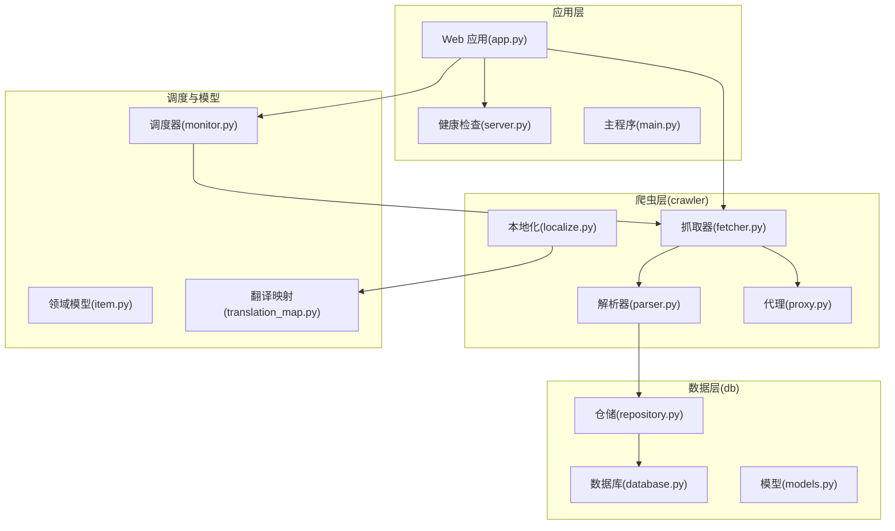
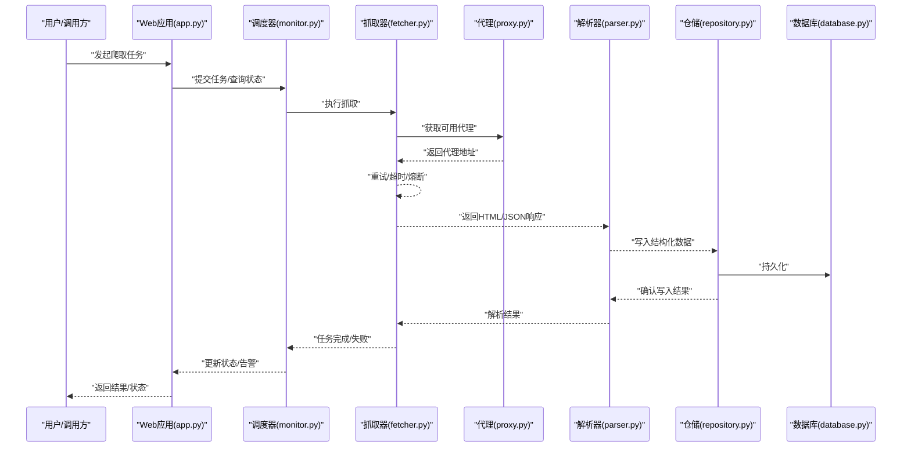
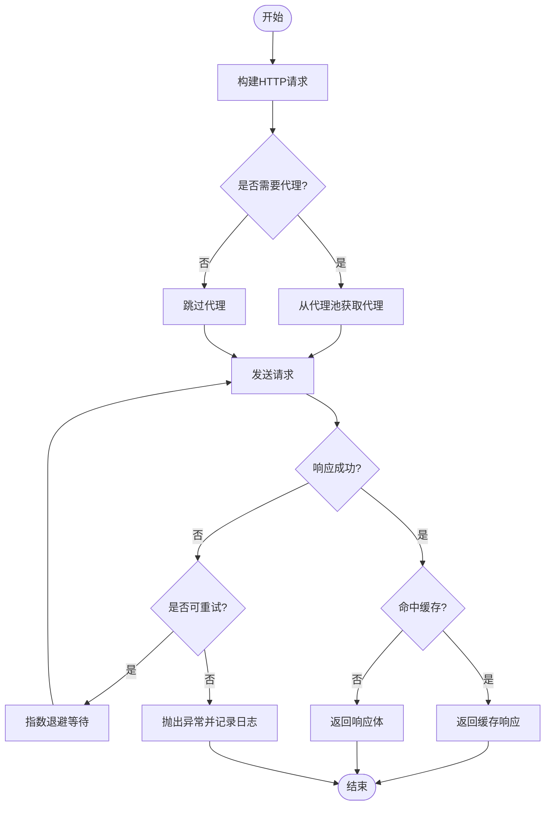
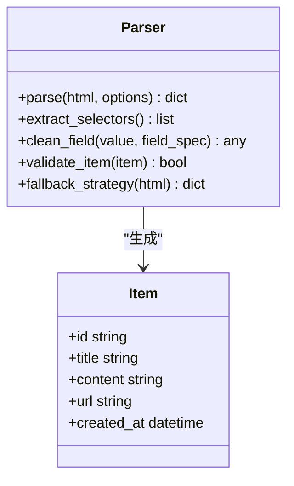
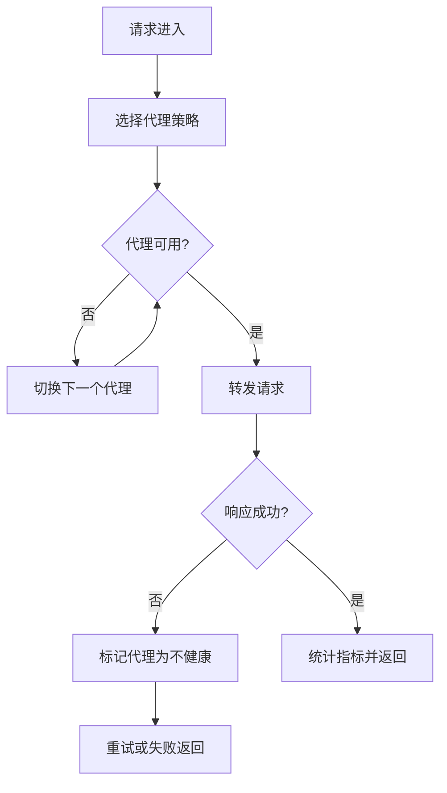
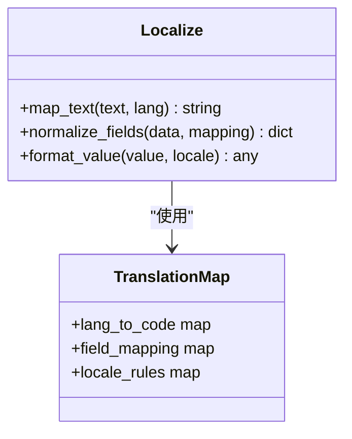
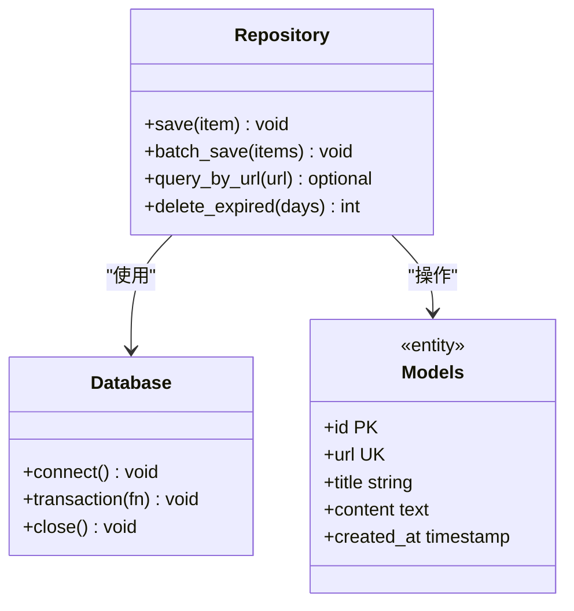
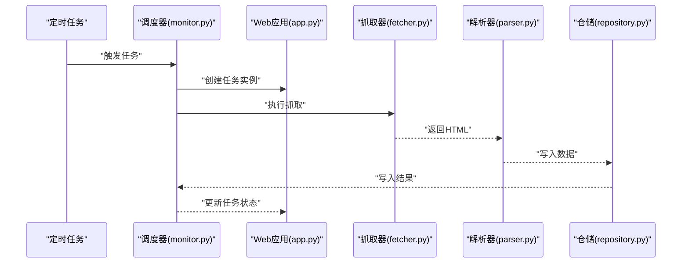
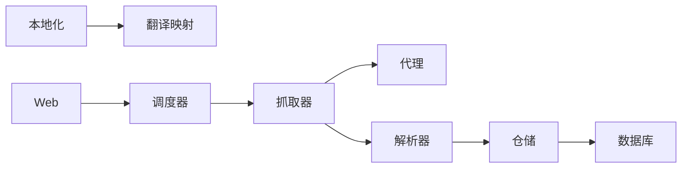

# 网页爬虫系统

<cite>
**本文引用的文件**   
- [main.py](file://src/main.py)
- [config.py](file://src/config.py)
- [utils.py](file://src/utils.py)
- [fetcher.py](file://src/crawler/fetcher.py)
- [parser.py](file://src/crawler/parser.py)
- [proxy.py](file://src/crawler/proxy.py)
- [localize.py](file://src/crawler/localize.py)
- [database.py](file://src/db/database.py)
- [models.py](file://src/db/models.py)
- [repository.py](file://src/db/repository.py)
- [monitor.py](file://src/scheduler/monitor.py)
- [app.py](file://src/web/app.py)
- [server.py](file://src/health/server.py)
- [item.py](file://src/models/item.py)
- [translation_map.py](file://translate/translation_map.py)
- [README.md](file://README.md)
</cite>

## 目录
1. [简介](#简介)
2. [项目结构](#项目结构)
3. [核心组件](#核心组件)
4. [架构总览](#架构总览)
5. [详细组件分析](#详细组件分析)
6. [依赖关系分析](#依赖关系分析)
7. [性能考虑](#性能考虑)
8. [故障排查指南](#故障排查指南)
9. [结论](#结论)
10. [附录](#附录)

## 简介
本文件为网页爬虫系统的技术文档，围绕页面抓取器（Fetcher）、内容解析器（Parser）、代理管理器（Proxy）和本地化模块（Localize）展开，系统阐述HTTP请求处理、HTML解析策略、代理配置与国际化支持。同时给出与调度器的集成方式、连接池与并发控制等性能优化要点，并提供常见问题的排查方法与最佳实践建议。

## 项目结构
仓库采用分层模块化组织：
- crawler：爬虫核心能力（抓取、解析、代理、本地化）
- db：数据持久化（模型、仓储、数据库连接）
- scheduler：任务调度与监控
- web：Web服务入口与健康检查
- models：领域模型定义
- translate：翻译映射表
- src根目录：应用启动、配置与通用工具

图表来源
- [app.py](file://src/web/app.py)
- [server.py](file://src/health/server.py)
- [main.py](file://src/main.py)
- [fetcher.py](file://src/crawler/fetcher.py)
- [parser.py](file://src/crawler/parser.py)
- [proxy.py](file://src/crawler/proxy.py)
- [localize.py](file://src/crawler/localize.py)
- [database.py](file://src/db/database.py)
- [models.py](file://src/db/models.py)
- [repository.py](file://src/db/repository.py)
- [monitor.py](file://src/scheduler/monitor.py)
- [item.py](file://src/models/item.py)
- [translation_map.py](file://translate/translation_map.py)

章节来源
- [README.md](file://README.md)

## 核心组件
- 抓取器（Fetcher）：负责构建HTTP请求、管理重试与超时、选择代理、缓存响应、统一异常封装。
- 解析器（Parser）：负责HTML解析、结构化抽取、字段清洗与类型转换、错误恢复与降级。
- 代理（Proxy）：维护代理池、健康探测、负载均衡与故障切换。
- 本地化（Localize）：基于翻译映射进行多语言文本归一化与标签映射。

章节来源
- [fetcher.py](file://src/crawler/fetcher.py)
- [parser.py](file://src/crawler/parser.py)
- [proxy.py](file://src/crawler/proxy.py)
- [localize.py](file://src/crawler/localize.py)

## 架构总览
爬虫系统以“抓取-解析-存储”为主线，配合调度器周期性触发任务；Web层提供接口与可视化；健康检查保障服务可用性。

图表来源
- [app.py](file://src/web/app.py)
- [monitor.py](file://src/scheduler/monitor.py)
- [fetcher.py](file://src/crawler/fetcher.py)
- [proxy.py](file://src/crawler/proxy.py)
- [parser.py](file://src/crawler/parser.py)
- [repository.py](file://src/db/repository.py)
- [database.py](file://src/db/database.py)

## 详细组件分析

### 抓取器（Fetcher）
- HTTP请求处理
  - 构建请求头、Cookie、User-Agent，支持自定义Header注入。
  - 统一超时设置（连接超时、读取超时），避免长尾阻塞。
  - 自动重定向控制与最大跳转限制。
- 重试机制
  - 指数退避重试，针对网络抖动、服务端限流、临时错误。
  - 可配置最大重试次数与退避间隔上限。
- 代理管理
  - 从代理池选择代理，失败时快速切换下一个代理。
  - 支持按域名或路径白名单绕过代理。
- 缓存与去重
  - 对相同URL的响应进行短期缓存，减少重复请求。
  - 可选ETag/Last-Modified协商缓存。
- 错误处理
  - 区分网络异常、HTTP状态码异常、解析异常，统一抛出领域异常。
  - 记录关键上下文（URL、耗时、代理、状态码）。

图表来源
- [fetcher.py](file://src/crawler/fetcher.py)
- [proxy.py](file://src/crawler/proxy.py)

章节来源
- [fetcher.py](file://src/crawler/fetcher.py)
- [proxy.py](file://src/crawler/proxy.py)

### 解析器（Parser）
- HTML解析策略
  - 使用选择器（如CSS/XPath）定位目标节点，支持多级嵌套与条件过滤。
  - 对动态渲染页面提供降级策略（优先结构化数据，回退到DOM解析）。
- 数据清洗
  - 去除空白、转义字符、单位换算、时间格式标准化。
  - 类型校验与默认值填充，缺失字段容错。
- 错误恢复
  - 局部解析失败不影响整体流程，记录警告并继续。
  - 提供解析模板版本管理，便于迭代升级。
- 输出模型
  - 将解析结果映射到领域模型（Item），供仓储层持久化。

图表来源
- [parser.py](file://src/crawler/parser.py)
- [item.py](file://src/models/item.py)

章节来源
- [parser.py](file://src/crawler/parser.py)
- [item.py](file://src/models/item.py)

### 代理（Proxy）
- 代理池管理
  - 维护活跃代理列表，支持动态添加/移除。
  - 健康探测：定期检测连通性与延迟，剔除不可用代理。
- 负载均衡
  - 轮询、随机或按延迟权重分配请求。
- 故障切换
  - 单次请求失败立即切换到下一个代理，避免单点阻塞。
- 配置与审计
  - 支持按域名白名单/黑名单控制代理使用。
  - 记录代理命中率、失败率与平均延迟。

图表来源
- [proxy.py](file://src/crawler/proxy.py)

章节来源
- [proxy.py](file://src/crawler/proxy.py)

### 本地化（Localize）
- 翻译映射
  - 基于翻译映射表进行多语言文本归一化，确保跨站点一致性。
- 标签映射
  - 将不同站点的字段名映射为标准字段名，便于统一入库。
- 区域设置
  - 支持按地区或语言偏好调整日期、货币、数字格式。
- 扩展性
  - 新增语言只需扩展映射表，无需改动解析逻辑。

图表来源
- [localize.py](file://src/crawler/localize.py)
- [translation_map.py](file://translate/translation_map.py)

章节来源
- [localize.py](file://src/crawler/localize.py)
- [translation_map.py](file://translate/translation_map.py)

### 数据层（Database/Models/Repository）
- 模型（Models）
  - 定义实体结构与约束，保证数据一致性。
- 仓储（Repository）
  - 封装CRUD操作，提供事务支持与批量写入。
- 数据库（Database）
  - 连接池管理、慢查询监控、迁移脚本执行。

图表来源
- [repository.py](file://src/db/repository.py)
- [database.py](file://src/db/database.py)
- [models.py](file://src/db/models.py)

章节来源
- [repository.py](file://src/db/repository.py)
- [database.py](file://src/db/database.py)
- [models.py](file://src/db/models.py)

### 调度器（Monitor）与Web集成
- 调度器
  - 定时触发抓取任务，支持任务优先级与依赖关系。
  - 任务状态跟踪、失败重试与告警通知。
- Web应用
  - 提供REST接口用于提交任务、查询进度与下载结果。
  - 集成健康检查端点，便于容器编排与健康探针。

图表来源
- [monitor.py](file://src/scheduler/monitor.py)
- [app.py](file://src/web/app.py)
- [fetcher.py](file://src/crawler/fetcher.py)
- [parser.py](file://src/crawler/parser.py)
- [repository.py](file://src/db/repository.py)

章节来源
- [monitor.py](file://src/scheduler/monitor.py)
- [app.py](file://src/web/app.py)

## 依赖关系分析
- 模块耦合
  - 抓取器依赖代理与解析器，解析器依赖仓储与模型。
  - 本地化模块独立，通过映射表解耦业务逻辑。
- 外部依赖
  - HTTP客户端库、HTML解析库、数据库驱动、调度框架。
- 潜在循环依赖
  - 通过仓储抽象与接口隔离，避免循环引用。

图表来源
- [fetcher.py](file://src/crawler/fetcher.py)
- [proxy.py](file://src/crawler/proxy.py)
- [parser.py](file://src/crawler/parser.py)
- [repository.py](file://src/db/repository.py)
- [database.py](file://src/db/database.py)
- [localize.py](file://src/crawler/localize.py)
- [translation_map.py](file://translate/translation_map.py)
- [monitor.py](file://src/scheduler/monitor.py)
- [app.py](file://src/web/app.py)

章节来源
- [fetcher.py](file://src/crawler/fetcher.py)
- [parser.py](file://src/crawler/parser.py)
- [proxy.py](file://src/crawler/proxy.py)
- [localize.py](file://src/crawler/localize.py)
- [repository.py](file://src/db/repository.py)
- [database.py](file://src/db/database.py)
- [monitor.py](file://src/scheduler/monitor.py)
- [app.py](file://src/web/app.py)

## 性能考虑
- 连接池管理
  - 复用HTTP连接，减少握手开销；合理设置最大连接数与空闲回收。
- 并发控制
  - 使用线程池或协程限制并发度，避免资源耗尽。
  - 令牌桶或漏桶算法控制请求速率，防止被目标站点封禁。
- 缓存策略
  - 响应缓存、DNS缓存、静态资源缓存，降低重复负载。
- 解析优化
  - 增量解析与流式处理，避免大对象内存峰值。
- 监控与调优
  - 采集QPS、延迟分布、错误率，结合A/B测试优化参数。

[本节为通用指导，不直接分析具体文件]

## 故障排查指南
- 常见问题
  - 网络连接超时：检查代理可用性、防火墙规则与DNS解析。
  - 解析失败：核对选择器表达式、HTML结构变更与编码问题。
  - 数据不一致：检查字段映射、类型转换与默认值策略。
  - 调度异常：查看任务队列堆积、依赖冲突与资源竞争。
- 诊断步骤
  - 启用调试日志，记录请求链路、响应状态与异常堆栈。
  - 使用抓包工具验证HTTP交互与代理转发。
  - 逐步隔离模块，定位问题边界。
- 恢复策略
  - 自动重试与降级，人工介入阈值与告警通知。
  - 数据修复脚本与回滚机制。

章节来源
- [fetcher.py](file://src/crawler/fetcher.py)
- [parser.py](file://src/crawler/parser.py)
- [proxy.py](file://src/crawler/proxy.py)
- [monitor.py](file://src/scheduler/monitor.py)

## 结论
本爬虫系统以清晰的模块划分与稳健的错误恢复机制为基础，结合代理池、本地化与调度器，形成可扩展、高可用的数据采集平台。通过连接池与并发控制实现性能优化，辅以完善的监控与排障手段，满足复杂场景下的稳定运行需求。

[本节为总结，不直接分析具体文件]

## 附录
- 配置示例
  - 抓取器：超时、重试、代理开关、缓存策略。
  - 解析器：选择器模板、字段映射、清洗规则。
  - 代理：池大小、健康探测周期、负载均衡策略。
  - 本地化：语言代码、映射表路径、区域设置。
- 最佳实践
  - 遵循幂等设计，避免重复写入。
  - 使用只读副本进行查询，提升吞吐。
  - 灰度发布解析模板，降低风险。
  - 定期清理过期数据，控制存储成本。

[本节为补充信息，不直接分析具体文件]