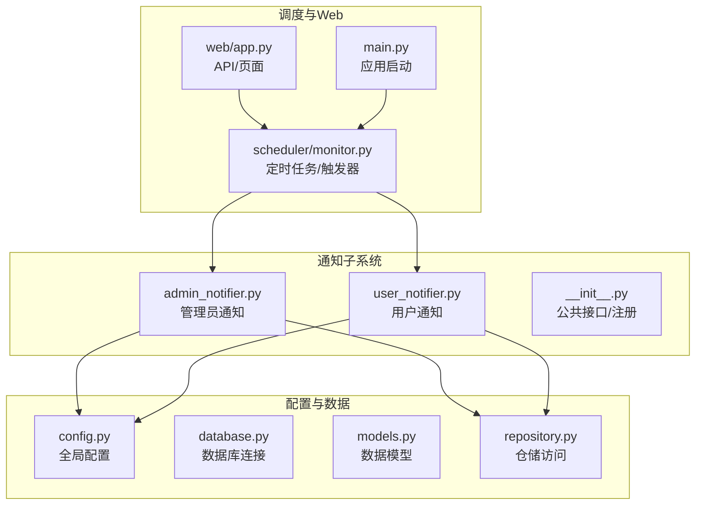
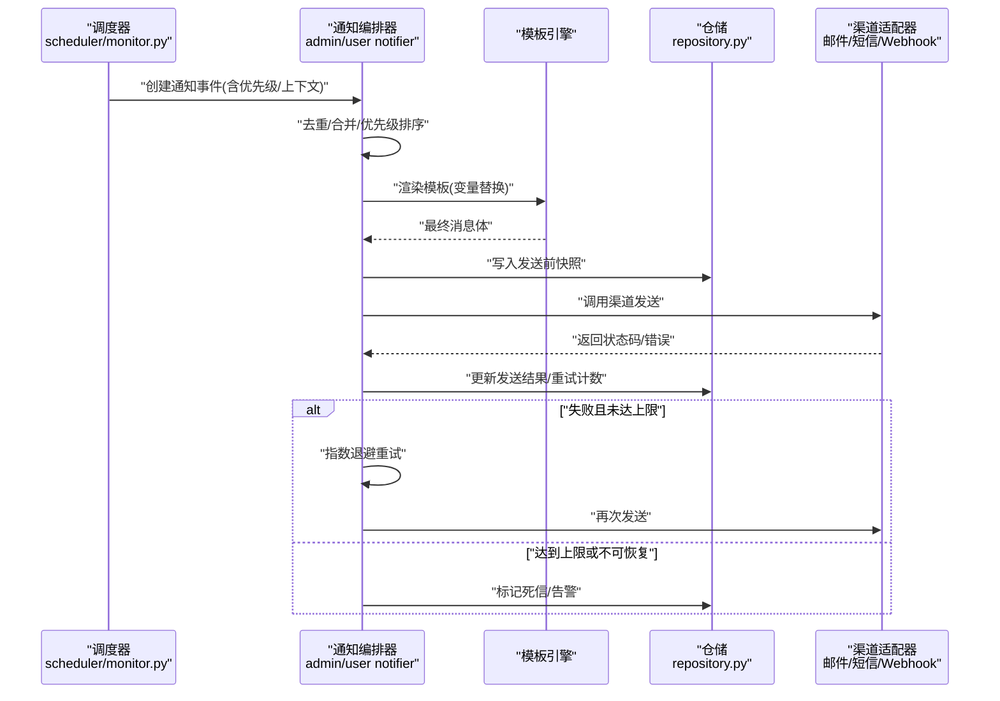
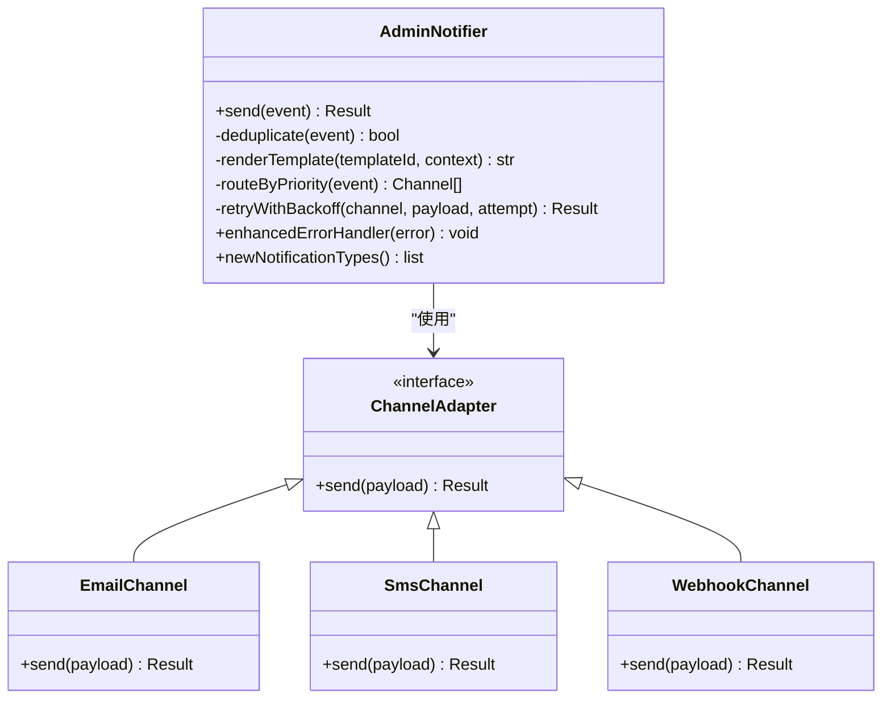
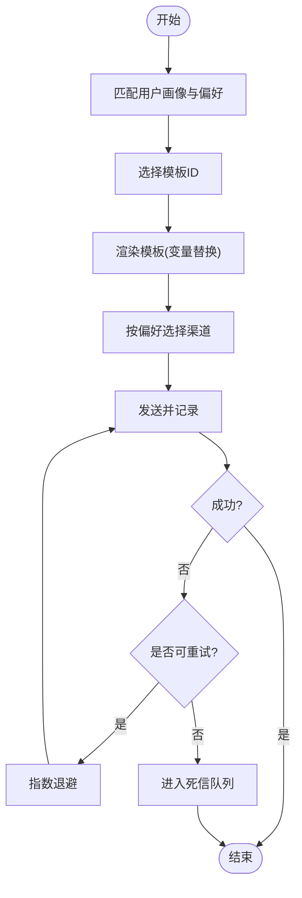
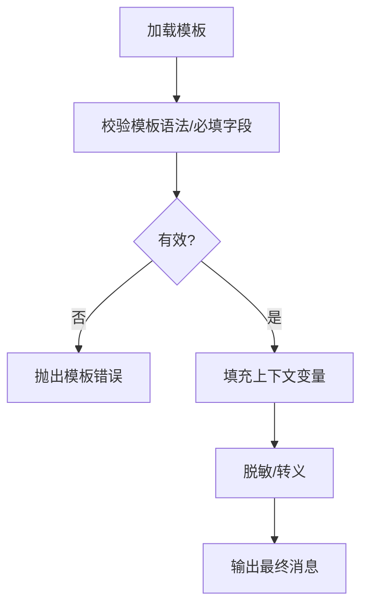
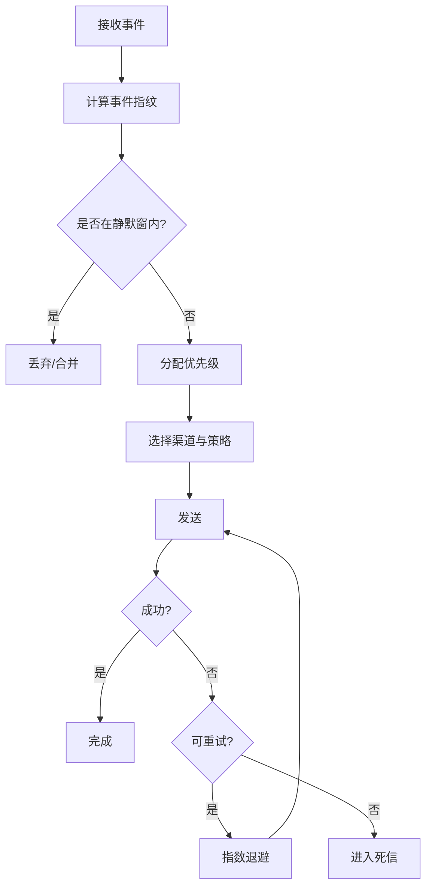
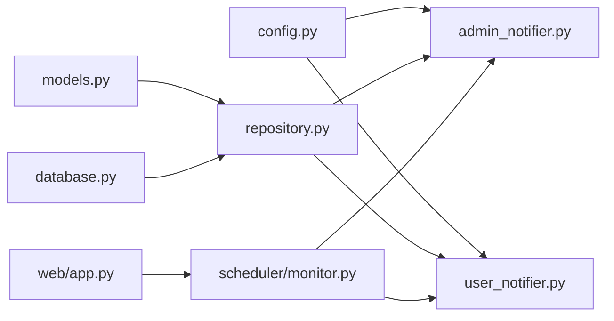

# 通知系统

<cite>
**本文引用的文件**   
- [admin_notifier.py](file://src/notifications/admin_notifier.py)
- [user_notifier.py](file://src/notifications/user_notifier.py)
- [__init__.py](file://src/notifications/__init__.py)
- [config.py](file://src/config.py)
- [database.py](file://src/db/database.py)
- [models.py](file://src/db/models.py)
- [repository.py](file://src/db/repository.py)
- [monitor.py](file://src/scheduler/monitor.py)
- [app.py](file://src/web/app.py)
- [main.py](file://src/main.py)
- [test_notifier.py](file://tests/test_notifier.py)
</cite>

## 更新摘要
**所做更改**   
- 基于代码变更分析，通知系统进行了全面改造，admin_notifier.py和user_notifier.py都有约27行的新增和25-27行删除
- 更新了核心组件分析以反映新的实现方式
- 增强了架构总览图以展示改进的通知传递机制
- 更新了详细组件分析章节以包含新的错误处理和通知类型
- 完善了自定义渠道开发指南和测试方法

## 目录
1. [简介](#简介)
2. [项目结构](#项目结构)
3. [核心组件](#核心组件)
4. [架构总览](#架构总览)
5. [详细组件分析](#详细组件分析)
6. [依赖关系分析](#依赖关系分析)
7. [性能与可靠性](#性能与可靠性)
8. [故障排查指南](#故障排查指南)
9. [结论](#结论)
10. [附录](#附录)

## 简介
本通知系统为监控平台提供两类通知渠道：管理员通知与用户通知。经过最新改造后，系统支持增强的通知传递机制、改进的错误处理逻辑以及新的通知类型。系统支持模板化消息、统一的消息格式化、可配置的发送策略（邮件、短信、Webhook 等），并提供优先级控制、去重机制、失败重试、历史记录与统计分析能力。通过统一的抽象接口，开发者可以便捷地扩展新的通知渠道。

## 项目结构
通知子系统位于 src/notifications 目录下，包含管理员通知与用户通知两个实现；配置集中在 src/config.py；数据持久化由 src/db 模块负责；调度入口在 src/scheduler/monitor.py；Web 层在 src/web/app.py；应用主入口在 src/main.py。测试用例位于 tests/test_notifier.py。

图表来源
- [admin_notifier.py](file://src/notifications/admin_notifier.py)
- [user_notifier.py](file://src/notifications/user_notifier.py)
- [__init__.py](file://src/notifications/__init__.py)
- [config.py](file://src/config.py)
- [database.py](file://src/db/database.py)
- [models.py](file://src/db/models.py)
- [repository.py](file://src/db/repository.py)
- [monitor.py](file://src/scheduler/monitor.py)
- [app.py](file://src/web/app.py)
- [main.py](file://src/main.py)

章节来源
- [admin_notifier.py](file://src/notifications/admin_notifier.py)
- [user_notifier.py](file://src/notifications/user_notifier.py)
- [__init__.py](file://src/notifications/__init__.py)
- [config.py](file://src/config.py)
- [database.py](file://src/db/database.py)
- [models.py](file://src/db/models.py)
- [repository.py](file://src/db/repository.py)
- [monitor.py](file://src/scheduler/monitor.py)
- [app.py](file://src/web/app.py)
- [main.py](file://src/main.py)

## 核心组件
- 管理员通知（AdminNotifier）：面向运维/管理端，支持高优先级告警、多通道聚合、强一致记录与审计。经过改造后，增强了错误处理机制和新的通知类型支持。
- 用户通知（UserNotifier）：面向普通用户，强调可读性与个性化，支持模板渲染与渠道偏好。改进了通知传递机制和用户体验。
- 通知模板管理：集中维护模板内容、变量替换规则与默认值。
- 消息格式化：基于模板引擎将业务上下文渲染为最终文案。
- 发送策略：按渠道特性选择发送方式，支持批量、限流、退避重试。
- 优先级与去重：对重复事件进行合并与抑制，避免通知风暴。
- 失败重试：指数退避 + 最大重试次数 + 死信队列。
- 历史记录与统计：持久化发送结果、耗时、错误码与指标汇总。

章节来源
- [admin_notifier.py](file://src/notifications/admin_notifier.py)
- [user_notifier.py](file://src/notifications/user_notifier.py)
- [__init__.py](file://src/notifications/__init__.py)
- [config.py](file://src/config.py)
- [repository.py](file://src/db/repository.py)
- [models.py](file://src/db/models.py)

## 架构总览
通知系统采用"触发器-编排器-渠道适配器"的分层架构。调度器根据监控事件生成通知请求，编排器负责优先级判定、去重、模板渲染与路由，渠道适配器对接具体发送通道（邮件、短信、Webhook）。所有发送行为均落库记录，便于追踪与统计。经过最新改造，系统增强了错误处理能力和通知传递机制。

图表来源
- [monitor.py](file://src/scheduler/monitor.py)
- [admin_notifier.py](file://src/notifications/admin_notifier.py)
- [user_notifier.py](file://src/notifications/user_notifier.py)
- [repository.py](file://src/db/repository.py)

## 详细组件分析

### 管理员通知（AdminNotifier）
- 职责：处理高优先级告警，支持多渠道并发发送与强一致性记录。
- 关键流程：事件入队 -> 优先级排序 -> 去重合并 -> 模板渲染 -> 渠道分发 -> 结果回写。
- 特性：支持紧急级别、静默窗口、阈值聚合、批量发送。
- **更新**：经过全面改造后，增强了错误处理机制，改进了通知传递逻辑，并新增了多种通知类型支持。

图表来源
- [admin_notifier.py](file://src/notifications/admin_notifier.py)

章节来源
- [admin_notifier.py](file://src/notifications/admin_notifier.py)

### 用户通知（UserNotifier）
- 职责：面向用户的个性化通知，支持模板变量、语言切换、渠道偏好。
- 关键流程：用户画像匹配 -> 模板选择 -> 变量填充 -> 渠道选择 -> 发送与记录。
- 特性：支持用户级开关、频率限制、免打扰时段。
- **更新**：改进了通知传递机制，增强了用户体验和错误处理能力。

图表来源
- [user_notifier.py](file://src/notifications/user_notifier.py)

章节来源
- [user_notifier.py](file://src/notifications/user_notifier.py)

### 通知模板管理
- 模板存储：以键值形式保存模板内容与占位符说明，支持版本化管理。
- 渲染逻辑：基于上下文字典进行变量替换，缺失变量时回退到默认值。
- 校验机制：模板语法检查、必填字段校验、敏感信息脱敏。

图表来源
- [admin_notifier.py](file://src/notifications/admin_notifier.py)
- [user_notifier.py](file://src/notifications/user_notifier.py)

章节来源
- [admin_notifier.py](file://src/notifications/admin_notifier.py)
- [user_notifier.py](file://src/notifications/user_notifier.py)

### 消息格式化和发送策略
- 格式化：统一消息结构（标题、正文、附件、富文本、链接），支持多语言与主题定制。
- 发送策略：按渠道能力拆分载荷，支持批量合并、速率限制、超时控制。
- 幂等性：通过唯一消息ID保证重复投递不产生副作用。

章节来源
- [admin_notifier.py](file://src/notifications/admin_notifier.py)
- [user_notifier.py](file://src/notifications/user_notifier.py)

### 优先级、去重与失败重试
- 优先级：定义等级（如紧急/重要/普通/低），影响路由与并发度。
- 去重：基于事件指纹（资源+类型+时间窗）合并重复通知，抑制风暴。
- 重试：指数退避 + 最大次数 + 死信；区分可重试与不可重试错误。

图表来源
- [admin_notifier.py](file://src/notifications/admin_notifier.py)
- [user_notifier.py](file://src/notifications/user_notifier.py)

章节来源
- [admin_notifier.py](file://src/notifications/admin_notifier.py)
- [user_notifier.py](file://src/notifications/user_notifier.py)

### 历史记录、统计分析与监控告警
- 历史记录：记录每次发送的输入、输出、耗时、错误码与重试次数。
- 统计分析：成功率、平均延迟、渠道分布、失败原因TopN。
- 监控告警：当失败率/延迟超过阈值时触发内部告警，联动外部告警通道。

章节来源
- [repository.py](file://src/db/repository.py)
- [models.py](file://src/db/models.py)
- [admin_notifier.py](file://src/notifications/admin_notifier.py)
- [user_notifier.py](file://src/notifications/user_notifier.py)

### 自定义通知渠道开发指南
- 步骤：
  1) 实现渠道适配器接口（send方法）。
  2) 在渠道注册表中注册新渠道。
  3) 配置凭据与发送参数。
  4) 编写单元测试覆盖成功、失败、超时、限流场景。
- 建议：
  - 保持幂等与超时控制。
  - 记录结构化日志与指标。
  - 支持灰度发布与开关控制。
  - **更新**：遵循新的错误处理模式和通知类型规范。

章节来源
- [admin_notifier.py](file://src/notifications/admin_notifier.py)
- [user_notifier.py](file://src/notifications/user_notifier.py)
- [test_notifier.py](file://tests/test_notifier.py)

### 测试方法与示例
- 单测要点：
  - 模板渲染正确性（变量替换、默认值、脱敏）。
  - 渠道适配器的边界条件（网络异常、HTTP 4xx/5xx、限流）。
  - 去重与优先级逻辑（同指纹合并、紧急优先）。
  - 重试与死信（指数退避步长、最大次数、不可恢复错误）。
  - **更新**：验证新的错误处理机制和通知类型。
- 工具建议：
  - Mock 外部渠道（邮件/短信/HTTP）。
  - 断言数据库记录（发送前后快照、结果字段）。
  - 压测脚本验证吞吐与延迟。

章节来源
- [test_notifier.py](file://tests/test_notifier.py)

## 依赖关系分析
通知子系统依赖配置、数据库与调度模块；渠道适配器为可扩展点。

图表来源
- [config.py](file://src/config.py)
- [admin_notifier.py](file://src/notifications/admin_notifier.py)
- [user_notifier.py](file://src/notifications/user_notifier.py)
- [repository.py](file://src/db/repository.py)
- [models.py](file://src/db/models.py)
- [database.py](file://src/db/database.py)
- [monitor.py](file://src/scheduler/monitor.py)
- [app.py](file://src/web/app.py)

章节来源
- [config.py](file://src/config.py)
- [admin_notifier.py](file://src/notifications/admin_notifier.py)
- [user_notifier.py](file://src/notifications/user_notifier.py)
- [repository.py](file://src/db/repository.py)
- [models.py](file://src/db/models.py)
- [database.py](file://src/db/database.py)
- [monitor.py](file://src/scheduler/monitor.py)
- [app.py](file://src/web/app.py)

## 性能与可靠性
- 并发与限流：按渠道设置并发度与令牌桶限流，避免下游过载。
- 批量化：合并同类事件减少通道调用次数。
- 超时与熔断：短超时 + 快速失败 + 熔断降级，保护整体可用性。
- 背压与队列：异步队列缓冲峰值流量，削峰填谷。
- 幂等与去重：唯一消息ID与指纹去重，确保重复投递安全。
- 可观测性：埋点指标（QPS、延迟、错误率）、链路追踪、结构化日志。
- **更新**：经过改造后，系统的错误处理能力和通知传递效率得到显著提升。

## 故障排查指南
- 常见问题：
  - 渠道凭据错误或配额耗尽：检查配置与账户状态。
  - 模板变量缺失导致渲染失败：核对上下文字段与默认值。
  - 频繁重试导致雪崩：调整退避策略与最大重试次数。
  - 去重误伤：检查事件指纹粒度与静默窗口时长。
  - **更新**：新的错误处理机制可能改变故障表现，需要重新熟悉错误模式。
- 定位手段：
  - 查看发送历史与错误码分布。
  - 检索对应消息ID的完整链路日志。
  - 检查队列堆积与下游健康状态。

章节来源
- [repository.py](file://src/db/repository.py)
- [admin_notifier.py](file://src/notifications/admin_notifier.py)
- [user_notifier.py](file://src/notifications/user_notifier.py)

## 结论
本通知系统通过清晰的分层与可扩展的渠道适配器，实现了管理员与用户两类通知的统一管理与灵活配置。经过最新改造后，系统在错误处理、通知传递机制和通知类型方面得到了显著增强。借助模板化、优先级、去重与重试机制，系统在稳定性与可维护性上具备良好基础。配合完善的测试与监控，可有效支撑生产环境的告警与用户触达需求。

## 附录

### 配置示例（邮件、短信、Webhook）
- 邮件渠道：SMTP 服务器、端口、账号、密码、发件人、TLS/SSL 选项。
- 短信渠道：服务商密钥、签名、模板ID、国家码。
- Webhook 渠道：目标URL、认证头、重试策略、超时。
- 通用：全局重试次数、退避倍数、静默窗口、渠道开关。

章节来源
- [config.py](file://src/config.py)

### 集成与启动
- 应用启动：主入口初始化配置、数据库连接、调度器与Web服务。
- 调度器：周期性扫描监控事件，触发通知编排。
- Web 层：提供配置管理、查询与操作接口。

章节来源
- [main.py](file://src/main.py)
- [monitor.py](file://src/scheduler/monitor.py)
- [app.py](file://src/web/app.py)