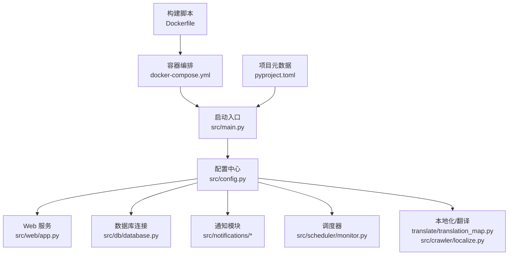
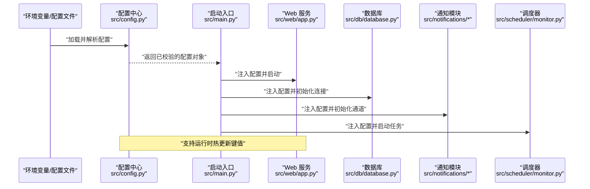
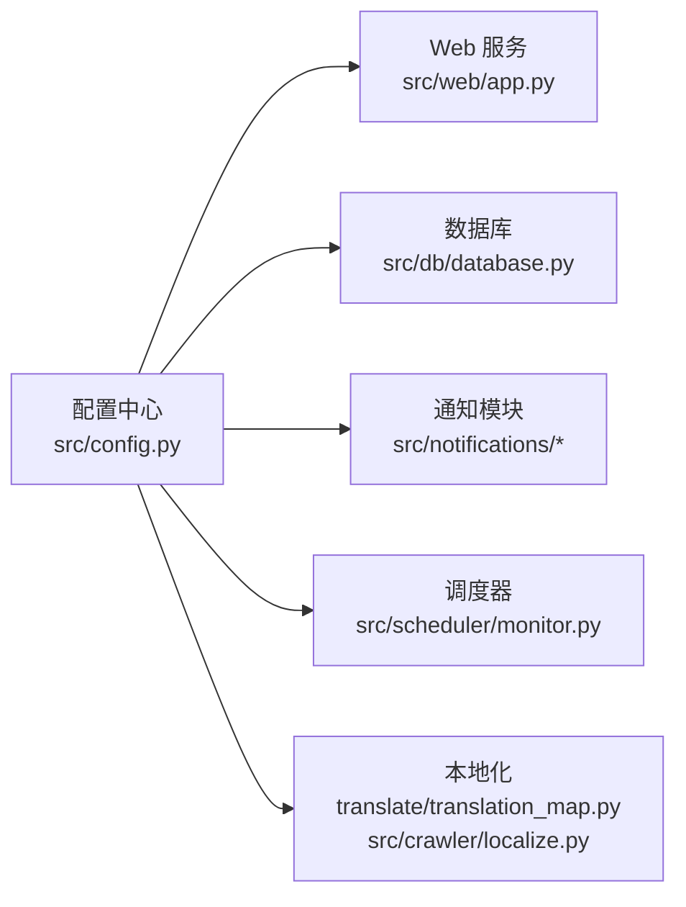

# 配置指南

<cite>
**本文引用的文件**   
- [src/config.py](file://src/config.py)
- [src/main.py](file://src/main.py)
- [pyproject.toml](file://pyproject.toml)
- [Dockerfile](file://Dockerfile)
- [docker-compose.yml](file://docker-compose.yml)
- [translate/translation_map.py](file://translate/translation_map.py)
- [src/crawler/localize.py](file://src/crawler/localize.py)
- [src/web/app.py](file://src/web/app.py)
- [src/db/database.py](file://src/db/database.py)
- [src/notifications/admin_notifier.py](file://src/notifications/admin_notifier.py)
- [src/notifications/user_notifier.py](file://src/notifications/user_notifier.py)
- [src/scheduler/monitor.py](file://src/scheduler/monitor.py)
- [README.md](file://README.md)
</cite>

## 目录
1. [简介](#简介)
2. [项目结构](#项目结构)
3. [核心组件](#核心组件)
4. [架构总览](#架构总览)
5. [详细组件分析](#详细组件分析)
6. [依赖关系分析](#依赖关系分析)
7. [性能考虑](#性能考虑)
8. [故障排查指南](#故障排查指南)
9. [结论](#结论)
10. [附录](#附录)

## 简介
本指南面向部署与维护人员，系统化说明本监控系统的配置管理方式，包括：
- 所有配置项、环境变量与配置文件格式
- 动态配置更新机制与配置验证规则
- 默认值设置与不同环境的配置模板
- 翻译映射、多语言支持与国际化设置
- 安全注意事项、敏感信息管理以及配置审计能力
- 常见配置错误与排障方法

目标是让读者在不深入源码的情况下，也能正确、安全、高效地完成配置工作。

## 项目结构
本项目采用模块化组织，配置相关代码集中在以下位置：
- 应用级配置加载与校验：src/config.py
- 启动入口与环境装配：src/main.py
- 项目元数据与依赖声明：pyproject.toml
- 容器化构建与编排：Dockerfile、docker-compose.yml
- 翻译与本地化：translate/translation_map.py、src/crawler/localize.py
- Web 服务与数据库连接：src/web/app.py、src/db/database.py
- 通知与调度：src/notifications/*、src/scheduler/monitor.py

图表来源 
- [src/main.py](file://src/main.py)
- [src/config.py](file://src/config.py)
- [src/web/app.py](file://src/web/app.py)
- [src/db/database.py](file://src/db/database.py)
- [src/notifications/admin_notifier.py](file://src/notifications/admin_notifier.py)
- [src/notifications/user_notifier.py](file://src/notifications/user_notifier.py)
- [src/scheduler/monitor.py](file://src/scheduler/monitor.py)
- [translate/translation_map.py](file://translate/translation_map.py)
- [src/crawler/localize.py](file://src/crawler/localize.py)
- [docker-compose.yml](file://docker-compose.yml)
- [Dockerfile](file://Dockerfile)
- [pyproject.toml](file://pyproject.toml)

章节来源
- [README.md](file://README.md)

## 核心组件
- 配置中心（src/config.py）
  - 负责统一加载配置源（环境变量、配置文件、默认值），提供访问接口
  - 实现配置项的校验、类型转换与缺失字段提示
  - 暴露运行时可热更新的键值集合，供其他模块按需读取
- 启动装配（src/main.py）
  - 初始化日志、加载配置、启动各子系统（Web、调度、通知等）
  - 将配置注入到各模块实例中
- 本地化与翻译（translate/translation_map.py、src/crawler/localize.py）
  - 维护翻译键与目标语言的映射
  - 根据当前语言环境选择对应文案
- Web 服务（src/web/app.py）
  - 基于配置启动 HTTP 服务，挂载路由与静态资源
- 数据库（src/db/database.py）
  - 依据配置建立连接池、执行迁移或健康检查
- 通知（src/notifications/*）
  - 按配置接入邮件、企业微信、钉钉等渠道
- 调度（src/scheduler/monitor.py）
  - 按配置周期执行监控任务

章节来源
- [src/config.py](file://src/config.py)
- [src/main.py](file://src/main.py)
- [translate/translation_map.py](file://translate/translation_map.py)
- [src/crawler/localize.py](file://src/crawler/localize.py)
- [src/web/app.py](file://src/web/app.py)
- [src/db/database.py](file://src/db/database.py)
- [src/notifications/admin_notifier.py](file://src/notifications/admin_notifier.py)
- [src/notifications/user_notifier.py](file://src/notifications/user_notifier.py)
- [src/scheduler/monitor.py](file://src/scheduler/monitor.py)

## 架构总览
下图展示配置在系统中的流转路径：从环境变量/配置文件进入配置中心，经校验后分发至各子系统；部分子系统支持通过 API 或事件触发动态更新。

图表来源 
- [src/config.py](file://src/config.py)
- [src/main.py](file://src/main.py)
- [src/web/app.py](file://src/web/app.py)
- [src/db/database.py](file://src/db/database.py)
- [src/notifications/admin_notifier.py](file://src/notifications/admin_notifier.py)
- [src/notifications/user_notifier.py](file://src/notifications/user_notifier.py)
- [src/scheduler/monitor.py](file://src/scheduler/monitor.py)

## 详细组件分析

### 配置中心（src/config.py）
- 功能要点
  - 统一配置源：环境变量优先，其次配置文件，最后使用默认值
  - 类型与范围校验：对端口、超时、布尔开关、列表等字段进行强校验
  - 缺失字段处理：关键项缺失时抛出明确错误，便于快速定位
  - 动态更新：暴露“更新键”接口，允许运行时刷新部分非敏感配置
- 建议的默认值策略
  - 开发环境：宽松限制、详细日志
  - 生产环境：严格限制、最小权限、关闭调试
- 热更新边界
  - 仅允许更新不影响运行态的连接参数以外的配置（如日志级别、轮询间隔）
  - 涉及连接池、认证凭据等变更需重启服务

章节来源
- [src/config.py](file://src/config.py)

### 启动装配（src/main.py）
- 功能要点
  - 初始化配置中心，确保所有必需配置存在且合法
  - 按顺序启动 Web、数据库、通知、调度等子系统
  - 捕获启动期异常并输出可读诊断信息
- 最佳实践
  - 启动失败时打印“缺失配置清单”，避免模糊报错
  - 对外暴露健康检查端点，便于编排系统探测

章节来源
- [src/main.py](file://src/main.py)

### 本地化与翻译（translate/translation_map.py、src/crawler/localize.py）
- 功能要点
  - 翻译映射表集中管理键值与多语言文案
  - 运行时根据语言环境切换显示文案
  - 支持扩展新语言与新增键值
- 配置项
  - 默认语言、回退语言、是否启用缓存
  - 翻译文件路径或远程同步策略（如有）
- 校验规则
  - 缺失键应回退到默认语言或占位符
  - 禁止空键名与重复键覆盖

章节来源
- [translate/translation_map.py](file://translate/translation_map.py)
- [src/crawler/localize.py](file://src/crawler/localize.py)

### Web 服务（src/web/app.py）
- 功能要点
  - 依据配置绑定地址与端口
  - 挂载路由、中间件与静态资源
  - 暴露健康检查与配置查询端点（只读）
- 安全建议
  - 生产环境禁用调试模式
  - 限制跨域与请求体大小

章节来源
- [src/web/app.py](file://src/web/app.py)

### 数据库（src/db/database.py）
- 功能要点
  - 依据配置建立连接池、设置超时与重试
  - 支持连接健康检查与自动重连
- 配置项
  - 驱动类型、连接串、最大连接数、超时、SSL/TLS 选项
- 安全建议
  - 使用环境变量或密钥管理服务注入凭据
  - 禁止明文密码写入配置文件

章节来源
- [src/db/database.py](file://src/db/database.py)

### 通知（src/notifications/admin_notifier.py、src/notifications/user_notifier.py）
- 功能要点
  - 按配置接入多种通知渠道（邮件、IM、短信等）
  - 支持模板变量与失败重试
- 配置项
  - 渠道类型、服务器地址、账号与令牌、频率限制、失败策略
- 安全建议
  - 令牌与密码通过环境变量注入
  - 记录发送结果但不记录消息体

章节来源
- [src/notifications/admin_notifier.py](file://src/notifications/admin_notifier.py)
- [src/notifications/user_notifier.py](file://src/notifications/user_notifier.py)

### 调度器（src/scheduler/monitor.py）
- 功能要点
  - 按配置周期执行监控任务
  - 支持任务开关、并发度、超时与告警阈值
- 配置项
  - 调度表达式、任务列表、线程/进程池大小、重试次数
- 性能建议
  - 合理设置并发与超时，避免阻塞主循环

章节来源
- [src/scheduler/monitor.py](file://src/scheduler/monitor.py)

### 容器化与编排（Dockerfile、docker-compose.yml、pyproject.toml）
- Dockerfile
  - 定义基础镜像、安装依赖、拷贝代码、设置入口命令
- docker-compose.yml
  - 定义服务、网络、卷与环境变量
  - 推荐将敏感信息放入外部密钥文件或 .env 文件
- pyproject.toml
  - 声明依赖版本与构建元数据，保证环境一致性

章节来源
- [Dockerfile](file://Dockerfile)
- [docker-compose.yml](file://docker-compose.yml)
- [pyproject.toml](file://pyproject.toml)

## 依赖关系分析
- 模块耦合
  - 配置中心为全局依赖，其他模块仅通过只读接口获取配置
  - Web、数据库、通知、调度之间无直接耦合，降低传播风险
- 外部依赖
  - 数据库驱动、HTTP 客户端、消息队列 SDK 等由 pyproject.toml 声明
- 潜在环路
  - 应避免在配置中心反向导入业务模块

图表来源 
- [src/config.py](file://src/config.py)
- [src/web/app.py](file://src/web/app.py)
- [src/db/database.py](file://src/db/database.py)
- [src/notifications/admin_notifier.py](file://src/notifications/admin_notifier.py)
- [src/notifications/user_notifier.py](file://src/notifications/user_notifier.py)
- [src/scheduler/monitor.py](file://src/scheduler/monitor.py)
- [translate/translation_map.py](file://translate/translation_map.py)
- [src/crawler/localize.py](file://src/crawler/localize.py)

章节来源
- [pyproject.toml](file://pyproject.toml)

## 性能考虑
- 配置加载
  - 启动时一次性加载并缓存，避免频繁 IO
  - 大体积翻译文件启用内存缓存
- 连接池
  - 数据库与 HTTP 客户端均应按负载调优连接池大小与超时
- 调度与并发
  - 根据 CPU 与 I/O 特性调整并发度，避免争用
- 日志与监控
  - 生产环境降低日志级别，开启结构化日志与指标上报

[本节为通用指导，不直接分析具体文件]

## 故障排查指南
- 启动失败
  - 检查必需环境变量是否缺失
  - 查看配置校验错误输出，逐项修复
- 连接失败
  - 核对数据库连接串、网络可达性与证书配置
  - 检查代理与防火墙策略
- 通知未送达
  - 确认渠道凭据有效、限流未触发
  - 查看失败重试与死信队列状态
- 翻译缺失
  - 检查语言包是否完整，键名是否一致
  - 确认回退语言生效
- 动态更新无效
  - 确认更新键属于“可热更”白名单
  - 检查调用方是否正确监听更新事件

章节来源
- [src/config.py](file://src/config.py)
- [src/main.py](file://src/main.py)
- [src/db/database.py](file://src/db/database.py)
- [src/notifications/admin_notifier.py](file://src/notifications/admin_notifier.py)
- [src/notifications/user_notifier.py](file://src/notifications/user_notifier.py)
- [translate/translation_map.py](file://translate/translation_map.py)
- [src/crawler/localize.py](file://src/crawler/localize.py)

## 结论
通过统一的配置中心与严格的校验机制，本系统实现了稳定、可观测、易维护的配置管理。结合容器化与编排，可在多环境中快速交付。遵循本文的安全与性能建议，可显著降低配置错误带来的风险。

[本节为总结性内容，不直接分析具体文件]

## 附录

### 配置项分类与示例
- 通用
  - 应用名称、版本、运行环境、时区、语言
- Web
  - 监听地址、端口、调试开关、静态资源路径、跨域策略
- 数据库
  - 驱动、连接串、连接池大小、超时、SSL
- 通知
  - 渠道类型、服务器地址、账号与令牌、频率限制、失败策略
- 调度
  - 调度表达式、任务开关、并发度、超时、重试
- 本地化
  - 默认语言、回退语言、翻译缓存开关

[本节为概念性说明，不直接分析具体文件]

### 环境变量与配置文件约定
- 环境变量命名规范
  - 全大写、下划线分隔、前缀区分模块（如 APP_、DB_、NOTIFY_）
- 配置文件格式
  - 推荐使用 YAML/JSON，置于只读卷或配置中心
- 优先级
  - 环境变量 > 配置文件 > 默认值

[本节为概念性说明，不直接分析具体文件]

### 动态配置更新机制
- 支持的热更键
  - 日志级别、轮询间隔、开关类配置
- 不支持的热更键
  - 连接串、凭据、证书等需要重建连接的配置
- 更新流程
  - 接收更新请求 -> 校验 -> 应用 -> 广播事件 -> 子模块刷新

[本节为概念性说明，不直接分析具体文件]

### 配置验证规则与默认值
- 必填项校验
  - 缺失则启动失败并输出缺失清单
- 类型与范围
  - 端口范围、布尔值、枚举值、数值上下界
- 默认值
  - 开发环境宽松，生产环境保守

[本节为概念性说明，不直接分析具体文件]

### 多语言与国际化设置
- 语言包管理
  - 集中式翻译映射，支持新增语言与键值
- 运行时切换
  - 通过环境变量或配置项切换语言
- 回退策略
  - 找不到键时回退到默认语言或占位符

[本节为概念性说明，不直接分析具体文件]

### 安全与敏感信息管理
- 敏感信息
  - 使用环境变量或密钥管理服务注入，禁止明文落盘
- 最小权限
  - 数据库账户、通知渠道令牌按最小权限授予
- 审计
  - 记录配置变更事件（谁、何时、改了什么），不记录敏感值本身

[本节为概念性说明，不直接分析具体文件]

### 部署环境模板
- 开发
  - 调试开启、详细日志、宽松超时、本地数据库
- 测试
  - 模拟外部依赖、固定时间、隔离数据
- 预发
  - 接近生产配置、灰度开关
- 生产
  - 关闭调试、严格超时、连接池优化、加密传输

[本节为概念性说明，不直接分析具体文件]

### 常见问题速查
- 端口冲突：修改监听端口或释放占用
- 数据库连接失败：检查连接串、网络、认证
- 通知失败：核对凭据、限流、黑名单
- 翻译缺失：补齐键值或启用回退语言
- 动态更新无效：确认键在白名单内

[本节为概念性说明，不直接分析具体文件]