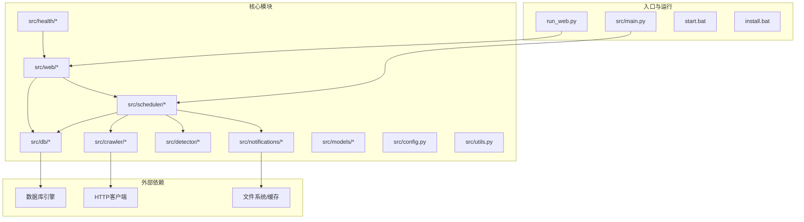
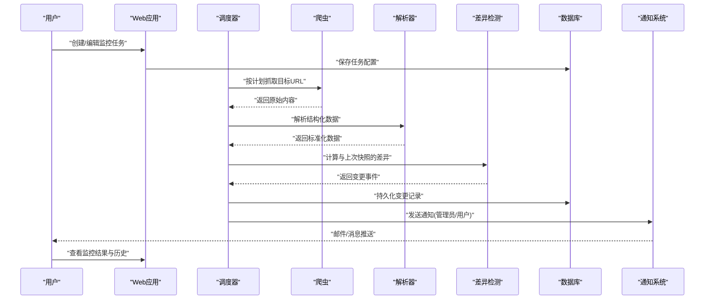
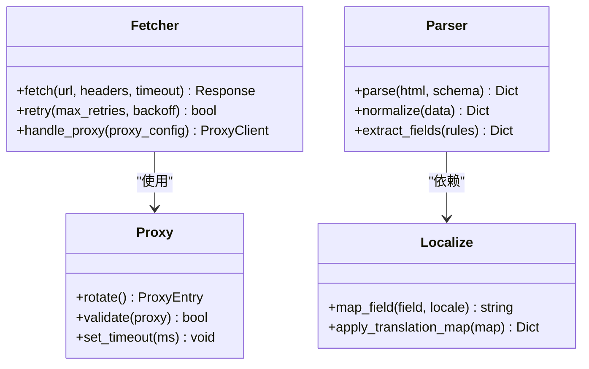
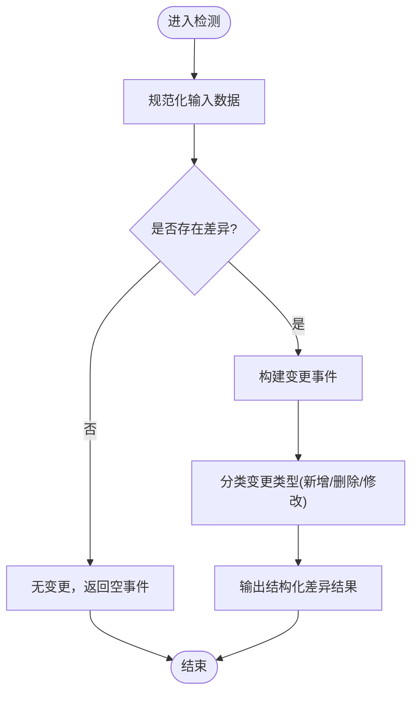
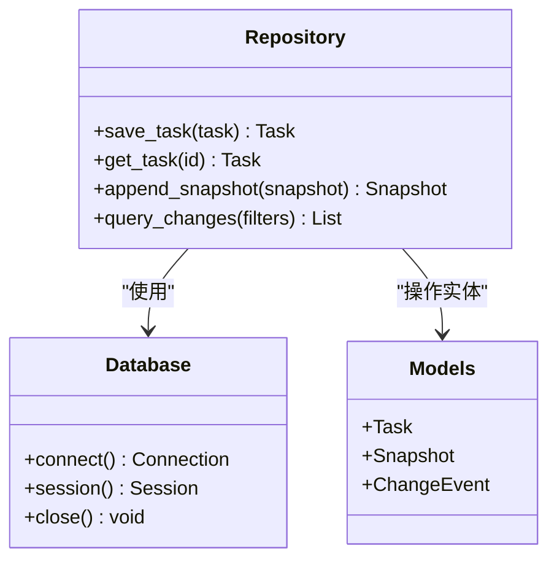
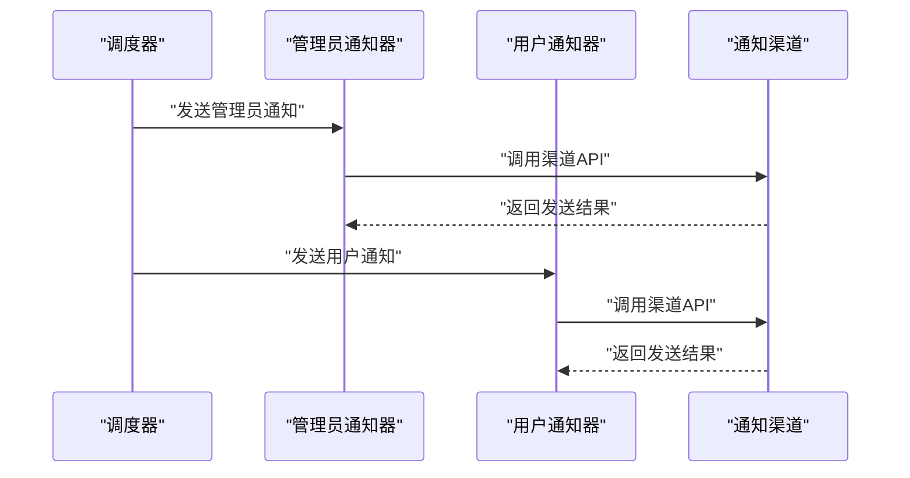
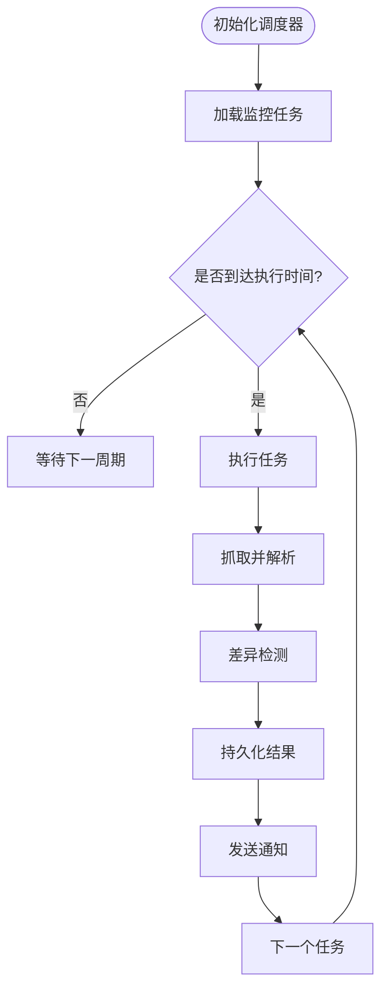
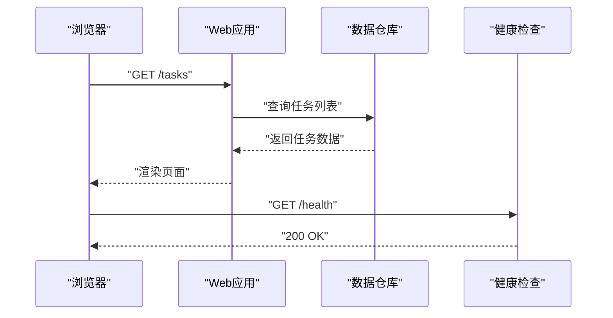
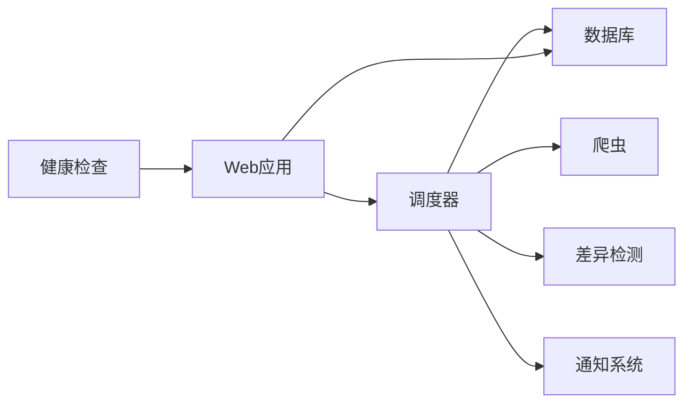

# 项目概述

<cite>
**本文引用的文件**   
- [README.md](file://README.md)
- [pyproject.toml](file://pyproject.toml)
- [Dockerfile](file://Dockerfile)
- [docker-compose.yml](file://docker-compose.yml)
- [src/main.py](file://src/main.py)
- [run_web.py](file://run_web.py)
- [src/config.py](file://src/config.py)
- [src/utils.py](file://src/utils.py)
- [src/crawler/fetcher.py](file://src/crawler/fetcher.py)
- [src/crawler/parser.py](file://src/crawler/parser.py)
- [src/crawler/localize.py](file://src/crawler/localize.py)
- [src/crawler/proxy.py](file://src/crawler/proxy.py)
- [src/db/database.py](file://src/db/database.py)
- [src/db/models.py](file://src/db/models.py)
- [src/db/repository.py](file://src/db/repository.py)
- [src/detector/diff.py](file://src/detector/diff.py)
- [src/health/server.py](file://src/health/server.py)
- [src/models/item.py](file://src/models/item.py)
- [src/notifications/admin_notifier.py](file://src/notifications/admin_notifier.py)
- [src/notifications/user_notifier.py](file://src/notifications/user_notifier.py)
- [src/scheduler/monitor.py](file://src/scheduler/monitor.py)
- [src/web/app.py](file://src/web/app.py)
- [src/web/static/index.html](file://src/web/static/index.html)
- [tests/test_diff.py](file://tests/test_diff.py)
- [tests/test_notifier.py](file://tests/test_notifier.py)
- [tests/test_parser.py](file://tests/test_parser.py)
- [translate/translation_map.py](file://translate/translation_map.py)
</cite>

## 目录
1. [简介](#简介)
2. [项目结构](#项目结构)
3. [核心组件](#核心组件)
4. [架构总览](#架构总览)
5. [详细组件分析](#详细组件分析)
6. [依赖关系分析](#依赖关系分析)
7. [性能考量](#性能考量)
8. [故障排查指南](#故障排查指南)
9. [结论](#结论)
10. [附录](#附录)

## 简介
本项目是一个基于Python的网页监控与变更检测系统，提供从网页抓取、内容解析、差异检测、持久化存储到Web界面展示与通知告警的完整后端能力。其核心价值在于：
- 持续跟踪目标网页或数据源的变化，及时发出通知
- 以Web界面集中管理监控任务、查看历史变更与统计
- 通过可插拔的通知渠道（管理员/用户）实现多端触达
- 支持代理、本地化与国际化扩展，适配复杂网络环境

适用场景包括：
- 价格/库存/公告等关键信息的实时变动监控
- 合规审计与变更留痕
- 竞品动态与政策更新追踪
- 第三方平台状态与健康度监测

目标用户：
- 运维与SRE团队：用于服务健康检查与变更审计
- 产品与运营：用于市场信息与价格策略监控
- 开发者与测试：用于接口与页面回归监控
- 安全与合规：用于敏感信息泄露与配置漂移检测

技术栈选择的原因与优势：
- Python生态成熟，爬虫、数据处理、Web框架与数据库驱动丰富
- 模块化设计便于扩展通知、解析器与存储后端
- Docker与docker-compose支持快速部署与环境一致性
- 单元测试覆盖关键逻辑，保障稳定性

## 项目结构
项目采用按功能域划分的模块组织方式，核心目录说明如下：
- src/crawler：网页抓取、解析、本地化与代理
- src/db：数据库模型、连接与仓储访问
- src/detector：内容差异检测算法
- src/notifications：通知发送（管理员/用户）
- src/scheduler：定时监控调度
- src/web：Web应用与静态资源
- src/health：健康检查服务
- src/models：通用数据模型
- translate：翻译映射表
- tests：单元测试
- 根目录：构建与运行脚本、容器化配置

图表来源 
- [src/main.py](file://src/main.py)
- [run_web.py](file://run_web.py)
- [src/scheduler/monitor.py](file://src/scheduler/monitor.py)
- [src/web/app.py](file://src/web/app.py)
- [src/health/server.py](file://src/health/server.py)

章节来源
- [README.md](file://README.md)
- [pyproject.toml](file://pyproject.toml)
- [Dockerfile](file://Dockerfile)
- [docker-compose.yml](file://docker-compose.yml)

## 核心组件
- 爬虫子系统：负责HTTP请求、反爬处理、代理切换、HTML/结构化数据解析与本地化适配
- 差异检测：对抓取内容进行规范化与比对，识别新增、删除、修改等变更类型
- 数据存储：定义数据模型、建立连接、封装增删改查操作，保证事务与一致性
- 通知系统：向管理员与用户发送变更通知，支持多渠道与模板化
- 调度器：周期性触发监控任务，协调抓取、检测、存储与通知流程
- Web界面：提供任务管理、结果查看、日志与配置的可视化交互
- 健康检查：暴露健康探针，供负载均衡与编排系统探测服务可用性

章节来源
- [src/crawler/fetcher.py](file://src/crawler/fetcher.py)
- [src/crawler/parser.py](file://src/crawler/parser.py)
- [src/crawler/localize.py](file://src/crawler/localize.py)
- [src/crawler/proxy.py](file://src/crawler/proxy.py)
- [src/detector/diff.py](file://src/detector/diff.py)
- [src/db/database.py](file://src/db/database.py)
- [src/db/models.py](file://src/db/models.py)
- [src/db/repository.py](file://src/db/repository.py)
- [src/notifications/admin_notifier.py](file://src/notifications/admin_notifier.py)
- [src/notifications/user_notifier.py](file://src/notifications/user_notifier.py)
- [src/scheduler/monitor.py](file://src/scheduler/monitor.py)
- [src/web/app.py](file://src/web/app.py)
- [src/health/server.py](file://src/health/server.py)

## 架构总览
系统采用分层与事件驱动的混合架构：调度器作为中枢，按周期触发监控任务；爬虫获取原始数据，解析后交由差异检测模块生成变更事件；变更事件写入数据库并通过通知系统分发；Web层提供查询与管理能力；健康检查对外暴露可用性信号。

图表来源 
- [src/scheduler/monitor.py](file://src/scheduler/monitor.py)
- [src/crawler/fetcher.py](file://src/crawler/fetcher.py)
- [src/crawler/parser.py](file://src/crawler/parser.py)
- [src/detector/diff.py](file://src/detector/diff.py)
- [src/db/repository.py](file://src/db/repository.py)
- [src/notifications/admin_notifier.py](file://src/notifications/admin_notifier.py)
- [src/notifications/user_notifier.py](file://src/notifications/user_notifier.py)
- [src/web/app.py](file://src/web/app.py)

## 详细组件分析

### 爬虫子系统
职责：
- 发起HTTP请求，处理重试、超时与异常
- 代理管理与轮换，提升成功率与匿名性
- HTML与结构化数据解析，提取关键字段
- 本地化与语言映射，统一字段命名

图表来源 
- [src/crawler/fetcher.py](file://src/crawler/fetcher.py)
- [src/crawler/parser.py](file://src/crawler/parser.py)
- [src/crawler/localize.py](file://src/crawler/localize.py)
- [src/crawler/proxy.py](file://src/crawler/proxy.py)

章节来源
- [src/crawler/fetcher.py](file://src/crawler/fetcher.py)
- [src/crawler/parser.py](file://src/crawler/parser.py)
- [src/crawler/localize.py](file://src/crawler/localize.py)
- [src/crawler/proxy.py](file://src/crawler/proxy.py)

### 差异检测模块
职责：
- 对抓取数据进行规范化（去空白、排序、编码统一）
- 计算新旧数据的差异，输出变更类型与详情
- 支持多种数据结构（文本、JSON、表格）

图表来源 
- [src/detector/diff.py](file://src/detector/diff.py)

章节来源
- [src/detector/diff.py](file://src/detector/diff.py)
- [tests/test_diff.py](file://tests/test_diff.py)

### 数据存储与模型
职责：
- 定义监控任务、抓取结果、变更事件的数据模型
- 管理数据库连接与会话生命周期
- 封装CRUD操作，提供仓库式访问接口

图表来源 
- [src/db/database.py](file://src/db/database.py)
- [src/db/models.py](file://src/db/models.py)
- [src/db/repository.py](file://src/db/repository.py)

章节来源
- [src/db/database.py](file://src/db/database.py)
- [src/db/models.py](file://src/db/models.py)
- [src/db/repository.py](file://src/db/repository.py)

### 通知系统
职责：
- 向管理员与用户发送变更通知
- 支持模板化内容与多渠道投递
- 失败重试与错误上报

图表来源 
- [src/notifications/admin_notifier.py](file://src/notifications/admin_notifier.py)
- [src/notifications/user_notifier.py](file://src/notifications/user_notifier.py)

章节来源
- [src/notifications/admin_notifier.py](file://src/notifications/admin_notifier.py)
- [src/notifications/user_notifier.py](file://src/notifications/user_notifier.py)
- [tests/test_notifier.py](file://tests/test_notifier.py)

### 调度器
职责：
- 维护监控任务列表与执行计划
- 协调抓取、解析、检测、存储与通知流程
- 处理任务失败与重试策略

图表来源 
- [src/scheduler/monitor.py](file://src/scheduler/monitor.py)

章节来源
- [src/scheduler/monitor.py](file://src/scheduler/monitor.py)

### Web界面
职责：
- 提供任务管理、结果查询与历史对比
- 展示监控统计与日志
- 暴露健康检查接口

图表来源 
- [src/web/app.py](file://src/web/app.py)
- [src/web/static/index.html](file://src/web/static/index.html)
- [src/health/server.py](file://src/health/server.py)

章节来源
- [src/web/app.py](file://src/web/app.py)
- [src/web/static/index.html](file://src/web/static/index.html)
- [src/health/server.py](file://src/health/server.py)

### 配置与工具
- 配置中心：集中管理环境变量、路径、超时、重试等参数
- 工具库：通用函数、日志、序列化、加密等

章节来源
- [src/config.py](file://src/config.py)
- [src/utils.py](file://src/utils.py)

## 依赖关系分析
- 内部依赖：调度器依赖爬虫、解析器、差异检测、数据库与通知模块；Web层依赖数据库与调度器；健康检查独立对外
- 外部依赖：HTTP客户端、数据库引擎、通知渠道API、文件系统/缓存
- 耦合与内聚：模块按职责划分，低耦合高内聚；通过接口与仓储模式降低直接依赖

图表来源 
- [src/scheduler/monitor.py](file://src/scheduler/monitor.py)
- [src/web/app.py](file://src/web/app.py)
- [src/health/server.py](file://src/health/server.py)

章节来源
- [pyproject.toml](file://pyproject.toml)
- [Dockerfile](file://Dockerfile)
- [docker-compose.yml](file://docker-compose.yml)

## 性能考量
- 抓取并发与限流：合理设置并发数与延迟，避免目标站点封禁
- 解析优化：增量解析与缓存热点数据，减少重复计算
- 差异检测：对大数据集进行分块比较与索引优化
- 数据库：连接池、读写分离、索引设计与定期归档
- 通知：批量发送与异步队列，降低阻塞
- 缓存：对静态资源与频繁查询结果进行缓存

[本节为通用指导，不直接分析具体文件]

## 故障排查指南
常见问题与定位方法：
- 抓取失败：检查代理配置、超时与重试策略，查看抓取日志
- 解析异常：核对解析规则与目标页面结构变化，验证本地化映射
- 差异误报：确认规范化流程与比较阈值，检查编码与格式
- 通知失败：校验渠道凭证与配额，查看发送回执与错误码
- 数据库连接：检查连接池大小、权限与网络连通性
- Web不可用：查看健康检查接口与端口占用，确认依赖服务状态

章节来源
- [src/crawler/fetcher.py](file://src/crawler/fetcher.py)
- [src/crawler/parser.py](file://src/crawler/parser.py)
- [src/detector/diff.py](file://src/detector/diff.py)
- [src/notifications/admin_notifier.py](file://src/notifications/admin_notifier.py)
- [src/notifications/user_notifier.py](file://src/notifications/user_notifier.py)
- [src/db/database.py](file://src/db/database.py)
- [src/health/server.py](file://src/health/server.py)

## 结论
本项目以模块化与可扩展为核心设计理念，提供端到端的网页监控与变更检测能力。通过清晰的职责划分与完善的工具链，既满足初学者快速上手的需要，也为有经验的开发者提供了深入定制的空间。建议在生产环境中结合容器化与监控体系，确保稳定性与可观测性。

[本节为总结性内容，不直接分析具体文件]

## 附录

### 快速开始指南
- 环境要求：Python解释器、包管理器、可选的数据库与外部通知渠道
- 安装步骤：
  - 克隆仓库并进入项目目录
  - 安装依赖（参考构建脚本与配置文件）
  - 配置环境变量（数据库、代理、通知渠道等）
  - 启动Web服务与后台调度任务
- 基本使用：
  - 在Web界面创建监控任务
  - 查看抓取结果与变更历史
  - 配置通知渠道并接收告警

章节来源
- [README.md](file://README.md)
- [install.bat](file://install.bat)
- [start.bat](file://start.bat)
- [pyproject.toml](file://pyproject.toml)
- [Dockerfile](file://Dockerfile)
- [docker-compose.yml](file://docker-compose.yml)
- [run_web.py](file://run_web.py)
- [src/main.py](file://src/main.py)

### 术语对照
- 抓取：从目标网站获取原始内容
- 解析：将原始内容转换为结构化数据
- 差异检测：比较新旧数据并生成变更事件
- 快照：某时刻的数据副本，用于对比
- 通知：向指定对象发送变更告警
- 健康检查：对外暴露服务可用性的探针接口

章节来源
- [translate/translation_map.py](file://translate/translation_map.py)
- [src/models/item.py](file://src/models/item.py)